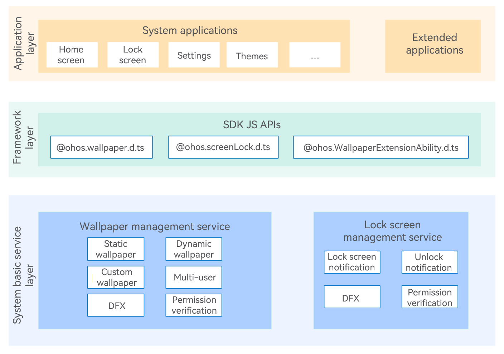

# Theme Framework

## Introduction

### About the Subsystem
The theme framework subsystem consists of the wallpaper management service and lock screen management service, providing basic capabilities such as wallpaper setting, screen locking, and screen unlocking for the system.

### Architecture
**Figure 1** Architecture of the theme framework subsystem



## Directory Structure

```
base/theme
├──wallpaper_mgr                      # Wallpaper management service
└──screenlock_mgr                     # Lock screen management service
```

## Services

### Wallpaper Management Service

The wallpaper management service provides APIs for setting wallpapers and comes with a wallpaper switching notification mechanism.

### Lock Screen Management Service

The lock screen management service provides capabilities for locking and unlocking the screen, supports screen lock and unlock notifications, and enables lock screen applications to register system event callbacks.

## Repositories Involved

[theme\_wallpaper\_mgr](https://gitee.com/openharmony/theme_wallpaper_mgr)

[theme\_screenlock\_mgr](https://gitee.com/openharmony/theme_screenlock_mgr)
