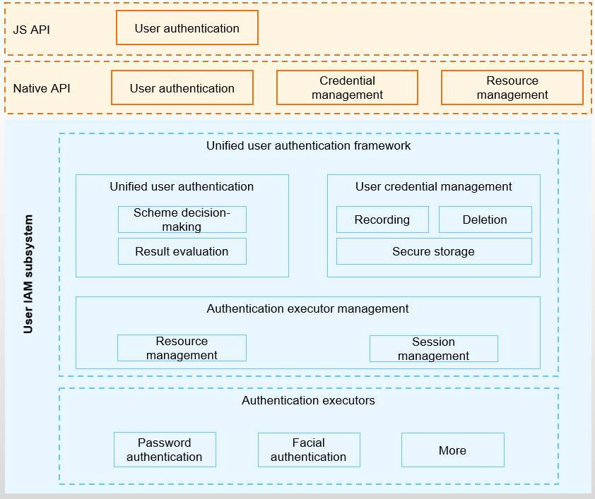

# User IAM

## Introduction

The user identity and access management (IAM) subsystem provides a unified framework for user credential management and user identity authentication in OpenHarmony. It allows multiple users to set their own authentication credential information and authenticates their identities based on the information set. 

This subsystem is widely used in security-sensitive scenarios such as screen lock and payment. In addition, the user IAM subsystem provides APIs for third-party applications to control user access.

**Figure 1** Architecture



The user IAM subsystem consists of the unified user authentication framework and authentication executor. The unified user authentication framework consists of the following:

- Unified user authentication: provides unified user identity authentication externally and open biometric authentication capabilities for third-party applications to invoke.
- User credential management: provides a unified user credential information management interface for the upper layer and invokes authentication resources in the system through the authentication executor to implement lifecycle management and secure storage of user credentials.
- Authentication executor management: provides authentication resource management and authentication session management, and supports unified management, scheduling, and connection of various authentication executors in the system.

Based on the unified user authentication framework, the system supports multiple authentication capabilities. Currently, OpenHarmony supports PIN and facial authentication executors. To implement a new authentication executor, you only need to implement authentication capabilities in a new component and connect the new component to the unified user authentication framework based on the APIs defined by the authentication executor management component.

> **NOTE**
> 
>In the user IAM subsystem, an authentication executor is the minimum execution unit of a user identity authentication operation. For example, a PIN authentication module is responsible for PIN collection, processing, comparison, and secure storage, and therefore it can be abstracted as a PIN authentication executor.

## Directory Structure

```undefined
//base/useriam
├── user_auth_framework	        # User authentication framework, including user authentication, credential management, and executor management.
├── face_auth			# Facial authentication component, which interacts with the authentication executor to implement facial information enrollment, deletion, and authentication.
├── pin_auth 			# PIN authentication component, which interacts with the authentication executor to implement PIN enrollment, deletion, and authentication.

```

## Constraints

- User credential management involves critical operations in the system, and the related APIs can be called only by basic system applications.
- The authentication executors process user authentication credentials. Therefore, only system services can interact with the authentication executor management module to implement the executor functions.

## Usage

### How to Use

- The unified user authentication framework must work with an authentication executor.
- By default, the first authentication executor in the system is the PIN authentication executor.

## Repositories Involved

[useriam_user_auth_framework](https://gitee.com/openharmony/useriam_user_auth_framework)

[useriam_pin_auth](https://gitee.com/openharmony/useriam_pin_auth)

[useriam_face_auth](https://gitee.com/openharmony/useriam_face_auth)

[drivers_interface](https://gitee.com/openharmony/drivers_interface)

[drivers_peripheral](https://gitee.com/openharmony/drivers_peripheral)
