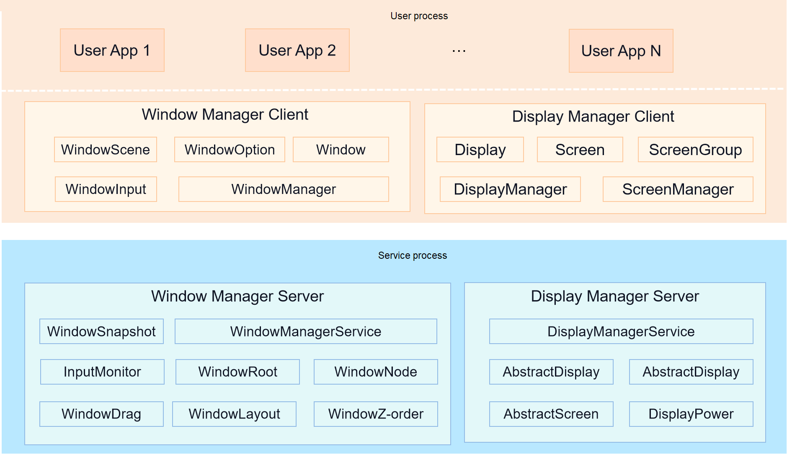

# Window Manager

## Introduction

The Window Manager subsystem provides basic capabilities of window and display management. It is the basis for UI display. The following figure shows the architecture of the Window Manager subsystem.

**Figure 1** Architecture of the Window Manager subsystem



Components of the Window Manager subsystem are described as follows:

- **Window Manager Client**

    Provides window object abstraction and window management interfaces, and connects to the ability and UI framework.

- **Display Manager Client**

    Provides display information abstraction and display management interfaces.

- **Window Manager Server**

    Provides capabilities such as window layout, Z-order control, window tree structure, window dragging, and window snapshot, and offers the window layout and focus window for multimodal input.

- **Display Manager Server**

    Provides display information, screenshot, screen on/off, and brightness processing control, and processes the mapping between the display and screen.

## Directory Structure

```text
foundation/window/window_manager/
├── dm                      # Implementation code of Display Manager Client
├── dmserver                # Implementation code of Display Manager Server
├── interfaces              # External APIs
│   ├── innerkits           # Native APIs
│   └── kits                # JS APIs and native APIs
├── resources               # Resource files used by the framework
├── sa_profile              # System service configuration files
├── snapshot                # Implementation code of the screenshot command line tool
├── utils                   # Utilities
├── wm                      # Implementation code of Window Manager Client
├── wmserver                # Implementation code of Window Manager Server
```

## Constraints

Programming language version: C++ 11 or later

## Available APIs

- [@ohos.window (Window)](../application-dev/reference/apis-arkui/js-apis-window.md)
- [@ohos.window (Window) (System API)](../application-dev/reference/apis-arkui/js-apis-window-sys.md)
- [@ohos.display (Display)](../application-dev/reference/apis-arkui/js-apis-display.md)
- [@ohos.display (Display) (System API)](../application-dev/reference/apis-arkui/js-apis-display-sys.md)

## Repositories Involved

- [graphic_graphic_2d](https://gitee.com/openharmony/graphic_graphic_2d)
- [arkui_ace_engine](https://gitee.com/openharmony/arkui_ace_engine)
- [ability_ability_runtime](https://gitee.com/openharmony/ability_ability_runtime)
- [multimodalinput_input](https://gitee.com/openharmony/multimodalinput_input)
