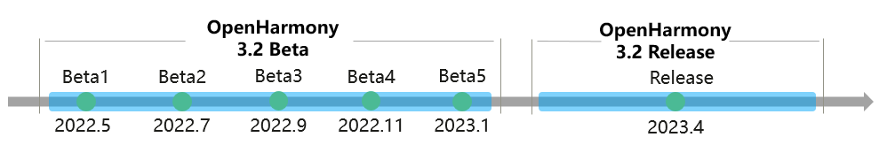

# OpenHarmony 3.2 Release

## Version Description
OpenHarmony 3.2 Release provides more comprehensive capabilities for the standard system. It supports the development of large-scale applications and atomic services using the ArkTS programming language and stage model. It has optimized the [ArkCompiler](#arkcompiler) and introduced the task pool mechanism to improve running performance of applications. It has improved the capabilities of ArkUI components, graphics rendering, and system security, supporting more diverse distributed service development. It provides stable APIs of API version 9, which further improves the overall system performance, stability, and security based on OpenHarmony 3.1 Release.


The figure below shows the milestones of OpenHarmony 3.2. Read the content below to learn more about key features and capabilities.

**Figure 1** Milestones of OpenHarmony 3.2



## Feature Updates
### ArkUI


 **Component capability enhancement**

- The XComponent is supported. This component can be used to write EGL/OpenGL ES data and media data and display the data. It can work with the NDK to support C++/ArkTS hybrid development for gaming and media applications.
- The AbilityComponent is supported. It enables an ability to embed into other applications as a component.
- The basic capabilities for ArkTS widget development are provided. Widget interaction and dynamic content update are supported. A unified paradigm is provided for widget and page development, so that the page layout can be directly reused in the widget layout, improving widget development experience and efficiency.
- The system supports text-only and image-only copy, paste, and drag by default. You do not need to process copy, paste, and drag events.
- Multi-level menus and group menus are supported.

-  **You can develop UI at a time that can adapt to screens of different specifications.**

- The interaction normalization capability is enhanced. Unified interaction events are provided for the touch panel, mouse, keyboard, touchpad, and stylus. Native ArkUI components support normalized operations.
- The responsive layout capability is optimized, the media query capability is enhanced, and the grid system is reconstructed and supports interconnection with the free window.
- The focus capability is enhanced. The Tab key and arrow keys can be used to move the focus, and a component can be configured to be focusable.
- The **\<Column>** and **\<SideBarContainer>** components can be automatically hidden when they are dragged to a width that is less than the minimum width.

For details, see [ArkUI Guide](../application-dev/ui/arkui-overview.md).


### Application Framework

- The stage model is introduced in API version 9. It provides mandatory components and running mechanisms for applications. This model makes the development of complex applications simpler and more efficient.
  - Abilities are provided in the form of classes, making extension easier.
  - VM instances can be shared within a process, reducing memory usage of applications.
  - Data objects can be shared within a process, enabling state sharing among multiple modules.
  - The ability lifecycle is separated from the window display/focus event, and a unified ability lifecycle is used in multiple device forms, facilitating distributed application development.
  - The ability and UI are separated, RPC capabilities are provided, and abilities can be migrated and collaborated across devices, facilitating distributed application development.

- The ExtensionAbility mechanism is provided. With this mechanism, an application can provide custom functions and content for another application or the system during interaction. For example, an application can be displayed as a widget on the home screen or execute background tasks during off-peak hours. Currently, the following ExtensionAbilities are supported: FormExtensionAbility, WorkSchedulerExtensionAbility, InputMethodExtensionAbility, and AccessibilityExtensionAbility.

- Atomic services can be pre-loaded by package, improving the first-time loading performance.

- The Harmony Shared Package (HSP) is used for sharing of code and resources within an application.


For details, see [Application Model Guide](../application-dev/application-models/application-model-composition.md).


### Application Package Management

- A default application can be selected. For example, if a user selects an application as the default application when opening a file or URL, that application will be automatically used to open the file or URL of the same type next time.

- The system can grant permissions (such as location and contact permissions) to certain pre-installed applications, such as **Home Screen**, **SystemUI**, and **Settings**, to simplify the authorization process when the device is powered on for the first time. For details, see [Pre-authorizing user_grant Permissions](../application-dev/security/accesstoken-guidelines.md).

- Permission control on pre-installed applications is enhanced. For example, you can configure whether pre-installed applications can reside permanently, use multiple processes, or use ServiceExtensionAbility. For details, see the [Application Privilege Configuration Guide](../device-dev/subsystems/subsys-app-privilege-config-guide.md).

- Application code can be dynamically updated, and quick fix packages are provided for applications to quickly respond to requirements and fix defects. (This capability requires the device vendor to build an application market and provide the distribution capability.) For details, see [Quick Fix Overview](../application-dev/quick-start/quickfix-principles.md).

- HAP-based isolation is provided for .so files, so you can deploy .so files of the same name in different modules.


### System Applications

 **Home Screen enhancement**

Users can hold an application icon (currently **Camera** and **Gallery**) on the home screen to add a service widget.


 **SystemUI enhancement**

- Control Panel can be opened and exited.

- Notification Panel can be opened and exited. Notifications can be displayed, deleted, group expanded, and group collapsed. Banner notifications can be displayed and hidden.


 **Settings enhancement**

- Users can set permissions on the **Privacy** menu.

- The following debugging switches are added to the developer options: layout boundary, transition animation, and transition drawing.


 **Photos enhancement**

- The PhotoPicker capability is added. PhotoPicker is a unified entry for users to select images and videos. It enables users to grant only media file permissions to applications when they try to access images and videos.

- The service widget and browsing capabilities are provided for **Albums**.

- Users can edit images, such as cropping and rotating.
  For details, see [Application Photos](https://gitee.com/openharmony/applications_photos).


 **FilePicker** 

The FilePicker capability is added. FilePicker is a unified entry for users to select files (except media files). It enables users to grant non-media file permissions to applications when they try to access files other than images and videos.


 **Browser**

No built-in browser application is available. You can develop a browser application by following the instructions provided in [Browser Application](https://gitee.com/openharmony/applications_app_samples/tree/samples_3.2_Release/code/BasicFeature/Web/Browser).

### Distributed Technology

Abilities and widgets can be queried, added, refreshed, and deleted across devices.


#### DSoftBus

- Files can be transferred over Bluetooth links. Compared with OpenHarmony 3.1, this version provides a 10% increase in the performance of the Bluetooth data transmission channel.

- For each process, two queues are created: a high-priority queue for messages and a low-priority queue for bytes. This ensures that messages can be transmitted in time in the case of byte congestion.

- In addition to raw stream transmission, common stream transmission is provided, which enables DSoftBus to perform encryption and decryption on unencrypted audio and video streams. The caller only needs to transmit raw audio and video streams to DSoftBus, which ensures secure data transmission.

- Transmission links (WLAN/Wi-Fi P2P/Bluetooth BR) can be dynamically selected based on the transmission link supported by the devices and the DSoftBus APIs called (**SendFile**, **SendStream**, **SendMessage**, and **SendBytes**). For example, when stream data needs to be transmitted, a WLAN (5G frequency band) is preferentially selected. If the WLAN is unavailable, another link (for example, Wi-Fi P2P) is selected.

#### Distributed hardware

- The distributed camera allows users to set the location and quality level (which affects the compression ratio and definition of photos).

- The distributed camera supports video recording.

- Users can use the device management native APIs to import account authentication information to the device security authentication system. Devices with the same login account can automatically complete authentication and networking.


#### Distributed data management

 **Cross-application data access**

- The proxy mode is used to implement cross-application data access on the same device, avoiding frequent launch of applications that provides the data source.

- Cross-application data access to relational databases and key-value databases on the same device is supported.

 **Local database**

- Key-value databases and relational databases are supported.

- Database files can be encrypted for storage.

- Database damage detection and rebuild are supported.

- Applications can back up and restore databases via clients.

- Key-value databases can be automatically backed up.

- Relational database query for the same application across devices is supported.

- Damage detection and rebuild for metadata databases are supported.

- The key-value database is moved from the unified system sandbox to the application-specific sandbox, minimizing the access permission of application data and improving application data security.

 **Data synchronization**

- Key-value data can be synchronized based on conditions (time segment, time sorting, and synchronization duration).

- When a device goes online, system data is preferentially synchronized, shortening the device wakeup time.

- Cross-device data synchronization in multi-user scenarios is supported.

 **Distributed object**: Objects can be persistent.

 **Sandbox application**: Key-value databases, relational databases, and distributed objects can be persistent.


#### Distributed Scheduler

The ability hopping capability is enhanced. The automatic serialization of data structures simplifies application adaptation. The use of distributed objects makes service data migration easier. Atomic services can be used without being installed during ability continuation.


### File Management

- User-level file encryption is supported.

- The APIs for collecting statistics by application space are added. The size of application directories at each level can be obtained.

- Application file sharing is enhanced. Files can be opened across applications.

- Application files can be backed up and restored.

- External storage devices of the file system can be mounted, unmounted, formatted, read, and written.

- The file management I/O interface is enhanced. The **listFile** API is provided for directory traversal.


### Graphics & Window

- The display frame rate in the multi-window scenario is improved.

- The property animation is enhanced, and animations can customize properties.

- The graphics development capability at the native layer is enhanced. The **SurfaceImage** interface supports buffer management, content update, and matrix conversion. The **Vsync** interface supports requesting of the next frame and callbacks. The **HardwareBuffer** interface supports requesting, releasing, obtaining, and accessing capabilities. The **NativeWindow** interface supports scaling mode setting.

- The EGL is constructed to enhance GPU adaptation for devices.

- Visual effects such as window shadow, blur, and rounded corners are added.

- More transitions are supported, such as one-take shooting, input method switching, application switching, and screen rotation.

- Window attributes can be set. The window privacy layer prevents user privacy leakage during screenshotting and screen recording.


### Multimedia


 **Audio**

- Bluetooth devices can be selected for audio playback and calling.

- DTMF dial tones can be generated and played.

- The OpenSL ES basic recording APIs are supported.

- An application can query the list of available audio devices and carry device information, such as the sampling rate, number of channels, and channel mask.

- Information about existing playback streams and recording streams in the system can be queried.


 **Playback**

- A local media file specified by FD can be played. Network VOD based on HTTPS and HLS is supported HDI-based H.264 hardware decoding and playback are supported.

- Audio and video encoding and decoding based on the codec HDI are supported.


 **Camera**

- Users can configure the format, resolution, quality (affecting the compression ratio and definition), and location of photos taken by the camera. Users can record videos and take snapshots during video recording.

- Precise privacy protection is provided. Applications can use the camera only when they are running in the foreground (including the camera floating window scenario). System services can use the camera when they are running in the background, and third-party applications are not allowed to use the camera in silent mode in the background. System interfaces are provided for enabling and disabling the global camera switch.


 **Image**: The raw and WebP image formats are supported.


### Common Event and Notification

- Applications can set the number of badges to be displayed on the home screen.

- System applications can remove sticky events. After a sticky event is removed, new subscribers will not receive a notification when the event is triggered.

- Static subscription can be enabled or disabled for system applications. After static subscription is disabled, the StaticSubscriberExtensionAbility component cannot be started by other abilities.

- The capability of **StaticSubscriberExtensionAbility** is supplemented. When the StaticSubscriberExtensionAbility component is running, the static information (such as the bundle path and bundle name) of the installation package can be obtained from the context.

### Web

- The web component can be configured, including network loading interception, font management, scroll bar, and customized interception for fetch.

- A series of web page operations are supported, including obtaining historical records, obtaining the forward and backward lists, obtaining source URLs, scrolling, and determining whether a page contains images.

- Web page event processing is supported, including reporting of page loading events and original input events.

- Interworking between web pages and applications is supported. The ArrayBuffer type can be used for message exchange.

- The web performance is enhanced. Read-only data segments of the rendering process can be shared to save memory. The pre-read dynamic library is supported for faster web page loading.


### Connectivity

- NFC card read and write capabilities are provided.

- Audio calls and video playback over Bluetooth links are supported.

- Multi-network concurrency, enhanced HTTP/HTTPS, and TLS socket ArkTS API capabilities are provided.
  - Multi-network concurrency
     - Socket-based route binding is supported.
     - NIC-based route binding is supported.
  - HTTP/HTTPS
     - HTTP 2.0 is supported.
     - HTTP cache is supported.
     - The HTTP concurrency framework is supported.
     - Gzip compression and specified format for returned data are supported.
  - TLS socket
     - The client can specify secure transmission options such as the certificate, key, and CA, to establish a TLS socket connection with the server.
     - TLS v1.2 and TLS v1.3 are supported.
  - Web socket 
  - Ethernet connection and network hotspot

- The cellular communication framework capability is provided (If complete cellular communication capabilities are required, the chip vendor must support the HDI):
  - Dual-card management and basic capability interfaces and framework such as dual-card calling, messaging, and network search are supported.
  - VoLTE voice call interfaces and framework are supported. This requires the chip vendor to implement the IMS service (including HDI).
  - The IMS messaging TX and RX interfaces and framework are supported. This requires the chip vendor to implement the IMS service (including HDI).
  - Cellular data roaming and cellular data self-healing interfaces and framework are supported.
  - The dual-card data switching interfaces and framework are supported.


### Device Management

The location service supports privacy enhancement features such as approximate location and explicit background location.


 **DeviceProfile**

The capabilities of saving, querying, and synchronizing key-value data of basic system services are provided as open APIs.


 **Power supply**

- The maximum, minimum, and default luminance values of the system can be read from system parameters.

- System APIs are provided for entering and exiting the suspended state.

- APIs related to the battery level are supported.

- System APIs are provided for estimating the remaining charging time, transient current, remaining power, and total power.

- Power consumption statistics for software and hardware features such as camera, audio, calling, and short distance are supported.

- The CPU frequency, volume, and system brightness can be controlled when the device is overheating.


### Security

- System-level certificate management is supported to secure the certificate throughout the lifecycle (generation, storage, use, and destruction).

- The encryption and decryption algorithm library framework, with the OpenSSL encryption and decryption library encapsulated, is provided. Unified ArkTS APIs related to the algorithm library are also provided.

- HUKS supports certain SM2, SM3, and SM4 algorithms.

- Mutual authentication is provided for distributed devices based on account management.


### Ability Access Control

- The permission management framework is implemented for applications and system processes. The following application permission APIs are provided:
  - APIs for verifying, granting, and revoking permissions
  - APIs for listening for permission grant state changes
  - APIs for displaying a dialog box to ask users for certain permissions

- Privacy permission management is provided for the applications that display a permission dialog box as well as the **Settings** application.

- Privacy report is provided, and APIs are provided for adding and querying permission access records and listening for permission usage status changes.

- Privacy protection is enhanced.
  - When the camera is used, **systemUI** displays a dot in the upper right corner for notification purposes.
  - Users can turn on or off sensitive resources (such as the microphone and camera) with a tap.

- The permissive mode is provided for SELinux.


### ArkCompiler

 **Enhanced language feature**: ECMAScript 2021 in strict mode is supported.

 **Compiler runtime**

- The es2abc compiler is provided to optimize the bytecode compilation performance and shorten the compilation time.

- An assembly interpreter is provided to improve the running performance of high-level programming languages.

- The host AOT compiler based on the PGO configuration file is provided to improve the high-load performance of high-level programming languages.

- The modularization capability is supported to standardize the development of complex applications.

- The hot patch mechanism is provided.

- Debugging is enhanced to support multi-instance debugging and hot reload debugging.

- CDP-based CPU profiler/heap profiler optimization, application performance optimization, and memory optimization are provided.

 **Language base class library**

- The utils capabilities are enhanced. The UUID is used as a universal, unified identifier, and the buffer API is provided to support buffer reading, writing, comparison, and search.

- The basic capabilities of the TaskPool API are provided to support concurrent tasks. The task pool provides a multi-thread running environment for applications, reducing overall resource consumption and improving overall system performance.

 **C/C++ toolchain**

- Toolchain upgrade: LLVM is upgraded to 12.0.0 to support the MIPS and RISC-V architectures.

- Functionality enhancement: Stack PageGuard protection, address randomization, namespace isolation, CFI, Fortify, and time zone update are supported to improve security of the C/C++ library.

- Performance optimization: The performance of frequently used functions is optimized to improve the basic performance of the C library, and the linker is optimized to improve the library loading performance.

- The locale module provides the capabilities of setting the time zone.


### Kernel

- ASLR kernel address randomization, KASAN address detection, and CFI are provided to reduce the attack surface of the system and improve kernel security.

- The security of the musl memory allocator and heap memory is enhanced to prevent against risks such as heap overflow, double-free, and UAF.

- Refined memory management is provided. The **OnMemoryLevel** feature enables applications to get a notification about the memory usage so that they can perform different processing. In addition, system resources are managed in a systematic and centralized manner, and application resources are monitored and managed in a timely manner.

- The local storage is enhanced. Performance optimization is performed for F2FS when there is little storage space available. Automatic fragment reclamation when the storage device is idle and hierarchical SSR are used to reduce system fragments and restore system performance.

### Driver

 **HDF**

  - Dynamic loading of kernel-mode drivers, reporting of plug-and-play events, and configuration of driver security policies are provided, laying a more stable and secure driver platform base.
  
  - The HDI supports two channel modes: IPC invoking and pass-through invoking. You can select either of them based on service requirements.
  
  - Automatic generation of HDI service-oriented code, template-based driver code generation, HCS macro parsing, and visualized editing configuration are supported, lowering the driver development threshold and improving the development efficiency.
  
  - The platform driver supports user-mode interrupts. The CAN bus HDF is added, and MMC driver implementation is optimized.

 **Peripheral driver model**

  - The camera driver model supports mirror reflection, lens control, adding of location information for JPEG images, sensor angle query, and facial recognition metadata streams.
  
  - Key control capabilities, such as headset access, earpiece and speaker switching, call volume setting, and call muting, are added to the ADM model of the audio module.
  
  - The display driver model supports multi-screen management, software Vsync, compatible FrameBuffer architecture, and efficient access of different display architectures.
  
  - The hardware codec driver model is added for the standard system, and the codec HDI 2.0 interfaces and reference implementation are provided.
  
  - The vibrator drive model is supported, including vibration start/stop and basic vibration effect control.
  
  - The gesture-driven model is supported, including reporting status events and device status events, enabling/disabling gestures, and function status configuration.
  
  - The USB driver model supports the device mode and host mode. The DDK capabilities such as the RNDIS network driver in device mode are added.
  
  - The WLAN driver anti-interference capability is supported and the optimal P2P channel selection capability is provided to continuously improve WLAN signal quality.

### Tool Improvement

 **Application development on DevEco Studio**

- The diagnosis feature is provided for the application/service development environment. If the diagnosis result contains failed items, you are advised to adjust the items according to the suggestions.

- Basic templates and widget templates are provided. ArkTS widgets can be added during application development on the stage model.

- The ExtensionAbility template is provided.

- Code errors can be checked based on the new ArkUI syntax and specifications. The Code Linter feature is added for you to configure check rules and rectify errors.

- The basic quick fix capability is provided for C++ code.

- The OpenHarmony Package Manager Command-line Interface (OHPM CLI) is provided for release, installation, and dependency management of OpenHarmony shared packages. Historical projects of API version 9 can be migrated to OHPM projects.

- The closed-source HAR can be constructed, and HAR obfuscation can be configured.

- The AOT compilation mode is supported, providing high-load TS performance selection and build capabilities to improve running performance of applications.

- By default, modular compilation is enabled for projects developed on the stage model using API version 9, which effectively shortens the incremental compilation time and reduces the package size after compilation.

- Concurrent compilation is supported.

 **Application debugging and tuning on DevEco Studio**

- Cross-language debugging between ArkTS/JS and C/C++ is supported. In a C/C++ project, ArkTS/JS and C/C++ can be used. C/C++ methods can be called for debugging in ArkTS/JS code.  

- Hot reloading is supported. After the code is saved, the latest code can be used on the real device without restarting the application.

- Multi-packet pushing and multi-instance debugging are supported.

- Memory error detection is provided for C/C++ projects developed using API version 9.

- Fault logs can be printed for you to quickly query, locate, and export application fault information.

- The testing framework capability is enhanced. For JS/ArkTS projects using API version 8 or 9, the execution efficiency of the testing framework is greatly improved. In addition, the testing framework template is optimized to improve the readability of the template code.

For details, see [DevEco Studio Version Change History](https://developer.harmonyos.com/en/docs/documentation/doc-releases/release_notes-0000001057597449) and [DevEco Studio User Guide](https://developer.harmonyos.com/en/docs/documentation/doc-guides/tools_overview-0000001053582387).


 **Debugging tools**

- HDC file transfer supports directory TX/RX, permission synchronization, and CS file sending within the same network segment, improving the efficiency of debugging, tuning, and automatic test.


### Testing

- The capability of filtering and executing test cases is added. Specified fields such as the case type and level can be configured in test cases. Filtered test cases can be executed using commands. For details, see [How to Use](https://gitee.com/openharmony/testfwk_arkxtest/blob/master/README_en.md#basic-process-support).

- The test case-driven execution capability is added. Different input and output data with similar test logic can be configured in auxiliary files, helping you reduce the amount of test code. For details, see [Data Driving](https://gitee.com/openharmony/testfwk_arkxtest/blob/master/README_en.md#data-driving).

- UI scenario simulation capabilities are added, such as multi-window, pinch, and fling. For details, see [API Reference](../application-dev/reference/apis/js-apis-uitest.md).

- The compatibility test specifications are added, covering six aspects of application quality requirements: UX, performance, power consumption, stability, compatibility, and security.

- The [SmartPerf-Host](https://gitee.com/openharmony-sig/smartperf/tree/master) tool provides a performance optimization platform, which provides GUI operations for detailed data analysis.  
  - Power consumption analysis is provided, which can be used to display the power consumption proportion by application subcategory, resource request and usage records, power consumption exception events, and association between power consumption and system status.
  - Traces can be captured on the web side.
  - SQL query and metrics description are supported.
  - Kernel memory event analysis is supported.

- The [wukong](https://gitee.com/openharmony/ostest_wukong) tool is enhanced as follows:
  - Sliding, mouse, character, system key, and control events can be injected to simulate diversified user operations.
  - Users can set the total running duration and application trustlist/blocklist.
  - Components can be traversed in sequence. Screenshots can be taken during the test. You can perform sleep and wake-up tests.

## Version Mapping

**Table 1** Version mapping of software and tools

| Software/Tool| Version| Remarks|
| -------- | -------- | -------- |
| OpenHarmony | 3.2 Release | NA |
| Public SDK | Ohos_sdk_public 3.2.11.9 (API Version 9 Release) | This toolkit is intended for application developers and does not contain system APIs that require system permissions. It is provided as standard in DevEco Studio.|
| (Optional) HUAWEI DevEco Studio| 3.1 Release | Recommended for developing OpenHarmony applications<br />How to obtain:<br /> [Windows(64-bit)](https://contentcenter-vali-drcn.dbankcdn.cn/pvt_2/DeveloperAlliance_package_901_9/16/v3/YO_7mAQNTbS8jekrvez5IA/devecostudio-windows-3.1.0.500.zip?HW-CC-KV=V1&HW-CC-Date=20230512T073650Z&HW-CC-Expire=315360000&HW-CC-Sign=90814E421B9A6D8DB4757FAFC21A965CF890A387DF9A2633B4AB797AD77E6485) <br />[Mac(X86)](https://contentcenter-vali-drcn.dbankcdn.cn/pvt_2/DeveloperAlliance_package_901_9/d8/v3/zRt_WN3iRZiJ6nmb0mII2g/devecostudio-mac-3.1.0.500.zip?HW-CC-KV=V1&HW-CC-Date=20230512T073549Z&HW-CC-Expire=315360000&HW-CC-Sign=11DF6C7F2EE8C5CA5F5F44CE7441EBF2E24824FC7ECD5D961329C9575A8326AF) <br />[Mac(ARM)](https://contentcenter-vali-drcn.dbankcdn.cn/pvt_2/DeveloperAlliance_package_901_9/7d/v3/EEGHWfBmR_29a-xjAQJZqA/devecostudio-mac-arm-3.1.0.500.zip?HW-CC-KV=V1&HW-CC-Date=20230512T074142Z&HW-CC-Expire=315360000&HW-CC-Sign=92C9A7380140C8363D6B853A3898B31674144C2C809ED47F154EC450B714DBC0) |
| (Optional) HUAWEI DevEco Device Tool| 3.1 Release | Recommended for developing OpenHarmony smart devices<br>[Click here](https://device.harmonyos.com/en/develop/ide/). |

## Source Code Acquisition


### Prerequisites

1. Register your account with Gitee.

2. Register an SSH public key for access to Gitee.

3. Install the [git client](https://git-scm.com/book/en/v2/Getting-Started-Installing-Git) and [git-lfs](https://gitee.com/vcs-all-in-one/git-lfs?_from=gitee_search#downloading), and configure user information.
  
   ```
   git config --global user.name "yourname"
   git config --global user.email "your-email-address"
   git config --global credential.helper store
   ```

4. Run the following commands to install the **repo** tool:
  
   ```
   curl -s https://gitee.com/oschina/repo/raw/fork_flow/repo-py3 > /usr/local/bin/repo  # If you do not have the permission, download the tool to another directory and configure it as an environment variable by running the chmod a+x /usr/local/bin/repo command.
   pip3 install -i https://repo.huaweicloud.com/repository/pypi/simple requests
   ```


### Acquiring Source Code Using the repo Tool

**Method 1 (recommended)**

Use the **repo** tool to download the source code over SSH. (You must have an SSH public key for access to Gitee.)

- Obtain the source code from the version branch. You can obtain the latest source code of the version branch, which includes the code that has been incorporated into the branch up until the time you run the following commands:
   ```
   repo init -u git@gitee.com:openharmony/manifest.git -b OpenHarmony-3.2-Release --no-repo-verify
   repo sync -c
   repo forall -c 'git lfs pull'
   ```
   
- Obtain the source code from the version tag, which is the same as that released with the version.
   ```
   repo init -u git@gitee.com:openharmony/manifest.git -b refs/tags/OpenHarmony-v3.2-Release --no-repo-verify
   repo sync -c
   repo forall -c 'git lfs pull'
   ```

**Method 2**

Use the **repo** tool to download the source code over HTTPS.

- Obtain the source code from the version branch. You can obtain the latest source code of the version branch, which includes the code that has been incorporated into the branch up until the time you run the following commands:
   ```
   repo init -u https://gitee.com/openharmony/manifest -b OpenHarmony-3.2-Release --no-repo-verify
   repo sync -c
   repo forall -c 'git lfs pull'
   ```
   
- Obtain the source code from the version tag, which is the same as that released with the version.
   ```
   repo init -u https://gitee.com/openharmony/manifest -b refs/tags/OpenHarmony-v3.2-Release --no-repo-verify
   repo sync -c
   repo forall -c 'git lfs pull'
   ```


### Acquiring Source Code from Mirrors

**Table 2** Mirrors for acquiring source code

| Source Code                               | Version| Mirror                                                | SHA-256 Checksum                                            | Software Package Size|
| --------------------------------------- | ------------ | ------------------------------------------------------------ | ------------------------------------------------------------ | -------- |
| Full code base (for mini, small, and standard systems)       | 3.2 Release    | [Download](https://repo.huaweicloud.com/openharmony/os/3.2-Release/code-v3.2-Release.tar.gz) | [Download](https://repo.huaweicloud.com/openharmony/os/3.2-Release/code-v3.2-Release.tar.gz.sha256) | 21.8 GB |
| Hi3861 solution (binary)       | 3.2 Release    | [Download](https://repo.huaweicloud.com/openharmony/os/3.2-Release/hispark_pegasus.tar.gz) | [Download](https://repo.huaweicloud.com/openharmony/os/3.2-Release/hispark_pegasus.tar.gz.sha256) | 22.9 MB |
| Hi3516 solution-LiteOS (binary)| 3.2 Release    | [Download](https://repo.huaweicloud.com/openharmony/os/3.2-Release/hispark_taurus_LiteOS.tar.gz) | [Download](https://repo.huaweicloud.com/openharmony/os/3.2-Release/hispark_taurus_LiteOS.tar.gz.sha256) | 294.3 MB |
| Hi3516 solution-Linux (binary) | 3.2 Release    | [Download](https://repo.huaweicloud.com/openharmony/os/3.2-Release/hispark_taurus_Linux.tar.gz) | [Download](https://repo.huaweicloud.com/openharmony/os/3.2-Release/hispark_taurus_Linux.tar.gz.sha256) | 174.3 MB |
| RK3568 standard system solution (binary)       | 3.2 Release    | [Download](https://repo.huaweicloud.com/openharmony/os/3.2-Release/dayu200_standard_arm32.tar.gz) | [Download](https://repo.huaweicloud.com/openharmony/os/3.2-Release/dayu200_standard_arm32.tar.gz.sha256) | 3.9 GB |
| Public SDK package for the standard system (macOS)            | 3.2.11.9      | [Download](https://repo.huaweicloud.com/openharmony/os/3.2-Release/ohos-sdk-mac-public.tar.gz) | [Download](https://repo.huaweicloud.com/openharmony/os/3.2-Release/ohos-sdk-mac-public.tar.gz.sha256) | 712.7 MB |
| Public SDK package for the standard system (macOS-M1)            | 3.2.11.9      | [Download](https://repo.huaweicloud.com/openharmony/os/3.2-Release/L2-SDK-MAC-M1-PUBLIC.tar.gz) | [Download](https://repo.huaweicloud.com/openharmony/os/3.2-Release/L2-SDK-MAC-M1-PUBLIC.tar.gz.sha256) | 671.1 MB |
| Public SDK package for the standard system (Windows\Linux)  | 3.2.11.9      | [Download](https://repo.huaweicloud.com/openharmony/os/3.2-Release/ohos-sdk-windows_linux-public.tar.gz) | [Download](https://repo.huaweicloud.com/openharmony/os/3.2-Release/ohos-sdk-windows_linux-public.tar.gz.sha256) | 1.6 GB |

## What's New

This version has the following updates to OpenHarmony 3.2 Beta5.

### API 

For details about the API changes, see the following:
- [API Differences Between OpenHarmony 3.2 Release and 3.2 Beta5](api-diff/Beta5-to-v3.2-Release)
- [API Differences Between OpenHarmony 3.2 Release and 3.1 Release](api-diff/v3.2-Release)

### Chip and Development Board Adaptation

For details about the adaptation status, see [SIG_DevBoard](https://gitee.com/openharmony/community/blob/master/sig/sig_devboard/sig_devboard.md).

### Samples

**Table 3** New samples

| Subsystem| Name| Introduction| Programming Language|
| -------- | -------- | -------- | -------- |
| Accessibility| [AccessibilityExtensionAbility](https://gitee.com/openharmony/applications_app_samples/tree/master/code/SystemFeature/ApplicationModels/AccessibilityExtAbility)| This sample demonstrates an application developed using the AccessibilityExtensionAbility component. It uses multiple APIs to implement quick interaction.| ArkTS |
| Enterprise management| [Enterprise Device Management ExtensionAbility](https://gitee.com/openharmony/applications_app_samples/tree/master/code/SystemFeature/ApplicationModels/EnterpriseAdminExtensionAbility)| EnterpriseAdminExtensionAbility is a mandatory component for Mobile Device Management (MDM) applications. When developing MDM applications for enterprises, you need to inherit EnterpriseAdminExtensionAbility and implement MDM service logic in the EnterpriseAdminExtensionAbility instance. EnterpriseAdminExtensionAbility implements notifications of system management status changes and defines the callbacks that are triggered when a device administrator application is enabled or disabled or an application is installed or uninstalled.| ArkTS |
| Mission management| [WorkScheduler](https://gitee.com/openharmony/applications_app_samples/tree/master/code/BasicFeature/TaskManagement/WorkScheduler)| This sample uses the APIs **\@ohos.WorkSchedulerExtensionAbility**, **\@ohos.net.http**, **\@ohos.notification**, **\@ohos.bundle**, and **\@ohos.fileio** to implement the functionalities of setting background tasks, downloading, saving, and installing update packages, and sending notifications.| ArkTS |


For more information, visit [Samples](https://gitee.com/openharmony/applications_app_samples).


## Resolved Issues

**Table 4** Resolved issues

| Issue No.| Description|
| -------- | -------- |
| I6ATXO | [RK3568] The execution result of the OpenGL test suite contains failed items during XTS test.|
| I6BJ9Z<br>I6BJ82 | alloc_file_pseudo memory leakage occurs.|
| I6BRTS | Invoking the **rdb::executeSql** interface may cause memory leakage.|
| I6AZ4T | Memory leakage exists for applications with the **\<textInput>** component.|


## Known Issues

**Table 5** Known issues

| Issue No.| Description| Impact| To Be Resolved By|
| -------- | -------- | -------- | -------- |
| I6AB3T | The duration for starting the **Contacts** application for the first time after device boost exceeds the baseline.| The contacts process is a non-resident process. When a user opens the **Contacts** application for the first time after the device is boosted, it takes a long time to start the contacts database process.| Pending|
| I6SMQA | When a user uses a browser application to open a WeiBo page and swipes the screen quickly, jitter occurs during swiping.| The content is not loaded during swiping but will be loaded quickly. User experience is affected.| 2023-05-15|
| I6TRE6 | There is a low probability that libdatashare_consumer.z.so crashes due to the com.ohos.contacts thread in the com.ohos.contacts process.| When a user exits the **Contacts** application within 600 ms after opening it, there is a low probability that the contacts process crashes. The contacts process will be automatically restarted after the crash. The impact is controllable.| 2023-04-30|
| I6SXBI | There is a low probability that a C++ crash occurs in libdistributeddata.z.so of the ohos.samples.distributedcalc process of wukong.| When a user exits the **Calculator** application within 1 second after opening it, there is a low probability that the calculator process encounters a C++ crash. The calculator process will be automatically restarted after the crash. The impact is controllable.| 2023-04-30|
| I6U00Q | When the RK3568 uses a 3.5 mm headset to play audio files, popping sounds occur.| User experience is affected, but the impact is controllable.| 2023-05-30|
| I6TNY9 | When the call log is full, the dialer cannot be hidden if a user swipes up.| User experience is affected.| 2023-04-30|
| I6TOTV | When **tabs_animation** in the **<Tabs\>** component is switched repeatedly, two colors are displayed.| The color display of the **<Tabs\>** component is affected.| 2023-04-30|
| I6TOV2 <br>I6TOYV <br>I6TOQO <br>I6TOK5 | In Wi-Fi or BLE networking, if the P2P channel opens a session whose link type is streams for 100 times, there is a possibility that the operation fails.| In Wi-Fi networking, the success rate is greater than 80%, and there is a high probability that a new round of networking is successful. The impact is controllable.| 2023-05-30|
| I6TMP3 | When a user holds an application to access image preview, swipes backwards about 150 widgets, and touches to add a widget, the widget may not be displayed on the home screen.| User experience is affected, but the impact is controllable.| 2023-04-30|
| I6B4U3 | During the pressure test, app freezing occurs on the com.ohos.launcher process.| When a large number of applications are installed (more than 40 applications in the test scenario) and the memory is small, there is a low probability that app freezing occurs. However, the home screen functions are normal and the overall functions and usage are not affected.| 2023-05-30|
| I64726 <br>I641A2 | When the **bluetooth.pairDevice** API is called, no prompt indicating successful pairing is displayed. The device is paired in silent mode, and the device can be controlled using the Bluetooth keyboard and mouse.| No prompt is displayed, but the pairing is successful. This does not affect the pairing networking of DSoftBus.| 2023-06-30|
| I6U1H9 | The **gridColOffset** attribute of **GridCol** is not included in the previewer.| The attribute display of the preview inspector is affected, but the overall effect of the previewer is not affected.| 2023-04-30|
