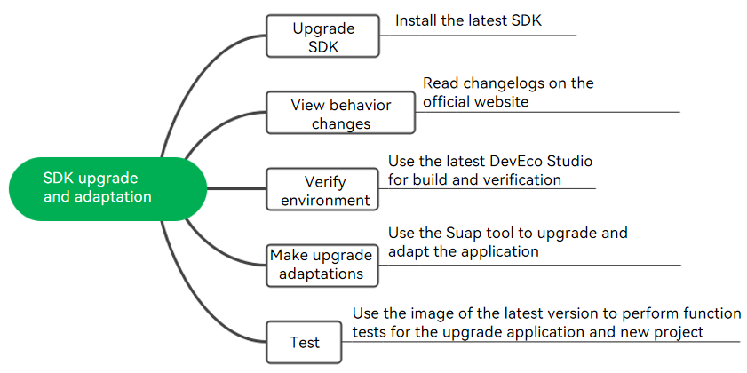

# Sdk-Upgrade-Guide

## Overview

This topic walks you through on how to upgrade your existing SDK and make necessary adaptations to your application.

## Upgrade and Adaptation Process

The entire SDK upgrade and adaptation process is divided into five phases:

1. Upgrading the SDK: Obtain the latest SDK version and installing the SDK.

2. Viewing behavior changes: Read changelogs.

3. Verifying the environment: Use DevEco Studio of the latest version for build and verification.

4. Making upgrade adaptations: Use the Suap tool to upgrade your application.

5. Testing: Use the image of the latest version to test the functions of the upgraded application and new project.

### Upgrading the SDK

You can upgrade the SDK in either of the following ways:

- Trigger automatic upgrade in DevEco Studio.
- Download the latest SDK version from the official website and upgrade it.

For example, to obtain the SDK version of OpenHarmony-4.0-Beta2, visit [Acquiring Source Code from Mirrors](OpenHarmony-v4.0-beta2.md#acquiring-source-code-from-mirrors).

For details on how to use the full SDK, see [Switching to Full SDK](../application-dev/faqs/full-sdk-switch-guide.md).

After the SDK upgrade, update the **compileSdkVersion** and **compatibleSdkVersion** configuration items in the **build-profile.json5** file of DevEco Studio.

### Viewing Behavior Changes

Changelogs are always provided along with each version release on the official website. From these changelogs, you can know the behavior changes and incompatible changes after the upgrade, as well as the change impact and adaptation guide.

Changelogs are archived in the [changelogs](changelogs) folder.

### Verifying the Environment

After you switch to the full SDK of the latest version, an error will be reported when incompatible APIs are being built in DevEco Studio. You are advised to use the latest DevEco Studio for build and verification.

To obtain the latest DevEco Studio version, see [Acquiring the Application Development Tool (HUAWEI DevEco Studio)](../device-dev/get-code/gettools-ide.md#acquiring-the-application-development-tool-huawei-deveco-studio).

### Making Upgrade Adaptations

Incompatible API changes may cause application build failures or event function problems. To quickly adapt to the latest SDK, you are advised to use the Suap tool to upgrade and adapt your application. The Suap tool generates an update report on DevEco Studio. The report contains the changes in the SDK of the new version and the code location. You can click **Locate Code** on DevEco Studio to access the corresponding page and modify your code.

To obtain the Suap tool, search for OpenHarmony SDK Upgrade Assistant in the DevEco Studio plug-in market.

### Testing

After the SDK upgrade and adaptation, download the image of the latest version and perform function tests on the device to ensure that the adaptation is successful. You are advised to use the emulator provided by DevEco Studio to perform the test.
