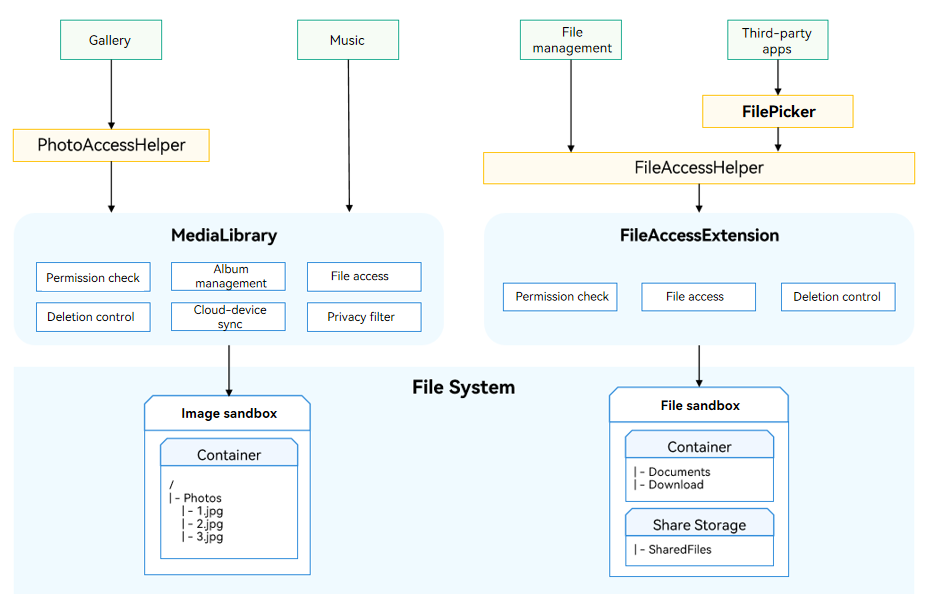

# File Subsystem Changelog

## cl.file.1 Change of Compatibility of mediaLibrary APIs

The compatibility of some [mediaLibrary](../../../application-dev/reference/apis/js-apis-medialibrary.md) APIs is changed.

1. Due to the change of the directory structure of the file subsystem, the **mediaLibrary** APIs will no longer be used to access document directories (**Documents** and **Download**). Use the [FilePicker](../../../application-dev/reference/apis/js-apis-file-picker.md) APIs instead.

- Before the change, the following directories can be accessed by using **mediaLibrary** APIs:

  **Camera**, **Videos**, **Pictures**, **Audios**, **Documents**, and **Download**

- After the change, the following directories can be accessed by using **mediaLibrary** APIs:

  **Camera**, **Videos**, **Pictures**, and **Audios**

2. The URI format of the corresponding assets is changed. For details, see [File Subsystem ChangeLog](../OpenHarmony_4.0.11.2/changelogs-filemanagement.md).

**Change Impact**

For applications developed based on earlier versions, check for the **mediaLibrary** APIs called to access the **Documents** and **Download** directories and use the **FilePicker** APIs.

**Key API/Component Changes**

| Module                   | Method/Attribute/Enum/Constant                                         | Change Type|
| ------------------------- | ------------------------------------------------------------ | -------- |
| medialibrary   |  **function** getFileAssets(options: MediaFetchOptions, callback: AsyncCallback&lt;FetchFileResult&gt;): void | The compatibility of the applicable range of the API is changed.    |
| medialibrary   |  **function** getFileAssets(options: MediaFetchOptions): Promise&lt;FetchFileResult&gt; | The compatibility of the applicable range of the API is changed.    |
| medialibrary   |  **function** createAsset(mediaType: MediaType, displayName: string, relativePath: string, callback: AsyncCallback&lt;FileAsset&gt;): void | The compatibility of the applicable range of the API is changed.    |
| medialibrary   |  **function** createAsset(mediaType: MediaType, displayName: string, relativePath: string): Promise&lt;FileAsset&gt; | The compatibility of the applicable range of the API is changed.    |
| medialibrary   |  **function** deleteAsset(uri: string, callback: AsyncCallback&lt;void&gt;): void | The compatibility of the applicable range of the API is changed.    |
| medialibrary   |  **function** deleteAsset(uri: string): Promise&lt;void&gt; | The compatibility of the applicable range of the API is changed.    |
| medialibrary   |  **function** getPublicDirectory(type: DirectoryType, callback: AsyncCallback&lt;string&gt;): void | The compatibility of the applicable range of the API is changed.    |
| medialibrary   |  **function** getPublicDirectory(type: DirectoryType): Promise&lt;string&gt; | The compatibility of the applicable range of the API is changed.    |
| medialibrary   |  **function** storeMediaAsset(option: MediaAssetOption, callback: AsyncCallback&lt;string&gt;): void | The compatibility of the applicable range of the API is changed.    |
| medialibrary   |  **function** storeMediaAsset(option: MediaAssetOption): Promise&lt;string&gt; | The compatibility of the applicable range of the API is changed.    |
| medialibrary   |  **interface** DirectoryType | The compatibility of the applicable range of the API is changed.    |
| medialibrary   |  **interface** MediaAssetOption | The compatibility of the applicable range of the API is changed.    |

**getFileAssets**:

The **getFileAssets** API cannot be used to obtain file assets in the **Documents** and **Download** directories. Use the [FilePicker](../../../application-dev/reference/apis/js-apis-file-picker.md) APIs instead.

**createAsset**:

If **relativePath** in **createAsset()** is set to a directory in **Documents** or **Download**), the file asset cannot be created in the specified directory. Use the [FilePicker](../../../application-dev/reference/apis/js-apis-file-picker.md) APIs instead.

**deleteAsset**:

If **URI** in **deleteAsset()** specifies a file asset in the **Documents** or **Download** directory, the specified file asset cannot be deleted. Use [fileAccess.delete](../../../application-dev/reference/apis/js-apis-fileAccess.md) APIs instead.

**getPublicDirectory**:

If **type** in **getPublicDirectory()** is set to **mediaLibrary.DirectoryType.DIR_DOCUMENTS** or **mediaLibrary.DirectoryType.DIR_DOWNLOAD**, the specified file path cannot be obtained.

**storeMediaAsset**:

If **MediaAssetOption.relativePath** in **storeMediaAsset()** is set to a path of the file in the **Documents** or **Download**) directory, the file asset cannot be stored. Use the [FilePicker](../../../application-dev/reference/apis/js-apis-file-picker.md) APIs instead.

**DirectoryType**:

**DirectoryType** does not support **mediaLibrary.DirectoryType.DIR_DOCUMENTS** or **mediaLibrary.DirectoryType.DIR_DOWNLOAD** in **mediaLibrary** APIs.

**MediaAssetOption**:

The **relativePath** in the **MediaAssetOption** attribute cannot be set to the path of a file in the **Documents** or **Download** directory when **storeMediaAsset()** is used.

**Adaptation Guide**

Do not use the **mediaLibrary** APIs to access or operate the files in the **Documents** and **Download** directories. Use the [FilePicker](../../../application-dev/reference/apis/js-apis-file-picker.md) APIs instead.



Example:

Before the change, the **mediaLibrary** APIs are used to edit files in the **Documents** and **Download** directories.

1. Call **getMediaLibrary** to obtain a **mediaLibrary** instance.
2. Create a **MediaFetchOptions** object, and call **getFileAssets** to obtain files in the use file directory.
3. Call the **FetchFileResult** APIs to obtain the file asset of the target file.
4. Call **fileAsset.open** to open the file and obtain the FD.
5. Call [fs.writeSync](../../../application-dev/reference/apis/js-apis-file-fs.md#writesync) to edit the file based on the FD.
6. After the edit, call **fileAsset.close** to close the FD of the file.
7. Call **fetchFileResult.close** to release the resources occupied by **getFileAssets**.
8. Call **release** to release the **mediaLibrary** instance.

**Sample code**:

```js
import mediaLibrary from '@ohos.multimedia.mediaLibrary';
import fs from '@ohos.file.fs';

async function example() {
  try {
    let context = getContext(this);
    let media = mediaLibrary.getMediaLibrary(context);
    let fileKeyObj = mediaLibrary.FileKey;
    let imageType = mediaLibrary.MediaType.IMAGE;
    let getImageOp = {
      selections: fileKeyObj.MEDIA_TYPE + '= ?',
      selectionArgs: [imageType.toString()],
      order: fileKeyObj.DATE_ADDED + ' DESC',
    };
    const fetchFileResult = await media.getFileAssets(getImageOp);
    const fileAsset = await fetchFileResult.getFirstObject();
    console.info('mediaLibrary fileAsset displayName: ' + fileAsset.displayName);
    let fd = await fileAsset.open('rw');
    console.info('mediaLibrary fileAsset open fd: ' + fd);
    let writeLen = fs.writeSync(fd, 'hello, world');
    console.info('write data to file succeed and size is: ' + writeLen);
    fileAsset.close(fd);
    fetchFileResult.close();
    media.release();
  } catch (err) {
    console.error('mediaLibrary fail, err: ' + err);
  }
}
```

After the change, use **FilePicker** APIs to edit the files in the user file directory.

1. Obtain a **DocumentViewPicker** object.
2. Call **DocumentViewPicker.select** to select a file.
3. After a file is selected, the file URI is returned.
4. After the UI is returned from **DocumentViewPicker**, call [fs.openSync](../../../application-dev/reference/apis/js-apis-file-fs.md#fsopensync) to open the file based on the URI and obtain the FD.
5. Call [fs.writeSync](../../../application-dev/reference/apis/js-apis-file-fs.md#writesync) to edit the file based on the FD.
6. After the edit, call [fs.closeSync](../../../application-dev/reference/apis/js-apis-file-fs.md#closesync) to close the FD.

**Sample code**:

```js
import picker from '@ohos.file.picker';
import fs from '@ohos.file.fs';

let uri;

async function example() {
  try {
    let DocumentSelectOptions = new picker.DocumentSelectOptions();
    let documentPicker = new picker.DocumentViewPicker();
    documentPicker.select(DocumentSelectOptions).then((DocumentSelectResult) => {
      console.info('DocumentViewPicker.select successfully, DocumentSelectResult uri: ' + JSON.stringify(DocumentSelectResult));
      uri = DocumentSelectResult[0];
    }).catch((err) => {
      console.error('DocumentViewPicker.select failed with err: ' + err);
    });
  } catch (err) {
    console.error('DocumentViewPicker failed with err: ' + err);
  }
}

async function writeFile() {
  try {
    let file = fs.openSync(uri, fs.OpenMode.READ_WRITE);
    console.info('DocumentViewPicker file fd: ' + file.fd);
    let writeLen = fs.writeSync(file.fd, 'hello, world');
    console.info('write data to file succeed and size is: ' + writeLen);
    fs.closeSync(file);
  } catch (err) {
    console.error('DocumentViewPicker fail, err: ' + err);
  }
}
```

Before the change, use the **mediaLibrary** APIs to create a file in the **Documents** and **Download** directories.

1. Call **getMediaLibrary** to obtain a **mediaLibrary** instance.
2. Call **getPublicDirectory** to obtain the path of the user file directory.
3. Call **createAsset** to create a file and obtain the file asset.
4. Call **fileAsset.open** to open the file and obtain the FD.
5. Call **fs.write** to edit the file based on the FD.
6. After the edit, call **fileAsset.close** to close the FD of the file.
7. Call **release** to release the **mediaLibrary** instance.

**Sample code**:

```js
import mediaLibrary from '@ohos.multimedia.mediaLibrary';
import fs from '@ohos.file.fs';

async function example() {
  try {
    let context = getContext(this);
    let media = mediaLibrary.getMediaLibrary(context);
    let mediaType = mediaLibrary.MediaType.FILE;
    let DIR_DOWNLOAD = mediaLibrary.DirectoryType.DIR_DOWNLOAD;
    const path = await media.getPublicDirectory(DIR_DOWNLOAD);
    const fileAsset = await media.createAsset(mediaType, 'test.txt', path);
    console.info('mediaLibrary fileAsset displayName: ' + fileAsset.displayName);
    let fd = await fileAsset.open('rw');
    console.info('mediaLibrary fileAsset open fd: ' + fd);
    let writeLen = fs.writeSync(fd, 'hello, world');
    console.info('write data to file succeed and size is: ' + writeLen);
    fileAsset.close(fd);
    media.release();
  } catch (err) {
    console.error('mediaLibrary fail, err: ' + err);
  }
}
```

After the change, use **FilePicker** APIs to create a file in the **Documents** and **Download** directories.

1. Obtain a **DocumentViewPicker** object.
2. Call **DocumentViewPicker.save** to create and save an empty file.
3. After the file is saved, the file URI is returned.
4. After the UI is returned from **DocumentViewPicker**, call [fs.openSync](../../../application-dev/reference/apis/js-apis-file-fs.md#fsopensync) to open the file based on the URI and obtain the FD.
5. Call [fs.writeSync](../../../application-dev/reference/apis/js-apis-file-fs.md#writesync) to edit the file based on the FD.
6. After the edit, call [fs.closeSync](../../../application-dev/reference/apis/js-apis-file-fs.md#closesync) to close the FD.

**Sample code**:

```js
import picker from '@ohos.file.picker';
import fs from '@ohos.file.fs';

let uri;

async function example() {
  try {
    let DocumentSaveOptions = new picker.DocumentSaveOptions();
    DocumentSaveOptions.newFileNames = ['DocumentViewPicker01.txt'];
    let documentPicker = new picker.DocumentViewPicker();
    documentPicker.save(DocumentSaveOptions).then((DocumentSaveResult) => {
      console.info('DocumentViewPicker.save successfully, DocumentSaveResult uri: ' + JSON.stringify(DocumentSaveResult));
      uri = DocumentSaveResult[0];
    }).catch((err) => {
      console.error('DocumentViewPicker.save failed with err: ' + err);
    });
  } catch (err) {
    console.error('DocumentViewPicker failed with err: ' + err);
  }
}

async function writeFile() {
  try {
    let file = fs.openSync(uri, fs.OpenMode.READ_WRITE);
    console.info('DocumentViewPicker file fd: ' + file.fd);
    let writeLen = fs.writeSync(file.fd, 'hello, world');
    console.info('write data to file succeed and size is: ' + writeLen);
    fs.closeSync(file);
  } catch (err) {
    console.error('DocumentViewPicker fail, err: ' + err);
  }
}
```
