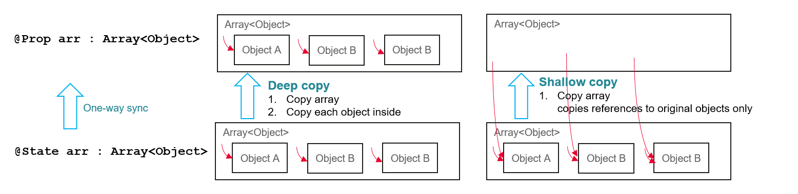

# Arkui Subsystem State Management Changelog


# Support by @Prop for Object Behavior Changes

## cl. Change from Shallow Copy to Deep Copy of Objects by @Prop

**Change Impact**

In API version 9, @Prop supports shallow copy of objects. The specific behavior is as follows:

- Object type: shallow copy of all properties returned by **Object.keys(propObj)**. That is, only the outermost object is copied, and the property in the object points to the data source of the original parent component.
- Array type: shallow copy of all array items. That is, only the outermost array is copied. Other behaviors are the same as those of the Object type.
- The prototype of the object and array is copied.

Since API version 10, @Prop supports deep copy of objects. The specific behavior is as follows:
- Object type: deep copy of all properties returned by **Object.keys(propObj)**.
- Array type: deep copy of all array items.
- The prototype of the object and array is copied.

**Adaptation Guide**

The impact of the change on UI rendering mainly lies in @ObjectLink-related scenarios, because @ObjectLink functions as a proxy for its decorated object properties.

The following shows an example:

API version 9: If @Prop objArray in the PropClassArray component changes the property of ClassA or sets a new array item, @ObjectLink obj in ObjectLinkClassA created by the parent component StateClassAArray changes.

The update is caused by the shallow copy from @State stateClassAArray in the parent component StateClassAArray to @Prop objArray in the child component PropClassAArray. The shallow copy copies only the reference of array items, and therefore the data source is changed. As @ObjectLink functions as a proxy for the properties of the data source, the update of @ObjectLink obj (constructed from the StateClassAArray component) in the ObjectLinkClassA component is triggered.

API version 10: In the preceding scenario, the copy from @State stateClassAArray in the parent component StateClassAArray to @Prop objArray in the child component PropClassAArray is a deep copy. As the object of ClassA is completely copied, the data source is not changed, and the update of @ObjectLink obj (constructed from the StateClassAArray component) in the ObjectLinkClassA component is not triggered.





```ts
let nextId = 0;

@Observed
class ClassA  {
  id : number;
  a : number;
  constructor(a : number = 0) {
    this.id = nextId++;
    this.a = a;
  }
}

@Component
struct ObjectLinkClassA {
  @ObjectLink obj : ClassA;

  build() {
    Row() {
      Text(`ObjectLink: obj: ${this.obj.a}`)
        .height(100)
        .onClick(() => {
          this.obj.a += 1;
          console.info(`ObjectLink onClick ClassA property changed to  ${this.obj.a}`)
        })
    }.border({width: 3, color: Color.Red})
  }
}

@Component
struct PropClassAArray {
  @Prop objArray : Array<ClassA> = [];

  build() {
    Column() {
      Text(`green box: @Prop : Array<ObjectClassA> item [0] + [1]`)
      Row() {
        ObjectLinkClassA({ obj:  this.objArray[0] })
        Text("[0] Assign new ClassA")
          .height(100)
          .onClick(() => {
            this.objArray[0] = new ClassA();
            console.info(`PropClassAArray[0] onClick ClassA object assign ${this.objArray[0].a}`)
          })
        Text("Change ClassA property")
          .height(100)
          .onClick(() => {
            this.objArray[0].a += 1;
            console.info(`PropClassAArray[1] onClick ClassA property change  ${this.objArray[1].a}`)
          })
      }
    }.border({width: 3, color: Color.Green})
  }
}

@Entry
@Component
struct StateClassAArray {
  @State stateClassAArray : Array<ClassA> = [ new ClassA(), new ClassA() ];

  build() {
    Column() {
      Column() {
        Text("Red box: @ObjectLink from @State array item[0]")
        Row() {
          ObjectLinkClassA({obj : this.stateClassAArray[0] })
          Text("Assign new ClassA")
            .height(100)
            .onClick(() => {
              this.stateClassAArray[0] = new ClassA();
              console.info(`StateClassAArray[0] onClick ClassA object assign ${this.stateClassAArray[0].a}`)
            })
          Text("Change ClassA property")
            .height(100)
            .onClick(() => {
              this.stateClassAArray[0].a += 1;
              console.info(`StateClassAArray onClick stateClassAArray[0] changed to  ${this.stateClassAArray[0].a}`)
            })
        }

      }.border({width: 3, color: Color.Blue})

      Divider().height(5)

      // Shallow copy in API version 9: Only the reference pointing to the source array item is copied, and the ClassA instance itself is not copied.
      // Deep copy in API version 10: The this.stateClassAArray instance is completely copied, including its array items.
      PropClassAArray({ objArray: this.stateClassAArray })
    }
  }
}
```
