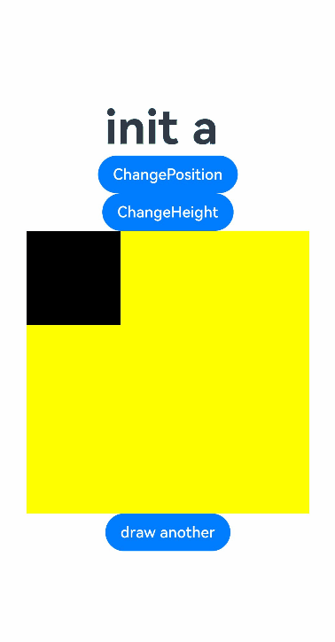

# ArkUI Subsystem Changelog


## cl.arkui.1 Reporting of Unexpected Number of @Extend/@AnimatableExtend Parameters

The @Extend and @AnimatableExtend decorators allow for only one parameter.

**Change Impact**

When there are multiple parameters for the @Extend/@AnimatableExtend decorator, a compilation error is reported.

**Example (incorrect)**:

```ts
// xxx.ets

@Extend(Text, Button)  // Compilation error: @Extend should have one and only one parameter.
function fancy() {
  .width(100)
}

@AnimatableExtend(Text, Polyline)  //Compilation error: @AnimatableExtend should have one and only one parameter.
function fancy2() {
  .height(100)
}

@Entry
@Component
struct Example {
  build() {
    Column() {
      Text('text')
        .fancy()
        .fancy2()
    }
  }
}
```

**Key API/Component Changes**

N/A

**Adaptation Guide**

Make sure the @Extend and @AnimatableExtend decorators contain only one parameter.

The code snippet is as follows:
```ts
// xxx.ets

@Extend(Text)
function fancy() {
  .width(100)
}

@AnimatableExtend(Text)
function fancy2() {
  .height(100)
}

@Entry
@Component
struct Example {
  build() {
    Column() {
      Text('text')
        .fancy()
        .fancy2()
    }
  }
}
```

## cl.arkui.2 Reporting of @Link/@ObjectLink Member Variables Not Being Configured from Parent Components

The value of an @Link or @ObjectLink decorated member variable in a component must be from the parent component.

**Change Impact**

When the value of an @Link/@ObjectLink decorated member variable in a component is not configured from the parent component, a compilation error is reported.

**Example (incorrect)**:

```ts
// xxx.ets

@Observed
class Count {
  message: string = 'count'
}

@Entry
@Component
struct Parent {
  @State state1: string = 'state1';
  @State state2: Count = new Count();
  build() {
    Column() {
      Child()  // Compilation error: Property 'link' in the custom component 'Child' is missing (mandatory to specify).
               // Compilation error: Property 'objectLink' in the custom component 'Child' is missing (mandatory to specify).
    }
  }
}

@Component
struct Child {
  @Link link: string;
  @ObjectLink objectLink: Count;
  build() {
    Column() {
      Text(this.link)
        .fontSize(50)
      Text(this.objectLink.message)
        .fontSize(50)
    }
  }
}
```

**Key API/Component Changes**

N/A

**Adaptation Guide**

Configure the @Link and @ObjectLink decorated member variables in components to get their values from the parent component.

The code snippet is as follows:
```ts
// xxx.ets

@Observed
class Count {
  message: string = 'count'
}

@Entry
@Component
struct Parent {
  @State state1: string = 'state1';
  @State state2: Count = new Count();
  build() {
    Column() {
      Child({link: $state1, objectLink: this.state2})
    }
  }
}

@Component
struct Child {
  @Link link: string;
  @ObjectLink objectLink: Count;
  build() {
    Column() {
      Text(this.link)
        .fontSize(50)
      Text(this.objectLink.message)
        .fontSize(50)
    }
  }
}
```
## cl.arkui.3 Behavior Change of the onReady Event for \<Canvas>

**Description**
The **onReady** event is triggered when the component is ready or when the component size changes. After it is triggered, the canvas is cleared.

**Example**
```ts
@Entry
@Component
struct OnReadyDiff {
  @State message: string = 'init '
  @State isShow: boolean = false
  @State myHeight: number = 300
  private settings: RenderingContextSettings = new RenderingContextSettings(true);
  private context: CanvasRenderingContext2D = new CanvasRenderingContext2D(this.settings);

  build() {
    Row() {
      Column() {
        Text(this.message)
          .fontSize(50)
          .fontWeight(FontWeight.Bold)
        Button('ChangePosition')
          .onClick(()=>{
            this.isShow = !this.isShow
          })
        if (this.isShow) {
          Button('new button')
            .height(200)
        }
        Button('ChangeHeight')
          .onClick(()=>{
            this.myHeight = this.myHeight==300?500:300
          })

        Canvas(this.context)
          .width(300)
          .height(this.myHeight)
          .backgroundColor('#ffff00')
          .onReady(() =>{
            this.context.fillRect(0, 0, 100, 100)
            this.message += 'a '
          })
        Button('draw another')
          .onClick(()=>{
            this.context.fillRect(100, 100, 100, 100)
          })
      }
      .width('100%')
    }
    .height('100%')
  }
}
```

API version 9: The **onReady** event is triggered when the component is ready, when the component location changes, or when the component size changes.



API version 10 and later: The **onReady** event is triggered when the component is ready or when the component size changes. It is not triggered when the component location changes.


**Change Impact**

When the component location changes, the **onReady** event is triggered in API version 9 and earlier versions, but not in API version 10 and later versions.

## cl.arkui.4 Change of How Percentage Is Calculated for Margin

Before the change: The margin is calculated twice when set in percentage. The second calculation is conducted after the result of the first calculation has been subtracted from the percentage reference. After the change: The first margin calculation result is used as the final result, and the second calculation is not conducted.

**Change Impact**

This change affects calculation of margins set in percentage.

**Example (incorrect)**:

```ts
// xxx.ets
@Entry
@Component
struct TextInputExample {
  @State text: string = ''
  controller: TextInputController = new TextInputController()

  build() {
    Column(){
      Row().margin({left:"50%"}).width(100).height(100)
    }.width("100%").height("100%")
  }
}
```

**Key API/Component Changes**

N/A

**Adaptation Guide**

After the change, the margin percentage reference is fixed at the parent component's width minus its padding, and does not subtract the result of the first margin calculation. As a result, the margin percentage is slightly greater than that before the change. Account for this change when setting the margin percentage.
