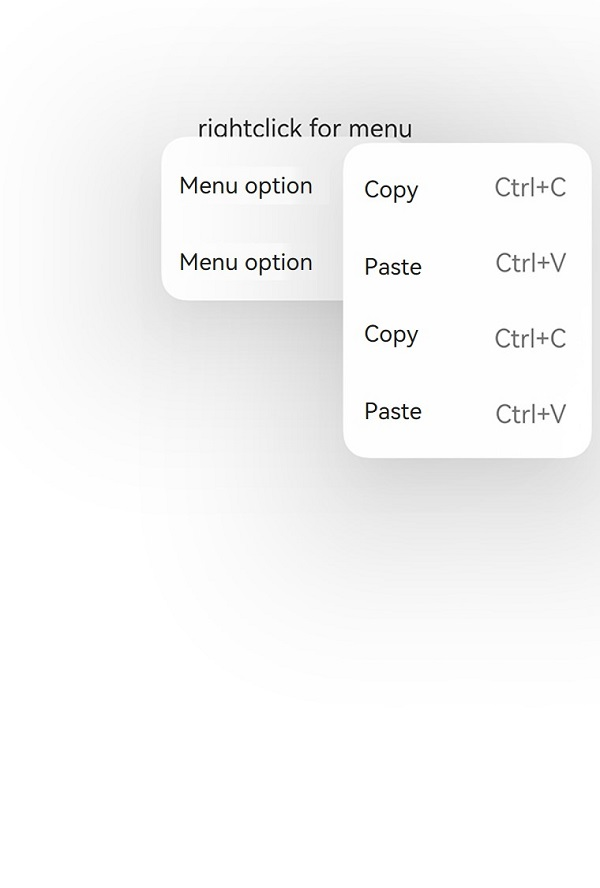
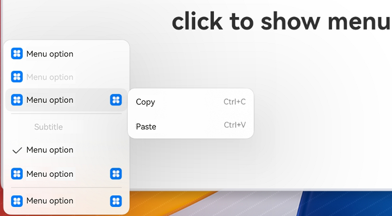

# ArkUI Subsystem Changelog

## cl.arkui.1 Visual Effect Changes of the Menu Component

**Access Level**

Public

**Reason for Change**

The changes are made to maintain consistency with UX specifications.

- Changes the display effect shown when the set width is less than the minimum width.
- Changes how the context menu interacts with the user.
- Adds an attribute to allow a menu to display across applications (if this attribute is not specified, the system auto-displays the menu across applications based on the device type).

**Change Impact**

The changes are compatible changes.

- Allows the menu to display across applications.

- Affects the avoidance logic of the context menu.

**API Level**

11

**Change Since**

OpenHarmony SDK 4.1.3.5

**Key API/Component Changes**

Menu

- Before change:

  - If a custom menu is set to a width less than 64 vp, it is displayed at the width of 64 vp.

  - If there is no enough room for the context menu below the selected element, the context menu is flipped and displayed above the selected element instead.

  - The submenu, if any, of a context menu, is displayed close to the edge.

  - The menu can only be displayed in the application window.

- After change:

  - If a custom menu is set to a width less than 64 vp, it is displayed at the width of two columns.

  - If there is no enough room for the context menu below the selected element, the context menu is moved upward vertically until it is completely displayed, while respecting the minimum bottom margin requirement for the menu.

  - When the menu pops up within the application, it has a left and right margin of 16 vp, and it defaults to avoiding the status bar and navigation bar without additional clearance distance. When the menu pops up outside the application window, it has a left and right margin of 8 vp, and it defaults to avoiding the status bar and dock area without additional clearance distance. If there is a submenu, its margin is consistent with that of the level-1 menu.

  
  
  - You can use the **showInSubWindow** attribute to set whether to display the menu in a subwindow outside the application window on KLV devices. The value **true** means to show the menu in a subwindow outside the application window, and **false** means the opposite. If this attribute is not set, the menu is displayed in a subwindow outside the application window on KLV devices and inside the application window on non-KLV devices.
  
  

**Adaptation Guide**

```
/* Example of displaying the menu in a child window
*(showInSubWindow?: boolean;)
* Condition: KLV device
* true: The menu is displayed in a subwindow outside the application window. 
* false: The menu is displayed inside the application window.
*/
@Entry
@Component
struct Index {
  @State select: boolean = true
  private iconStr: ResourceStr = $r("app.media.view_list_filled")
  private iconStr2: ResourceStr = $r("app.media.view_list_filled")

  @Builder
  SubMenu() {
    Menu() {
      MenuItem({ content: "Copy", labelInfo: "Ctrl+C" })
      MenuItem({ content: "Paste", labelInfo: "Ctrl+V" })
    }
  }

  @Builder
  MyMenu(){
    Menu() {
      MenuItem({ startIcon: $r("app.media.icon"), content: "Menu option" })
      MenuItem({ startIcon: $r("app.media.icon"), content: "Menu option" })
        .enabled(false)
      MenuItem({
        startIcon: this.iconStr,
        content: "Menu option",
        endIcon: $r("app.media.arrow_right_filled"),
        builder: ():void=>this.SubMenu()
      })
      MenuItemGroup ({ header: 'Subtitle' }) {
        MenuItem ({ content: "Menu option" })
          .selectIcon(true)
          .selected(this.select)
          .onChange((selected) => {
            console.info("menuItem select" + selected);
            this.iconStr2 = $r("app.media.icon");
          })
        MenuItem({
          startIcon: $r("app.media.view_list_filled"),
          content: "Menu option",
          endIcon: $r("app.media.arrow_right_filled"),
          builder: ():void=>this.SubMenu()
        })
      }
      MenuItem({
        startIcon: this.iconStr2,
        content: "Menu option",
        endIcon: $r("app.media.arrow_right_filled")
      })
    }
  }

  build() {
    Row() {
      Column() {
        Text('click to show menu')
          .fontSize(50)
          .fontWeight(FontWeight.Bold)
      }
      .bindMenu(this.MyMenu,{showInSubWindow:true})
      .width('100%')
    }
    .height('100%')
  }
}

```
