# ArkUI Subsystem Changelog

## cl.arkui.1 Change in the Default Background Effect of Menus

**Access Level**

Public

**Reason for Change**

The change is made to enhance visual effects.

**Change Impact**

This change is a compatible change.

In unified rendering mode, the default background of the menu is changed to a blur material.

**API Level**

11 

**Change Since**

OpenHarmony SDK 4.1.5.2

**Key API/Component Changes**

**bindMenu**, **bindContextMenu**, **<\Select>**, **<\Navigation>**

- Before change: The menu background is in white by default and does not support blur styles.
- After change: By default, the menu background is transparent with a blur style applied. You can configure the background color and blur style for **bindMenu** and **bindContextMenu**.

**Adaptation Guide**

Example of removing a blur style from **bindMenu** or **bindContextMenu**:
```ts
@Entry
@Component
struct Index {
  @State message: string = 'Custom menu';

  @Builder
  MenuBuilder() {
    Menu() {
      MenuItem({ content: "item00" })
      MenuItem({ content: "item11" })
    }
  }

  @Builder
  ContextMenuBuilder() {
    Menu() {
      MenuItem({ content: "item22" })
      MenuItem({ content: "item33" })
    }
  }

  build() {
    Row() {
      Column() {
        Text(this.message)
          .fontSize(50)
          .fontWeight(FontWeight.Bold)
          .fontColor('black')
          .bindMenu(this.MenuBuilder(), { backgroundColor: Color.White, backgroundBlurStyle: BlurStyle.NONE })
          .bindContextMenu(this.ContextMenuBuilder(), ResponseType.LongPress, {
            backgroundColor: Color.White,
            backgroundBlurStyle: BlurStyle.NONE
          })
      }
      .width('100%')
    }
    .height('100%').backgroundColor(Color.Orange)
  }
}
```
Before change:
```ts
.bindMenu(this.MenuBuilder())
.bindContextMenu(this.ContextMenuBuilder(), ResponseType.LongPress)
```
After change:
```ts
.bindMenu(this.MenuBuilder(), { backgroundColor: Color.White, backgroundBlurStyle: BlurStyle.NONE })
.bindContextMenu(this.ContextMenuBuilder(), ResponseType.LongPress, { backgroundColor: Color.White, backgroundBlurStyle: BlurStyle.NONE })
```
As shown in the preceding example, you can manually set the enumerated values of the background color and blur style.


## cl.arkui.2 New Sheet Types

**Access Level**

Public

**Reason for Change**

The change is made to enhance visual effects.

**Change Impact**

This change is a compatible change.

a. When the device width is less than 600 vp, the sheet is presented as a bottom sheet by default.

b. When the device width is in the 600-840 vp range, the sheet is presented as a center sheet by default.

c. When the device width is greater than 840 vp, the sheet is presented as a popup sheet by default, displayed under the node bound to through **bindSheet**.

Before change: The sheet is presented as a bottom sheet on all devices.


After change: The sheet can also be presented as a center or popup sheet. Below shows a center sheet.

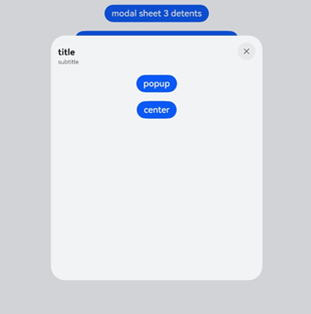

Below shows a popup sheet.

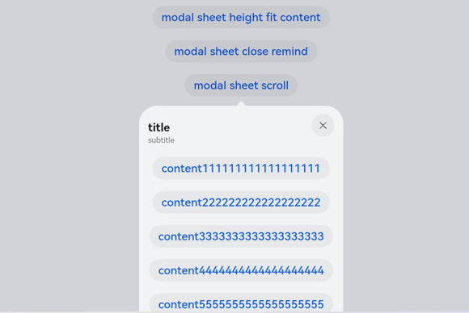

**API Level**

11

**Change Since**

OpenHarmony SDK 4.1.5.2

**Key API/Component Changes**

bindSheet

**Adaptation Guide**

For a device whose width is greater than 840 vp, to display a center sheet, set **preferType** in **SheetOptions** to **SheetType.CENTER**.


## cl.arkui.3 Change in the Style of the Bottom Sheet

**Access Level**

Public

**Reason for Change**

The change is made to enhance visual effects.

**Change Impact**

This change is a compatible change.

a. With **SheetSize** in **SheetOptions** of the bottom sheet set to **Medium**, the sheet height is the screen height multiplied by 0.6.

Before change:

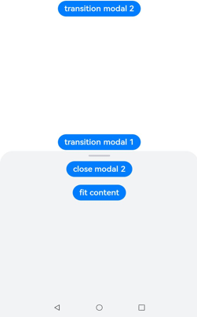

After change:


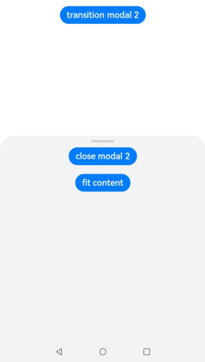

b. The **FIT_CONTENT** option is added to **SheetSize** in **SheetOptions** for the bottom sheet. This option enables the sheet to adapt its height based on the content.

Before change:


After change:

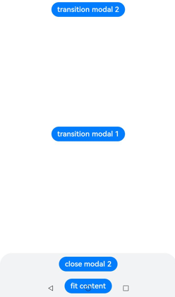

c. You can use **detents** in **SheetOptions** to specify an array of heights where the sheet can rest. This attribute takes effect only for the bottom sheet in portrait mode.

Before change: The sheet cannot rest at different heights.

After change:


d. When the device is in landscape mode, the bottom sheet supports only one detent - 8 vp away from the top of the screen.

Before change: The detent specifications of the bottom sheet in landscape mode are the same as those in portrait mode.

After change:

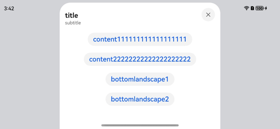

e. When the height of the content area builder is set to a percentage, the percentage is based on the height set or the value of **detents**, not the screen height.

**API Level**

11

**Change Since**

OpenHarmony SDK 4.1.5.2

**Key API/Component Changes**

bindSheet

**Adaptation Guide**

a. When **detents** in **SheetOptions** is set, the first height in the tuple is the initial height.

b. When **detents** is set in **SheetOptions**, the **height** attribute does not take effect.

c. When **height** is set to a custom height or **FIT_CONTENT**, the maximum height is used if the height set is greater than the maximum height or less than **0**.


## cl.arkui.4 Addition of the Center and PopUp Sheet Types

**Access Level**

Public

**Reason for Change**

The change is made to enhance visual effects.

**Change Impact**

This change is a compatible change.

a. The default width and height of the center sheet are 480 vp and 560 vp, respectively.

b. If a center sheet has fixed content, you can customize its height, 320 vp at minimum and length of the shorter edge of the device multiplied by 0.9 at maximum.

c. The center sheet does not resize when switched between landscape and portrait modes.

d. The default width and height of the popup sheet are 360 vp and 560 vp, respectively.

e. If a popup sheet has fixed content, you can customize its height, 320 vp at minimum and length of the shorter edge of the device multiplied by 0.9 at maximum.

**API Level**

11

**Change Since**

OpenHarmony SDK 4.1.5.2

**Key API/Component Changes**

bindSheet

**Adaptation Guide**

When **height** is set to a custom height or **FIT_CONTENT**, the maximum height is used if the height set is greater than the maximum height; the minimum height is used if the height set is less than the minimum height; the default height is used if the height set is a negative value.


## cl.arkui.5 Change in the Sheet Operation Area

**Access Level**

Public

**Reason for Change**

The change is made to enhance visual effects.

**Change Impact**

This change is a compatible change.

a. A title area is added to accommodate the title specified in **SheetOptions**. This area is 56 vp high for a single-line or custom title and 72 vp high for a double-line title.

Before change: There is no title area on the sheet.

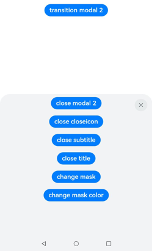

After change: The title area is displayed on the sheet as needed.

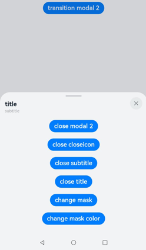

b. You can specify whether to show a close icon through **showClose** in **SheetOptions**. By default, the icon is displayed.

Before change: The sheet does not have a close icon.

After change: The sheet shows a close icon by default.

c. The size of the drag bar is changed to 48 x 4 vp. The drag bar is not displayed when sheet has only one detent and is displayed by default when sheet has multiple detents.

Before change: The drag bar is displayed by default, with a size of 28 x 4 vp.

After change: The drag bar is displayed by default only for the bottom sheet that has multiple detents, at a size of 48 x 4 vp.

d. The drag bar does not move slightly in the x or y direction when dragged.

Before change: The drag bar moves slightly in the x and y directions when dragged.

After change: The drag bar does not move slightly in the x or y direction when dragged.

**API Level**

11

**Change Since**

OpenHarmony SDK 4.1.5.2

**Key API/Component Changes**

bindSheet

**Adaptation Guide**

None.


## cl.arkui.6 Change in the Interaction with the Sheet Content Area

**Access Level**

Public

**Reason for Change**

The change is made to enhance the interaction experience.

**Change Impact**

This change is a compatible change.

a. With a bottom sheet that has its content displayed on the top, swiping up expands the sheet (if multiple detents are available) or scrolls the content; swiping down shrinks (if multiple detents are available) or closes the sheet.

b. With a bottom sheet that has its content displayed at the bottom, swiping up produces a bounce effect in the content area, without switching the sheet between detents; swiping down scrolls the content until it reaches the top.

c. With a bottom, center, or popup sheet that has its content displayed in the center, swiping up or down scrolls the content until it reaches the bottom or top, without switching the sheet between detents.

d. With a center sheet that has its content displayed on the top, swiping down closes the sheet; swiping up scrolls the content. With a center sheet that has its content displayed at the bottom, swiping up produces a bounce effect in the content area; swiping down scrolls the content.

e. With a popup sheet that has its content displayed on the top, swiping down does not close the sheet; swiping up scrolls the content. With a popup sheet that has its content displayed at the bottom, swiping up produces a bounce effect in the content area; swiping down scrolls the content.

Before change: The sheet does not interact when users swipe up or down on it.

After change:


**API Level**

11

**Change Since**

OpenHarmony SDK 4.1.5.2

**Key API/Component Changes**

bindSheet

**Adaptation Guide**

None.


## cl.arkui.7 Change in the Interaction with the Sheet Title Area

**Access Level**

Public

**Reason for Change**

The change is made to enhance the interaction experience.

**Change Impact**

This change is a compatible change.

a. Swiping up in the title area of a bottom sheet switches the sheet to the adjacent larger detent; dragging up the title area switches the sheet straight to the largest detent; if the sheet is already at its largest detent, it produces a bounce effect.

b.Swiping down in the title area of a bottom sheet switches the sheet to the adjacent smaller detent; dragging down the title area switches the sheet across detents and even closes it.

c. Swiping up in the title area of a center sheet produces a bounce effect; swiping down with a velocity lower than the threshold also produces a bounce effect; dragging down or swiping down with a velocity higher than the threshold closes the sheet.

Before change: Interaction in the title area triggers only the dismiss event.

After change:


**API Level**

11

**Change Since**

OpenHarmony SDK 4.1.5.2

**Key API/Component Changes**

bindSheet

**Adaptation Guide**

None.

**Example**

See the preceding example after change.


## cl.arkui.8 Change in Modes for Dismissing a Sheet

**Access Level**

Public

**Reason for Change**

The change is made to enhance the interaction experience.

**Change Impact**

This change is a compatible change.

a. A sheet can be dismissed by touching the mask. By default, the bottom and center sheets have a mask, and the popup sheet has no mask.

Before change: By default, the sheet has no mask, and users cannot dismiss the sheet by touching the mask.

After change:


b. A sheet can be dismissed by touching the close icon.

c. A bottom or center sheet can be dismissed by a pull-down gesture.

Before change: All sheets can be dismissed by a pull-down gesture.

After change: Only the bottom and center sheets can be dismissed by a pull-down gesture.

d. The **shouldDismiss** callback is added to **SheetOptions**. With the callback registered, when the user attempts to dismiss the sheet by a pull-down gesture or clicking the back button, the mask, or the close icon, the sheet is not dismissed immediately.

Before change: If the dismiss event is triggered, the sheet is dismissed immediately.

After change: With the **shouldDismiss** callback registered, when the user attempts to dismiss the sheet, the sheet is not dismissed immediately.

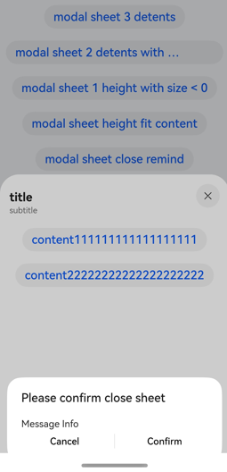

**API Level**

11

**Change Since**

OpenHarmony SDK 4.1.5.2

**Key API/Component Changes**

bindSheet

**Adaptation Guide**

None.

## cl.arkui.9 Change in the \<Select> Component

**Access Level**

Public

**Reason for Change**

The change is made to enhance visual effects.

**Change Impact**

This change is a compatible change.

**API Level**

11

**Change Since**

OpenHarmony SDK 4.1.5.2

**Key API/Component Changes**

\<Select>

- Before change:
  The distance between the drop-down button text and the left boundary and the distance between the arrow icon and the right boundary of the **\<Select>** component are 12 vp.

  There is a horizontal offset when the drop-down button is aligned with the drop-down list box.

  The distance between the drop-down button and the drop-down menu is 4 vp.

  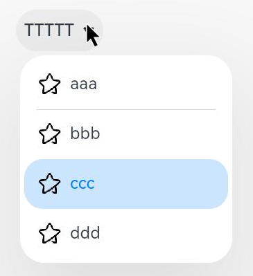

- After change:
  The distance between the drop-down button text and the left boundary and the distance between the arrow icon and the right boundary of the **\<Select>** component are 16 vp.

  There is not horizontal offset when the drop-down button is aligned with the drop-down list box.
  
  The distance between the drop-down button and the drop-down menu is 8 vp.

  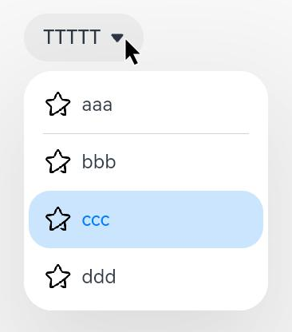

**Adaptation Guide**

None.


## cl.arkui.10 Change in Interaction with the \<Refresh> Component

**Access Level**

Public

**Reason for Change**

Previously, the **\<Refresh>** component supports the mouse-based drag-down action. This may result in conflicts with the multiselect action in certain scenarios. In addition, the support for the mouse-based drag-down action does not comply with the UX specifications.

**Change Impact**

This change is a non-compatible change. After change, the **\<Refresh>** component does not support the mouse-based drag-down action.

**API Level**

8

**Change Since**

OpenHarmony SDK 4.1.5.2

**Key API/Component Changes**

In versions earlier than API version 11, the **\<Refresh>** component supports the mouse-based drag-down action.

In API version 11 and later versions, the **\<Refresh>** component does not support the mouse-based drag-down action.

**Adaptation Guide**

None.
