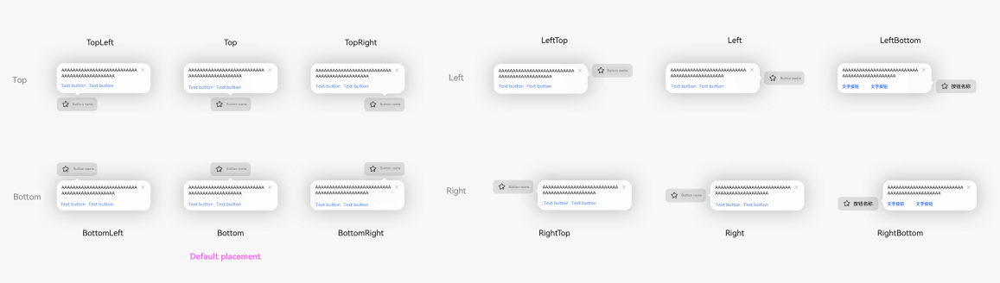
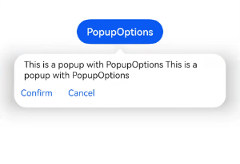
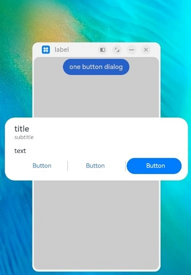

# ArkUI Subsystem Changelog

## cl.arkui.1 Display Effect Change of the alignment Parameter in the \<DatePickerDialog>, \<TimePickerDialog>, and \<TextPickerDialog> Components

**Access Level**

Public

**Reason for Change**

Specification optimization.

**Change Impact**

This change is a compatible change.

In **\<DatePickerDialog>**, **\<TimePickerDialog>**, and **\<TextPickerDialog>** components, the **alignment** parameter to adjust the position of the picker dialog box relative to the window. The affected scenarios are as follows:

(a) **alignment** is set to **Top**, **TopStart**, or **TopEnd**

Before change: There is a default spacing of 40 vp between the picker dialog box and the top of the window.

After change: The spacing between the picker dialog box and the top of the window is 0.

(b) **alignment** is set to **Bottom**

Before change: There is a default spacing of 16 vp between the picker dialog box and the bottom of the window.

After change: The spacing between the picker dialog box and the bottom of the window is 0.

(c) **alignment** is set to **Center**

Before change: There is an upward offset of 16 vp relative to the center of the window.

After change: The picker dialog box is in the center of the window

**API Level** 

11

**Change Since**

OpenHarmony SDK 4.1.5.3

**Key API/Component Changes**

DatePickerDialog, TimePickerDialog, TextPickerDialog

**Adaptation Guide**

If you want to set the spacing between the picker dialog box and window edges, use **offset** together with **alignment**.

## cl.arkui.2 Renaming of the buttonMargin and textMargin APIs for the \<SegmentButton> Component

**Access Level**

Public

**Reason for Change**

The original API names do not convey the actual functionality of the APIs.

**Change Impact**

This change is a non-compatible change. The APIs for setting the button and text paddings in the **\<SegmentButton>** component are renamed as follows:

(a) API for setting the button padding

Before change: **buttonMargin**

After change: **buttonPadding**

(b) API for setting the text padding

Before change: **textMargin**

After change: **textPadding**

**Change Since**

OpenHarmony SDK 4.1.5.3

**Key API/Component Changes**

SegmentButton

**Adaptation Guide**

Before change:

The APIs for setting the button and text paddings in the **\<SegmentButton>** component are **buttonMargin** and **textMargin**, respectively.

After change:

The APIs for setting the button and text paddings in the **\<SegmentButton>** component are **buttonPadding** and **textPadding**, respectively.

## cl.arkui.3 Default Value Change for IconOptions.size of cancelButton in the \<TextInput> Component

**Access Level**

Public

**Reason for Change**

If the **IconOptions.size** parameter is not set in the **cancelButton** API, the image size obtained is different from the actual one.

**Change Impact**

This change is a non-compatible change. If the **IconOptions.size** parameter is not set in the **cancelButton** API, the image size obtained is as follows:

Before change: 0.00 px

After change: 24.00 vp

**Change Since**

OpenHarmony SDK 4.1.5.3

**Key API/Component Changes**

TextInput

**Adaptation Guide**

N/A

## cl.arkui.4 Change in the @Prop and @BuilderParam Initialization Validation Specification

**Access Level**

Public

**Reason for Change**

The initialization validation spefication for @Prop and @BuilderParam is changed to cover the case where they are used with @Require.

**Change Impact**

This change is a non-compatible change. Specifically, when the @Require decorator is used together with the @Prop or @BuilderParam decorator, the @Prop or @BuilderParam decorated variable must have its initial value passed from the parent component. If the parent component does not pass in any value, a compilation error occurs. This check for initialization from the parent component is not conducted if the @Prop or @BuilderParam decorator is not used with @Require.

**API Level**

11

**Change Since**

OpenHarmony SDK 4.1.5.3

**Example**

```
@Entry
@Component
struct Index {
  build() {
    Row() {
      Child()
    }
  }
}

@Component
struct Child {
  // ERROR: Property buildText must be initialized through the component constructor.
  @Require @BuilderParam buildText: () => void;
  // ERROR: Property initBuildText must be initialized through the component constructor.
  @Require @BuilderParam initBuildText: () => void = buildFuction;
  // ERROR: Property message must be initialized through the component constructor.
  @Require @Prop message: string = 'Hello';
  // ERROR: Property initMessage must be initialized through the component constructor.
  @Require @Prop initMessage: string;
  // Remove the error message: ERROR: Property 'chindProp' in the custom component 'Child' is missing assignment or initialization.
  @Prop chindProp: string;
  // Remove the error message: ERROR: Property 'chindBuildParam' in the custom component 'Child' is missing assignment or initialization.
  @BuilderParam chindBuildParam: () => void;

  build() {
  }
}

@Builder
function buildFuction() {
}
```

**Key API/Component Changes**

N/A

**Adaptation Guide**

When the \@Require decorator is used together with the \@Prop or \@BuilderParam decorator, the \@Prop and \@BuilderParam decorated variable must have a value passed from the parent component during construction of the owning component.


## cl.arkui.5 Change in the Popup Style and Avoidance Logic Specifications

**Access Level**

Public

**Reason for Change**

The UX capability is enhanced.

**Change Impact**

This change is a compatible change.

1. If the popup background color is not set, the default background color is used with a blur effect applied. To remove the blur effect, call **backgroundBlurStyle** and set **BlurStyle.NONE** (**backgroundBlurStyle: BlurStyle.NONE**).

   ```ts
   // xxx.ets
   @Entry
   @Component
   struct PopupExample {
     @State handlePopup: boolean = false
   
     build() {
       Column() {
         // PopupOptions for setting the popup
         Button('PopupOptions')
           .onClick(() => {
             this.handlePopup = !this.handlePopup;
           })
           .bindPopup(this.handlePopup, {
             message: 'This is a popup with PopupOptions',
             backgroundBlurStyle: BlurStyle.NONE,
           })
           .position({ x: 100, y: 150 })
       }
     }
   }
   ```

2. The following 12 alignment modes are added:

   - Top: TopLeft/Top/TopRight
   - Bottom: BottomLeft/Bottom/BottomRight
   - Left: LeftTop/Left/LeftBottom
   - Right: RightTop/Right/RightBottom

   

   ```ts
   // xxx.ets
   @Entry
   @Component
   struct PopupExample {
     @State handlePopup: boolean = false;
   
     build() {
       Column() {
         // PopupOptions for setting the popup
         Button ('Button Name')
           .onClick(() => {
             this.handlePopup = !this.handlePopup;
           })
           .bindPopup(this.handlePopup, {
             message: 'Test',
             placement: Placement.Bottom
           })
           .position({ x: 100, y: 150 })
       }
     }
   }
   ```

3. When a popup of the PopupOptions type has a button, the popup does not disappear when anywhere outside of the popup area is clicked.

   - Before change: When a popup of the PopupOptions type has a button, the popup disappears when anywhere outside of the popup area is clicked.

   - After change: When a popup of the PopupOptions type has a button, the popup does not disappear when anywhere outside of the popup area is clicked.

   > **NOTE**
   >
   > A popup of the PopupOptions type has a button when either **primaryButton** or **secondaryButton** or both are set in **PopupOptions** through **bindPopup**.

4. A popup of the PopupOptions type allows scrolling when text overflow occurs.

   - Before change: In a popup of the PopupOptions type, extra-long text is clipped.

   - After change: In a popup of the PopupOptions type, a scroll API can be added to allow for scrolling when text overflow occurs.

5. The font color of the popup of the PopupOptions type is the value of **ohos_id_color_text_primary** in the layered parameters.

   - Before change: The font color of the popup of the PopupOptions type is the value of **ohos_id_color_text_primary_contrary** in the layered parameters.

   - After change: The font color of the popup of the PopupOptions type is the value of **ohos_id_color_text_primary** in the layered parameters.

6. The button color of the popup of the PopupOptions type is the value of **ohos_id_color_text_primary_activated** in the layered parameters.

   - Before change: The button color of the popup of the PopupOptions type is the value of **ohos_id_color_text_primary_contrary** in the layered parameters.

   - After change: The button color of the popup of the PopupOptions type is the value of **ohos_id_color_text_primary_activated** in the layered parameters.

7. In the popup of the PopupOptions type, buttons can be displayed in the flex layout so that a line break is inserted in cases of text overflowing.

   - Before change: If the button in a popup of the PopupOptions type contains ultra-long text, the text is clipped.

   - After change: If the button in a popup of the PopupOptions type contains ultra-long text, the extra text is wrapped onto a new line in flex layout.

8. A popup of the CustomPopupOptions type can be configured to be focusable, by setting the **focusable** parameter in **CustomPopupOptions** to **true**.

   ```ts
   // xxx.ets
   @Entry
   @Component
   struct PopupExample {
     @State customPopup: boolean = false
   
     // Define the popup content in the popup builder.
     @Builder
     popupBuilder() {
       Row({ space: 2 }) {
         Button("button1")
         Button("button2")
       }
     }
   
     build() {
       Column() {
         // CustomPopupOptions for setting the popup
         Button('CustomPopupOptions')
           .position({ x: 80, y: 300 })
           .onClick(() => {
             this.customPopup = !this.customPopup
           })
           .bindPopup(this.customPopup, {
             builder: this.popupBuilder,
             focusable: true
           })
       }
     }
   }
   ```

9. If **showInSubWindow** is set to **true**, the maximum height of the popup is the device screen height. If **showInSubWindow** is set to **false**, the maximum height of the popup is the application window height.

   - Before change: There is no maximum height limit. If the text is too long, it will be clipped.

   - After change: The maximum height is specified, and if the text is too long, a scroll bar is added to display the text.

   If **showInSubWindow** is set to **true**, the maximum height is the device screen height. Allowable height = Maximum height – Status bar height (0 if there is no status bar) – Dock height (0 if there is no dock) – 40 vp – 40 vp.

   If **showInSubWindow** is set to **false**, the maximum height is the height of the application window. Allowable height = Maximum height – Status bar height (0 if there is no status bar) – Dock height (0 if there is no dock) – 40 vp – 40 vp.

The following figures show the styles of items 1, 5, and 6 before and after the change.  

- Before change 
  
- After change 
  

> **NOTE**
>
> - The popup of the PopupOptions type is a popup where the **PopupOptions** data structure is passed in by **bindPopup**.
>
> - The popup of the CustomPopupOptions type is a popup where the **CustomPopupOptions** data structure is passed in by **bindPopup**.

**API Level**

11

**Change Since**

OpenHarmony SDK 4.1.5.2

**Key API/Component Changes**

bindPopup

**Adaptation Guide**

1. Customize the popup background color based on user requirements. For details, see item 1.

2. Set whether the popup obtains focus when displayed. For details, see item 8.

## cl.Arkui.6 Added Support for Displaying a Dialog Box in a Subwindow

**Access Level**

Public

**Reason for Change**

The UX capability is enhanced.

**Change Impact**

This change is a compatible change. The **showInSubWindow** attribute, which is already supported in the **\<CustomDialog>** component, is added to the **\<AlertDialog>** and **\<ActionSheet>** components and the **showDialog** and **showActionMenu** APIs in the **promptAction** module. If this attribute is manually set to **true**, the dialog box is created in a subwindow and can be displayed outside of the application window.

**API Level**

11

**Change Since**

OpenHarmony SDK 4.1.5.5

**Key API/Component Changes**

Before change: The **showInSubWindow** attribute is available for the **CustomDialogControllerOptions** API of the **\<CustomDialog>** component.

After change: The **showInSubWindow** attribute is available for the **\<AlertDialog>**, **\<CustomDialog>**, and **\<ActionSheet>** components and the **showDialog** and **showActionMenu** APIs in the **promptAction** module.

**Adaptation Guide**

N/A

## cl.Arkui.7 Change in the Mask Scope of the \<CustomDialog> Component

**Access Level**

Public

**Reason for Change**

The change is made to maintain consistency with UX specifications.

**Change Impact**

This change is a non-compatible change.

Before change: When **showInSubWindow** is set to **true**, the mask of the **\<CustomDialog>** component covers the subwindow; when **showInSubWindow** is set to **false**, the mask covers the entire application window.


After change: The mask of the **\<CustomDialog>** component covers the entire application window regardless of whether **showInSubWindow** is **true** or **false**.



**API Level**

11

**Change Since**

OpenHarmony SDK 4.1.5.5

**Key API/Component Changes**

CustomDialog

**Adaptation Guide**

You can customize the mask scope when **showInSubWindow** is set to **true** by controlling the application window scope.

## cl.Arkui.8 Adding of the isModal Attribute for Dialog Boxes

**Access Level**

Public

**Reason for Change**

The UX capability is enhanced.

**Change Impact**

This change is a compatible change. The **isModal** attribute is added to the **\<AlterDialog>**, **\<CustomDialog>**, and **\<ActionSheet>** components and the **showDialog** and **showActionMenu** APIs in the **promptAction** module. The value **true** (default) means that the dialog box has a mask, and **false** means the opposite.

**API Level**

11

**Change Since**

OpenHarmony SDK 4.1.5.5

**Key API/Component Changes**

isModal

**Adaptation Guide**

N/A

## cl.Arkui.9 API Change of the Advanced Popup Component

**Access Level**

Public

**Reason for Change**

The UX capability is enhanced.

**Change Impact**

In the **PopupIconOptions** data structure of @ohos.arkui.advanced.Popup (popup component), the **image** variable does not accept the PixelMap or DrawableDescriptor data type.

**API Level**

11

**Change Since**

OpenHarmony SDK 4.1.5.2

**Key API/Component Changes**

@ohos.arkui.advanced.Popup

**Adaptation Guide**

Regarding the **image** variable in the **PopupIconOptions** data structure of @ohos.arkui.advanced.Popup (popup component), only values of the ResourceStr type are allowed.
