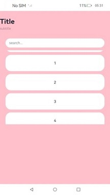
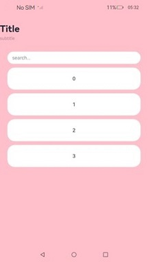

# ArkUI Subsystem Changelog

OpenHarmony 4.1.6.1 has the following changes in the \<Navigation>, \<NavDestination>, and \<Tabs> components.

## cl.arkui.1 Expansion of the \<Navigation> and \<NavDestination> Components to the Non-Safe Area

When conditions permit, the **\<Navigation>** and **\<NavDestination>** components are expanded to the non-safe area by default.

**Access Level**

Public

**Change Impact**

Before change: The **expandSafeArea** attribute of the **\<Navigation>** and **\<NavDestination>** components is defaulted to **[SafeAreaExpandType.NONE, SafeAreaExpandEdges.NONE]**.



After change: The **expandSafeArea** attribute of the **\<Navigation>** and **\<NavDestination>** components is defaulted to **[SafeAreaExpandType.SYSTEM, SafeAreaExpandEdges.BOTTOM, SafeAreaEdge.TOP]**, meaning that the components' background color is expanded to the status bar and navigation bar.



**API Level**

11

**Change Since**

OpenHarmony SDK 4.1.6.1

**Key API/Component Changes**

**\<Navigation>** and **\<NavDestination>** components

**Adaptation Guide**

If **margin** is set for the **\<Navigation>** or **\<NavDestination>** component, there would be space between the component and the status bar or navigation bar. As a result, the component cannot be expanded to the non-safe area. To create an immersive experience for the application, change **margin** to **padding** to remove the space between the component and the status bar and navigation bar. The code example is as follows:

Before adaptation:

```ts
@Entry
@Component
struct NavigationExample {
  build() {
    NavDestination() {
        ...
    }.margin({...})
  }
}
```

After adaptation:

```ts
@Entry
@Component
struct NavigationExample {
  build() {
    NavDestination() {
        ...
    }.padding({...})
  }
}
```

## cl.arkui.2 Expansion of the \<Tabs> Component to the Bottom Non-Safe Area

When conditions permit, the **\<Tabs>** component is expanded to the bottom non-safe area by default.

**Access Level**

Public

**Change Impact**

Before change: The **expandSafeArea** attribute of the **\<Tabs>** component is defaulted to **[SafeAreaExpandType.NONE, SafeAreaExpandEdges.NONE]**.

Before change: The **expandSafeArea** attribute of the **\<Tabs>** component is defaulted to **[SafeAreaExpandType.SYSTEM, SafeAreaExpandEdges.BOTTOM]**, meaning that the components' background color is expanded to the bottom navigation bar.

**API Level**

11

**Change Since**

OpenHarmony SDK 4.1.6.1

**Key API/Component Changes**

**\<Tabs>** component

**Adaptation Guide**

The component can deliver an immersive experience at its default settings, and no adaptation is required.

## cl.arkui.3 Change to the Default Value of the autoResize and interpolation Attributes of the \<Image> Component

**Access Level**

Public

**Reason for Change**

This change is to solve the image aliasing issue.

**Change Impact**

This change is a non-compatible change.

Before change: The **\<Image>** component's **autoResize** attribute is defaulted to **true** and the **interpolation** attribute **None**.

After change: The **\<Image>** component's **autoResize** attribute is defaulted to **false** and the **interpolation** attribute **LOW**. This change enhances the component's visual appeal. Yet, it may increase the memory usage if the contained image is large, in which case you need to take memory optimization measures.
Note: This change does not affect the component's display on the large home screen.

**API Level**

11

**Change Since**

OpenHarmony SDK 4.1.6.1

**Key API/Component Changes**

**\<Image>** component

**Adaptation Guide**

This change is about the default settings, and no adaptation is required. To change the component to its original default display effect, set **autoResize** to **true** and **interpolation** to **None**.

## cl.arkui.4 Addition of the Edge Scrolling Effect to the \<Swiper> Component with One Page

**Access Level**

Public

**Reason for Change**

When a **\<Swiper>** component contains only one page, it does not exhibit the edge scrolling effect available when it contains multiple pages in non-repeating mode.

**Change Impact**

This change is a non-compatible change.

Before change, the **\<Swiper>** component does not exhibit the edge scrolling effect when it contains only one page.

After change, the **\<Swiper>** component exhibits an edge scrolling effect (**EdgeEffect.Spring** by default) when it contains only one page.

**API Level**

8

**Change Since**

OpenHarmony SDK 4.1.6.1

**Key API/Component Changes**

\<Swiper>

**Adaptation Guide**

No adaptation is required. If you want the **\<Swiper>** component to have no edge scrolling effect, set its **effectMode** attribute to **EdgeEffect.None**.
