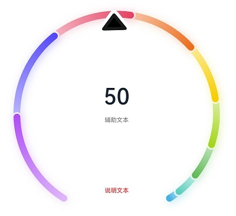

# ArkUI Subsystem Changelog

## cl.arkui.1 Floating Point Number Support Added for timeZoneOffset of the \<TextClock> Component

**Access Level**

Public

**Reason for Change**

The time zone offset for some countries and regions is a floating point number. Therefore, floating point numbers need to be supported.

**Change Impact**

This change is a compatible change.

**API Level**

8 

**Change Since**

OpenHarmony SDK 4.1.6.5

**Key API/Component Changes**

In versions earlier than API version 11, any floating point number set for the **timeZoneOffset** parameter of the **\<TextClock>** component is converted to the corresponding integer.

Since API version 11, a floating point number in the { 9.5, 3.5, -3.5, -4.5, -5.5, -5.75, -6.5, -9.5, -10.5, -12.75 } range can be set for the **timeZoneOffset** parameter of the **\<TextClock>** component.

**Adaptation Guide**

For details, see [TextClock](../../../application-dev/reference/apis-arkui/arkui-ts/ts-basic-components-textclock.md).

## cl.arkui.2 Change in the Default Shadow Blur Radius of the \<Gauge> Component

**Access Level**

Public

**Reason for Change**

The original default shadow blur radius, 5 vp, is too small for the **\<Gauge>** component according to the UX specifications. Therefore, the default shadow blur radius is enlarged to 20 vp.

**Change Impact**

This change is a compatible change. It enhances the default display effect of the component.

**API Level**

11

**Change Since**

OpenHarmony SDK 4.1.6.5

**Key API/Component Changes**

Before OpenHarmony SDK 4.1.6.5, the default shadow blur radius of the **\<Gauge>** component is 5 vp.


Since OpenHarmony SDK 4.1.6.5, the default shadow blur radius of the **\<Gauge>** component is 20 vp.



**Adaptation Guide**

No adaptation is required. Yet, since the default display effect is changed, you need to check whether it meets your expectation. Change the display variables where necessary.

## cl.arkui.3 Return Value Unit Change for getItemRect and getItemRectInGroup

**Access Level**

Public

**Reason for Change**

The unit of the return value type **RectResult** should be vp, not previously px.

**Change Impact**

This change is a non-compatible change. The unit of the value returned by o the **getItemRect** API of a scrollable component and the **getItemRectInGroup** API of the **\<List>** component is changed from px to vp. The affected scenarios are as follows:

(a) The **getItemRect** API is called in a scrollable component to obtain the size and position of a child component.

Before change: The size and position returned are both in px.

After change: The size and position returned are both in vp.

(b) The **getItemRectInGroup** API is called in a **\<List>** component to obtain the size and position of a list item in a list item group.

Before change: The size and position returned are both in px.

After change: The size and position returned are both in vp.

**API Level**

11

**Change Since**

OpenHarmony SDK 4.1.6.5

**Key API/Component Changes**

**getItemRect** (**\<List>**, **\<Grid>**, **\<WaterFlow>**, **\<Scroll>**) and **getItemRectInGroup** (**\<List>**)

**Adaptation Guide**

 If the px unit is required, you can use the **vp2px** API to convert the unit.
## cl.arkui.4 Log Level Change for Value Assignment of @Link/@ObjectLink Decorated Variables

**Access Level**

Public

**Reason for Change**

The log level for value assignment of an @Link/@ObjectLink decorated variable in the parent component is changed from WARN to ERROR.

**Change Impact**

This change is a non-compatible change. After the change, an error is reported if an @Link/@ObjectLink decorated variable is not assigned a value in the parent component.

**API Level**

11

**Change Since**

OpenHarmony SDK 4.1.6.5

**Example**

```
let NextID: number = 1;

@Observed
class ClassA {
  public id: number;
  public c: number;

  constructor(c: number) {
    this.id = NextID++;
    this.c = c;
  }
}

@Entry
@Component
struct Parent {
  @State message: string = 'Hello';

  build() {
    Column() {
      // ERROR: Property 'message' in the custom component 'Child' is missing (mandatory to specify).
      // ERROR: Property 'message1' in the custom component 'Child' is missing (mandatory to specify).
      Child();
    }
  }
}

@Component
struct Child {
  @Link message: string;
  @ObjectLink message1: ClassA;

  build() {
    Row() {
    }
  }
}
```

**Key API/Component Changes**

N/A

**Adaptation Guide**

If a child component uses an @Link/@ObjectLink decorated variable, then the variable must be assigned a value in its parent component.
## cl.arkui.5 Click Event Change for isShow in bindmenu

**Access Level**

Public

**Reason for Change**

When **isShow** is used in **bindMenu**, the menu can be displayed only through **isShow**.

**Change Impact**

This change is a non-compatible change. After the change, when **isShow** is used in **bindMenu**, clicking the parent component does not show the menu.

**API Level**

11

**Change Since**

OpenHarmony SDK 4.1.6.5
**Example**

```
@Entry
@Component
struct MenuExample {
  @State listData: number[] = [0, 0, 0]
  @State isShow: boolean = false

  @Builder MenuBuilder() {
    Flex({ direction: FlexDirection.Column, justifyContent: FlexAlign.Center, alignItems: ItemAlign.Center }) {
      ForEach(this.listData, (item:number, index) => {
        Column() {
          Row() {
            Image($r("app.media.icon")).width(20).height(20).margin({ right: 5 })
            Text(`Menu${index as number + 1}`).fontSize(20)
          }
          .width('100%')
          .height(30)
          .justifyContent(FlexAlign.Center)
          .align(Alignment.Center)
          .onClick(() => {
            console.info(`Menu${index as number + 1} Clicked!`)
          })

          if (index != this.listData.length - 1) {
            Divider().height(10).width('80%').color('#ccc')
          }
        }.padding(5).height(40)
      })
    }.width(100)
  }

  build() {
    Column() {
      Text('click for menu')
        .fontSize(20)
        .margin({ top: 20 })
        .onClick(()=>{
          this.isShow = true
        })
        .bindMenu(this.isShow, this.MenuBuilder,
          {
            onDisappear: ()=>{
              this.isShow = false
            }
          }
        )
    }
    .height('100%')
    .width('100%')
    .backgroundColor('#f0f0f0')
  }
}
```

**Key API/Component Changes**

bindMenu

**Adaptation Guide**

When **isShow** is used in **bindMenu**, the menu is displayed only after **isShow** is changed from **false** to **true** in related click, gesture, and hover events. If the menu cannot be displayed after the value of **isShow** is changed, use logs to print the value of **isShow** before and after your change. If the value remains unchanged, check whether the value of **isShow** is not updated to **false** in **onDisappear** when the menu disappears, or whether **isShow** is set to **true** initially.

## cl.arkui.6 Removal of Incorrect Inheritance from OffscreenCanvas Class Declaration

**Access Level**

Public

**Reason for Change**

In the previous **OffscreenCanvas** class declaration, the parent class incorrect. As a result, DevEco Studio incorrectly associates methods and attributes that are not of the **OffscreenCanvas** class.

**Change Impact**

This change is a compatible change. After the change, the methods and attributes of the **OffscreenCanvas** class can be correctly displayed for intelligent code completion in DevEco Studio.

**API Level**

11

**Change Since**

OpenHarmony SDK 4.1.6.5

**Key API/Component Changes**

OffscreenCanvas

**Adaptation Guide**

N/A

## cl.arkui.7 Float Type Support Added for layoutWeight

**Access Level**

Public

**Reason for Change**

The **layoutWeight** parameter needs to be set more precisely.

**Change Impact**

This change is a compatible change.

**API Level**

9

**Change Since**

OpenHarmony SDK 4.1.6.5

**Key API/Component Changes**

**layoutWeight**

Before API version 12, when the parameter is set to a float number, the digits after the decimal point are not counted.

Since API version 12, when the parameter is set to a float number, the digits after the decimal point are counted.

**Adaptation Guide**

N/A

## cl.arkui.8 Height Configuration Change for the \<GridRow> Component

**Access Level**

Public

**Reason for Change**

In previous versions, the **\<GridRow>** component always adapts its height to child components, regardless of whether the **height** is set.
The change is to correct this known issue.

**Change Impact**

This change is a non-compatible change. The height of the **\<GridRow>** component can be customized.

**API Level**

9

**Change Since**

OpenHarmony SDK 4.1.6.5

**Key API/Component Changes**

**\<GridRow>** component

Before API version 11, the **\<GridRow>** component always adapts its height to child components, regardless of whether the **height** is set.

Since API version 11, the **\<GridRow>** component is drawn based on the specified height. If no height is specified, the component adapts its height to child components.

**Adaptation Guide**

N/A

## cl.arkui.9 Behavior Change for backgroundColor in \<XComponent> of the surface Type

**Access Level**

Public

**Reason for Change**

Background color configuration is required for the **\<XComponent>** of the surface type.

**Change Impact**

This change is a non-compatible change.

Before change: The background color is black by default regardless of the **backgroundColor** attribute settings.

After change: The background color specified through the **backgroundColor** attribute takes effect.

**API Level**

9

**Change Since**

OpenHarmony SDK 4.1.6.5

**Example**

```
@Entry
@Component
struct XComponentBKColor {
  private surfaceId: string = ''
  private xComponentContext: Record<string, () => void> = {}
  xComponentController: XComponentController = new XComponentController()

  build() {
    Row() {
      XComponent({
        id: 'xcomponentid',
        type: XComponentType.SURFACE,
        controller: this.xComponentController
      })
        .onLoad(() => {
          this.xComponentController.setXComponentSurfaceSize({ surfaceWidth: 1920, surfaceHeight: 1080 })
          this.surfaceId = this.xComponentController.getXComponentSurfaceId()
          this.xComponentContext = this.xComponentController.getXComponentContext() as Record<string, () => void>
        })
        .width('640px')
        .height('480px')
        .backgroundColor(Color.White)
    }
  }
}
```

**Key API/Component Changes**

XComponent

**Adaptation Guide**

After setting the **backgroundColor** attribute for the **\<XComponent>** component of the surface type, ensure that the background color is what is required by the use scenario.

## cl.arkui.10 Display Effect Change for the \<TextInput> or \<TextArea> Component When the Caret Exceeds the Rounded Corner

**Access Level**

Public

**Reason for Change**

This change is a non-compatible change. Previously, when **padding** is set to **0**, the caret is displayed outside the default rounded corner of the text box, which does not meet application requirements.

**Change Impact**

Before change: When the text box uses the default rounded corners with a padding of **0**, the caret is not clipped if it exceeds the rounded corners.


After change: When the text box uses the default rounded corners with a padding of **0**, the caret is clipped if it exceeds the rounded corners.


**API Level**

9

**Change Since**

OpenHarmony SDK 4.1.6.5

**Key API/Component Changes**

TextInput/TextArea

**Adaptation Guide**

N/A

## cl.arkui.11 Matching Rule Change for UI Instances of Global APIs

**Access Level**

Public

**Reason for Change**

The change is to standardize the UI instance matching of global APIs to avoid unexpected behavior caused by unclear instances.

**Change Impact**

In the multi-instance scenario, if a global API is called in the context that is not bound to any UI instance (for example, the routing API is used in an asynchronous callback), the instance scope of the API may change.

A global API requires a specific UI context to determine the UI instance that takes effect. You are advised to use the global APIs bound to an instance.

**API Level**

8

**Change Since**

OpenHarmony SDK 4.1.6.5

**Key API/Component Changes**

The following APIs are not recommended in multi-instance scenarios. You are advised to use the substitutes described in the adaptation guide.

|                  API                  |            Description           |
| :-----------------------------------: | :------------------------: |
|            @ohos.animator             |      Custom animation controller.     |
|     @ohos.arkui.componentSnapshot     |          Component screenshot.         |
|      @ohos.arkui.componentUtils       |         Component utility class.        |
|      @ohos.arkui.dragController       |         Drag controller.        |
|         @ohos.arkui.inspector         |        Layout callback.       |
|         @ohos.arkui.observer          |          Observer.         |
|              @ohos.font               |         Custom font registration.        |
|             @ohos.measure             |          Text measurement.         |
|           @ohos.mediaquery            |          Media query.         |
|          @ohos.promptAction           |            Prompt.           |
|             @ohos.router              |          Page routing.         |
|              AlertDialog              |          Alert dialog box.         |
|              ActionSheet              |        Action sheet.       |
|         CalendarPickerDialog          |       Calendar picker dialog box.      |
|           DatePickerDialog            |      Date picker dialog box.     |
|           TimePickerDialog            |     Time picker dialog box.    |
|           TextPickerDialog            |     Text picker dialog box.    |
|              ContextMenu              |          Menu control.         |
| vp2px/px2vp/fp2px/px2fp/lpx2px/px2lpx |        Pixel unit conversion.       |
|             focusControl              |          Focus control.         |
|             cursorControl             |          Cursor control.         |
|              getContext               | Obtains the context of the current ability.|
|        LocalStorage.getShared         |  Obtains the storage passed by the current ability. |
|               animateTo               |          Explicit animation.         |
|         animateToImmediately          |        Explicit instant animation.       |

**Adaptation Guide**

You can use the built-in method [getUIContext](../../../application-dev/reference/apis-arkui/arkui-ts/ts-custom-component-api.md#getuicontext) of a component to obtain the UI context where the component is located and use the APIs listed below in [UIContext](../../../application-dev/reference/apis-arkui/js-apis-arkui-UIContext.md#uicontext) to obtain the object bound to the instance.

| API in UIContext                   | Description              |
| -------------------------------- | ------------------ |
| getRouter                        | Page routing.          |
| getComponentUtils                | Component utility class.        |
| getUIInspector                   | Layout callback.      |
| getUIObserver                    | Observer.          |
| getMediaQuery                    | Media query.          |
| getFont                          | Font.              |
| getPrompAction                   | Prompt.              |
| animateTo                        | Explicit animation.          |
| showAlerDialog                   | Alert dialog box.          |
| showActionSheet                  | Action sheet.      |
| showDatePickerDialog             | Date picker dialog box.  |
| showTimePickerDialog             | Time picker dialog box.|
| showTextPcikerDialog             | Text picker dialog box.|
| createAnimator                   | Custom animation controller.  |
| KeyboardAvoidMode                | Keyboard avoidance.          |
| getAtomicServiceBar              | Cloud service.            |
| getDragController/getDragPreview | Drag and drop.              |
| runScopedTask                    | Executes the closure of the bound instance.|

For the following APIs that are not provided in **UIContext**, you can use **runScopedTask** for adaptation.

| API                                 | Description                      |
| ------------------------------------- | -------------------------- |
| measure                               | Text measurement.                  |
| getContext                            | Obtains the context of the current ability.|
| LocalStorage.getShared                | Obtains the storage passed by the current ability.  |
| animateToImmediately                  | Explicit instant animation.              |
| ContextMenu                           | Menu control.                  |
| vp2px/px2vp/fp2px/px2fp/lpx2px/px2lpx | Pixel unit conversion.              |
| focusControl                          | Focus control.                  |
| cursorControl                         | Cursor control.                  |
| @ohos.arkui.componentSnapshot         | Component screenshot.                  |

Example 1

```ets
// Use the route object bound to the instance for page routing.
@Entry
@Component
struct Index {
  build() {
    Row() {
      Button()
        .onClick(() => {
          let uiContext = this.getUIContext();
          let uiRouter = uiContext.getRouter();
          uiRouter.pushUrl({
            url: 'pages/Page'
          })
        })
    }
  }
}
```

Example 2

```ets
// Execute the closure of the bound instance.
@Entry
@Component
struct Index {
  build() {
    Row() {
      Button()
        .onClick(() => {
          let uiContext = this.getUIContext();
          uiContext.runScopedTask(() => {
            let context = getContext();
            console.log('Get context: ' + JSON.stringify(context))
          })
        })
    }
  }
}
```
