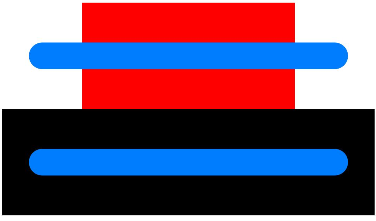

# ArkUI Subsystem Changelog

## cl.arkui.1 Change in the Default Width of the Linear Style of the Progress Component

**Access Level**

Public API

**Reason for Change**

The previous default width of 300 vp for the linear style of the **Progress** component does not align with the UX specifications.

**Change Impact**

This change is a non-compatible change. With this change, the default width of the linear style of the **Progress** component will now adapt to the width of its parent component, offering increased flexibility.

**API Level**

8 

**Change Since**

OpenHarmony SDK 4.1.6.6

**Key API/Component Changes**

Before change: In versions earlier than OpenHarmony SDK 4.1.6.6, the default width of the linear style of the **Progress** component is 300 vp.

After change: Since OpenHarmony SDK 4.1.6.6, the default width of the linear style of the **Progress** component dynamically adjusts to match the width of its parent component.

**Adaptation Guide**

After this change, if the width of the **Progress** component in linear style does not meet your requirements, you can manually set the [width](../../../application-dev/reference/apis-arkui/arkui-ts/ts-universal-attributes-size.md#width) attribute to achieve the desired layout.
