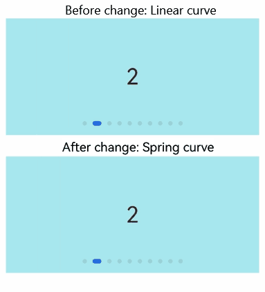

# ArkUI Subsystem Changelog

## cl.arkui.1 Default Curve Parameter Change for Swiper Component

**Access Level**

Other

**Reason for Change**

Specification optimization.

**Change Impact**

When the **curve** parameter is not set for the **Swiper** component, the default curve changes from **Linear** to **interpolatingSpring(-1,1,328,34)**.

**API Level**

8

**Change Since**

OpenHarmony SDK 5.0.0.16

**Key API/Component Changes**

Affected component: **Swiper**
Before change: The default curve for **Swiper** was **Linear**.
After change: The default curve for **Swiper** is **interpolatingSpring(-1,1,328,34)**.

**Adaptation Guide**

The default behavior has changed, no adaptation is needed, but you should ensure that the new default effect meets expectations. If it does not, custom modifications to the effect control variables should be made to achieve the desired outcome.

## cl.arkui.2 Attribute Change When Component Size Is Not Set and Margin Exceeds Component Size

**Access Level**

Public API

**Reason for Change**

When the component's width and height are not set and the margin exceeds the component's size, it will compress the component's size to zero.

**Change Impact**

This change is non-compatible.

Before the change in API version 12, when the component's width and height were not set, and the set margin exceeded the component's size, the compression did not take effect, and the component maintained its original size.

After the change in API version 12, when the component's width and height are not set, and the set margin exceeds the component's size, the compression takes effect, and the component's width and height are compressed to zero.

**Start API Level**

9

**Change Since**

OpenHarmony SDK 5.0.0.16

**Key API/Component Changes**

Components with overly large margins

**Adaptation Guide**

Reduce the margin appropriately so that the component can be displayed, or set the width and height of the component so that its size is not affected by the margin.