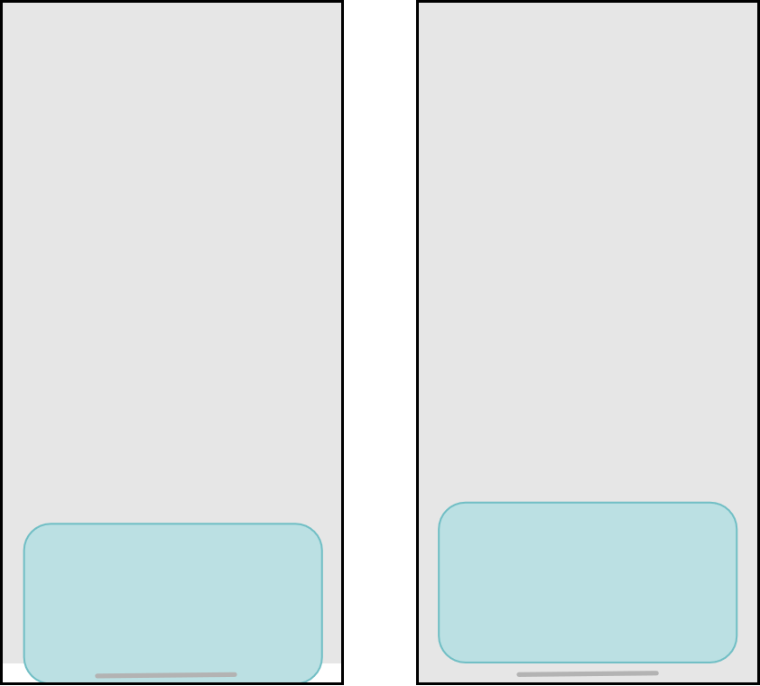

# ArkUI Subsystem Changelog

## cl.arkui.1 Safe Area Behavior Change for Dialog Box Avoidance

**Access Level**

Public API

**Reason for Change**

The mask area cannot cover the bottom navigation bar, and in immersive mode, the content is still displayed in the navigation bar and status bar.

**Change Impact**

This change is a non-compatible change.

Before change: 1. The dialog box mask area does not extend to the bottom navigation bar. 2. When **showInSubwindow** is **true** or the application is configured for immersive mode, the content is still displayed in the top status bar and bottom navigation bar.

After change: 1. The dialog box mask area extends to the bottom navigation bar by default. 2. When **showInSubwindow** is **true** or the application is configured for immersive mode, the content is not displayed in the top status bar and bottom navigation bar.

The following figure shows the effect comparison before and after the change when **Alignment** is set to **Bottom**.



**API Level**

**AlertDialog** and **CustomDialog**: API version 7; **ActionSheet**, **DatePickerDialog**, **TimePickerDialog**, and **TextPickerDialog**: API version 8; **promptAction.showDialog**: API version 9; **promptAction.openCustomDialog**: API version 11

**Change Since**

OpenHarmony SDK 5.0.0.19

**Key API/Component Changes**

promptAction.showDialog, promptAction.openCustomDialog, AlertDialog, ActionSheet, DatePickerDialog, TimePickerDialog, TextPickerDialog, CustomDialog

**Adaptation Guide**

To enable the dialog box content to display in the navigation bar, set **alignment** to **DialogAlignment.Bottom** and **offset.dy** to the height of the navigation bar. Here is a specific example code snippet:
1. In the **EntryAbility** page, set the window to full screen and obtain the height of the top status bar and the bottom navigation bar.
```ts
// src/main/ets/entryability/EntryAbility.ets
import { AbilityConstant, UIAbility, Want } from '@kit.AbilityKit';
import { window } from '@kit.ArkUI';

export default class EntryAbility extends UIAbility {
  onWindowStageCreate(windowStage: window.WindowStage): void {
    windowStage.loadContent('pages/Index', (err, data) => {
      if (err.code) {
        return;
      }
      // Obtain the main window.
      let windowClass: window.Window = windowStage.getMainWindowSync();
      // Set the window to full screen.
      windowClass.setWindowLayoutFullScreen(true)
      // Obtain the height of the status bar.
      let statusArea = windowClass.getWindowAvoidArea(window.AvoidAreaType.TYPE_SYSTEM);
      AppStorage.setOrCreate('SafeAreaTopHeight', statusArea.topRect.height);
      // Obtain the height of the navigation bar.
      let navigationArea = windowClass.getWindowAvoidArea(window.AvoidAreaType.TYPE_NAVIGATION_INDICATOR);
      AppStorage.setOrCreate('SafeAreaBottomHeight', navigationArea.bottomRect.height);
    });
  }
}
```

2. When calling the dialog box page, set **alignment** and **offset**.
```ts
// src/main/ets/pages/Index.ets
let storage = LocalStorage.getShared();

@CustomDialog
struct CustomDialogExample {
  controller?: CustomDialogController

  build() {
    Column() {
      Text('This is a dialog box')
        .fontSize(30)
        .height(100)
      Button('Close Dialog Box')
        .onClick(() => {
          if (this.controller != undefined) {
            this.controller.close()
          }
        })
        .margin(20)
    }
  }
}

@Entry(storage)
@Component
struct CustomDialogUser {
  safeAreaTopHeight: string = AppStorage.get<number>('SafeAreaTopHeight') + 'px';
  safeAreaBottomHeight: string = AppStorage.get<number>('SafeAreaBottomHeight') + 'px';
  dialogController: CustomDialogController | null = new CustomDialogController({
    builder: CustomDialogExample(),
    alignment: DialogAlignment.Bottom,
    offset: { dx: 0, dy: this.safeAreaBottomHeight }
  })

  build() {
    Column() {
      Button('Open Dialog Box')
        .onClick(() => {
          if (this.dialogController != null) {
            this.dialogController.open()
          }
        })
    }
    .width('100%')
    .height('100%')
    .justifyContent(FlexAlign.Center)
  }
}
```

## cl.arkui.2 Change in the colors Parameter Type for linearGradient, sweepGradient, radialGradient, and LinearGradient from Array\<any> to Array\<[ResourceColor, number]>

**Access Level**

Public API

**Reason for Change**

The use of the **any** type in APIs can be too broad, as it does not provide clear guidance on what specific types are expected or allowed.

**Change Impact**

This change is a non-compatible change.

Before change: The **colors** parameter for the **linearGradient**, **sweepGradient**, and **radialGradient** universal attributes and the **LinearGradient** API is allowed to be defined as an **Array\<any>** type.

After change: If an incompatible **colors** parameter type with **Array\<[ResourceColor, number]>** is used, such as **Array\<any>**, a compilation error will occur.

**API Level**

**linearGradient**, **sweepGradient**, and **radialGradient**: API version 7; **LinearGradient**: API version 9

**Change Since**

OpenHarmony SDK 5.0.0.19

**Adaptation Guide**

To define variables used in the **linearGradient**, **sweepGradient**, and **radialGradient** APIs, the type of the **colors** parameter should be accurately defined to be compatible with **Array\<[ResourceColor, number]>**.

Example:
```ts
@Entry
@Component
struct Test {
  colors: Array<any> = [[0xff0000, 0.0], [0x0000ff, 0.3], [0xffff00, 1.0]];
  build() {
    Row()
      .width('90%')
      .height(50)
      .linearGradient({
        angle: 90,
        // colors is defined as the Array<any> type. This will result in a compilation error.
        colors: this.colors
      })
  }
}
```
Adjust the **colors** parameter to be compatible with the API's expected type, for example, **colors: Array&lt;[ResourceColor, number]&gt; = [[0xff0000, 0.0], [0x0000ff, 0.3], [0xffff00, 1.0]]**.

