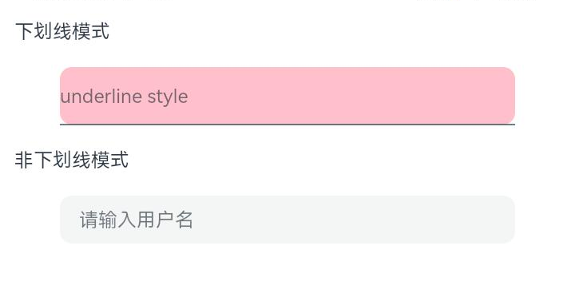

# ArkUI Subsystem Changelog

## cl.arkui.1 Default Style Change of the TextInput Component

**Access Level**

Public API

**Reason for Change**

The default style is changed.

**Change Impact**

This change is a non-compatible change.

Before change: The **borderRadius** setting has no effect on the text box in underline mode, with a default radius of 0. The left and right padding for the text box in underline mode is 12 vp. The default height of the text box in non-underline mode is 48 vp.


After change: The **borderRadius** setting is effective for the text box in underline mode, with a default radius of 0. The left and right padding for the text box in underline mode is 0 vp. The default height of the text box in non-underline mode is 40 vp.



Example:

```ts
@Entry
@Component
struct TextInputExample {
  @State Text: string = ''
  build() {
    Column({ space: 20 }) {
      Text('Underline mode')
        .width('95%')
      // Show an underline.
      TextInput({ placeholder: 'underline style' })
        .showUnderline(true)
        .backgroundColor(Color.Pink)
        .width(360)
        .borderRadius(10)
      Text('Non-underline mode')
        .width('95%')
      TextInput({ placeholder: 'Enter user name', text: this.Text })
        .showUnderline(false)
        .width(360)
        .borderRadius(10)

    }.width('100%')
  }
}
```

**Start API Level**

10

**Change Since**

OpenHarmony SDK 5.0.0.22

**Key API/Component Changes**

The default style of the **TextInput** component is changed.

**Adaptation Guide**

No adaptation is required. Yet, since the default display effect is changed, you need to check whether it meets your expectation. Change the display variables where necessary.

## cl.arkui.2 Changes to Toast Styles

**Access Level**

Public API

**Reason for Change**

The toast UX display style is updated since API version 12.

**Change Impact**

This change is a non-compatible change.

- In API version 11 and earlier versions, the background color of the toast is dark black, the font color is white, the maximum height is not limited, and the text is not truncated.<br>

- Since API version 12, the toast has a transparent and blurry background and black font color in the normal bright color display style, and a transparent and blurry background and white font color in the dark color display style. The maximum height of the toast is calculated as follows: (Screen height - Signal bar - Navigation bar) x 0.65. The maximum width is adaptive based on the screen width minus the margin on the side, with a maximum value of 400 vp. If the UI text is too long, the font size is reduced to 12 fp, and the extra text is truncated.<br>

- Attribute changes

| Name| Before Change| After Change|
|---------|---------|---------|
| Background color| bg_color | COMPONENT_ULTRA_THICK |
| Rounded corners| toast_border_radius | corner_radius_level9 |
| padding-left | toast_padding_horizontal | padding_level8 |
| padding-top | toast_padding_vertical | padding_level4 |
| padding-right | toast_padding_horizontal | padding_level8 |
| padding-bottom | toast_padding_vertical | padding_level4 |
| Font size| text_font_size | Body_M |
| Font color| text_color | font_primary |
| Font weight| toast_text_font_weight | font_weight_regular |

**Example**
The following figures show the comparison before and after the change.

| Before Change| After Change|
|---------|---------|
|   |    |

**API Level**

12

**Change Since**

OpenHarmony SDK 5.0.0.22

**Key API/Component Changes**

Toast

**Adaptation Guide**

No adaptation is required.

## cl.arkui.3 Default Value Change of the clip Attribute of the Text Component

**Access Level**

Public API

**Reason for Change**

The default value is set to **false** to accommodate more use cases.

**Change Impact**

This change is a non-compatible change.

Before change: In API version 11 and earlier versions, the default value of the **clip** universal attribute for the **Text** component is **true**, truncating and hiding content that exceeds the component area.


After change: Since API version 12, the default value of the **clip** universal attribute for the **Text** component is **false**, allowing content that exceeds the component area to be displayed without truncation.


Example:

```ts
@Entry
@Component
struct TextClipExample {
  build() {
    Column({ space: 20 }) {
      Text('This is set wordBreak to WordBreak text Taumatawhakatangihangakoauauotamateaturipukakapikimaungahoronukupokaiwhenuakitanatahu.')
        .fontSize(12)
        .border({ width: 1 })
        .wordBreak(WordBreak.NORMAL)
        .lineHeight(20)
        .maxLines(2)
    }.height(300).width(335).padding({ left: 35, right: 35, top: 35 })
  }
}
```

**Start API Level**

7

**Change Since**

OpenHarmony SDK 5.0.0.22

**Key API/Component Changes**

Default value of the **clip** universal attribute of the **Text** component

**Adaptation Guide**

No adaptation is required. Yet, since the default display effect is changed, you need to check whether it meets your expectation. Change the display variables where necessary.

## cl.arkui.4 Change in the Processing of Abnormal Values of the caretPosition API of the TextInput, TextArea, and Search Components

**Access Level**

Public API

**Reason for Change**

This change is made for optimization of the logic for processing abnormal values when setting the cursor position for **Search**, **TextInput**, and **TextArea** components.

**Change Impact**

This change is a non-compatible change.

Before change: In API version 11 and earlier versions, if the input parameter for **TextInput.caretPosition()** is a negative number or undefined, the API has no effect.
If the input parameters for **TextInputController.caretPosition()**, **TextAreaController.caretPosition()**, and **SearchController.caretPosition()** are negative numbers, the API takes effect by moving the cursor to position 0 and recording the cursor position as a negative number.

After change: Since API version 12, if the input parameter for **TextInput.caretPosition()** is a negative number or undefined, it is processed as **0**, and the API takes effect.
If the input parameters for **TextInputController.caretPosition()**, **TextAreaController.caretPosition()**, and **SearchController.caretPosition()** are negative numbers, they are processed as 0, and the API takes effect by moving the cursor to position 0 and recording the cursor position as 0.

**Start API Level**

8

**Change Since**

OpenHarmony SDK 5.0.0.22

**Adaptation Guide**

The visual effect of the cursor position remains unchanged.
If the parameter value for setting the cursor position is a negative number or undefined and the cursor position does not need to be changed, you must modify the service code to enter a valid value.

## cl.arkui.5 UX Behavior Change of the ListItem Component

**Access Level**

Public API

**Reason for Change**

The UX behavior of the **ListItem** component is updated since API version 12.

**Change Impact**

This change is a non-compatible change.

- Before change: In API version 11 and earlier versions, after the **ListItem** component is swiped to expand and display the swipe action menu, clicking a non-menu area of the **List** component will not automatically collapse the swipe action menu, and the component at the clicked location can respond to the click event.<br>

- After change: Since API version 12, after the **ListItem** component is swiped to expand and display the swipe action menu, clicking a non-menu area of the **List** component will automatically collapse the swipe action menu, and the component at the clicked location will not respond to the click event.<br>

**Example**
The following figures show the comparison before and after the change.

| Before Change| After Change|
|---------|---------|
|   |    |

**API Level**

12

**Change Since**

OpenHarmony SDK 5.0.0.22

**Key API/Component Changes**

**ListItem** component

**Adaptation Guide**

No adaptation is required.

## cl.arkui.6 Processing Rule Change of Visibility.None in Relative Layout

**Access Level**

Public API

**Reason for Change**

This change is made for enhancement of UX specifications.

**Change Impact**

This change is a non-compatible change.

Before change: If the **Visibility** attribute of any anchor point of component A is **None**, component A is not measured.

After change: If the **Visibility** attribute of any anchor point of component A is **None**, component A is still measured. The position of the anchor component remains unchanged, and the width and height of the anchor component are considered as 0.

**API Level**

The feature is supported since API version 7, and the change takes effective since API version 12.

**Change Since**

OpenHarmony SDK 5.0.0.23

**Adaptation Guide**

If you want component A not to be measured after the **Visibility** attribute of the anchor component is set to **None**, set the **Visibility** attribute of component A to **Hidden** or **None**.

## cl.arkui.7 C-API Change in Obtaining the API Set of Native Modules

**Access Level**

Public API

**Reason for Change**

This change is made to enhance compatibility.

**Change Impact**

This change is a non-compatible change.

Before change: The native module API set can be obtained through **OH_ArkUI_GetNativeAPI**.

After change: The native module API set can be obtained through **OH_ArkUI_GetModuleInterface** or **OH_ArkUI_QueryModuleInterfaceByName**.

**Start API level**

Both the feature and change are effective since API level 12.

**Change Since**

OpenHarmony SDK 5.0.0.22

**Adaptation Guide**

You can call the new APIs to obtain the native module API set as follows:

Method 1:

```
auto nodeAPI = reinterpret_cast<ArkUI_NativeNodeAPI_1*>(
  OH_ArkUI_QueryModuleInterfaceByName(ARKUI_NATIVE_NODE, "ArkUI_NativeNodeAPI_1"));
```

Method 2:

```
ArkUI_NativeNodeAPI_1* nodeAPI = nullptr;
OH_ArkUI_GetModuleInterface(ARKUI_NATIVE_NODE, ArkUI_NativeNodeAPI_1, nodeAPI);
```

## cl.arkui.8 C-API Change in the Event Registration API

**Access Level**

Public API

**Reason for Change**

This change is made to enhance compatibility.

**Change Impact**

This change is a non-compatible change.

Before change:

* Events can be bound to a component by calling **nodeAPI->registerNodeEvent(nodePtr, eventType, eventId)** with three parameters: the component node pointer, event type, and event ID.

* After an event response, you can access the event callback data, which is a pointer to ArkUI_NodeEvent, and directly access the structure and data within the pointer.

Example:

```
nodeAPI->registerNodeEvent(button, NODE_ON_CLICK, 1); // 1 indicates the ID of the event to register.
auto onclick = [](ArkUI_NodeEvent *event) {
  if (event->eventId == 1) {
    auto offsetX = event->componentEvent.data[0].f32; // Obtain the X coordinate of the clicked position relative to the upper left corner of the clicked component.
  }
};
nodeAPI->registerNodeEventReceiver (onclick); // Listen for event callbacks, and execute the custom onclick method when the Button component's click event is triggered.
```

After change:

* The event registration API includes an additional pointer to a custom parameter, as in **nodeAPI->registerNodeEvent(nodePtr, eventType, eventId, userData)**.

* After an event response, you can still access the event callback data, which is a pointer to **ArkUI_NodeEvent**, but the specific structure of the pointer is no longer exposed. You must use specific functions to obtain the required parameters.

Example:

```
nodeAPI->registerNodeEvent(button, NODE_ON_CLICK, 1, nullptr); // If no custom data needs to be passed in, nullptr can be passed in instead.
auto onclick = [](ArkUI_NodeEvent *event) {
  if (OH_ArkUI_NodeEvent_GetTargetId(event) == 1) { // Obtain the event ID.
    auto offsetX = OH_ArkUI_NodeEvent_GetNodeComponentEvent(event)->data[0].f32; // Obtain the X coordinate of the clicked position relative to the upper left corner of the clicked component.
  }
};
nodeAPI->registerNodeEventReceiver(onclick);
```

**Start API level**

Both the feature and change are effective since API level 12.

**Change Since**

OpenHarmony SDK 5.0.0.22

**Adaptation Guide**

* Globally search for the **registerNodeEvent** function and change all usage of this function to include four parameters, with the fourth parameter being a nullptr as a placeholder.

* Globally search for the **ArkUI_NodeEvent** type and change **event->eventId** in the callback to **OH_ArkUI_NodeEvent_GetTargetId(event)**.

* Globally search for the **ArkUI_NodeEvent** type and change **event->kind** in the callback to **OH_ArkUI_NodeEvent_GetEventType(event)**.

* Globally search for the **ArkUI_NodeEvent** type and change **event->componentEvent.data** in the callback to **OH_ArkUI_NodeEvent_GetNodeComponentEvent(event)->data**.

* Globally search for the **ArkUI_NodeEvent** type and change **event->stringEvent.pStr** in the callback to **OH_ArkUI_NodeEvent_GetStringAsyncEvent(event)->pStr**.

* Globally search for the **ArkUI_NodeEvent** type and change **event->touchEvent** in the callback to first obtain a pointer to the **ArkUI_UIInputEvent** type using the **OH_ArkUI_NodeEvent_GetInputEvent(event)** method, then access detailed API data through various functions provided for obtaining **ArkUI_UIInputEvent** data.

## cl.arkui.9 Specification Change for Handling Abnormal Parameters of visibility

**Access Level**

Public API

**Reason for Change**

This change is made to improve robustness.

**Change Impact**

Before change: Abnormal values are processed as **hidden**.

After change: Abnormal values are processed as **visible**.

**Start API Level**

The feature is supported since API version 7, and the change takes effective since API version 12.

**Change Since**

OpenHarmony SDK 5.0.0.22

**Adaptation Guide**

No adaptation is required. Yet, since the default exception handling logic is changed, you need to check whether it meets your expectation. Change the variables where necessary.

## cl.arkui.10 Behavior Change of the transform API

**Access Level**

Public API

**Reason for Change**

This change is made for improvement of API functionality.

**Change Impact**

Before change: Perspective projection transformations in the input matrix are not processed, that is, perspective projection transformations are not supported.

After change: Perspective projection transformations in the input matrix are processed, that is, perspective projection transformations are supported.

**Example**
Refer to the code snippet below.
```
import matrix4 from '@ohos.matrix4'
const matrixArr: [number, number, number, number,
  number, number, number, number,
  number, number, number, number,
  number, number, number, number] = [
  0.25, 0, 0, -0.0015,
  0, 1, 0, 0,
  0, 0, 1, 0,
  0, 0, 0, 1];

let matrix = matrix4.init(matrixArr);

@Entry
@Component
struct Tests {
  build() {
    Column() {
      Rect()
        .fill(Color.Gray)
        .scale({
          x: 1,
          centerX: 0,
          centerY: 0,
        })
        .width('500px')
        .height('500px')
        .transform(matrix)
    }.width('100%').height('100%').alignItems(HorizontalAlign.Center)
  }
}
```
The following figures show the comparison before and after the change.

| Before Change| After Change|
|---------|---------|
|   |    |

**Start API Level**

This feature is available since API version 7.

**Change Since**

OpenHarmony SDK 5.0.0.22

**Adaptation Guide**

If the input matrix involves perspective projection transformations, that is, the first three parameters of the last column of the matrix are not 0, there will be inconsistencies before and after the change.

To maintain the original transformation effect, you need to modify the input matrix. Specifically, set the first three parameters of the last column in **Matrix4Transit** to 0.
```
const matrixArr: [number, number, number, number,
  number, number, number, number,
  number, number, number, number,
  number, number, number, number] = [
  0.25, 0, 0, -0.0015,
  0, 1, 0, 0,
  0, 0, 1, 0,
  0, 0, 0, 1];
  
for (let i = 3;i < 12;i += 4) {
    matrixArr[i] = 0;
}

let matrix = matrix4.init(matrixArr);
```
