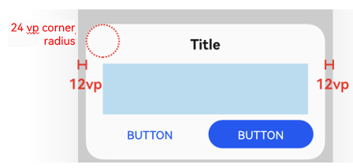
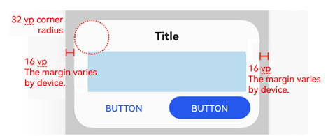
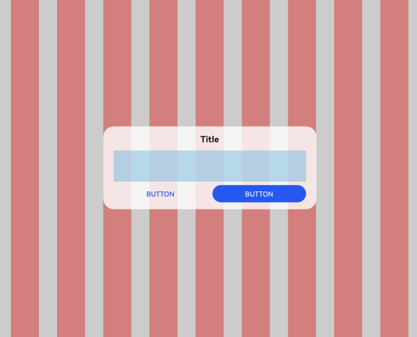
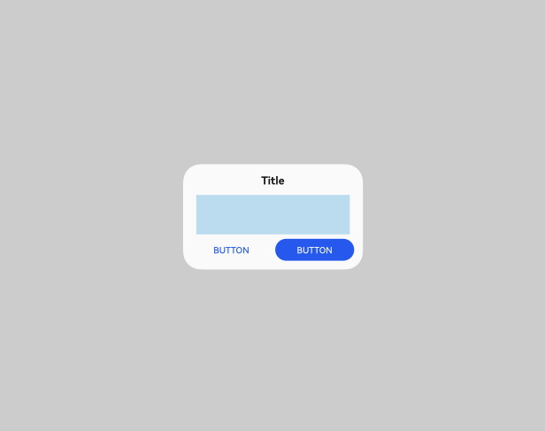
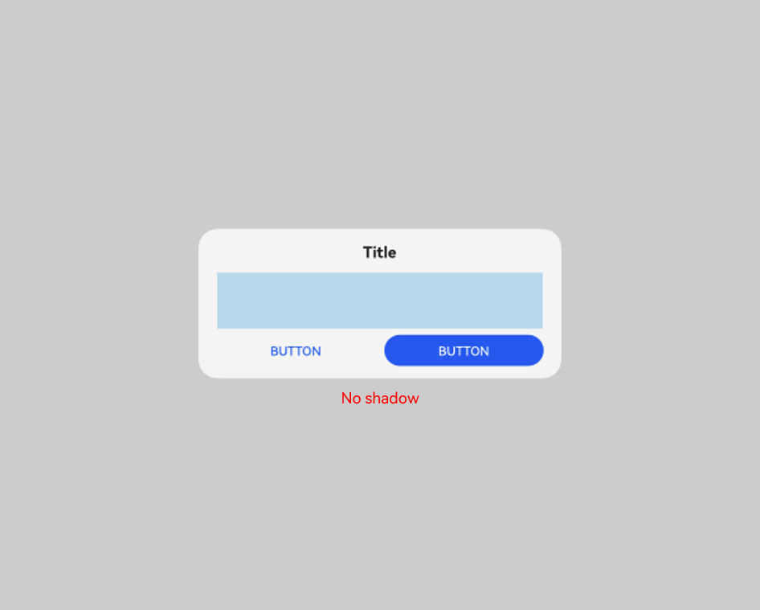
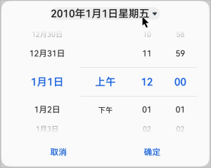

# ArkUI Subsystem Changelog

## cl.arkui.1 New Directional Menu Style for bindMenu

**Access Level**

Public API

**Reason for Change**

This change is made for enhancement of UX specifications.

**Change Impact**

This change is a non-compatible change.

Before change: Setting the **enableArrow** attribute to **true** in **MenuOptions** of **bindMenu** does not display a directional menu style.

After change: Setting the **enableArrow** attribute to **true** in **MenuOptions** of **bindMenu** and having a menu size and position sufficient to accommodate an arrow will display a directional menu style.

**API Level**

The **enableArrow** and **arrowOffset** attributes are supported since API version 10.

**Change Since**

OpenHarmony SDK 5.0.0.23

**Adaptation Guide**

To avoid displaying a directional menu style in **bindMenu**, either do not set the **enableArrow** attribute or set it to **false** in **MenuOptions**.
To display a directional menu style, set the **enableArrow** attribute to **true** and optionally set the **arrowOffset** attribute.

## cl.arkui.2 Default Focus Navigation Behavior Change

**Access Level**

Public API

**Reason for Change**

This change is made to optimize the default focus behavior.

**Change Impact**

This change is a non-compatible change.

Before change: Components with focus capability but not focusable by default require **.focusable(true)** to become focusable, and do not have the default focus frame; focused state styles needed to be configured.

After change: Components registered with **onClick** or single-tap gestures are focusable by default, displaying a default focus box without the need for focused state style configuration.

**Start API Level**

12

**Change Since**

OpenHarmony SDK 5.0.0.23

**Adaptation Guide**

If you do not want a clickable component to participate in focus navigation, set **.focusable(false)**.

## cl.arkui.3 Default Style Changes of the Dialog Component

**Access Level**

Public API

**Reason for Change**

This change is made to optimize the visual style of the dialog box, including corner radius, background color, material, and shadow, and to optimize the dialog box's responsive layout for a better user experience across devices.

**Change Impact**

This change is a non-compatible change. It affects only the default styles of dialog boxes. Custom styles will override the defaults, and illegal custom values will result in default behavior.

- Before change:
  1. The default corner radius is 24 vp on all corners of the dialog box.
  2. The default background color of the dialog box in light color mode is 0xd9fffff.
  3. By default, most dialog boxes have a transparent background and ultra-thick blur, except for **customDialog** and **PromptAction**.
  4. The default width of the dialog box is controlled by the grid system, with a maximum width of 400 vp. For 2-in-1 devices, the width of the dialog box is fixed at 400 vp and cannot be changed.
  5. The default maximum height of the dialog box is (Screen Height - Safe Area) x 0.8. For 2-in-1 devices, the maximum height is (Full screen x 0.67 x 0.9).
  6. Responsive and adaptive dialog boxes are centered after avoiding the navigation bar. The alignment mode is **DialogAlignment.Bottom** on default devices and **DialogAlignment.Center** on other devices.
  7. There is no default shadow style for any device.

  <br/>
- After change:
  1. The default corner radius is 32 vp on all corners of the dialog box.
  2. The default background color of the dialog box in light color mode is 0xfffff.
  3. By default, all dialog boxes have a transparent background and ultra-thick blur.
  4. The default width of the dialog box is the window width minus left and right margins, which are 40 on 2-in-1 devices and 16 on other devices. The default maximum width is 400 vp, which varies with the window size. When a custom value is specified for the width of the dialog box, this custom value will be used. The reference width for the dialog box is the width of its containing window. You can adjust the width based on this reference. If an invalid value is set, the dialog box will fall back to its default appearance.
  5. The default minimum height of the dialog box is 70 vp, and the default maximum height is (Window height - Safe area) x 0.9. When a custom value is specified for the height of the dialog box, this custom value will be used. The reference height for the dialog box is calculated as the window height minus the safe area. You can adjust the height based on this reference. If an invalid value is set, the dialog box will fall back to its default appearance.
  6. Responsive and adaptive dialog boxes are centered based on the full screen on all devices.
  7. For 2-in-1 devices, the shadow style is **ShadowStyle.OUTER_FLOATING_MD** for components in the focused state and **ShadowStyle.OUTER_FLOATING_SM** for components in the unfocused state. There is no default shadow style for other devices.

  The following figures show the comparison before and after the change.

| Before Change| After Change|
|---------|---------|
|   |    |
|  |   |
|   |  |
|   |   |

**API Level**

12

**Change Since**

OpenHarmony SDK 5.0.0.23

**Key API/Component Changes**

**Dialog** component

**Adaptation Guide**

No adaptation is required. Yet, since the default display effect is changed, you need to check whether it meets your expectation. Change the display variables where necessary.

## cl.arkui.4 Default Transparency Effect and Opacity Customization for Drag Previews

**Access Level**

Public API

**Reason for Change**

This change is made in accordance with UX specifications.

**Change Impact**

This change is a non-compatible change.

API version 11 and earlier: The drag preview does not have transparency.

API version 12 and later: The drag preview has a 95% transparency, and the transparency value can be customized.

**API Level**

12

**Change Since**

OpenHarmony SDK 5.0.0.23

**Adaptation Guide**

No adaptation is required as this is a default style change.

## cl.arkui.5 @Observed/@Track/@ObservedV2 Validation Change
**Access Level**

Public API

**Reason for Change**

Compile-time validation is added to prevent incorrect use of the deep observation decorators, which could lead to functional errors at runtime.

**Change Impact**

Before change: No error is reported during validation.

After change:
In the following scenarios, which do not comply with the specifications, the compiler will report errors.

- Using @Track within a class decorated by @ObservedV2

> **NOTE**
>
> Since @ObservedV2 uses a different implementation logic from @Observed, @Track cannot be used within a class decorated by @ObservedV2. @Track can be used with @Observed, and @Trace can be used with @ObservedV2.

- Decorating a class with both @Observed and @ObservedV2

> **NOTE**
>
> Mixing the use of @Observed and @ObservedV2 may cause undefined behavior, including redundant re-renders and loss of the in-depth observation, property observation, or property-level update capability.

- Inconsistent use of @Observed and @ObservedV2 when decorating child classes and parent classes

The following is an example of incorrect code:

```ts
// @Track cannot be used within a class decorated by @ObservedV2.
@ObservedV2
class TestObserved {
  @Track value: string = "hello"
}
// A class cannot be decorated by both @Observed and @ObservedV2.
@Observed
@ObservedV2
class TestObserved1 {
  value: string = "hello"
}
// The use of @Observed and @ObservedV2 must be consistent when decorating chid classes and parent classes.
@Observed
class TestObserved3 {
  @Track value: string = "hello"
}
@ObservedV2
class TestObserved4 extends TestObserved3 {
  @Trace value: string = "hello"
}

@ObservedV2
class TestObserved5 {
  @Trace value: string = "hello"
}
@Observed
class TestObserved6 extends TestObserved5 {
  @Track value: string = "hello"
}
```

**Start API Level**

12

**Change Since**

OpenHarmony SDK 5.0.0.23

**Adaptation Guide**

Adapt and rectify code according to the error messages.

## cl.arkui.6 TextInput, TextArea, Search, and RichEditor Text Menu Style Changes

**Access Level**

Public API

**Reason for Change**

This change is made in accordance with specifications.

**Change Impact**

This change is a compatible change.
API version 11 and earlier: The text selection menu includes share, search, and translate buttons, all of which are gray, and has an expanded menu.

API version 12 and later: The text selection menu does not include share, search, and translate buttons, and the expanded menu does not appear.

**Start API Level**

The text menu is a system capability with no external APIs.

**Change Since**

OpenHarmony SDK 5.0.0.23

**Key API/Component Changes**

**TextInput**, **TextArea**, **Search**, and **RichEditor** components

**Adaptation Guide**

No adaptation is required. However, you need to check whether the changed behavior affects the overall application logic.

## cl.arkui.7 Disallowing of Using ImageSpan and ContainerSpan Alone

**Access Level**

Public API

**Reason for Change**

This change is made in accordance with specifications.

**Change Impact**

This change is a non-compatible change.
Before change: Using the **ImageSpan** and **ContainerSpan** components in a component other than **Text** does not result in compilation errors.
After change: Using the **ImageSpan** and **ContainerSpan** components in a component other than **Text** results in compilation errors.

**Start API Level**

12

**Change Since**

OpenHarmony SDK 5.0.0.23

**Key API/Component Changes**

**ImageSpan** and **ContainerSpan** components

**Adaptation Guide**

Modify your code according to the error messages.

## cl.arkui.8 Change in the Popup Avoidance Position When Width Is Set to 100%

**Access Level**

Public API

**Reason for Change**

This change is made to match UX style changes.

**Change Impact**

This change is a non-compatible change.

Before change: When the popup width is greater than or equal to 100% minus 6 vp, the popup is avoided by default, and there is a 6 vp margin from the left edge of the window.

After change: When the popup width is greater than or equal to 100% minus 6 vp, the popup is not avoided by default, and there is no 6 vp margin from the left edge of the window.

| Before Change| After Change|
|---------|---------|
|  |   |

**Start API Level**

7

**Change Since**

OpenHarmony SDK 5.0.0.23

**Key API/Component Changes**

**Popup** component

**Adaptation Guide**

No adaptation is required. Yet, since the default display effect is changed, you need to check whether it meets your expectation. Adjust the popup position using the **offset** attribute where necessary. For details, see [Popup Control](../../../application-dev/reference/apis-arkui/arkui-ts/ts-universal-attributes-popup.md).

## cl.arkui.9 Unified Corner Radius and Customization Support for Drag Previews

**Access Level**

Public API

**Reason for Change**

This change is made in accordance with UX specifications.

**Change Impact**

This change is a non-compatible change.

API version 11 and earlier: Non-text components display a drag preview with custom corner radius effects.

API version 12 and later: When non-text components are long-pressed, **DragPreviewOptions.mode** is checked to determine whether to activate the unified corner radius effect for drag previews, with a default value of 12 vp. If the custom corner radius value set by the application is greater than the default value, the custom value will be used.

**API Level**

12

**Change Since**

OpenHarmony SDK 5.0.0.23

**Adaptation Guide**

No adaptation is required as this is a default style change.

## cl.arkui.10 Background Blur Effect Support for Drag Previews

**Access Level**

Public API

**Reason for Change**

This change is made in accordance with UX specifications.

**Change Impact**

This change is a non-compatible change.

API version 11 and earlier: Non-text components display a drag preview without a background blur effect when long-pressed.

API version 12 and later: Non-text components display a drag preview with a background blur effect when long-pressed.

**API Level**

12

**Change Since**

OpenHarmony SDK 5.0.0.23

**Adaptation Guide**

No adaptation is required as this is a default style change.

## cl.arkui.11 DatePickerDialog Title Button Size and Layout Change

**Access Level**

Public API

**Reason for Change**

This change is made for enhancement of UX specifications.

**Change Impact**

This change is a non-compatible change.

Before change: The size of the **DatePickerDialog** title button is the same as the text size, and the bottom operation area is 24 vp away from the dialog box edge.

After change: The height of the **DatePickerDialog** title button is 32 vp, with a distance of 16 vp from the left and right boundaries of the dialog box, and the bottom operation area is flush with the dialog box edge.

The following figures show the comparison before and after the change.

| Before Change| After Change|
|---------|---------|
|  |  |

**Start API Level**

12

**Change Since**

OpenHarmony SDK 5.0.0.23

**Adaptation Guide**

No adaptation is required. However, you need to check whether the changed behavior affects the overall application logic.

## cl.arkui.12 Change in the Spacing Between the Title and Close Button of bindSheet

**Access Level**

Public API

**Reason for Change**

This change is made to meet application demands and new UX specifications.

**Change Impact**

This change is a non-compatible change.

API version 11 and earlier: The spacing between the title and close button is 32 vp.

API version 12 and later: The spacing between the title and close button is 8 vp.

The figure below shows the change.


**Start API Level**

11

**Change Since**

OpenHarmony SDK 5.0.0.23

**Key API/Component Changes**

bindSheet

**Adaptation Guide**

No adaptation is required. Yet, since the default display effect is changed, you need to check whether it meets your expectation. Change the display variables where necessary.

## c1.arkui.13 Change to Exception Handling for bindSheet's backgroundColor Attribute

**Access Level**

Public API

**Reason for Change**

To align with user experience guidelines, the sheet reverts to the default background color when an invalid value is assigned to the **backgroundColor** attribute.

**Change Impact**

This change is a non-compatible change.

Before change: Assigning an invalid value to the **backgroundColor** attribute of a sheet has no effect.

After change: Assigning an invalid value to the **backgroundColor** attribute of a sheet restores the sheet to the default background color.

**Start API Level**

11

**Change Since**

OpenHarmony SDK 5.0.0.23

**Key API/Component Changes**

bindSheet

**Adaptation Guide**

No adaptation is required. Yet, since the default display effect is changed, you need to check whether it meets your expectation. Change the display variables where necessary.

## cl.arkui.14 Change to the Menu Component Margin

**Access Level**

Public API

**Reason for Change**

This change is made in accordance with UX specifications.

**Change Impact**

Before change: The menu has margins set to 12 vp on the horizontal sides and 24 vp on the vertical sides.

After change: The left and right margins are adjusted to 16 vp, and the top and bottom margins are automatically adjusted to avoid the status bar and navigation bar without additional spacing. For menus configured to appear outside the application window, the left and right margins are set to 8vp, with top and bottom margins are adjusted to avoid the status bar and dock area.

**Start API Level**

9

**Change Since**

OpenHarmony SDK 5.0.0.23

**Key API/Component Changes**

Menu

**Adaptation Guide**

No adaptation is required. Yet, since the default display effect is changed, you need to check whether it meets your expectation. Change the display variables where necessary.

## cl.arkui.15 Default Font Size Change for TabContent's Bottom Tabs in Horizontal Layout

**Access Level**

Public API

**Reason for Change**

This change is made to improve readability.

**Change Impact**

This change is a non-compatible change.

Before change: The default font size for bottom tabs in a horizontal layout within the **TabContent** component is 10 vp.


After change: The default font size for bottom tabs in a horizontal layout within the **TabContent** component is 12 vp.


**Start API Level**

10

**Change Since**

OpenHarmony SDK 5.0.0.23

**Key API/Component Changes**

TabContent

**Adaptation Guide**

No adaptation is required. Yet, since the default display effect is changed, you need to check whether it meets your expectation. Change the related attributes where necessary. For details, see [TabContent](../../../application-dev/reference/apis-arkui/arkui-ts/ts-container-tabcontent.md).

## cl.arkui.16 Change to Exception Handling for the backgroundImage Attribute

**Access Level**

Public API

**Reason for Change**

This change is made to improve robustness.

**Change Impact**

Before change: Exceptional values for the **backgroundImage** attribute were left unhandled.

After change: Exceptional values for the **backgroundImage** attribute clear the background image and handled as the default value.

**Start API Level**

The feature is supported since API version 7, and the change takes effective since API version 12.

**Change Since**

OpenHarmony SDK 5.0.0.23

**Adaptation Guide**

No adaptation is required. Yet, since the default exception handling logic is changed, you need to check whether it meets your expectation. Change the variables where necessary.

## cl.arkui.17 Change to Exception Handling for the backgroundImageSize Attribute

**Access Level**

Public API

**Reason for Change**

This change is made to improve robustness.

**Change Impact**

Before change: Exceptional values for the **backgroundImageSize** attribute are treated as a width and height of 0.

After change: Exceptional values are treated as the default value **ImageSize.Auto**.

**Start API Level**

The feature is supported since API version 7, and the change takes effective since API version 12.

**Change Since**

OpenHarmony SDK 5.0.0.23

**Adaptation Guide**

No adaptation is required. Yet, since the default exception handling logic is changed, you need to check whether it meets your expectation. Change the variables where necessary.

## cl.arkui.18 Addition of New Parameter Types in border

**Access Level**

Public API

**Reason for Change**

This change is made to provide mirroring capabilities for the **border** member properties.

**Change Impact**

This change is a non-compatible change.

Before change: The type of **borderWidth** is Length | EdgeWidths.

​                The type of **borderColor** is ResourceColor | EdgeColors.

​                The type of **borderRadius** is Length | BorderRadiuses.

​                The same applies to **borderOptions**.

After change: The type of **borderWidth** is Length | EdgeWidths | LocalizedEdgeWidths.

​                The type of **borderColor** is ResourceColor | EdgeColors | LocalizedEdgeColors.

​                The type of **borderRadius** is Length | BorderRadiuses | LocalizedBorderRadiuses.

​                The same applies to **borderOptions**.

**Start API Level**

12

**Change Since**

OpenHarmony SDK 5.0.0.23

**Key API/Component Changes**

New parameter type LocalizedEdgeWidths for **borderWidth**, LocalizedEdgeColors for **borderColor**, and LocalizedBorderRadiuses for **borderRadius**, along with the expansion of types for **width**, **color**, and **radius** parameters in **borderOptions**

**Adaptation Guide**

Adapt and rectify code according to the error messages.

In the following scenarios, a type incompatibility error is reported:

```ts
const item: BorderOptions = { width: "10px",color: 0x000000,radius: 10 }

const value1 : Length | EdgeWidths = item.width

const value2 : ResourceColor | EdgeColors = item.color

const value3 : Length | BorderRadiuses = item.radius
```

Manually modify the code.

```ts
const item: BorderOptions = { width: "10px",color: 0x000000,radius: 10 }

const value1 : Length | EdgeWidths | LocalizedEdgeWidths | undefined = item.width

const value2 : ResourceColor | EdgeColors | LocalizedEdgeColors | undefined = item.color

const value3 : Length | BorderRadiuses | LocalizedBorderRadiuses | undefined = item.radius
```
