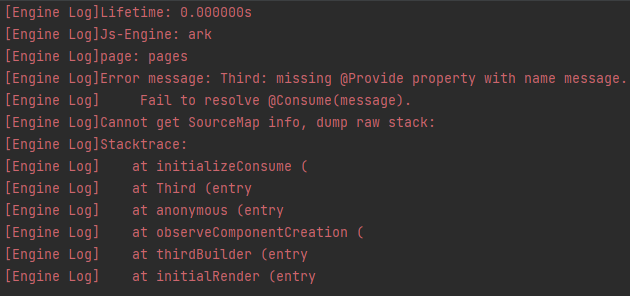

## cl.arkui.1 Specification Change for RichEditor Menu Visibility When Scrolling After Popup

**Access Level**

Public API

**Reason for Change**

The default UX behavior regarding whether the **RichEditor** menu should be displayed after the popup and when scrolling stops has changed.

**Change Impact**

Before change: After the **RichEditor** menu is popped up, the menu is hidden when scrolling the component and does not automatically reappear after scrolling stops.

After change: After the **RichEditor** menu is popped up, the menu is hidden when scrolling the component but will automatically reappear after scrolling stops.

**Start API Level**

API level 12

**Change Since**

OpenHarmony SDK version 5.0.0.24

**Adaptation Guide**

The default UX behavior has changed. No adaptation is needed. It does not affect the functional logic. Pay attention to the current rich text menu's UX performance when scrolling stops.

## cl.arkui.2 Corner Customization for bindMenu and bindContextMenu Menus

**Access Level**

Public API

**Reason for Change**

Enhancement of functionality

**Change Impact**

This change is a compatible change.

**API Level**

12

**Change Since**

OpenHarmony SDK version 5.0.0.24

**Key API/Component Changes**

bindMenu, bindContextMenu

**Adaptation Guide**

This change is a compatible change, and no adaptation is needed. For details about how to use this feature, see [Menu Control](../../../application-dev/reference/apis-arkui/arkui-ts/ts-universal-attributes-menu.md). 

## cl.arkui.3 Specification Change in the Use of promptAction.showToast in Unclear UI Contexts

**Access Level**

Public API

**Reason for Change**

The functionality of this module relies on the UI execution context and should not be used in places where the UI context is unclear. If this interface is called within non-UI pages or some asynchronous callbacks, it may fail to track the current UI context, leading to incorrect calculation of the toast position.

**Change Impact**

Before change: In places with an unclear UI context, toasts could be displayed directly, but the position might be incorrect.

After change: In places with an unclear UI context, users are required to specify the corresponding UIContext to obtain the promptAction object for displaying toasts.

**Start API Level**

API level 9

**Change Since**

OpenHarmony SDK version 5.0.0.24

**Adaptation Guide**

When attempting to display a toast within http requests, delays, or sub-windows, the toast may not appear, and the log may show an error code 11 returned by the window. In such cases, users need to specify the context manually, as in the following code example:

```ts
import promptAction from '@ohos.promptAction';
import http from '@ohos.net.http';

@Entry
@Component
struct Index {
  @State message: string = 'Show toast';

  build() {
    Row() {
      Button() {
        Text(this.message)
          .fontSize(20)
          .fontWeight(FontWeight.Bold)
      }
      .width('100%')
      .onClick(()=>{
        let httpRequest = http.createHttp()
        let uiContext = this.getUIContext()
        httpRequest.request('https://xxx.com', { method: http.RequestMethod.GET }).then((res: http.HttpResponse) => {
          let promptAction1 = uiContext.getPromptAction()
          promptAction1.showToast({
            message:"Toast for success",
            duration:1000,
            showMode: promptAction.ToastShowMode.TOP_MOST
          })
        }).catch((err: Error)=>{
          let promptAction1 = uiContext.getPromptAction()
          promptAction1.showToast({
            message:"Toast for error",
            duration:1000,
            showMode: promptAction.ToastShowMode.TOP_MOST
          })
          httpRequest.destroy()
        })
      })
    }
    .height('100%')
  }
}
```

## cl.arkui.4 Default Unit Specification Change for backgroundImagePosition Parameter

**Access Level**

Public API

**Reason for Change**

The default unit value of the interface does not match the documentation description.

**Change Impact**

Before change: Numeric values entered for the position type were defaulted to px units.

After change: Numeric values entered for the position type are defaulted to vp units.

**Start API Level**

The feature was at API level 7, and the change was made in API level 12.

**Change Since**

OpenHarmony SDK version 5.0.0.24

**Adaptation Guide**

The default behavior has changed, and no adaptation is required. However, you need to ensure that the new default effect meets expectations. If px units are needed, values can be concatenated as a string with "px" appended, or converted from px to vp before setting.

## cl.arkui.5 Default Value Change for RicEditor Component's RichEditorTextStyle Universal Attribute

**Access Level**

Public API

**Reason for Change**

Enhancement of UX specifications.

**Change Impact**

This change is non-compatible.

1. Modification of the font display size set in the **RichEditorTextStyle** universal attribute when the font size is 0.

   - Before change: Content was not displayed when the font size was set to 0.
   - After change: When the font size is set to 0, it displays with the default font size of 16fp.

2. Modification of the default font color set in the **RichEditorTextStyle** universal attribute.

   - Before change: The default font color was **Color.Black**.
   - After change: The default font color is **font_primary** from system resources.

3. Modification of the default text decoration color set in the **RichEditorTextStyle** universal attribute.

   - Before change: The default decoration line color was **Color.Black**.
   - After change: The default decoration line color follows the font color.

**Start API Level**

10

**Change Since**

OpenHarmony SDK version 5.0.0.24

**Adaptation Guide**

The default behavior has changed, and no adaptation is required. However, developers should ensure that the new default effects meet their expectations. If the new defaults do not meet the requirements, custom modifications to the effect control variables should be made to achieve the desired outcome. 


## cl.arkui.6 Change in Parent-Child Relationship When Using Custom Components in @Builder Function

**Access Level**

Public API

**Reason for Change**

When a Builder function is passed into a child component, the `this` within the child component refers to the parent component where the Builder function is defined. This can lead to runtime errors in certain scenarios, hence the change is necessary.

**Change Impact**

Example 1:

```ts
@Entry
@Component
struct Index {
  @Builder thirdBuilder() {
    Third()
  }
  build() {
    Column() {
      Second({secondBuilder: this.thirdBuilder.bind(this)})
    }
  }
}

@Component
struct Second {
  @Provide message: string = 'Hello';
  @BuilderParam secondBuilder: ()=>void;
  build() {
    Column() {
      this.secondBuilder()
    }
  }
}

@Component
struct Third {
  @Consume message: string;
  build() {
    Column() {
      Text(this.message).fontSize(30)
    }
  }
}
```

Before the change:

Executing the aforementioned code would result in a runtime error.



After the change:

No errors occur.

**Scenario Examples Involved**

Example of dialog nesting:

```ts
@Builder
function customDialogBuilderFunc(){}

@CustomDialog
struct CustomDialogExampleTwo {
  @BuilderParam grandsonBuilderFunc: ()=>void;
  grandsonFunc: ()=>void = ()=>{};
  controllerTwo?: CustomDialogController;
  @State message: string = "I'm the second dialog box.";
  @State showIf: boolean = false;
  build() {
    Column() {
      this.grandsonBuilderFunc()
      Button("show/hide Text")
        .onClick(()=>{
          this.grandsonFunc()
        })
      Button ('Close Second Dialog Box')
        .onClick(() => {
          if (this.controllerTwo != undefined) {
            this.controllerTwo.close()
          }
        })
        .margin(20)
    }
  }
}

@CustomDialog
struct CustomDialogExample {
  @BuilderParam childBuilderFunc: ()=>void = customDialogBuilderFunc;
  childFunc: null | (()=>void) = null;
  dialogControllerTwo: CustomDialogController | null = new CustomDialogController({
    builder: CustomDialogExampleTwo({grandsonBuilderFunc: this.childBuilderFunc, grandsonFunc: this.childFunc!}),
    alignment: DialogAlignment.Bottom,
    offset: { dx: 0, dy: -25 } })
  controller?: CustomDialogController;

  build() {
    Column() {
      Button ('Open Second Dialog Box and close this box')
        .onClick(() => {
          this.controller!.close();
          this.dialogControllerTwo!.open();
        })
        .margin(20)
    }.borderRadius(10)
  }
}

@Entry
@Component
struct CustomDialogUser {
  @State inputValue: string = 'Click Me';
  @State styleFlag: boolean = false;
  @Builder parentBuilderFunc() {
    if (this.styleFlag) {
      Text(this.inputValue).fontSize(35)
    }
  }
  parentFunc() {
    this.styleFlag = !this.styleFlag;
  }
  dialogController: CustomDialogController | null = new CustomDialogController({
    builder: CustomDialogExample({childBuilderFunc: this.parentBuilderFunc.bind(this), childFunc: this.parentFunc.bind(this),}),
    cancel: this.exitApp,
    autoCancel: true,
    alignment: DialogAlignment.Bottom,
    offset: { dx: 0, dy: -20 },
    gridCount: 4,
    customStyle: false
  })


  aboutToDisappear() {
    this.dialogController = null;
  }

  onCancel() {
    console.info('Callback when the first button is clicked');
  }

  onAccept() {
    console.info('Callback when the second button is clicked');
  }

  exitApp() {
    console.info('Click the callback in the blank area');
  }
  build() {
    Column() {
      Button(this.inputValue)
        .onClick(() => {
          if (this.dialogController != null) {
            this.dialogController.open()
          }
        }).backgroundColor(0x317aff)
    }.width('100%').margin({ top: 5 })
  }
}
```

Example of component freezing:

```ts
@Entry
@Component
struct Index {
  @Builder
  parentComponent() {
    Third()
  }
  build() {
    Column() {
      Second({childBuilderParam: this.parentComponent.bind(this)})
    }.width('100%').margin({ top: 5 })
  }
}

@Component({freezeWhenInactive: true})
struct Second {
  @BuilderParam childBuilderParam: ()=>void;
  build() {
    Column() {
      this.childBuilderParam();
    }.width('100%').margin({ top: 5 })
  }
}

@Component
struct Third {
  @State message: string = '111';
  build() {
    Column() {
      Text(this.message)
    }.width('100%').margin({ top: 5 })
  }
}
```

**Start API Level**

9

**Change Since**

OpenHarmony SDK version 5.0.0.24

**Key API/Component Changes**

@Builder

**Adaptation Guide**

This change is a compatibility improvement. No adaptation is required.

## cl.arkui.7 Change in the Rule for Handling Boundary Values of the Menu Component's radius API

**Access Level**

Public API

**Reason for Change**

Enhancement of UX specifications.

**Change Impact**

This change is non-compatible.

Before the change: When the sum of the two maximum corner radii in the horizontal direction is greater than or equal to the menu's width, all four corners of the menu use the menu's default corner radius value.

After the change: When the sum of the two maximum corner radii in the horizontal direction is greater than the menu's width, or when the sum of the two maximum corner radii in the vertical direction is greater than the menu's height, all four corners of the menu use the menu's default corner radius value.

**API Level**

12

**Change Since**

OpenHarmony SDK version 5.0.0.24

**Key API/Component Changes**

The radius interface within the Menu component.

**Adaptation Guide**

If the expectation is to use the menu's default corner radius, there is no need to set the radius property for the **Menu** component.

If a custom corner radius is expected, it can be set through the radius interface with a custom value that does not exceed the boundary values.

## cl.arkui.8 Specification Change for RichEditor's onWillChange and onDidChange Interfaces

**Access Level**

Public API

**Reason for Change**

Enhancement of interface capabilities.

**Change Impact**

This change is non-compatible.

Before the change:

The parameter of the **OnWillChange** callback function, **RichEditorChangeValue**, was information about the replaced span and the new span.
The return value of the **OnDidChange** callback function was information about the new span.

After the change:

The parameter of the **OnWillChange** callback function, **RichEditorChangeValue**, is the index range of the replaced content and information about the new span.
The return value of the **OnDidChange** callback function is the index range of the replaced content and the index range of the new content.

**API Level**

12

**Change Since**

OpenHarmony SDK version 5.0.0.24

**Key API/Component Changes**

The OnWillChange and OnDidChange interfaces of RichEditor.

**Adaptation Guide**

See [RichEditor](../../../application-dev/reference/apis-arkui/arkui-ts/ts-basic-components-richeditor.md#example17) for the usage of the enhanced APIs.
<!--no_check-->

