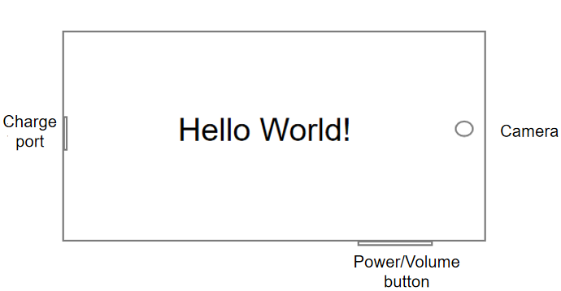
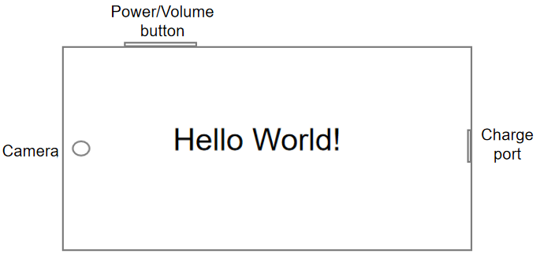

# Window Subsystem Changelog

## cl.window.1 Landscape Orientation Behavior Changed

**Access Level**

Public API

**Reason for Change**

When setting the landscape mode for an application by configuring the ability tag **orientation** in the **module.json** file or calling the **setPreferredOrientation** API, developers are used to choosing **LANDSCAPE**. In this case, the power button rotates to the bottom of the device, which is opposite to the common logic in the industry and does not comply with user habits.

**Change Impact**

This change is a non-compatible change.

This change takes effect from OpenHarmony SDK 5.0.0.25 (API version 12). It does not take effect in API version 11 and earlier versions. After the change, the rotation orientation is opposite to that before the change when **LANDSCAPE** is applied.

The following figures show the comparison before and after the change.
| Before Change | After Change |
|---------|---------|
|  |  |

**Start API Level**

9

**Change Since**

OpenHarmony SDK 5.0.0.25

**Key API/Component Changes**

The following table lists the landscape settings before and after the change.

Landscape effect comparison
|Orientation| Before Change         | After Change  |
|-------| -------- | --------------- |
|LANDSCAPE|  Power button facing downwards   |  Power button facing upwards  |
|LANDSCAPE_INVERTED|  Power button facing upwards   |  Power button facing downwards |
|AUTO_ROTATION_LANDSCAPE|  Power button facing downwards   |  Power button facing upwards |
|AUTO_ROTATION_LANDSCAPE_RESTRICTED|  Power button facing downwards   |  Power button facing upwards  |
|USER_ROTATION_LANDSCAPE   |  Power button facing downwards  | Power button facing upwards  |
|USER_ROTATION_LANDSCAPE_INVERTED|  Power button facing upwards |  Power button facing downwards  |

**Adaptation Guide**

1. Change the enumerated values as follows:

   (1) If **LANDSCAPE** is passed in before the change, pass in **LANDSCAPE_INVERTED** after the change to ensure the same experience.

   (2) If **LANDSCAPE_INVERTED** is passed in before the change, pass in **LANDSCAPE** after the change to ensure the same experience.

   (3) If **USER_ROTATION_LANDSCAPE** is passed in before the change, pass in **USER_ROTATION_LANDSCAPE_INVERTED** after the change to ensure the same experience.

   (4) If **USER_ROTATION_LANDSCAPE_INVERTED** is passed in before the change, pass in **USER_ROTATION_LANDSCAPE** after the change to ensure the same experience.

2. The listened landscape orientation is changed.

   After the landscape mode is set for an application, the orientation of the display can be obtained by listening for **display.on('change')**. After the change, the orientation of the display changes accordingly when the display rotates.

   (1) When the power button is on the right side of the device, the values of **displayOrientation** are different before and after the change, as described below.

   |Orientation| Before Change         | After Change  |
   |-------| -------- | --------------- |
   |LANDSCAPE|  1    |  3   |
   |LANDSCAPE_INVERTED|  3    |  1  |
   |AUTO_ROTATION_LANDSCAPE|  1    |  3 |
   |AUTO_ROTATION_LANDSCAPE_RESTRICTED|  3    |  1   |
   |USER_ROTATION_LANDSCAPE   |  1   | 3   |
   |USER_ROTATION_LANDSCAPE_INVERTED|  3  |  1   |
(2) When the power button is on the left side of the device, the values of **displayOrientation** remain unchanged before and after the change.
3. Recommended enumerated values for the landscape mode:

   After the change, you are advised to set the landscape mode to **LANDSCAPE** and **USER_ROTATION_LANDSCAPE**.