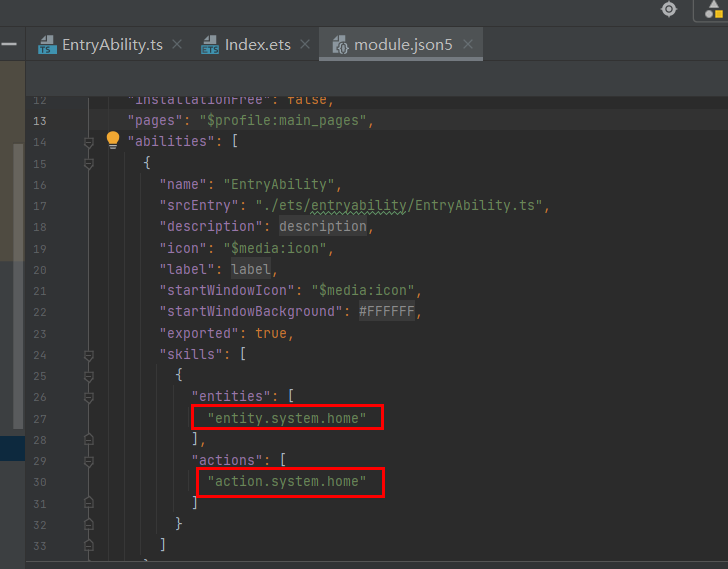

# Bundle Manager Subsystem Changelog

## cl.bundlemanager.1 Specifications of Entry Icons and Entry Labels Changed

**Access Level**

Public API

**Reason for Change**

The [entry icon and entry name](../../../application-dev/application-models/application-component-configuration-stage.md#configuring-the-entry-icon-and-entry-label), configured under **abilities** in the **module.json5** file, are the icon and name displayed on the home screen after the application is installed. The [application icon and application name](../../../application-dev/application-models/application-component-configuration-stage.md#configuring-the-application-icon-and-application-label), configured in the **app.json5** file, are the icon and name displayed in the application list of Settings or notification bar after the application is installed.

If an application is configured with the application icon, application name, entry icon, and entry name, the icon and name displayed on the home screen are different from those displayed in Settings. To prevent malicious applications from forging the icons and names, an application should always display the same icon and name in different places of the device.

**Change Impact**

This change is a compatible change. If an application has an entry UIAbility with the entry icon and entry label configured, that entry icon and entry label are displayed. If an application is not configured with an entry icon or entry label, the application icon and application label are displayed.

Before change:

| Position   | Icon and Name Displayed      | Description       |
| ----- | ---------- | --------- |
|  Home screen  |  Entry icon and name |  If an application does not have an entry UIAbility, the application icon and application name are displayed. |
|  Settings  |  Application icon and name |  The fields for configuring the application icon and name are mandatory. The default icon and name are provided during project creation. |

After change:
| Position   | Icon and Name Displayed      | Description       |
| ----- | ---------- | --------- |
|  Home screen  |  Entry icon and name |  If an application does not have an entry UIAbility, the application icon and application name are displayed. |
|  Settings  |  Entry icon and name |  If an application has an entry UIAbility with the entry icon and entry label configured, the entry icon and entry label are displayed. If an application does not have an entry UIAbility or is not configured with an entry icon or entry label, the application icon and application label are displayed. If an application has multiple entry UIAbilities, the icon and name configured in the UIAbility corresponding to the mainElement of the entry type HAP are displayed. |

**Start API Level**

N/A

**Change Since**

OpenHarmony SDK 5.0.0.31

**Key API/Component Changes**

The icons and labels returned by the query interface provided by the bundleManager module are returned by priority.

**Adaptation Guide**

You are advised to keep the application icon, application label, entry icon, and entry label consistent.

## cl.bundlemanager.2 Only One Entry UIAbility Is Supported by for an Application

**Access Level**

System API

**Reason for Change**

If an application has multiple entry icons, different icons and names will be displayed on the home screen after the application is installed. Malicious applications may forge the icons and names of others, bringing security and privacy leakage risks. After the application is modified to support only one entry UIAbility, only one icon and name are displayed on the home screen after the application is installed. If multiple entry UIAbilities are configured for an application, only the mainElement in the HAP of the entry type takes effect.

Entry UIAbility configuration fields:
For **skills** under **abilities** in **module.json5**, **entities** contains **entity.system.home**, and **actions** contains **action.system.home**.

**Change Impact**

This change is a non-compatible change. An application supports only one entry UIAbility.

Before change:

Multiple entry UIAbilities can be configured for an application. After the application is installed, multiple icons and names are displayed on the home screen.

After change:

Only one entry UIAbility can be configured for an application. After the application is installed, only one icon and name are displayed on the home screen. If multiple entry UIAbilities are configured for an application, only the entry UIAbility corresponding to the mainElement of the HAP of the entry type is returned.

**Start API Level**

7

**Change Since**

OpenHarmony SDK 5.0.0.31

**Key API/Component Changes**

The **getLauncherAbilityInfo** API provided by the bundleManager module returns only one entry UIAbility information.

**Adaptation Guide**

You are advised to configure only one entry UIAbility.
