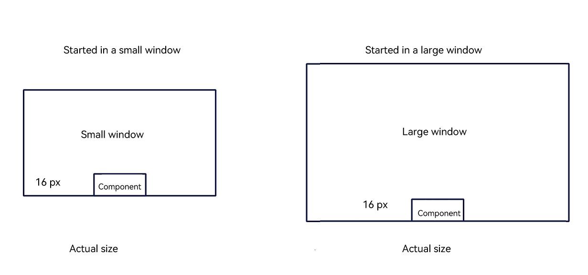
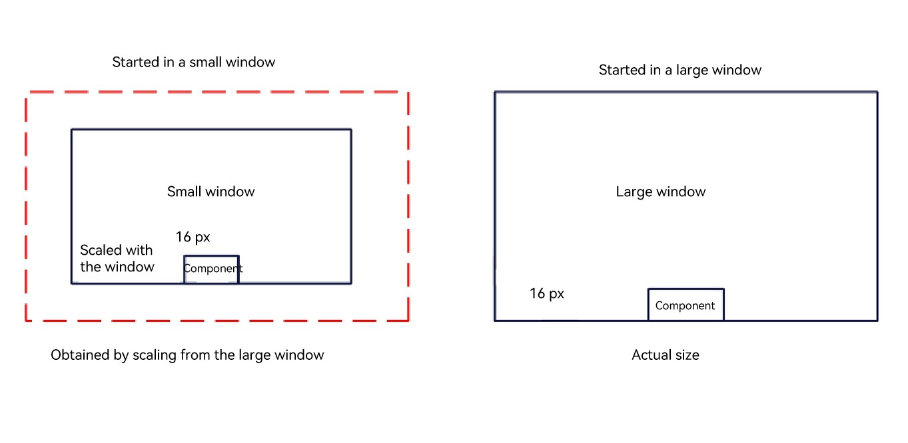

# Window Subsystem Changelog

## cl.pipwindow.1 Default Size of the PiP Window Is Now Fixed at the Actual Size of the Large Window

**Access Level**

Public API

**Reason for Change**


The default size of the PiP window previously depends on the size of the window at launch, which can be small or large window size. Resizing the window by double-clicking does not change the actual size of the window, but it changes the scale factor of the window.

For example, if an application renders a custom UI component based on a small window, and then the user double-clicks the window to scale up to a large window, the visual size of the custom UI component does not match the size when PiP is initiated with a large window. To address this, the PiP window size is now fixed to the actual size of the large window, with its size in the small window derived from the large window's actual size through scaling.

**Change Impact**

This change is a non-compatible change.

Before change:

The PiP window uses the actual size regardless of whether it is started in a small or large window. If an application renders a custom UI component based on a small or large window and then the user double-clicks to scale to the other mode, the visual size of the component is different from that in the scenario where PiP is directly started in that mode.

After change:

The PiP window's size is standardized to the default size of the large window, and its size in a small window is obtained by scaling the large window based on system rules. The custom UI component, after being adapted to the large window size, is scaled together with the PiP window when being displayed in the small window.

| Before Change| After Change|
|---------|---------|
|  |  |

**Start API Level**

API 12

**Change Since**

OpenHarmony SDK 5.0.0.42

**Key API/Component Changes**

Scenarios where **customUIController** in **PiPConfiguration** is used to add a custom component in a PiP window.

**Adaptation Guide**

If your application has adapted the size of custom UI components based on the small window, these components in the small window may be smaller than intended.

Adapt the custom components based on the maximum level (actual size) of the PiP window. The components in other levels will automatically adjust in size along with the scaling of the PiP window.

```ts
@Builder
function buildText(params: Params) {
  Column() {
    // Before the change, the font size is 20 if the application uses the small window as the baseline.
    // Text(params.text)
    //  .fontSize(20)
    //  .fontColor(Color.Red)

    // After the change, the font size is adapted based on the actual size of the large window and adjusted to a proper value.
     Text(params.text)
      .fontSize(38)
      .fontColor(Color.Red)
  }
  .width('100%')
  .height('100%')
}
// customUIController used by the custom UI component.
class TextNodeController extends NodeController {
  private message: string;
  private textNode: BuilderNode<[Params]> | null = null;
  constructor(message: string) {
    super();
    this.message = message;
  }
  makeNode(context: UIContext): FrameNode | null {
    this.textNode = new BuilderNode(context);
    this.textNode.build(wrapBuilder<[Params]>(buildText), new Params(this.message));
    return this.textNode.getFrameNode();
  }
}
```
