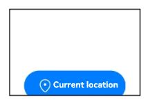
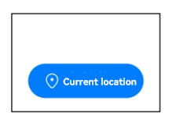

# Access Token Changelog

## cl.access_token.1 Change in the Security Component Behaviors for the offset Attribute

**Access Level**

Public API

**Reason for the Change**

When a security component cannot be completely displayed in its parent component due to the setting of **offset**, it can still be tapped, which poses security risks and may be exploited by malicious applications.

**Change Impact**

This change is a non-compatible change.

Before the change:

When a security component is clipped and cannot be completely displayed in its parent component due to the setting of **offset**, it still responds to user taps.

Example:

When **LocationButton** is clipped and cannot be completely displayed in its parent component due to the setting of **offset**, it still responds to user taps, allowing access to the location information.

After the change:

When a security component is clipped and cannot be completely displayed in its parent component due to the setting of **offset**, it does not respond to user taps.

Example:

When **LocationButton** is clipped and cannot be completely displayed in its parent component due to the setting of **offset**, it does not respond to user taps.

**Start API Level**

10

**Change Since**

OpenHarmony SDK 5.0.0.46

**Key API/Component Changes**

**LocationButton** in @internal/component/ets/location_button.d.ts.

**SaveButton** in @internal/component/ets/save_button.d.ts.

**PasteButton** in @internal/component/ets/paste_button.d.ts.

**Adaptation Guide**

If a security component is clipped by its parent component and cannot be completely displayed, adjust the value of **x** or **y** in **offset({x: value, y: value})** to bring it into full view.

