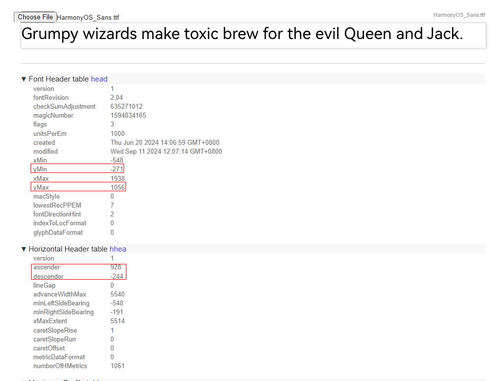

# ArkGraphics2D Changelog

## cl.arkgraphics2d.1 Added ohos.graphics2d.text.adapter_text_height to the metadata Tag of the Main Module to Enable a New Line Height Calculation Rule Globally

**Access Level**

Public API

**Reason for Change**

To further improve text rendering, a field is introduced to enable applications to adopt a new line height calculation rule across the entire application.

**Change Impact**

This change is a compatible change.

The **ohos.graphics2d.text.adapter_text_height** field is added to the [**metadata** tag in the module.json5 file](../../../application-dev/quick-start/module-configuration-file.md#metadata) of the main module to enable the new line height calculation rule for the application.

```json
{
    "module": {
        "name": "test",
        "type": "entry",
        "metadata": [
            {
                "name": "ohos.graphics2d.text.adapter_text_height",
            }
        ]
    }
}
```
If **ohos.graphics2d.text.adapter_text_height** is not configured, the default line height calculation rule is used. The default rule is calculated as follows:

For a font size of **fontSize** (px), the rule is (|descender| + |ascender|)/unitsPerEm * fontSize.

If **ohos.graphics2d.text.adapter_text_height** is configured in the main module, the default line height calculation rule is enabled for the entire application. The new rule is as follows:

1. For custom fonts: For a font size of **fontSize** (px), the rule is (|yMin| + |yMax|) /unitsPerEm * fontSize.
2. For system fonts: For a font size of **fontSize** (px), the rule is (|yMin| + |yMax|) /unitsPerEm * fontSize. For system fonts, the line height calculation is based on the **HarmonyOS_Sans.ttf** file.

You can use the [font inspector](https://opentype.js.org/font-inspector.html) to view the parameters in a font file and learn about the line height and effect of the font.

The following uses the **HarmonyOS_Sans.ttf** file as an example to describe the default and new rules for calculating the line height.

| Parameters in the HarmonyOS_Sans.ttf font file                       |
| ----------------------------------------------------- |
|  |

The figure shows that at a 1000 px font size for HarmonyOS_Sans, yMin is -271, yMax is 1056, ascender is 928, and descender is -244.
1. According to the default rule, the line height for 50 px HaromonyOS_Sans is (|-244| + |928|)/1000 * 50 = 58.6 px.
2. According to the new rule, the line height for 50 px HaromonyOS_Sans is (|-271| + |1056|)/1000 * 50 = 66.35 px.

**Start API Level**

13

**Change Since**

OpenHarmony SDK 5.0.0.46

**Key API/Component Changes**

N/A

**Adaptation Guide**

The new line height calculation rule will be used as the default rule in later versions. For compatibility and UI display, you are advised to use this rule during application development.

After the setting of **ohos.graphics2d.text.adapter_text_height** in the main module, the application UI might display unexpected issues like text being cut off, elements overlapping, or shifts in the relative positioning of content. You need to adjust the layouts of the affected pages.
