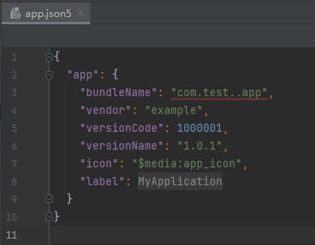

# Bundle Manager Subsystem Changelog

## cl.bundlemanager.1 Modified the Regular Expression Matching Rule for the bundleName Field in the app.json File

**Access Level**

Public API

**Reason for Change**

The regular expression matching rule of the **bundleName** field in the **app.json** file does not comply with the bundle name specifications.

**Change Impact**

This change is a non-compatible change.

Before the change, the regular expression matching rule is as follows:
- The bundle name starts with a letter and consists of letters, digits, underscores (_), and periods (.).

After the change, the regular expression matching rule is as follows:
- The bundle name consists of letters, digits, underscores (_), and periods (.).
- The bundle name contains at least three segments, separated by periods (.). 
- The first segment starts with a letter, and other segments start with a digit or letter. Each segment ends with a digit or letter.
- Consecutive periods (.) are not allowed.

**Start API Level**

8

**Change Since**

OpenHarmony 5.0.0.55

**Key API/Component Changes**

The **toolchains/modulecheck/app.json** file in the OpenHarmony SDK directory.

**Adaptation Guide**

If the following error is displayed in DevEco Studio, change the bundle name according to the new rule.  
