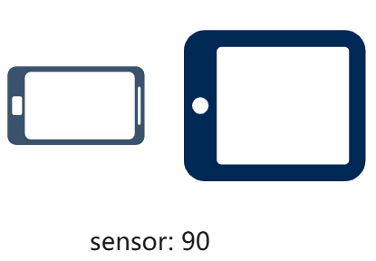
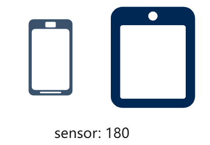
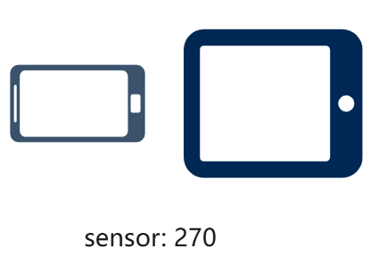

# Window Subsystem Changelog

## cl.display.1 Changed the rotation and orientation Attributes of Display Objects

**Access Level**

Public API

**Reason for Change**

There are variations in the alignment of electronic components across different devices such as mobile phones and tablets, and the natural orientation of the sensor does not align with the physical orientation of the screen. As a result, the return values of the **rotation** and **orientation** attributes in the Display object on tablets are different from those on mobile phones.

When both devices are rotated by the same angle, the values obtained from the **rotation** and **orientation** attributes of the Display object are different. Special processing is required based on the device type.

**Change Impact**

This change is a non-compatible change.

After the change, the display orientation on tablets will be changed to be the same as that on mobile phones.

The following show the comparison before and after the change.

| Device Rotation Direction| Tablet Before Change| Tablet After Change|  Mobile Phone|
|---------|---------|---------|---------|
|  | rotation: 1   orientation: 0 | rotation: 0   orientation: 0  | rotation: 0   orientation: 0  |
|  | rotation: 2   orientation: 3 | rotation: 1   orientation: 1 |rotation: 1   orientation: 1 |
|  | rotation: 3   orientation:  2| rotation: 2   orientation: 2 | rotation: 2   orientation: 2 |
|  | rotation: 0   orientation: 1 | rotation: 3   orientation: 3 | rotation: 3   orientation: 3 |

**Start API Level**

7

**Change Since**

OpenHarmony SDK 5.0.2.1

**Key API/Component Changes**

**rotation** and **orientation** attributes of the Display object in the @ohos.display.d.ts file

**Adaptation Guide**

Listen for landscape/portrait mode changes on tablets.

Call **display.on('change')** to listen for display attribute changes and obtain the **rotation** and **orientation** values from the Display object. Determine the landscape or portrait state based on these values for tablets, and pay attention to any changes to these values.

With the charging port facing downward (rotation set at **0**) as the reference point, and rotating the tablet clockwise by 0, 90, 180, and 270 degrees, the correlation between **rotation** and **orientation** values on tablets is detailed in the table below.

|Clockwise Rotation Angle|Value of rotation Before Change | Value of rotation After Change   | Value of orientation Before Change | Value of orientation After Change|
|-------      |-------        | --------          | ---------------   |---------------   |
|0            |1              |  0                |  0                |0                 |
|90           |2              |  1                |  3                |1                 |
|180          |3              |  2                |  2                |2                 |
|270          |0              |  3                |  1                |3                 |
