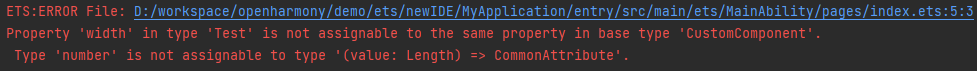

# Updates (OpenHarmony 3.2 Beta1 -> OpenHarmony 3.2 Beta2)

## Introduced Application Sandbox

Based on the namespace mechanism, OpenHarmony introduces the application sandbox to enhance application data security and reduce the possible leakage of application data and user privacy information.
It also resolves user experience and concurrency stability problems in file management caused by directory disorder and adoption of multiple file access modes.

**Change Impact**

After the application sandbox is enabled, the access operations of all applications incubated by the appspawn process will be restricted by the application sandbox.
If an application does not adapt to the file access model of the application sandbox, it may not function in full.
To access files in the **/data** directory, the application must use the **Context** API, rather than a hard-coded path. For details, see [Adaptation Process](application-sandbox-adaptation-guide.md#adaptation-process).

**Key API/Component Changes**

OpenHarmony application sandbox component

**Adaptation Guide**

See [Adaptation Guide for the Application Sandbox](application-sandbox-adaptation-guide.md).

## Added Build Verification for the Struct of Custom Components

**Change 1**: The lifecycle functions (such as **aboutToAppear**) in the struct of a custom component cannot be decorated using **private**.

**Change Impact**

Before the change, only the editor performs verification. After the change, the compiler also performs verification.

**Key API/Component Changes**

None

**Adaptation Guide**

If any of the following situations occurs, remove **private**.

**Change 2**: The member property name in the struct of a custom component cannot be the same as the built-in property or method name.

**Change Impact**

If the member property name in the struct of a custom component is the same as the built-in property or method name, the verification fails.

**Key API/Component Changes**

None

**Adaptation Guide**

If any of the following situations occurs, change the property name:

