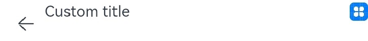

# ArkUI Changelog

## cl.arkui.1 undefined and null Value Support for State Variables

**Change Impact**

API version 9: State variables do not accept **undefined** or **null** as values. If a state variable is set to **undefined** or **null**, it will remain at its original value.

API version 10: State variables accept **undefined** and **null** as values. You need to check whether a state variable is **undefined**.

**Adaptation Guide**

Since API version 10, you need to take measures to check whether a state variable is **undefined**.
```ts
@Entry
@Component
struct Page3 {
  @State messages: string[] = ['Hello World']

  aboutToAppear() {
    // If AppStorage does not contain the specified key, undefined is returned.
    // API version 9: The ArkUI framework rejects undefined as the assigned value, and this.messages is still at its initial value ['Hello World'].
    // API version 10: The ArkUI framework accepts undefined as the assigned value, and this.messages is undefined.
    this.messages = AppStorage.Get("aProp")
  }

  build() {
    Row() {
      Column() {
        // API version 9: The application does not crash, and the value of length is 1.
        // API version 10: The application crashes, and the following error message is displayed: Cannot read property length of undefined.
        Text(`the messages length: ${this.messages.length}`)
          .fontSize(50)
          .fontWeight(FontWeight.Bold)
      }
      .width('100%')
    }
    .height('100%')
  }
}
```

In the preceding scenario, each time **undefined** or **null** is assigned to a state variable, a check for **undefined** state variables is required.

```ts
Text(`the messages length: ${this.messages?.length}`)
```

In API version 10, the ArkUI framework verifies the initialization and value types of state variables, and reports errors found during running. Specifically, there are the following two cases:
1. @Link initialization from the parent component

In the following example, a runtime error is reported, prompting you to initialize @Link.
```ts
@Entry
@Component
struct Page3 {
  @State aProp: boolean = true

  build() {
    Row() {
      Column() {
        // crash: SynchedPropertyObjectTwoWayPU[9, 'linkProp']: constructor @Link/@Consume source variable in
        // parent/ancestor @Component must be defined. Application error!
        LinkChild()
        // Incorrect: linkProp is initialized from a regular variable. In this case, the ArkUI framework considers linkProp as not initialized and reports an error.
        LinkChild({ aProp: false })
        // Correct: @Link is initialized from the state variable this.aProp.
        LinkChild({ aProp: this.aProp })
      }
      .width('100%')
    }
    .height('100%')
  }
}

@Component
struct LinkChild {
  @Link aProp: boolean

  build() {
    Text(`linkProp: ${this.aProp}`)
      .fontSize(50)
      .fontWeight(FontWeight.Bold)
  }
}
```

2. Value type support of state variables

If a state variable is assigned a value in an unsupported type, for example, function, a runtime error is reported.
```ts
@Entry
@Component
struct Page3 {
  // API version 10: A runtime error is reported: @Component 'Page3': Illegal variable value error with decorated variable @State/@Provide 'functionProp': failed
  // validation: 'undefined, null, number, boolean, string, or Object but not function, attempt to assign value type: 'function', 
  @State functionProp: () => void = () => {
    console.info("123")
  }

  aboutToAppear() {
    this.functionProp()
  }

  build() {
    Row() {
      Column() {
        Text("hello")
      }
      .width('100%')
    }
    .height('100%')
  }
}
```

## cl.arkui.2 Adaptation to Component Exceptions After Updating to SDK 4.0.10.x
After the SDK is updated to 4.0.10.x, the UI components cannot be properly displayed if the device is not using the matching image version.

**Example**

```
@Entry
@Component
struct Index { // Custom component
  build() {
    Text('Hello, world') // Basic component
  }
}
```

**Change Impact**

If the device where your application runs is not using the matching image version, calling a UI component in the application code will cause
the error message "this.observeComponentCreation2 is not callable".

**Key API/Component Changes**

N/A

**Adaptation Guide**

Use the matching image on the device.

## cl.arkui.1 Change in Processing for When scrollBar of the \<List> Component Is Set to undefined or an Invalid Value

**Change Impact**

In versions earlier than OpenHarmony_4.0.10.1, the following values evaluate to the default value **BarState.Off**: **scrollBar(undefined)**, **scrollBar('aaa')**, **scrollBar(-1)**.<br>
In OpenHarmony_4.0.10.2 and later versions, the preceding values evaluate to the default value **BarState.Auto**.

**Key API/Component Changes**

The processing of the **\<List>** component's **scrollBar** attribute, when it is set to **undefined** or an invalid value, is changed from using **BarState.Off** to using **BarState.Auto**.

## cl.arkui.4 Change in Processing for When scrollBar of the \<Grid> Component Is Set to undefined or an Invalid Value

**Change Impact**

In versions earlier than OpenHarmony_4.0.10.1, the following values evaluate to the default value **BarState.Off**: **scrollBar(undefined)**, **scrollBar('aaa')**, **scrollBar(-1)**.<br>
In OpenHarmony_4.0.10.2 and later versions, the preceding values evaluate to the default value **BarState.Auto**.

**Key API/Component Changes**

The processing of the **\<Grid>** component's **scrollBar** attribute, when it is set to **undefined** or an invalid value, is changed from using **BarState.Off** to using **BarState.Auto**.


## cl.arkui.5 Method Name Changes in NavPathStack

**Key API/Component Changes**

[NavPathStack](../../../application-dev/reference/arkui-ts/ts-basic-components-navigation.md#navpathstack10)  
|  Before Change  | After Change |
|  ----  | ----  |
| push  | pushPath |
| pushName  | pushNameByPath |
| popTo| PopToName |

**Change Impact**

After the SDK is updated to 4.0.10.x, if any of the old method names is used in the code, a compilation error will be reported.  
Property 'push' does not exist on type 'NavPathStack'.   
Property 'pushName' does not exist on type 'NavPathStack'.   
Property 'pop' does not exist on type 'NavPathStack'.   

**Adaptation Guide**  

Update the code to use the new method names.

```ts
navPathStack = new NavPathStack();
this.navPathStack.push(...)
this.navPathStack.pushPath(...)

this.navPathStack.pushName('navidesnation_add',this.value)
this.navPathStack.pushPathByName('navidesnation_add',this.value) 

this.navPathStack.pop('navidesnation_add')
this.navPathStack.popToName('navidesnation_add')
```

## cl.arkui.6 setLineDash Implementation Change


Changed the unit of the **number** parameter in the **setLineDash** API from px to vp.

**Example**
```ts
@Entry
@Component
struct SetLineDash {
  private settings: RenderingContextSettings = new RenderingContextSettings(true)
  private context: CanvasRenderingContext2D = new CanvasRenderingContext2D(this.settings)

  build() {
    Flex({ direction: FlexDirection.Column, alignItems: ItemAlign.Center, justifyContent: FlexAlign.Center }) {
      Canvas(this.context)
        .width('100%')
        .height('100%')
        .backgroundColor('#ffff00')
        .onReady(() =>{
          let ctx = this.context
          ctx.lineWidth = 5
          ctx.arc(100, 75, 50, 0, 6.28)
          ctx.setLineDash([10,20])
          ctx.stroke();
        })
      Image('image/SetLineDash.png')
        .objectFit(ImageFit.Contain)
    }
    .width('100%')
    .height('100%')
  }
}
```
API version 9: The unit of the **number** parameter in the **setLineDash** API is px.


API version 10 and later: The unit of the **number** parameter in the **setLineDash** API is vp.


**Change Impact**

The drawing effect of the **setLineDash** API in API version 9 or earlier is different from that in API version 10 or later.

## cl.arkui.7 Change in the Custom Navigation Title Position

1. **NavigationTitleMode** is set to **Full**, **Free**, or **Mini** without the back button.

   API version 9: The left margin remains at 24 vp.

   API version 10: The left margin is changed from 24 vp to 0. The top margin is changed from center to 0.

2. **NavigationTitleMode** is set to **Mini** and the back button is displayed.

   API version 9: The spacing between the custom title and the back button is 16 vp.

   API version 10: The spacing between the custom title bar and the back button is changed from 16 vp to 12 vp.

3. A custom menu is configured.

   API version 9: The right margin is 24 vp.

   API version 10: The right margin is changed from 24 vp to 0.

**Reason for Change**

Since API version 9, offsets are added the custom title and menu of the **\<Navigation>** component, which affects the use of custom components. Since OpenHarmony 4.0.10.6, the offsets are removed from applications in API version 10.

**Change Impact**

In API version 10, the custom navigation title is displayed on the left of or above the position where it would appear in previous API versions.

**Adaptation Guide**

1. For **NavigationTitleMode.Full**, **NavigationTitleMode.Free**, and **NavigationTitleMode.Mini**, you can add a left margin by using **$r('sys.float.ohos_id_max_padding_start')**.
To center the title on the top, use **.height('100%').alignItems(VerticalAlign.Center)**.

2. For **NavigationTitleMode.Mini** with the back button displayed, you can add a left margin by using **.margin({left: 4})**. To center the title on the top, use **.height('100%').alignItems(VerticalAlign.Center)**.

3. When a custom menu is configured, you can add a right margin by using **.margin({right: $r('sys.float.ohos_id_max_padding_end')})**.


**Example**
```ts
@Entry
@Component
struct Index {
  @State titleMode: NavigationTitleMode = NavigationTitleMode.Free
  @State backButton: boolean = false;
  @Builder CustomMenu() {
    Column() {
      Image($r('app.media.icon')).width(24).height(24)
    }
  }

  @Builder CustomTitle() {
    Column() {
      Text('Custom title').fontSize(20)
    }
  }

  build() {
    Column() {
      Navigation() {
        Column() {
          Text(`Change current title mode: ${this.titleMode}`)
            .onClick(()=>{
              if (this.titleMode == NavigationTitleMode.Free) {
                this.titleMode = NavigationTitleMode.Full;
              } else if (this.titleMode == NavigationTitleMode.Full) {
                this.titleMode = NavigationTitleMode.Mini;
              } else {
                this.titleMode = NavigationTitleMode.Free;
              }
            })

          Text(`Change back button: ${this.backButton}`).onClick(()=>{
            this.backButton = !this.backButton;
          }).margin({top: 10})
        }.margin({top: 40})
      }.title(this.CustomTitle)
      .titleMode(this.titleMode)
      .menus(this.CustomMenu)
      .hideBackButton(this.backButton)
    }
  }
}
```
API version 9: Custom title and menu in **NavigationTitleMode.Full** settings


API version 10: Custom title and menu in **NavigationTitleMode.Full** settings


API version 9: Custom title with the back button in **NavigationTitleMode.Mini** settings


API version 10: Custom title with the back button in **NavigationTitleMode.Mini** settings



API version 9: Custom title without the back button in **NavigationTitleMode.Mini** settings


API version 10: Custom title without the back button in **NavigationTitleMode.Mini** settings


## cl.arkui.8 Title Bar Change of the \<NavDestination> Component

For custom titles:

1. With the back button

   API version 9: The spacing between the back button and the title bar is 16 vp, and the title bar is centered.

   API version 10: The spacing between the back button and the title bar is changed from 16 vp to 12 vp, and the top offset of the title bar is changed to 0.

2. Without the back button

   API version 9: The title bar is centered, with a left margin of 24 vp.

   API version 10: The left margin of the title bar is changed from 24 vp to 0, and its top offset is changed to 0.

**Reason for Change**

Since API version 9, offsets are added to the custom title of the **\<Navigation>** component, which affects the use of custom components. Since OpenHarmony 4.0.10.6, the offsets are removed from applications in API version 10.

**Change Impact**
The custom title bar of the **\<NavDestination>** component is displayed in the upper left corner of the position where it would appear in previous API versions.

**Adaptation Guide**

To retain the display effect in previous versions, you can use the following solution:

1. Where the back button is not displayed: Add a left offset by using **margin({left: $r('sys.float.ohos_id_max_padding_start')})**.
To center the title bar on the top, use **.height ('100%').alignItems (VerticalAlign.Center)**.

2. Where the back button is displayed: Add a left offset by using **margin ({left: 4})**. To center the title bar on the top, use **.height ('100%').alignItems (VerticalAlign.Center)**.

**Example**
```ts
@Entry
@Component
struct Index {
  @Builder NavigationTile() {
    Column() {
      Text('title').fontColor('#182431').fontSize(30).lineHeight(41)
      Text('subTitle').fontColor('#182431').fontSize(14).lineHeight(19).margin(top:2, bottom: 20)
    }
  }

  build() {
    Column() {
      Navigation() {
        Text('Navigation')
      }.title(this.NavigationTitle)
       .titleMode(NavigationTitleMode.Free)
       .menus([
        {icon: 'common/image/icon.png', value: 'menu1'}
       ])
    }
  }
}
```

API version 9: Custom title bar with the back button


API version 10: Custom title bar with the back button


API version 9: Custom title bar without the back button


API version 10: Custom title bar without the back button


## cl.arkui.9 OnStateChange Callback Change of the \<NavRouter> Component

Fixed the number of **OnStateChange** calls:

The number of the **OnStateChange** calls for displaying the **\<NavDestination>** component is changed from twice to once, which does not affect the call sequence.

**Change Impact**

Applications that use **OnStateChange** for call timing are affected.

   Call sequence before the change: **OnStateChange(true)** triggered by display of **\<NavRouter>** -> **OnStateChange(false)** triggered by exiting of **\<NavRouter>** -> **OnStateChange(true)** triggered by display of **\<NavRouter>**

   Call sequence after the change: **OnStateChange(true)** triggered by display of **\<NavRouter>** -> **OnStateChange(false)** triggered by exiting of **\<NavRouter>**

## cl.arkui.10 Value Change of the PanelHeight Enum WRAP_CONTENT from 0 to 'wrapContent'

**Change Impact**

Before the change, both **customHeight(0)** and **customHeight(PanelHeight.WRAP_CONTENT)** configure the component to adapt to the content height.<br>
After the change, **customHeight(0)** sets the content height to **0**, and **customHeight(PanelHeight.WRAP_CONTENT)** configures the component to adapt to the content height.

**Key API/Component Changes**

The value of **WRAP_CONTENT** of the **PanelHeight** enum is changed from **0** to **'wrapContent'**. This API behavior change does not affect your use of the API.

## cl.arkui.11 Change of the Default Value for aspectRatio Set to an Invalid Value or undefined

**Change Impact**

Before the change, if **aspectRatio** is set to a negative value or **undefined**, the default value **1.0** is used.

After the change, if **aspectRatio** is set to a negative value or **undefined**, the default value **null** is used. For example, if a **\<Row>** component has only its width set and does not have any child component, then when **aspectRatio** is not set or is set to a negative value, the height of the **\<Row>** component is 0.

## cl.arkui.12 Change of Effect in Setting defaultFocus to true

**Change Impact**
In versions earlier than 4.0.9.1, setting **defaultFocus** to **true** does not take effect.

In 4.0.9.1 and later versions, setting **defaultFocus** to **true** takes effect.

## cl.arkui.13 Change of Focus Navigation for tabIndex

**Change Impact**
In versions earlier than 4.0.10.2, the focus navigation for **tabIndex** is not cyclic.

In 4.0.10.2 and later versions, the focus navigation for **tabIndex** is cyclic.

## cl.arkui.14 Change of Constraint Calculation for the \<TextInput> Component

**Change Impact**

In versions earlier than 4.0.10.2, when **margin** is set for the **\<TextInput>** component, the value of **margin** is subtracted from the component's constraint.

In versions earlier than 4.0.10.2, the value of **margin** is not subtracted from the **\<TextInput>** component's constraint.


## cl.arkui.15 Change in Handling Rules on Negative Values of fontSize for Buttons

**Change Impact**

Before change, a negative value of **fontSize** evaluates to **0**. That is, the text is not displayed.<br>
After change, a negative value of **fontSize** evaluates to the default value **16fp**.<br>
Note: This change does not affect the effect of **fontSize=0**.

## cl.arkui.16 Change in the Search Text Box for When the Attributes of the \<Search> Component Are Dynamically Changed

**Change Impact**

Before change, when **placeholder**, but not **value**, is set for the **\<Search>** component, dynamically changing the component attributes will clear the search text box.<br>
After change, when **placeholder**, but not **value**, is set for the **\<Search>** component, dynamically changing the component attributes will not clear the search text box.
Note: After change, the behavior of the **\<Search>** component is what is expected of the component in normal cases.

## cl.arkui.17 Change in the Width Specification of the \<Menu> Component

Changed the width specification of the [\<Menu>](../../../application-dev/reference/arkui-ts/ts-basic-components-menu.md) component as follows: If the width is not set, the component takes up two columns. If the width is set, the component adapts its content to the set width. The **\<Menu>** component has a default minimum width of 64 vp.

**Change Impact**

1. By default, the menu takes up two columns. If the content of the [\<MenuItem>](../../../application-dev/reference/arkui-ts/ts-basic-components-menuitem.md) is wider than 2 columns, the menu width is automatically extended.
2. The default minimum width of the menu is 64 vp. You can change the minimum width through the [constraintSize](../../../application-dev/reference/arkui-ts/ts-universal-attributes-size.md) attribute.

**Key API/Component Changes**

- [Menu](../../../application-dev/reference/arkui-ts/ts-basic-components-menu.md)

**Adaptation Guide**

You can set the minimum width to a value less than 64 vp or remove the limit altogether, by setting **constraintSize**.

**Example**
```ts
@Entry
@Component
struct Index {
  @Builder
  MyMenu(){
    Menu() {
      MenuItem({ startIcon: $r("app.media.icon"), content: "Menu option" })
    }
    .width(30)
    .constraintSize({minWidth: 0}) //Overwrite the default minimum width of 64 vp.
  }

  build() {
    Row() {
      Column() {
        Text('click to show menu')
      }
      .bindMenu(this.MyMenu)
      .width('100%')
    }
    .height('100%')
  }
}
```

## cl.arkui.18 Change in the Velocity Direction Specification of springCurve

**Change Impact**

In API version 9, when the [interpolate](../../../application-dev/reference/apis/js-apis-curve.md#interpolate9) method of [springCurve](../../../application-dev/reference/apis/js-apis-curve.md#curvesspringcurve9) is used for calculation, an initial velocity greater than 0 means to move in the reverse direction of the end point, and an initial velocity less than 0 means move in the direction of the end point.<br>
Since API version 10, when the **interpolate** method of **springCurve** is used for calculation, an initial velocity greater than 0 means to move in the direction of the end point, and an initial velocity less than 0 means move in the reverse direction of the end point. As a result, when the initial velocity is not 0, the result obtained using the **interpolate** method of **springCurve** in API version 10 is different from that in API version 9.

## cl.arkui.5 Change in the Actual Curve Time Estimation Threshold Specification of springCurve

**Change Impact**

In API version 9, the maximum duration estimated by the [interpolate](../../../application-dev/reference/apis/js-apis-curve.md#interpolate9) method of [springCurve](../../../application-dev/reference/apis/js-apis-curve.md#curvesspringcurve9) for the actual spring curve is 1 second. When the physics-based curve duration exceeds 1 second, the estimated duration is still 1 second. As a result, the animation duration of the spring curve that exceeds 1 second is incorrectly normalized, and the interpolation result changes abruptly when t=1.<br>
Since API version 10, the maximum duration estimated by the **interpolate** method of **springCurve** is 1000 seconds, so as to cover most spring curves. This change will result in differences from the calculation results by the **interpolate** method of **springCurve** in API versions earlier than 10.

## cl.arkui.19 uiAppearance API Behavior Change

Changed the return mode and return value of the **setDarkMode** and **getDarkMode** APIs.

**Change Impact**

The application developed based on earlier versions needs to adapt to new return mode and return value. Otherwise, the original service logic will be affected.

**Key API/Component Changes**


- In the error thrown when the **setDarkMode** API is called in callback mode, what's contained changes from error code ID only to error code ID and message.
- In the error thrown when the **setDarkMode** API is called in promise mode, what's contained changes from error code ID only to error code ID and message.
- In the value returned in normal cases when the **setDarkMode** API is called in callback mode, the first parameter changes from **0** to **null**.
- In the earlier version, the **getDarkMode** API directly returns **2** when an exception occurs. In this version, the API throws an error. You need to determine the error type based on the error code ID and message.

**NOTE**<br>Exceptions refer to unexpected behavior such as incorrect parameters, unconfigured permissions, and internal execution errors. Normal cases refer to expected behavior that do not generate errors.

**Adaptation Guide**

For details, see [@ohos.uiAppearance (UI Appearance)](../../../application-dev/reference/apis/js-apis-uiappearance.md).
