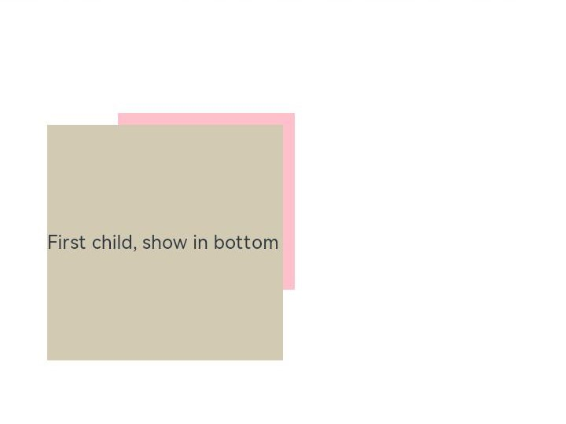

# ArkUI Subsystem Changelog


## cl.arkui.1 Change in the Default Scrollbar State of \<List> and \<Gird> Components

Changed the default state of the scrollbar in the **\<List>** and **\<Gird>** components from **BarState.Off** to **BarState.Auto**.

**Change Impact**

In the scenario where the scrollbar status is not set in the **\<List>** and **\<Gird>** components:

Before change:

The scrollbar is not displayed.

After change:

The scrollbar is displayed during scrolling and is hidden 2 seconds after the scrolling stops.

**Key API/Component Changes**

**scrollBar** attribute of the **\<List>** and **\<Gird>** components:
- [List](../../../application-dev/reference/arkui-ts/ts-container-list.md#attributes)
- [Grid](../../../application-dev/reference/arkui-ts/ts-container-grid.md#attributes)

**Adaptation Guide**

In scenarios where the scrollbar is not required, set the **scrollBar** attribute of the **\<List>** and **\<Gird>** components to **BarState.Off**.

The code snippet is as follows:
```ts
// xxx.ets
@Entry
@Component
struct ListItemExample {
  private arr: number[] = [0, 1, 2, 3, 4, 5, 6, 7, 8, 9]

  build() {
    Column() {
      List({ space: 20, initialIndex: 0 }) {
        ForEach(this.arr, (item) => {
          ListItem() {
            Text('' + item)
              .width('100%').height(100).fontSize(16)
              .textAlign(TextAlign.Center).borderRadius(10).backgroundColor(0xFFFFFF)
          }
        }, item => item)
      }
      .width('90%')
      .scrollBar(BarState.Off)
    }.width('100%').height('100%').backgroundColor(0xDCDCDC).padding({ top: 5 })
  }
}
```

## cl.arkui.2 Fixing of the Stack Layout Issue

Fixed the issue where child components in the [\<Stack>](../../../application-dev/reference/arkui-ts/ts-container-stack.md) container does not follow the **alignContent** settings when the child components stretch beyond the container.
Example:

```ts
@Entry
@Component
struct StackExample {
  build() {
    Stack({alignContent:Alignment.TopEnd}){
      Text('First child, show in bottom')
        .width(200).height(200).backgroundColor(0xd2cab3).margin(10)
    }.width(150).height(150).backgroundColor(Color.Pink).margin(100)
  }
}
```
Before: Child components are not arranged based on **alignContent:Alignment.TopEnd**.


After: Child components are arranged based on **alignContent:Alignment.TopEnd**.



**Change Impact**

1. When the **\<Stack>** component contains a child component larger than itself, adaptation to the application is required.
2. The previous workaround – **Offset** and **translate** settings for the child component – must be removed.

**Adaptation Guide**

Remove the **Offset** and **translate** settings for the child component.

##  cl.arkui.3 Change in the \<Button> Component Hover Effect

Changed the hover effect of the **\<Button>** component from scale-up by 100% to 105% to overlay of 0% to 5% opacity. Changed the pressed effect of the component to overlay of 5% to 10% opacity.

**Change Impact**

The visual effect of the **\<Button>** is affected.
