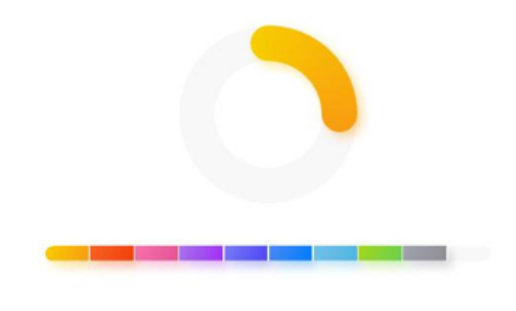
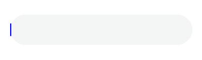

# ArkUI Changelog

## cl.arkui.1 Display Effect Change for the showTips Method of the \<Slider> Component

**Access Level**

Public

**Reason for Change**

This change is a compatible change, which involves how the tooltip is displayed for the **\<Slider>** component.

**Change Impact**

The **showTips** method of the **\<Slider>** component is affected. This method has two parameters: The first parameter of the Boolean type indicates whether to display a tooltip; the second parameter of the ResourceStr type indicates the text content of the tooltip.
The affected scenarios are as follows:

- Style of the tooltip when the first parameter of **showTips** is set to **true**

Before change


After change


- Width of the text content specified by the second parameter of **showTips**

Before change: The text can be displayed in multiple lines in full based on the grid width.

After change: The text is displayed in a single line, with the maximum width of 36 vp. That is, a maximum of four digits can be displayed.

**API Level**

7

**Change Since**

OpenHarmony SDK 4.1.5.5

**Key API/Component Changes**

\<Slider>

**Adaptation Guide**

N/A

## cl.Arkui.2 Change in the Default Colors of the \<Progress> Component

**Access Level**

Public

**Reason for Change**

The original default colors of the **\<Progress>** component do not comply with the UX specifications.

**Change Impact**

This change is a compatible change. It delivers a more visually appealing component.

**API Level**

8

**Change Since**

OpenHarmony SDK 4.1.5.5

**Key API/Component Changes**

**NOTE**<br>The color values listed below refer to the resource IDs in the system.<br>In versions earlier than API version 11: The default colors of the capsule-style progress indicator are as follows: foreground color: **ohos_id_color_emphasize_contrary**; border: **ohos_id_color_emphasize_contrary**. The default background color of the ring-style progress indicator is **ohos_id_color_component_normal**.


Since API version 11: The default colors of the capsule-style progress indicator are as follows: foreground color: **ohos_id_color_emphasize**; foreground color opacity: **ohos_id_alpha_highlight_bg**; border: **ohos_id_color_emphasize**; border opacity: **ohos_id_alpha_highlight_bg**. The default background color of the ring-style progress indicator is **ohos_id_color_button_normal**.


**Adaptation Guide**

N/A

## cl.Arkui.3 Change in the Default Colors of the \<LoadingProgress> Component

**Access Level**

Public

**Reason for Change**

The original default foreground color of the **\<LoadingProgress>** component does not comply with the UX specifications.

**Change Impact**

This change is a compatible change. It delivers a more visually appealing component.

**API Level**

8

**Change Since**

OpenHarmony SDK 4.1.5.5

**Key API/Component Changes**

In versions earlier than API version 11: The default foreground color opacity is **0.6**, and the default foreground color is **#99666666**.


Since API version 11: The default foreground color opacity is **1.0**, and the default foreground color is **#ff666666**.


**Adaptation Guide**

N/A

## cl.arkui.4 Change in the Default Behavior for the colorFilter Attribute of the \<Image> Component

**Access Level**

Public

**Reason for Change**

The change is made to meet user expectations.

**Change Impact**

This change is a non-compatible change.

Before change: When the **colorFilter** attribute of the **\<Image>** component is set to an invalid value, no operation is performed.

After change: When the **colorFilter** attribute of the **\<Image>** component is set to an invalid value, the system uses a value that represents a $4 \times 5$ matrix with entries of $1$ on the diagonal and entries of $0$ in other places.

**API Level**

11

**Change Since**

OpenHarmony SDK 4.1.5.5

**Key API/Component Changes**

**\<Image>** component

**Adaptation Guide**

N/A

## cl.arkui.5 Change in the Default Behavior for the fillColor Attribute of the \<Image> Component

**Access Level**

Public

**Reason for Change**

The change is made to meet user expectations.

**Change Impact**

This change is a non-compatible change.

Before change: When the **fillColor** attribute of the **\<Image>** component is set to an invalid value, no operation is performed.

After change: When the **fillColor** attribute of the **\<Image>** component is set to an invalid value, the system uses the default value.

**API Level**

11

**Change Since**

OpenHarmony SDK 4.1.5.5

**Key API/Component Changes**

**\<Image>** component

**Adaptation Guide**

N/A


## cl.Arkui.6 Change in the Default Shadow Blur Radius of the \<Datapanel> Component

**Access Level**

Public

**Reason for Change**

The original default shadow blur radius, 5 vp, is too small to meet the UX specifications.

**Change Impact**

This change is a compatible change. It delivers a more visually appealing component.

**API Level**

10

**Change Since**

OpenHarmony SDK 4.1.5.5

**Key API/Component Changes**

In versions earlier than API version 11: The default shadow blur radius of the **\<Datapanel>** component is 5 vp.


Since API version 11: The default shadow blur radius of the **\<Datapanel>** component is 20 vp.



**Adaptation Guide**

N/A

## cl.Arkui.7 Change in the Default Alignment Mode for Dialog Box Content

**Access Level**

Public

**Reason for Change**

The change is made to maintain consistency with UX specifications.

**Change Impact**

This change is a compatible change. It delivers a more visually appealing dialog box when there are multiple lines but no title in the dialog box.

**API Level**

7

**Change Since**

OpenHarmony SDK 4.1.5.5

**Key API/Component Changes**

In versions earlier than API version 11: By default, content in the dialog box is center aligned when there is no title.

Since API version 11: By default, content in the dialog box is center aligned when there is no title and the content contains only one line, and is left aligned when there is no title and the content contains multiple lines.

**Adaptation Guide**

N/A

## cl.Arkui.8 Change in the Default Background Effect of Dialog Boxes

**Access Level**

Public

**Reason for Change**

The change is made to enhance visual effects.

**Change Impact**

This change is a compatible change. In unified rendering mode, the default background of the dialog box is changed to a blur material.

To change the blur material and background color, you can use the **backgroundColor** and **backgroundBlurStyle** parameters.

**API Level**

11

**Change Since**

OpenHarmony SDK 4.1.5.5

**Key API/Component Changes**

Components: **\<AlertDialog>**, **\<ActionSheet>**, **\<CalendarPickerDialog>**, **\<DatePickerDialog>**, **\<TimePickerDialog>**, **\<TextPickerDialog>**<br>API: **showDialog** in the **promptAction** module

In versions earlier than API version 11: The default background of the dialog box is in the theme color.

Since API version 11: The default background of the dialog box is a blur material.

**Adaptation Guide**

Example of removing the blur material:
```ts
@Entry
@Component
struct AlertDialogExample {
  build() {
    Column({ space: 5 }) {
      Button('one button dialog')
        .onClick(() => {
          AlertDialog.show({
            message:"alertDialog",
          })
        }).backgroundColor(0x317aff)
    }.width('100%').margin({ top: 5 })
  }
}
```
Before change:
```ts
AlertDialog.show({
  message:"alertDialog",
})
```
After change:
```ts
AlertDialog.show({
  message:"alertDialog",
  backgroundColor:Color.White,
  backgroundBlurStyle:BlurStyle.NONE
})
```
As shown in the preceding example, you can manually set the enumerated values of the background color and blur style.

## cl.Arkui.9 Change in the Default Line Break Rule for Dialog Boxes

**Access Level**

Public

**Reason for Change**

The change is made to maintain consistency with UX specifications.

**Change Impact**

This change is a compatible change. It delivers a more visually appealing component.

**API Level**

7

**Change Since**

OpenHarmony SDK 4.1.5.5

**Key API/Component Changes**

In versions earlier than API version 11: The default line break rule of the dialog box is **BREAK_WORD**.

Since API version 11: The default line break rule of the dialog box is **BREAK_ALL**.

For details about the differences between **BREAK_WORD** and **BREAK_ALL**, see [WordBreak](../../../application-dev/reference/apis-arkui/arkui-ts/ts-appendix-enums.md#wordbreak11).

**Adaptation Guide**

N/A

## cl.arkui.10 Change in Handling of Invalid Opacity Values

**Access Level**

Public

**Reason for Change**

If the **opacity** attribute is set to a value less than 0, the opacity should be treated as completely transparent.

**Change Impact**

This change is a non-compatible change.

Before change: The **opacity** attribute is treated as completely opaque when set to a value less than 0.

After change: The **opacity** attribute is treated as completely transparent when set to a value less than 0.

**API Level**

7

**Change Since**

OpenHarmony SDK 4.1.5.5

**Key API/Component Changes**

opacity

**Adaptation Guide**

N/A

## cl.Arkui.11 Change in Handling of Invalid selectable Values for the \<ListItem> and \<GridItem> Components

**Access Level**

Public

**Reason for Change**

The change is made to meet user expectations.

**Change Impact**

This change is a non-compatible change.

Before change: Any invalid value of the **selectable** attribute is regarded as **false** for the **\<ListItem>** and **\<GridItem>** components.

After change: Any invalid value of the **selectable** attribute is regarded as **true** for the **\<ListItem>** and **\<GridItem>** components.

**API Level**

8

**Change Since**

OpenHarmony SDK 4.1.5.5

**Key API/Component Changes**

**selectable** attribute of the **\<ListItem>** and **\<GridItem>** components

Before change: Any invalid value of the **selectable** attribute is regarded as **false** for the **\<ListItem>** and **\<GridItem>** components.

After change: Any invalid value of the **selectable** attribute is regarded as **true** for the **\<ListItem>** and **\<GridItem>** components.

**Adaptation Guide**

N/A

## cl.arkui.12 Change in Handling of Certain Invalid Values of the fontSize attribute of the \<Text> Component

**Access Level**

Public

**Reason for Change**

The previous handling mode for invalid strings that contain digits, such as **"5abc"**, is incorrect.

**Change Impact**

This change is a non-compatible change.

Before change: If an invalid value set for the **fontSize** attribute contains a number, the number is regarded as the entire value. For example, **"5abc"** is regarded as 5 fp.

After change: If an invalid value is set for the **fontSize** attribute, regardless of whether it contains a number, the default value 16 fp is used.

**API Level**

11

**Change Since**

OpenHarmony SDK 4.1.5.5

**Key API/Component Changes**

**fontSize** attribute of the **\<Text>** component

**Adaptation Guide**

N/A

## cl.arkui.13 Click Event Specification Change

**Access Level**

Public

**Reason for Change**

A tap gesture should detect all fingers touching the screen within the touch target. The temporary specification that the finger movement must not exceed 20 px during the recognition process is removed.

**Change Impact**

This change is a non-compatible change.

Before change: For a tap gesture to be recognized successfully, the fingers involved must not move more than 20 px from the initial touch points.

After change: The tap gesture recognizer collects and caches the touch targets when fingers touch the screen. If any of the fingers moves outside the cached touch targets, the tap gesture cannot be recognized.

**API Level**

7

**Change Since**

OpenHarmony SDK 4.1.5.5

**Key API/Component Changes**

TapGesture

**Adaptation Guide**

If the tap gesture and pan gesture are placed in a parallel gesture group, they may be recognized at the same time.

As such, consider the following measures:
1. If the tap gesture and pan gesture are placed in a parallel gesture group, upgroup them when possible to avoid possible recognition conflicts.
Before modification
```ts
  .parallelGesture(GestureGroup(GestureMode.Parallel,
    TapGesture({count: 1})
      .onAction((event?: GestureEvent)=> {
        if (event) {
          console.info("Tapgesture")
        }
      }),
    PanGesture({fingers: 1})
      .onActionStart((event?: GestureEvent)=>{
        console.info("Pan start")
      })
      .onActionUpdate((event?: GestureEvent)=>{
        console.info("Pan update")
      })
      .onActionEnd((event?: GestureEvent)=>{
        console.info("Pan end")
      })
  ))
```
After modification
```ts
  .parallelGesture(GestureGroup(GestureMode.Parallel,
    PanGesture({fingers: 1})
      .onActionStart((event?: GestureEvent)=>{
        console.info("Pan start")
      })
      .onActionUpdate((event?: GestureEvent)=>{
        console.info("Pan update")
      })
      .onActionEnd((event?: GestureEvent)=>{
        console.info("Pan end")
      })
  ))
  .gesture(
    TapGesture({count: 1})
      .onAction((event?: GestureEvent)=> {
        if (event) {
          console.info("Tapgesture")
        }
    })
  )
```
2. If the tap gesture and pan gesture must be placed in the same parallel gesture group, you can use the custom gesture judgment APIs to specify that the finger involved in the tap gesture must not move a certain distance from the initial touch point.
Example:
```ts
  .gesture(
    TapGesture({count: 1})
      .onAction((event?: GestureEvent)=> {
        if (event) {
          console.log("Tapgesture")
        }
      })
  )
  .onTouch((event?: TouchEvent)=> {
    if (event) {
      if (event.type === TouchType.Down) {
        this.downX = event.touches[0].windowX
        this.downY = event.touches[0].windowY
      }
    }
  })
  .onGestureJudgeBegin((gestureInfo: GestureInfo, event: BaseGestureEvent)=> {
    if (gestureInfo.type == GestureControl.GestureType.TAP_GESTURE) {
      let xGap = event.fingerList[0].globalX - this.downX
      if (xGap > 5) {
        return GestureJudgeResult.REJECT
      }
      let yGap = event.fingerList[0].globalY - this.downY
      if (yGap > 5) {
        return GestureJudgeResult.REJECT
      }
      return GestureJudgeResult.CONTINUE
    } else {
      return GestureJudgeResult.CONTINUE
    }
  })
```
3. If the tap gesture and pan gesture must be placed in the same parallel gesture group, you can also use the custom gesture judgment APIs to set the component flag to avoid recognition conflicts.
```ts
@Entry
@Component
struct Index {
  @State message: string = '';
  private hasPanActive = false;
  build() {
    Column() {
      Row({ space: 20 }) {
        Text(this.message).width(100).height(40).backgroundColor(Color.Pink)
      }.margin(20)
    }
    .width('100%')
    .height(200)
    .borderWidth(2)
    .parallelGesture(GestureGroup(GestureMode.Parallel,
      TapGesture({count: 1})
        .onAction((event?: GestureEvent)=> {
          if (event) {
            console.info("Tapgesture")
          }
        }).tag("Single-Finger-Click"),
      PanGesture({fingers: 1})
        .onActionStart((event?: GestureEvent)=>{
          console.info("Pan start")
        })
        .onActionUpdate((event?: GestureEvent)=>{
          console.info("Pan update")
        })
        .onActionEnd((event?: GestureEvent)=>{
          console.info("Pan end")
        }).tag("Single-Finger-Pan")
    ))
    .onGestureJudgeBegin((gestureInfo: GestureInfo, event: BaseGestureEvent) => {
      // If a pan gesture is recognized, set the flag to true.
      if (gestureInfo.tag === "Single-Finger-Pan") {
        this.hasPanActive = true
      }
      // If a tap gesture is recognized and the flag is true, the component resets the flag and does not respond to the tap gesture.
      if (gestureInfo.tag === "Single-Finger-Click" && this.hasPanActive) {
        this.hasPanActive = false;
        return GestureJudgeResult.REJECT
      }
      return GestureJudgeResult.CONTINUE
    })
  }
}
```
## cl.arkui.14 Change in the Default Menu Item Height

**Access Level**

Other

**Reason for Change**

The change is made to maintain consistency with UX specifications.

**Change Impact**

This change is a compatible change.

Before change: If a menu item does not have its height specified, its height is 0, even when an icon is passed in.

Before change: If a menu item does not have its height specified, its height is the same as the height of the icon passed in.

**API Level**

11

**Change Since**

OpenHarmony SDK 4.1.5.5

**Key API/Component Changes**

\<MenuItem>, \<Menu>, \<MenuItemGroup>

**Adaptation Guide**

If the default height is inconsistent with the application UX specification, you can customize the height.

## cl.arkui.15 Change in the Logic for Setting the indicator Attribute of the \<Swiper> Component

**Access Level**

Other

**Reason for Change**

The previous logic for handling invalid values of the **left**, **top**, **right**, and **bottom** parameters of the **indicator** attribute is incorrect.

**Change Impact**

This change is a non-compatible change.

Before change: If any of the **left**, **top**, **right**, and **bottom** parameters of the **indicator** attribute is set to **0** or an invalid value, the navigation point indicator is located in the center of the bottom of the **\<Swiper>** component.

After change: If any of the **left**, **top**, **right**, and **bottom** parameters of the **indicator** attribute is set to **0** or an invalid value, the navigation point indicator is located at the edge of the **\<Swiper>** component. That is, the default value 0 vp is used.

**API Level**

10

**Change Since**

OpenHarmony SDK 4.1.5.5

**Key API/Component Changes**

\<Tabs>

**Adaptation Guide**

N/A

## cl.arkui.16 Expansion of the \<Navigation> and \<NavDestination> Components to the Non-Safe Area

When conditions permit, the **\<Navigation>** and **\<NavDestination>** components are expanded to the non-safe area by default.

**Access Level**

Public

**Change Impact**

Before change: The **expandSafeArea** attribute of the **\<Navigation>** and **\<NavDestination>** components is defaulted to **[SafeAreaExpandType.NONE, SafeAreaExpandEdges.NONE]**.


After change: The **expandSafeArea** attribute of the **\<Navigation>** and **\<NavDestination>** components is defaulted to **[SafeAreaExpandType.SYSTEM, SafeAreaExpandEdges.BOTTOM, SafeAreaEdge.TOP]**, meaning that the components' background color is expanded to the status bar and navigation bar.


**API Level**

11

**Change Since**

OpenHarmony SDK 4.1.6.1

**Key API/Component Changes**

**\<Navigation>** and **\<NavDestination>** components

**Adaptation Guide**

If **margin** is set for the **\<Navigation>** or **\<NavDestination>** component, there would be space between the component and the status bar or navigation bar. As a result, the component cannot be expanded to the non-safe area. To create an immersive experience for the application, change **margin** to **padding** to remove the space between the component and the status bar and navigation bar. The code example is as follows:

Before adaptation:

```ts
@Entry
@Component
struct NavigationExample {
  build() {
    NavDestination() {
        ...
    }.margin({...})
  }
}
```

After adaptation:

```ts
@Entry
@Component
struct NavigationExample {
  build() {
    NavDestination() {
        ...
    }.padding({...})
  }
}
```

## cl.arkui.17 Expansion of the \<Tabs> Component to the Bottom Non-Safe Area

When conditions permit, the **\<Tabs>** component is expanded to the bottom non-safe area by default.

**Access Level**

Public

**Change Impact**

Before change: The **expandSafeArea** attribute of the **\<Tabs>** component is defaulted to **[SafeAreaExpandType.NONE, SafeAreaExpandEdges.NONE]**.

Before change: The **expandSafeArea** attribute of the **\<Tabs>** component is defaulted to **[SafeAreaExpandType.SYSTEM, SafeAreaExpandEdges.BOTTOM]**, meaning that the components' background color is expanded to the bottom navigation bar.

**API Level**

11

**Change Since**

OpenHarmony SDK 4.1.6.1

**Key API/Component Changes**

**\<Tabs>** component

**Adaptation Guide**

The component can deliver an immersive experience at its default settings, and no adaptation is required.

## cl.arkui.18 Change to the Default Value of the autoResize and interpolation Attributes of the \<Image> Component

**Access Level**

Public

**Reason for Change**

This change is to solve the image aliasing issue.

**Change Impact**

This change is a non-compatible change.

Before change: The **\<Image>** component's **autoResize** attribute is defaulted to **true** and the **interpolation** attribute **None**.

After change: The **\<Image>** component's **autoResize** attribute is defaulted to **false** and the **interpolation** attribute **LOW**. This change enhances the component's visual appeal. Yet, it may increase the memory usage if the contained image is large, in which case you need to take memory optimization measures.
Note: This change does not affect the component's display on the large home screen.

**API Level**

11

**Change Since**

OpenHarmony SDK 4.1.6.1

**Key API/Component Changes**

**\<Image>** component

**Adaptation Guide**

N/A To change the component to its original default display effect, set **autoResize** to **true** and **interpolation** to **None**.

## cl.arkui.19 Addition of the Edge Scrolling Effect to the \<Swiper> Component with One Page

**Access Level**

Public

**Reason for Change**

When a **\<Swiper>** component contains only one page, it does not exhibit the edge scrolling effect available when it contains multiple pages in non-repeating mode.

**Change Impact**

This change is a non-compatible change.

Before change, the **\<Swiper>** component does not exhibit the edge scrolling effect when it contains only one page.

After change, the **\<Swiper>** component exhibits an edge scrolling effect (**EdgeEffect.Spring** by default) when it contains only one page.

**API Level**

8

**Change Since**

OpenHarmony SDK 4.1.6.1

**Key API/Component Changes**

\<Swiper>

**Adaptation Guide**

No adaptation is required. If you want the **\<Swiper>** component to have no edge scrolling effect, set its **effectMode** attribute to **EdgeEffect.None**.

## cl.arkui.20 Change in Display of Overflowing Title Text for Alert Dialog Boxes and Action Sheets

**Access Level**

Public

**Reason for Change**

Specification optimization.

**Change Impact**

This change is a compatible change.

When **title** and **subtitle** are set for an alert dialog box or action sheet:

a. If the value of **title** does not fit in the display area:

Before change: A maximum of one line of text is displayed, and an ellipsis (...) is used to represent clipped text.

After change: The font size is first decreased incrementally until it reaches 16 fp, then text is wrapped onto a new line, and finally an ellipsis (...) is used to represent clipped text.

b. If the value of **subtitle** does not fit in the display area:

Before change: A maximum of one line of text is displayed, and an ellipsis (...) is used to represent clipped text.

After change: The font size is first decreased incrementally until it reaches 12 fp, then text is wrapped onto a new line, and finally an ellipsis (...) is used to represent clipped text.

**API Level** 

**title** and **subtitle** of **AlertDialog** are supported since API version 7 and API version 10, respectively.

**title** and **subtitle** of **ActionSheet** are supported since API version 8 and API version 10, respectively.

**Change Since**

OpenHarmony SDK 4.1.6.2

**Key API/Component Changes**

AlertDialog and ActionSheet

**Adaptation Guide**

N/A

## cl.arkui.21 Change in Display of Overflowing Title Text Set Through promptAction.showDialog

**Access Level**

Public

**Reason for Change**

Specification optimization.

**Change Impact**

This change is a compatible change.

**promptAction.showDialog** can take the **title** parameter.

If the value of **title** does not fit in the display area:

Before change: A maximum of one line of text is displayed, and an ellipsis (...) is used to represent clipped text.

After change: The font size is first decreased incrementally until it reaches 16 fp, then text is wrapped onto a new line, and finally an ellipsis (...) is used to represent clipped text.

**API Level** 

9

**Change Since**

OpenHarmony SDK 4.1.6.2

**Key API/Component Changes**

promptAction.showDialog

**Adaptation Guide**

N/A

## cl.arkui.22 Change in Handling of Invalid animationDuration Values for the \<Tabs> Component

**Access Level**

Other

**Reason for Change**

When the **animationDuration** attribute is set to **null**, the default value should be used.

**Change Impact**

This change is a non-compatible change.

In API version 10 and earlier versions, when the **animationDuration** attribute is set to **null**, no tab switching animation is played.

Since API version 11, if the **animationDuration** attribute is set to **null**, the default value is used. In this case, when the tab bar is set to **BottomTabBarStyle**,no tab switching animation is played; when the tab bar is any other style, a 300 ms tab switching animation is played.

**API Level**

11

**Change Since**

OpenHarmony SDK 4.1.6.3

**Key API/Component Changes**

\<Tabs>

**Adaptation Guide**

Before the change, if you do not want to display a tab switching animation when a specific tab is clicked, set **animationDuration** to **null**. After the change, if you do not want to display a tab switching animation when a specific tab is clicked:<br>API version 11 or later: Set **animationDuration** to **0**.<br>API version 10 or earlier: Set **animationDuration** to **null**.

## cl.arkui.23 Floating Point Number Support Added for timeZoneOffset of the \<TextClock> Component

**Access Level**

Public

**Reason for Change**

The time zone offset for some countries and regions is a floating point number. Therefore, floating point numbers need to be supported.

**Change Impact**

This change is a compatible change.

**API Level**

8 

**Change Since**

OpenHarmony SDK 4.1.6.5

**Key API/Component Changes**

In versions earlier than API version 11, any floating point number set for the **timeZoneOffset** parameter of the **\<TextClock>** component is converted to the corresponding integer.

Since API version 11, a floating point number in the { 9.5, 3.5, -3.5, -4.5, -5.5, -5.75, -6.5, -9.5, -10.5, -12.75 } range can be set for the **timeZoneOffset** parameter of the **\<TextClock>** component.

**Adaptation Guide**

For details, see [TextClock](../../../application-dev/reference/apis-arkui/arkui-ts/ts-basic-components-textclock.md).

## cl.Arkui.24 Change in the Default Shadow Blur Radius of the \<Gauge> Component

**Access Level**

Public

**Reason for Change**

The original default shadow blur radius, 5 vp, is too small to meet the UX specifications.

**Change Impact**

This change is a compatible change. It delivers a more visually appealing component.

**API Level**

11

**Change Since**

OpenHarmony SDK 4.1.6.5

**Key API/Component Changes**

Before OpenHarmony SDK 4.1.6.5, the default shadow blur radius of the **\<Gauge>** component is 5 vp.


Since OpenHarmony SDK 4.1.6.5, the default shadow blur radius of the **\<Gauge>** component is 20 vp.


**Adaptation Guide**

No adaptation is required. Yet, since the default display effect is changed, you need to check whether it meets your expectation. Change the display variables where necessary.

## cl.arkui.25 Return Value Unit Change for getItemRect and getItemRectInGroup

**Access Level**

Public

**Reason for Change**

The unit of the return value type **RectResult** should be vp, not previously px.

**Change Impact**

This change is a non-compatible change. The unit of the value returned by o the **getItemRect** API of a scrollable component and the **getItemRectInGroup** API of the **\<List>** component is changed from px to vp. The affected scenarios are as follows:

(a) The **getItemRect** API is called in a scrollable component to obtain the size and position of a child component.

Before change: The size and position returned are both in px.

After change: The size and position returned are both in vp.

(b) The **getItemRectInGroup** API is called in a **\<List>** component to obtain the size and position of a list item in a list item group.

Before change: The size and position returned are both in px.

After change: The size and position returned are both in vp.

**API Level**

11

**Change Since**

OpenHarmony SDK 4.1.6.5

**Key API/Component Changes**

**getItemRect** (**\<List>**, **\<Grid>**, **\<WaterFlow>**, **\<Scroll>**) and **getItemRectInGroup** (**\<List>**)

**Adaptation Guide**

 If the px unit is required, you can use the **vp2px** API to convert the unit.
## cl.arkui.26 Log Level Change for Value Assignment of @Link/@ObjectLink Decorated Variables

**Access Level**

Public

**Reason for Change**

The log level for value assignment of an @Link/@ObjectLink decorated variable in the parent component is changed from WARN to ERROR.

**Change Impact**

This change is a non-compatible change. After the change, an error is reported if an @Link/@ObjectLink decorated variable is not assigned a value in the parent component.

**API Level**

11

**Change Since**

OpenHarmony SDK 4.1.6.5

**Example**

```
let NextID: number = 1;

@Observed
class ClassA {
  public id: number;
  public c: number;

  constructor(c: number) {
    this.id = NextID++;
    this.c = c;
  }
}

@Entry
@Component
struct Parent {
  @State message: string = 'Hello';

  build() {
    Column() {
      // ERROR: Property 'message' in the custom component 'Child' is missing (mandatory to specify).
      // ERROR: Property 'message1' in the custom component 'Child' is missing (mandatory to specify).
      Child();
    }
  }
}

@Component
struct Child {
  @Link message: string;
  @ObjectLink message1: ClassA;

  build() {
    Row() {
    }
  }
}
```

**Key API/Component Changes**

N/A

**Adaptation Guide**

If a child component uses an @Link/@ObjectLink decorated variable, then the variable must be assigned a value in its parent component.
## cl.arkui.27 Click Event Change for isShow in bindmenu

**Access Level**

Public

**Reason for Change**

When **isShow** is used in **bindMenu**, the menu can be displayed only through **isShow**.

**Change Impact**

This change is a non-compatible change. After the change, when **isShow** is used in **bindMenu**, clicking the parent component does not show the menu.

**API Level**

11

**Change Since**

OpenHarmony SDK 4.1.6.5
**Example**

```
@Entry
@Component
struct MenuExample {
  @State listData: number[] = [0, 0, 0]
  @State isShow: boolean = false

  @Builder MenuBuilder() {
    Flex({ direction: FlexDirection.Column, justifyContent: FlexAlign.Center, alignItems: ItemAlign.Center }) {
      ForEach(this.listData, (item:number, index) => {
        Column() {
          Row() {
            Image($r("app.media.icon")).width(20).height(20).margin({ right: 5 })
            Text(`Menu${index as number + 1}`).fontSize(20)
          }
          .width('100%')
          .height(30)
          .justifyContent(FlexAlign.Center)
          .align(Alignment.Center)
          .onClick(() => {
            console.info(`Menu${index as number + 1} Clicked!`)
          })

          if (index != this.listData.length - 1) {
            Divider().height(10).width('80%').color('#ccc')
          }
        }.padding(5).height(40)
      })
    }.width(100)
  }

  build() {
    Column() {
      Text('click for menu')
        .fontSize(20)
        .margin({ top: 20 })
        .onClick(()=>{
          this.isShow = true
        })
        .bindMenu(this.isShow, this.MenuBuilder,
          {
            onDisappear: ()=>{
              this.isShow = false
            }
          }
        )
    }
    .height('100%')
    .width('100%')
    .backgroundColor('#f0f0f0')
  }
}
```

**Key API/Component Changes**

bindMenu

**Adaptation Guide**

When **isShow** is used in **bindMenu**, the menu is displayed only after **isShow** is changed from **false** to **true** in related click, gesture, and hover events. If the menu cannot be displayed after the value of **isShow** is changed, use logs to print the value of **isShow** before and after your change. If the value remains unchanged, check whether the value of **isShow** is not updated to **false** in **onDisappear** when the menu disappears, or whether **isShow** is set to **true** initially.

## cl.arkui.28 Removal of Incorrect Inheritance from OffscreenCanvas Class Declaration

**Access Level**

Public

**Reason for Change**

In the previous **OffscreenCanvas** class declaration, the parent class incorrect. As a result, DevEco Studio incorrectly associates methods and attributes that are not of the **OffscreenCanvas** class.

**Change Impact**

This change is a compatible change. After the change, the methods and attributes of the **OffscreenCanvas** class can be correctly displayed for intelligent code completion in DevEco Studio.

**API Level**

11

**Change Since**

OpenHarmony SDK 4.1.6.5

**Key API/Component Changes**

OffscreenCanvas

**Adaptation Guide**

N/A

## cl.arkui.29 Float Type Support Added for layoutWeight

**Access Level**

Public

**Reason for Change**

The **layoutWeight** parameter needs to be set more precisely.

**Change Impact**

This change is a compatible change.

**API Level**

9

**Change Since**

OpenHarmony SDK 4.1.6.5

**Key API/Component Changes**

**layoutWeight**

Before API version 12, when the parameter is set to a float number, the digits after the decimal point are not counted.

Since API version 12, when the parameter is set to a float number, the digits after the decimal point are counted.

**Adaptation Guide**

N/A

## cl.arkui.30 Height Configuration Change for the \<GridRow> Component

**Access Level**

Public

**Reason for Change**

In previous versions, the **\<GridRow>** component always adapts its height to child components, regardless of whether the **height** is set.
The change is to correct this known issue.

**Change Impact**

This change is a non-compatible change. The height of the **\<GridRow>** component can be customized.

**API Level**

9

**Change Since**

OpenHarmony SDK 4.1.6.5

**Key API/Component Changes**

**\<GridRow>** component

Before API version 11, the **\<GridRow>** component always adapts its height to child components, regardless of whether the **height** is set.

Since API version 11, the **\<GridRow>** component is drawn based on the specified height. If no height is specified, the component adapts its height to child components.

**Adaptation Guide**

N/A

## cl.arkui.31 Behavior Change for backgroundColor in \<XComponent> of the surface Type

**Access Level**

Public

**Reason for Change**

Background color configuration is required for the **\<XComponent>** of the surface type.

**Change Impact**

This change is a non-compatible change.

Before change: The background color is black by default regardless of the **backgroundColor** attribute settings.

After change: The background color specified through the **backgroundColor** attribute takes effect.

**API Level**

9

**Change Since**

OpenHarmony SDK 4.1.6.5

**Example**

```
@Entry
@Component
struct XComponentBKColor {
  private surfaceId: string = ''
  private xComponentContext: Record<string, () => void> = {}
  xComponentController: XComponentController = new XComponentController()

  build() {
    Row() {
      XComponent({
        id: 'xcomponentid',
        type: XComponentType.SURFACE,
        controller: this.xComponentController
      })
        .onLoad(() => {
          this.xComponentController.setXComponentSurfaceSize({ surfaceWidth: 1920, surfaceHeight: 1080 })
          this.surfaceId = this.xComponentController.getXComponentSurfaceId()
          this.xComponentContext = this.xComponentController.getXComponentContext() as Record<string, () => void>
        })
        .width('640px')
        .height('480px')
        .backgroundColor(Color.White)
    }
  }
}
```

**Key API/Component Changes**

XComponent

**Adaptation Guide**

After setting the **backgroundColor** attribute for the **\<XComponent>** component of the surface type, ensure that the background color is what is required by the use scenario.

## cl.arkui.32 Display Effect Change for the \<TextInput> or \<TextArea> Component When the Caret Exceeds the Rounded Corner

**Access Level**

Public

**Reason for Change**

TThis change is a non-compatible change. Previously, when **padding** is set to **0**, the caret is displayed outside the default rounded corner of the text box, which does not meet application requirements.

**Change Impact**

Before change: When the text box uses the default rounded corners with a padding of **0**, the caret is not clipped if it exceeds the rounded corners.



After change: When the text box uses the default rounded corners with a padding of **0**, the caret is clipped if it exceeds the rounded corners.


**API Level**

9

**Change Since**

OpenHarmony SDK 4.1.6.5

**Key API/Component Changes**

TextInput/TextArea

**Adaptation Guide**

N/A

## cl.arkui.33 Matching Rule Change for UI Instances of Global APIs

**Access Level**

Public

**Reason for Change**

The change is to standardize the UI instance matching of global APIs to avoid unexpected behavior caused by unclear instances.

**Change Impact**

In the multi-instance scenario, if a global API is called in the context that is not bound to any UI instance (for example, the routing API is used in an asynchronous callback), the instance scope of the API may change.

A global API requires a specific UI context to determine the UI instance that takes effect. You are advised to use the global APIs bound to an instance.

**API Level**

8

**Change Since**

OpenHarmony SDK 4.1.6.5

**Key API/Component Changes**

The following APIs are not recommended in multi-instance scenarios. You are advised to use the substitutes described in the adaptation guide.

|                  API                  |            Description           |
| :-----------------------------------: | :------------------------: |
|            @ohos.animator             |      Custom animation controller.     |
|     @ohos.arkui.componentSnapshot     |          Component screenshot.         |
|      @ohos.arkui.componentUtils       |         Component utility class.        |
|      @ohos.arkui.dragController       |         Drag controller.        |
|         @ohos.arkui.inspector         |        Layout callback.       |
|         @ohos.arkui.observer          |          Observer.         |
|              @ohos.font               |         Custom font registration.        |
|             @ohos.measure             |          Text measurement.         |
|           @ohos.mediaquery            |          Media query.         |
|          @ohos.promptAction           |            Prompt.           |
|             @ohos.router              |          Page routing.         |
|              AlertDialog              |          Alert dialog box.         |
|              ActionSheet              |        Action sheet.       |
|         CalendarPickerDialog          |       Calendar picker dialog box.      |
|           DatePickerDialog            |      Date picker dialog box.     |
|           TimePickerDialog            |     Time picker dialog box.    |
|           TextPickerDialog            |     Text picker dialog box.    |
|              ContextMenu              |          Menu control.         |
| vp2px/px2vp/fp2px/px2fp/lpx2px/px2lpx |        Pixel unit conversion.       |
|             focusControl              |          Focus control.         |
|             cursorControl             |          Cursor control.         |
|              getContext               | Obtains the context of the current ability.|
|        LocalStorage.getShared         |  Obtains the storage passed by the current ability. |
|               animateTo               |          Explicit animation.         |
|         animateToImmediately          |        Explicit instant animation.       |

**Adaptation Guide**

You can use the built-in method [getUIContext](../../../application-dev/reference/apis-arkui/arkui-ts/ts-custom-component-api.md#getuicontext) of a component to obtain the UI context where the component is located and use the APIs listed below in [UIContext](../../../application-dev/reference/apis-arkui/js-apis-arkui-UIContext.md#uicontext) to obtain the object bound to the instance.

| API in UIContext                   | Description              |
| -------------------------------- | ------------------ |
| getRouter                        | Page routing.          |
| getComponentUtils                | Component utility class.        |
| getUIInspector                   | Layout callback.      |
| getUIObserver                    | Observer.          |
| getMediaQuery                    | Media query.          |
| getFont                          | Font.              |
| getPrompAction                   | Prompt.              |
| animateTo                        | Explicit animation.          |
| showAlerDialog                   | Alert dialog box.          |
| showActionSheet                  | Action sheet.      |
| showDatePickerDialog             | Date picker dialog box.  |
| showTimePickerDialog             | Time picker dialog box.|
| showTextPcikerDialog             | Text picker dialog box.|
| createAnimator                   | Custom animation controller.  |
| KeyboardAvoidMode                | Keyboard avoidance.          |
| getAtomicServiceBar              | Cloud service.            |
| getDragController/getDragPreview | Drag and drop.              |
| runScopedTask                    | Executes the closure of the bound instance.|

For the following APIs that are not provided in **UIContext**, you can use **runScopedTask** for adaptation.

| API                                 | Description                      |
| ------------------------------------- | -------------------------- |
| measure                               | Text measurement.                  |
| getContext                            | Obtains the context of the current ability.|
| LocalStorage.getShared                | Obtains the storage passed by the current ability.  |
| animateToImmediately                  | Explicit instant animation.              |
| ContextMenu                           | Menu control.                  |
| vp2px/px2vp/fp2px/px2fp/lpx2px/px2lpx | Pixel unit conversion.              |
| focusControl                          | Focus control.                  |
| cursorControl                         | Cursor control.                  |
| @ohos.arkui.componentSnapshot         | Component screenshot.                  |

Example 1

```ets
// Use the route object bound to the instance for page routing.
@Entry
@Component
struct Index {
  build() {
    Row() {
      Button()
        .onClick(() => {
          let uiContext = this.getUIContext();
          let uiRouter = uiContext.getRouter();
          uiRouter.pushUrl({
            url: 'pages/Page'
          })
        })
    }
  }
}
```

Example 2

```ets
// Execute the closure of the bound instance.
@Entry
@Component
struct Index {
  build() {
    Row() {
      Button()
        .onClick(() => {
          let uiContext = this.getUIContext();
          uiContext.runScopedTask(() => {
            let context = getContext();
            console.log('Get context: ' + JSON.stringify(context))
          })
        })
    }
  }
}
```
