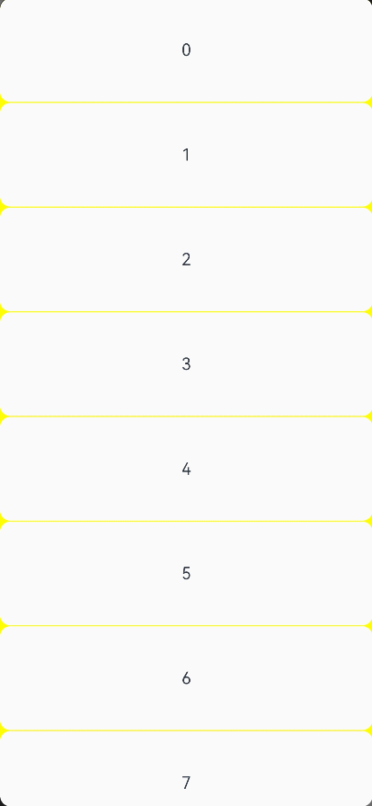

# ArkUI Subsystem Changelog

## cl.arkui.1 Removal of Padding Effect from List Scrollbar Margin

**Change Impact**

In versions earlier than API version 10, the scrollbar margin in the **\<List>** component is affected by padding. When padding is set for the component, the space of the scrollbar is squeezed inward.

Since API version 10, the scrollbar margin in the **\<List>** component fixed at 4 vp, not affected by padding.

## cl.arkui.2 Change of Space Reserved for Scrollbar Top and Bottom

**Change Impact**

Before change, the space reserved for the top and bottom of a vertical scrollbar (or left and right of a horizontal scrollbar) is fixed, as a result of which the scrollbar may be cut by the rounded corners of the scrollable container component.

After change, the space reserved for the top and bottom of a vertical scrollbar (or left and right of a horizontal scrollbar) is dynamically calculated based on the rounded corner radius of the scrollable container component. For example, when the rounded corner radius of a **\<Scroll>** component is 0, the space reserved for the top and bottom of its vertical scrollbar is 0, which means that the scrollbar can scroll to the bottom of the **\<Scroll>** component.

## cl.arkui.3 Change of position Attribute Effectiveness on Components with Width or Height of 0

**Change Impact**

In versions earlier than API version 10, if the width or height of a component is set to 0, the universal attribute **position** set for this component does not take effect.

Since API version 10, the universal attribute **position** set for this component still takes effect.

**Adaptation Guide**
If the layout of a component whose width or height is 0 changes due to the settings the **position** attribute, you can cancel the settings to keep the layout consistent with that before the change.

## cl.arkui.4 Change of itemAlign.Auto on \<Flex> Component

**Change Impact**

In versions earlier than 4.1.1.1, when **itemAlign.Auto** is set for the **\<Flex>** component, the component follows other components on the cross axis.

Since the 4.1.1.1 version, **itemAlign.Auto** is equivalent to **itemAlign.Start**.

## cl.arkui.1 Removal of ArkTS Widgets from Applicability of draggable in the \<Image> Component

**Change Level**

Public

**Reason for Change**

The **draggable** API of the **\<Image>** component is not supported in ArkTS widgets.

**Change Impact**

This change is a non-compatible change. After the **@form** tag is removed from the **draggable** API, the **draggable** API cannot be used for the **\<Image>** component in ArkTS widgets.

**API Level**

Since API version 9

**Key API/Component Changes**

Before change, the **draggable** API of the **\<Image>** component has the **@form** tag.

After change, the **draggable** API of the **\<Image>** component does not have the **@form** tag and cannot be used in ArkTS widgets.

**Adaptation Guide**

N/A (The **draggable** API of the **\<Image>** component is not supported in ArkTS widgets before and after change.)

## cl.Arkui.1 Changes in the Default QR Code Color, Background Color, and Size

**Change Impact**

In versions earlier than API version 11, the **\<QRCode>** component uses the following default settings: color: **Color.Black**; background color: **Color.White**; width and height: same as the parent component.


Since API version 11, the **\<QRCode>** component uses the following default settings: color: **ohos_id_color_foreground**; background color: **ohos_id_color_background**; width and height: 240 vp.

**Adaptation Guide**

For details, see [QRCode](../../../application-dev/reference/apis-arkui/arkui-ts/ts-basic-components-qrcode.md).

Example:
```ts
// xxx.ets
@Entry
@Component
struct QRCodeExample {
  private value: string = 'hello world'
  build() {
    Column() {
      QRCode(this.value)
    }.width('100%').height('100%')
  }
}
```
## cl.arkui.2 Changes to the \<Refresh> Component
**Change Impact**

1. Default refresh settings

In versions earlier than API version 11, child components of the **\<Refresh>** component do not move down with the pull-down gesture, and the edge bounce effect of the component is independent of the loading.



Since API version 11, child components of the **\<Refresh>** component move down with the pull-down gesture.


**Adaptation Guide**

For details, see [Refresh](../../../application-dev/reference/apis-arkui/arkui-ts/ts-container-refresh.md).

Example:

```ts
@Entry
@Component
struct RefreshExample {
  @State isRefreshing: boolean = false
  @State arr: String[] = ['0', '1', '2', '3', '4','5','6','7','8','9','10']

  build() {
    Column() {
      Refresh({ refreshing: $$this.isRefreshing}) {
        List() {
          ForEach(this.arr, (item: string) => {
            ListItem() {
              Text('' + item)
                .width('100%').height(100).fontSize(16)
                .textAlign(TextAlign.Center).borderRadius(10).backgroundColor(0xFFFFFF)
            }
          }, (item: string) => item)
        }
        .onScrollIndex((first: number) => {
          console.info(first.toString())
        })
        .width('100%')
        .height('100%')
        .divider({strokeWidth:1,color:Color.Yellow,startMargin:10,endMargin:10})
        .scrollBar(BarState.Off)
        .backgroundColor(Color.Yellow)
      }
      .onStateChange((refreshStatus: RefreshStatus) => {
        console.info('Refresh onStatueChange state is ' + refreshStatus)
      })
      .onRefreshing(() => {
        setTimeout(() => {
          this.isRefreshing = false
        }, 2000)
        console.log('onRefreshing test')
      })
      .backgroundColor(0x89CFF0)
    }
  }
}
```

2. Custom refresh settings with the builder API

In versions earlier than API version 11, the **\<Refresh>** component is embedded with child components, with a height not greater than 64 vp. The edge bounce effect of the scrolling component and the custom refresh style for the pull-down gesture take effect at the same time.


Since API version 11, child components of the **\<Refresh>** component move down with the pull-down gesture. There are no constraints on the height of the custom refresh component with the builder API.


**Adaptation Guide**

For details, see [Refresh](../../../application-dev/reference/apis-arkui/arkui-ts/ts-container-refresh.md).

Example:

```ts
// xxx.ets
@Entry
@Component
struct RefreshExample {
  @State isRefreshing: boolean = false
  @State arr: String[] = ['0', '1', '2', '3', '4','5','6','7','8','9','10']
  @Builder
  customRefreshComponent()
  {
    Stack()
    {
      Row()
      {
        LoadingProgress().height(32)
        Text("Refreshing..").fontSize(16).margin({left:20})
      }
      .alignItems(VerticalAlign.Center)
    }.width("100%").align(Alignment.Center)
  }

  build() {
    Column() {
      Refresh({ refreshing: $$this.isRefreshing,builder:this.customRefreshComponent()}) {
        List() {
          ForEach(this.arr, (item: string) => {
            ListItem() {
              Text('' + item)
                .width('100%').height(100).fontSize(16)
                .textAlign(TextAlign.Center).borderRadius(10).backgroundColor(0xFFFFFF)
            }
          }, (item: string) => item)
        }
        .onScrollIndex((first: number) => {
          console.info(first.toString())
        })
        .width('100%')
        .height('100%')
        .divider({strokeWidth:1,color:Color.Yellow,startMargin:10,endMargin:10})
        .scrollBar(BarState.Off)
        .backgroundColor(Color.Yellow)
      }
      .onStateChange((refreshStatus: RefreshStatus) => {
        console.info('Refresh onStatueChange state is ' + refreshStatus)
      })
      .onRefreshing(() => {
        setTimeout(() => {
          this.isRefreshing = false
        }, 2000)
        console.log('onRefreshing test')
      })
      .backgroundColor(0x89CFF0)
    }
  }
}
```

## cl.arkui.1 System Component Parent-Child Verification

Since API version 11, if the parent component of the following components is not as expected, a compilation error is reported: \<Blank>, \<FlowItem>, \<GridItem>, \<GridCol>, \<ListItem>, \<ListItemGroup>, \<Option>, \<Span>, \<StepperItem>, and \<TabContent>

**Example**

```
@Entry
@Component
struct Index {
  build() {
    Button(){
      Blank()
    }
  }
}
```

**Change Impact**

The parent component of the following components must be within **if**, **ForEach**, **LazyForEach**, or a method decorated by @Builder: \<Blank>, \<FlowItem>, \<GridItem>, \<GridCol>, \<ListItem>, \<ListItemGroup>, \<Option>, \<Span>, \<StepperItem>, and \<TabContent>. Otherwise, an error is reported during compilation.

```
// ArkTS:ERROR The 'Blank' component can only be nested in the 'Row,Column,Flex' parent component.
Button(){
      Blank()
    }
```

**Key API/Component Changes**

None

**Adaptation Guide**

For details, see [\<Blank>](../../../application-dev/reference/apis-arkui/arkui-ts/ts-basic-components-blank.md), [\<FlowItem>](../../../application-dev/reference/apis-arkui/arkui-ts/ts-container-flowitem.md), [\<GridItem>](../../../application-dev/reference/apis-arkui/arkui-ts/ts-container-griditem.md), [\<GridCol>](../../../application-dev/reference/apis-arkui/arkui-ts/ts-container-gridcol.md), [\<ListItem>](../../../application-dev/reference/apis-arkui/arkui-ts/ts-container-listitem.md), [\<ListItemGroup>](../../../application-dev/reference/apis-arkui/arkui-ts/ts-container-listitemgroup.md), \<Option>, [\<Span>](../../../application-dev/reference/apis-arkui/arkui-ts/ts-basic-components-span.md), [\<StepperItem>](../../../application-dev/reference/apis-arkui/arkui-ts/ts-basic-components-stepperitem.md), and [\<TabContent>](../../../application-dev/reference/apis-arkui/arkui-ts/ts-container-tabcontent.md).

## cl.arkui.2 Change of constraintSize Effectiveness for the \<Flex> Component in wrap Mode

Since API version 11, the **constraintSize** attribute takes effect on the cross axis when the **\<Flex>** component is in wrap mode.

**Example**

```
@Entry
@Component
struct ClipExample1 {
  @State message: string = 'Hello World'
  build() {
    Row() {
      Column() {
        Text(this.message)
          .fontSize(50)
          .fontWeight(FontWeight.Bold)
        Flex({wrap:FlexWrap.Wrap}) {
          Text('1').height(50).backgroundColor(Color.Gray)
          Text ('Seize the day').height (50).backgroundColor (Color.Gray)
          Text ('Seize the day and').height (50).backgroundColor (Color.Gray)
          Text('Seize the day and make every moment count').height(50).backgroundColor(Color.Gray)
          Text ('Seize the moment and make every').height (50).backgroundColor (Color.Gray)
          Text ('Seize the moment and make every').height (50).backgroundColor (Color.Gray)
          Text('Seize the day and make every moment count').height(50).backgroundColor(Color.Gray)
          Text('Seize the day and make every moment count').height(50).backgroundColor(Color.Gray)
          Text('1').height(50).backgroundColor(Color.Gray)
          Text('1').height(50).backgroundColor(Color.Gray)
          Text('1').height(50).backgroundColor(Color.Gray)
        }
        .clip(true)
        .backgroundColor(Color.Orange)
        .constraintSize({
          minHeight: 50,
          maxHeight: 150
        })
      }
      .width('100%')
    }.height('100%').width(300)
  }
}
```

**Change Impact**

Before the change, the height of the **\<Flex>** component is 200, which is not restricted by **maxHeight** in **constraintSize**. After the change, **constraintSize** settings take effect, with the minimum height of 50 and the maximum height of 150. The maximum and minimum width constraints take effect in the same way.

**Adaptation Guide**

If **wrap** is used and **constraintSize** is set on the **\<Flex>** component in previous versions, the settings should take effect. If the constraint is not required, remove **constraintSize** or adjust the constraint value.

## cl.arkui.3 Change in the currentOffset API of the \<Scroll> Component

**Change Impact**

The original return value **any** of the **currentOffset** API is inconvenient for intelligent code completion.

Since API version 11, the return value of the **currentOffset** API is **OffsetResult**.

## cl.arkui.1 Change to the padding API of the \<Flex> Component

**Access Level**

Public

**Reason for Change**

In previous versions, there is a sudden change of the child components in the **\<Flex>** container as its paddings along the main or cross axis increase to such an extent that the container width is exceeded.

**Change Impact**

This change is a compatible change.

Before change: When the container's paddings gradually increase along the main axis, the child components suddenly move rightward once the container width is exceeded. (The same applies to padding increase along the cross axis.)

Before change: When the container's paddings gradually increase along the main axis, the child components gradually move rightward until they disappear as the container width is exceeded. (The same applies to padding increase along the cross axis.)

**Change Since**

OpenHarmony SDK 4.1.2.5

**Key API/Component Changes**

**\<Flex>** component

**Adaptation Guide**

If the sum of paddings does not cause the width or height of the component to be exceeded, no adaptation is required. Since API version 11, if the child components become invisible due to excessively large paddings, maintain the same effect for padding increase.

## cl.arkui.1 Change in minWidth of constraintSize

**Access Level**

Public

**Reason for Change**

An error occurs when **minWidth** of **constraintSize** is used on API version 10 or earlier versions. Therefore, **minWidth** must be confined to API version 11 and later versions.

**Change Impact**

This change is a non-compatible change.

**Change Since**

OpenHarmony SDK 4.1.3.1

**\<Flex>** component

Before change: **minWidth** of **constraintSize** can be used on API version 10.

After change: **minWidth** of **constraintSize** work only when the API version is 11 or later.  

**Adaptation Guide**

If the SDK of API version 10 or earlier is used, and **minWidth** of **constraintSize** is used to restrict the component's minimum width, you must modify the code. If the component width changes to one less than the value specified by **minWidth**, the component width is directly used.
 

## Changes of Default Focus Behavior

Changed the default focus used when **defaultFocus** is not set.

Versions earlier than API version 11: The default focus is given to the first focusable non-container component on the current page.

API version 11 and later versions: The default focus is given to the root container of the current page.

**Change Impact**

If the **defaultFocus** attribute is not set, the first focusable non-container component on a page will not obtain focus immediately when the page opens for the first time. Instead, it is the root container of the page that obtains the focus.

For example:
1. Here is a page whose first focusable non-container component is a text box, and no component on the page is bound to the **defaultFocus** attribute.

   Versions earlier than API version 11: When the page opens, the text box obtains focus and starts the input method.

   API version 11 and later versions: When the page opens, the text box does not obtain focus and therefore the input method is not started. The user needs to press the Tab key to focus the text box.

2. Assume that the **onKeyEvent** event is bound to the first focusable non-container component on the page to listen for the key events on the component.
   
   Versions earlier than API version 11: When the page opens, the component is focused by default; the **onKeyEvent** callback can respond to key events on the component without any other operation required.

   API version 11 and later versions: When the page opens, the component is not focused; the **onKeyEvent** callback can respond to key events on the component only after the user presses the Tab key to enable the component to obtain focus.


**Adaptation Guide**

To achieve the before-change results, bind the **defaultFocus(true)** attribute to the target component to enable the target component to become the default focus on the page. In this way, when the page opens for the first time, the focus is automatically given to the first component bound to the **defaultFocus(true)** attribute.


## Changes of the Soft Keyboard Interaction Behavior in Text Box Components

When the text box is focused, the input method is started. The soft keyboard of the input method can be closed by touching either the inverted triangle button or the EnterKey button on the keyboard.

Versions earlier than API version 11: When either of the aforementioned button is touched, the soft keyboard is closed, and the text box component remains focused.

API version 11 and later versions: When either of the aforementioned button is touched, the soft keyboard is closed, and the text box component loses focus.

The following text box components are affected: **\<TextInput>**, **\<TextArea>**, **\<Search>**, and **\<RichEditor>**.

**Change Impact**

Logical behavior that affects the focus:

Versions earlier than API version 11: After a button is touched, the text box is still in the focused state. In this case, the **onKeyEvent** event on the text box can still be properly responded to. The application switches from the background to the foreground and starts the input method again. The user can press the Tab key to move the focus to the next component.

API version 11 and later versions: After a button is clicked, the text box loses focus immediately. In this case, the **onKeyEvent** event on the input box cannot respond to. The input method is not started again when the application is in the foreground. Pressing the Tab key enables the text box to obtain focus again, rather than moves the focus to the next component.

**Adaptation Guide**

N/A

## Change of the \<Checkbox> Component's Default Shape

Changed the **\<Checkbox>** component's default shape used when the **shape** attribute is not set.

**Change Impact**

Default shape policy:

API version 11 and later versions: The **\<Checkbox>** component's default shape is circle.

Versions earlier than API version 11: The **\<Checkbox>** component's default shape is rounded square.

**Adaptation Guide**

If you would like the **\<Checkbox>** component in the rounded square shape, bind the **shape(CheckBoxShape.ROUNDED_SQUARE)** attribute to the component.


## Resource Verification Level Change of the rawfile File

**Access Level**

Resources referenced in **$rawfile()**

**Change Impact**

When **$rawfile()** references a resource that does not exist, an ERROR message, instead of a WARN message in previous versions, is reported.

**Change Since**

OpenHarmony SDK 4.1.3.2

**Example**

```
@Entry
@Component
struct Index {
  build() {
    Button(){
      // ERROR: No such 'app_icon.ong' resource in current module.
      Image($rawfile('app_icon.png'))
    }
  }
}
```

**Key API/Component Changes**

N/A

**Adaptation Guide**

N/A

## cl.arkui.1 Optimization of Coordinates in Gesture Event Return Value

**Access Level**

Public

**Reason for Change**

In earlier versions, after a component is translated, rotated, or scaled, the coordinates returned from the event are incorrect and cannot be mapped to the coordinate system.

**Change Impact**

The returned coordinates can be mapped to the coordinate system.

**Change Since**

OpenHarmony SDK 4.1.3.3

**Key API/Component Changes**

* **offsetX**, **offsetY**, **pinchCenterX**, **pinchCenterY**, and **speed** in **GestureEvent**

* **localX** and **localY** in **FingerInfo**

* **x** and **y** in **ClickEvent**

* **x** and **y** in **TouchObject**

**Adaptation Guide**

N/A

## cl.ArkUI.2 Change to the selectBackgroundColor Attribute of the \<TextInput> Component

**Access Level**
Public

**Reason for Change**
If the **ResourceColor** value of **selectedBackgroundColor** does not have the opacity specified, text will be masked when selected.

**Change Impact**
This change is a compatible change. If the **ResourceColor** value of **selectedBackgroundColor** does not have the opacity specified, a 20% opacity will be used.

**Change Since**
OpenHarmony SDK 4.1.3.3

**Key API/Component Changes**
**selectedBackgroundColor** attribute of the **\<TextInput>** component

**Adaptation Guide**
N/A

## cl.ArkUI.3 Change to the Default Behavior for the animationDuration Attribute of the \<Tabs> Component

**Access Level**

Public

**Reason for Change**

The **\<Tabs>** component's **animationDuration** attribute did not exhibit consistent default behaviors:
If **animationDuration** is not set, no tab switching animation is displayed when a specific tab is clicked; if it is set to a value less than 0, a tab switching animation is displayed when a specific tab is clicked, and the default value 300 ms is used.

**Change Impact**

This change is a non-compatible change.
In API version 10 and earlier versions, if **animationDuration** is not set, no tab switching animation is displayed when a specific tab is clicked.
Since API version 11, if **animationDuration** is not set, a tab switching animation is displayed when a specific tab is clicked, and the default value 300 ms is used.

**Change Since**

OpenHarmony SDK 4.1.3.3

**Key API/Component Changes**

**animationDuration** attribute of the **\<Tabs>** component

**Adaptation Guide**

Before the change, if you do not want to display a tab switching animation when a specific tab is clicked, set **animationDuration** to **0** or do not set it at all.
After the change, if you do not want to display a tab switching animation when a specific tab is clicked:<br>API version 11 or later: Set **animationDuration** to **0**.<br>API version 10 or earlier: Set **animationDuration** to **0** or do not set it at all.

## cl.ArkUI.4 Change to the padding Attribute of the \<TextInput> Component

**Access Level**

Public

**Reason for Change**

When **padding** is set to **{left:10vp}**, the top, bottom, and right paddings are at 0, instead of at their default values.

**Change Impact**

This change is a non-compatible change. When **padding** is set to **{left:10vp}**, the top, bottom, and right paddings are at their default values, which are 16 vp, 16 vp, and 8 vp, respectively.

**Change Since**

All versions

**Key API/Component Changes**

**padding** attribute of the **\<TextInput>** component

**Adaptation Guide**

If you want to set the left padding of the **\<TextInput>** component to 10 vp and other paddings to 0, set **padding** to **{left:10vp, right:0vp, top:0vp, bottom:0vp}**. If the padding for a specific direction is not specified, the default value is used.

## cl.ArkUI.5 Change to the Line Height of the \<Text> component

**Access Level**

Other

**Reason for Change**

The line height of the **\<Text>** component must be the same as the font size, instead of being fixed at 14 px.

**Change Impact**

This change is a non-compatible change.

In API version 10 and earlier versions, when **fontSize('20px')** is set, the line height of the **\<Text>** component is 14 px, and the line height of its child component **\<Span>** is also fixed at 14 px.

Since API version 11, when **fontSize('20px')** is set, the line height of the **\<Text>** component is 20 px, and the line height of its child component **\<Span>** is fixed at 14 px.

**Change Since**

OpenHarmony SDK 4.1.3.3

**Key API/Component Changes**

**\<Text>** component

**Adaptation Guide**

N/A

## cl.ArkUI.6 Bug Fix for scrollTo Calls in the Scroller

**Access Level**

Public

**Reason for Change**

 This change is made to fix the following bug: When the scroller calls the **scrollTo** method, if the scrolling distance of the **\<Grid>** component is beyond the current page height along the main axis, the target position has an error of **rowsGap** multiplied by number of rows.  

**Change Impact**

This change is a compatible change. After change, a **scrollTo** method call will scroll the **\<Grid>** component to a more precise position.

**API Level**

7

**Change Since**

OpenHarmony 4.1.3.3

**Key API/Component Changes**

**\<Grid>** component

 

**Adaptation Guide**

N/A

## cl.ArkUI.1 Behavior Changes of Component Pressed State

**Access Level**
Public

**Reason for Change**
The change is made to optimize the pressed state style in the polymorphic style attribute.

**Change Impact**
This change is a compatible change. This change affects the validation or cancellation of the pressed state in the polymorphic style attribute.

**Change Since**
OpenHarmony SDK 4.1.3.3

**Key API/Component Changes**

In versions earlier than API version 11:

* A component enters the pressed state when touched, and remains in this state, even after the user's finger leaves the component touch target, until the finger is lifted.
* If the component is touched with multiple fingers, it remains in the pressed state until some of the fingers are lifted.
* If a component is placed in a scroll container component (such as **\<List>**), it will enter the pressed state when swiped on, and then immediately exit that state.

Since API version 11:

* A component enters the pressed state when touched and remains in this state until the user's finger leaves the component touch target.
* If the component is touched with multiple fingers, it remains in the pressed state until all of the fingers are lifted.
* If a component is placed in a scroll container component (such as **\<List>**), it will not enter the pressed state when swiped on.

**Adaptation Guide**
N/A

##  cl.arkui.1 Change in Check Rules on the \<Scroll> Component

**Access Level**

Public

**Reason for Change**

The [\<Scroll>](../../../application-dev/reference/apis-arkui/arkui-ts/ts-container-scroll.md) component supports a single child component. To prevent multiple child components from being added, a check rule is added to the compiler to warn of such attempts.

**Change Impact**

This change is a non-compatible change. The new check rule does not affect the layout or behavior of the **\<Scroll>** component.

**Change Since**

OpenHarmony SDK 4.1.3.5

**Key API/Component Changes**

Scroll

**Adaptation Guide**

Make sure the **\<Scroll>** component contains only one child component.

##  cl.arkui.2 Determination of the Cross Axis Size and stretch Alignment Mode in the \<Flex> Component

**Access Level**

Public

**Reason for Change**

In the **\<Flex>** container, the priority of the child component size is higher than that of the **stretch** alignment mode along the cross axis. If both are set, only the cross axis size of the child component takes effect.

**Change Impact**

This change is a compatible change.

API version 9 and earlier versions: If both the child component size and the **stretch** alignment mode are set for the cross axis, the cross axis size of the child component does not take effect.

API version 10 and later: If both the child component size and the **stretch** alignment mode are set for the cross axis, the **stretch** alignment mode does not take effect.

**Change Since**

OpenHarmony SDK 4.1.3.5

**Key API/Component Changes**

**\<Flex>** component

**Adaptation Guide**

To make the **stretch** alignment mode for the cross axis take effect, remove the cross axis size settings of the child component.

## cl.arkui.1 Change in Axis Event Response Capability

**Access Level**

Public

**Reason for Change**

The response of the mouse wheel and the touchpad to the swipe and pan gestures is improved, and the conflict between swipe events in different directions is resolved.

**Change Impact**

This change is a compatible change and does not involve API changes. However, due to changes in the response logic, response to the swipe and scroll events may be affected.

**Change Since**

OpenHarmony SDK 4.1.5.1

**Key API/Component Changes**

APIs: **PanGesture** and **SwipeGesture**

Components: **\<List>**, **\<Grid>**, **\<Scroll>**, and any other components that can be scrolled by using the mouse wheel

**Adaptation Guide**

Before change:

No matter how many swipe events occur in the area where the mouse pointer is located, the mouse wheel and the touchpad's two-finger functionality can respond only to the first swipe event bound to the first child node. If this swipe event is in the horizontal direction, it can be triggered with the mouse wheel or by swiping with two fingers horizontally or vertically on the touchpad. If this swipe event is in the vertical direction, it can be triggered with the mouse wheel or by swiping with two fingers vertically on the touchpad.

Example 1: A horizontal swipe event is bound to or built in a component. When the mouse pointer is located in the component area, scrolling the mouse wheel or swiping with two fingers horizontally or vertically on the touchpad can both trigger the event.

Example 2: A vertical swipe event is bound to or built in a component. When the mouse pointer is located in the component area, scrolling the mouse wheel or swiping with two fingers vertically on the touchpad can both trigger the event.

Example 3: A vertical swipe event is bound to or built in the parent component, and a horizontal swipe event is bound to or built in the child component. When the mouse pointer is in the area of the child component (also in the area of the parent component), operations with the mouse wheel and the touchpad trigger the event on the child component, but not on the parent component.

After change:

When there is only a horizontal swipe event in the area in which the mouse pointer is located, the first swipe event on the first child node may be triggered by with the mouse wheel, Shift+mouse wheel, or two fingers swiping horizontally on the touchpad.

When there is only a vertical swipe event in the area in which the mouse pointer is located, the first swipe event on the first child node may be triggered by with the mouse wheel or two fingers swiping vertically on the touchpad.

When there is a horizontal swipe event and a vertical swipe event in the area in which the mouse pointer is located, the first vertical swipe event on the first child node may be triggered with the mouse wheel or two fingers swiping vertically on the touchpad, while first horizontal swipe event may be triggered with Shift+mouse wheel or two fingers swiping horizontally on the touchpad.

In all the preceding scenarios, the two-finger operation on the touchpad does not the Shift button. This means that, pressing the Shift button does not affect event response.

Example 1: Scrolling the mouse wheel, scrolling the mouse wheel while pressing Shift, or swiping horizontally with two fingers on the touchpad can trigger the event.

Example 2: Scrolling the mouse wheel or swiping vertically with two fingers on the touchpad can trigger the event.

Example 3: Scrolling the mouse wheel or swiping vertically with two fingers on the touchpad can trigger the event on the parent component. Scrolling the mouse wheel while pressing Shift or swiping horizontally with two fingers on the touchpad can trigger the event on the child component.
## cl.arkui.2 Change in showActionMenu of UIContext

**Access Level**

Public

**Reason for Change**

The **callback** parameter type of the **showActionMenu** API of UIContext was incorrectly defined. As a result, the callback function was unavailable.

**Change Impact**

This change is a non-compatible change and involves API changes. The original API with the incorrectly defined **callback** parameter is no longer available.

**Change Since**

OpenHarmony SDK 4.1.5.1

**Key API/Component Changes**

**showActionMenu** API of **UIContext**

**Adaptation Guide**

Before change:

The data type of the **callback** parameter is **promptAction.ActionMenuSuccessResponse**, which is a data object. If **promptAction.ActionMenuSuccessResponse** is passed in according to the API definition, the API does not work.

```ts
import { PromptAction, UIInspector } from '@ohos.arkui.UIContext';
import promptAction from '@ohos.promptAction';
import { BusinessError } from '@ohos.base';

let promptActionF: PromptAction = uiContext.getPromptAction();
try {
    promptActionF.showActionMenu({
      title: 'Title Info',
      buttons: [
        {
          text: 'item1',
          color: '#666666'
        },
        {
          text: 'item2',
          color: '#000000'
        }
      ]
    },  (data:promptAction.ActionMenuSuccessResponse))
} catch (error) {
  let message = (error as BusinessError).message;
  let code = (error as BusinessError).code;
  console.error(`showActionMenu args error code is ${code}, message is ${message}`);
};
```

After change:

The data type of the **callback** parameter is AsyncCallback&lt;[promptAction.ActionMenuSuccessResponse](../../../application-dev/reference/apis-arkui/js-apis-promptAction.md#actionmenusuccessresponse)&gt, which indicates a callback method. If AsyncCallback&lt;[promptAction.ActionMenuSuccessResponse](../../../application-dev/reference/apis-arkui/js-apis-promptAction.md#actionmenusuccessresponse)&gt; is passed in, the API works properly.

```ts
import { PromptAction, UIInspector } from '@ohos.arkui.UIContext';
import promptAction from '@ohos.promptAction';
import { BusinessError } from '@ohos.base';

let promptActionF: PromptAction = uiContext.getPromptAction();
try {
    promptActionF.showActionMenu({
      title: 'Title Info',
      buttons: [
        {
          text: 'item1',
          color: '#666666'
        },
        {
          text: 'item2',
          color: '#000000'
        }
      ]
    }, (err:BusinessError, data:promptAction.ActionMenuSuccessResponse) => {
        if (err) {
        console.info('showDialog err: ' + err);
        return;
        }
        console.info('showDialog success callback, click button: ' + data.index);
    });
} catch (error) {
    let message = (error as BusinessError).message;
    let code = (error as BusinessError).code;
    console.error(`showActionMenu args error code is ${code}, message is ${message}`);
};
```
## cl.arkui.3 Change in Calculating the Size of the \<RelativeContainer> Component

**Access Level**

Public

**Reason for Change**

If both the component size and size constraints are set, the component size set is preferentially used. Since API version 11, the **bias** attribute is added to set the offset of the component under constraints.

**Change Impact**

Before change, if both the component size and size constraints are set, the size constraints are preferentially used to determine the component size.<br>After change, the component size set is preferentially used.

**Change Since**

OpenHarmony SDK 4.1.5.1 (API version 11 and later)

**Key API/Component Changes**

\<RelativeContainer>

## cl.arkui.1 Change in the Default Background Effect of Menus

**Access Level**

Public

**Reason for Change**

The change is made to enhance visual effects.

**Change Impact**

This change is a compatible change. In unified rendering mode, the default background of the menu is changed to a blur material.

**API Level**

11 

**Change Since**

OpenHarmony SDK 4.1.52

**Key API/Component Changes**

**bindMenu**, **bindContextMenu**, **<\Select>**, **<\Navigation>**

- Before change: The menu background is in white.
- After change: The menu background has a blur style applied.

**Adaptation Guide**

No adaptation is required.


## cl.arkui.2 New Sheet Types

**Access Level**

Public

**Reason for Change**

The change is made to enhance visual effects.

**Change Impact**

This change is a compatible change.

a. When the device width is less than 600 vp, the sheet is presented as a bottom sheet by default.

b. When the device width is in the 600-840 vp range, the sheet is presented as a center sheet by default.

c. When the device width is greater than 840 vp, the sheet is presented as a popup sheet by default, displayed under the node bound to through **bindSheet**.

**API Level**

11

**Change Since**

OpenHarmony SDK 4.1.5.2

**Key API/Component Changes**

bindSheet

**Adaptation Guide**

For a device whose width is greater than 840 vp, to display a center sheet, set **preferType** in **SheetOptions** to **SheetType.CENTER**.


## cl.arkui.3 Change in the Style of the Bottom Sheet

**Access Level**

Public

**Reason for Change**

The change is made to enhance visual effects.

**Change Impact**

This change is a compatible change.

a. With **SheetSize** in **SheetOptions** of the bottom sheet set to **Medium**, the sheet height is the screen height multiplied by 0.6.

b. The **FIT_CONTENT** option is added to **SheetSize** in **SheetOptions** for the bottom sheet. This option enables the sheet to adapt its height based on the content.

c. You can use **detents** in **SheetOptions** to specify an array of heights where the sheet can rest. This attribute takes effect only for the bottom sheet in portrait mode.

d. When the device is in landscape mode, the bottom sheet supports only one detent - 8 vp away from the top of the screen.

e. When the height of the content area builder is set to a percentage, the percentage is based on the height set or the value of **detents**, not the screen height.

**API Level**

11

**Change Since**

OpenHarmony SDK 4.1.5.2

**Key API/Component Changes**

bindSheet

**Adaptation Guide**

a. When **detents** in **SheetOptions** is set, the first height in the tuple is the initial height.

b. When **detents** is set in **SheetOptions**, the **height** attribute does not take effect.

c. When **height** is set to a custom height or **FIT_CONTENT**, the maximum height is used if the height set is greater than the maximum height or less than **0**.


## cl.arkui.4 Addition of the Center and PopUp Sheet Types

**Access Level**

Public

**Reason for Change**

The change is made to enhance visual effects.

**Change Impact**

This change is a compatible change.

a. The default width and height of the center sheet are 480 vp and 560 vp, respectively.

b. If a center sheet has fixed content, you can customize its height, 320 vp at minimum and length of the shorter edge of the device multiplied by 0.9 at maximum.

c. The center sheet does not resize when switched between landscape and portrait modes.

d. The default width and height of the popup sheet are 360 vp and 560 vp, respectively.

e. If a popup sheet has fixed content, you can customize its height, 320 vp at minimum and length of the shorter edge of the device multiplied by 0.9 at maximum.

**API Level**

11

**Change Since**

OpenHarmony SDK 4.1.5.2

**Key API/Component Changes**

bindSheet

**Adaptation Guide**

When **height** is set to a custom height or **FIT_CONTENT**, the maximum height is used if the height set is greater than the maximum height; the minimum height is used if the height set is less than the minimum height; the default height is used if the height set is a negative value.


## cl.arkui.5 Change in the Sheet Operation Area

**Access Level**

Public

**Reason for Change**

The change is made to enhance visual effects.

**Change Impact**

This change is a compatible change.

a. A title area is added to accommodate the title specified in **SheetOptions**. This area is 56 vp high for a single-line or custom title and 72 vp high for a double-line title.

b. You can specify whether to show a close icon through **showClose** in **SheetOptions**. By default, the icon is displayed.

c. The size of the drag bar is changed to 48 x 4 vp. The drag bar is not displayed when sheet has only one detent and is displayed by default when sheet has multiple detents.

d. The drag bar does not move slightly in the x or y direction when dragged.

**API Level**

11

**Change Since**

OpenHarmony SDK 4.1.5.2

**Key API/Component Changes**

bindSheet

**Adaptation Guide**

None.


## cl.arkui.6 Change in the Interaction with the Sheet Content Area

**Access Level**

Public

**Reason for Change**

The change is made to enhance the interaction experience.

**Change Impact**

This change is a compatible change.

a. With a bottom sheet that has its content displayed on the top, swiping up expands the sheet (if multiple detents are available) or scrolls the content; swiping down shrinks (if multiple detents are available) or closes the sheet.

b. With a bottom sheet that has its content displayed at the bottom, swiping up produces a bounce effect in the content area, without switching the sheet between detents; swiping down scrolls the content until it reaches the top.

c. With a bottom, center, or popup sheet that has its content displayed in the center, swiping up or down scrolls the content until it reaches the bottom or top, without switching the sheet between detents.

d. With a center sheet that has its content displayed on the top, swiping down closes the sheet; swiping up scrolls the content. With a center sheet that has its content displayed at the bottom, swiping up produces a bounce effect in the content area; swiping down scrolls the content.

e. With a popup sheet that has its content displayed on the top, swiping down does not close the sheet; swiping up scrolls the content. With a popup sheet that has its content displayed at the bottom, swiping up produces a bounce effect in the content area; swiping down scrolls the content.

**API Level**

11

**Change Since**

OpenHarmony SDK 4.1.5.2

**Key API/Component Changes**

bindSheet

**Adaptation Guide**

None.


## cl.arkui.7 Change in the Interaction with the Sheet Title Area

**Access Level**

Public

**Reason for Change**

The change is made to enhance the interaction experience.

**Change Impact**

This change is a compatible change.

a. Swiping up in the title area of a bottom sheet switches the sheet to the adjacent larger detent; dragging up the title area switches the sheet straight to the largest detent; if the sheet is already at its largest detent, it produces a bounce effect.

b.Swiping down in the title area of a bottom sheet switches the sheet to the adjacent smaller detent; dragging down the title area switches the sheet across detents and even closes it.

c. Swiping up in the title area of a center sheet produces a bounce effect; swiping down with a velocity lower than the threshold also produces a bounce effect; dragging down or swiping down with a velocity higher than the threshold closes the sheet.

**API Level**

11

**Change Since**

OpenHarmony SDK 4.1.5.2

**Key API/Component Changes**

bindSheet

**Adaptation Guide**

None.


## cl.arkui.8 Change in Modes for Dismissing a Sheet

**Access Level**

Public

**Reason for Change**

The change is made to enhance the interaction experience.

**Change Impact**

This change is a compatible change.

a. A sheet can be dismissed by touching the mask. By default, the bottom and center sheets have a mask, and the popup sheet has no mask.

b. A sheet can be dismissed by touching the close icon.

c. A bottom or center sheet can be dismissed by a pull-down gesture.

d. The **shouldDismiss** callback is added to **SheetOptions**. With the callback registered, when the user attempts to dismiss the sheet by a pull-down gesture or clicking the back button, the mask, or the close icon, the sheet is not dismissed immediately.

**API Level**

11

**Change Since**

OpenHarmony SDK 4.1.5.2

**Key API/Component Changes**

bindSheet

**Adaptation Guide**

None.

## cl.arkui.1 Display Effect Change of the alignment Parameter in the \<DatePickerDialog>, \<TimePickerDialog>, and \<TextPickerDialog> Components

**Access Level**

Public

**Reason for Change**

Specification optimization.

**Change Impact**

This change is a compatible change.

In **\<DatePickerDialog>**, **\<TimePickerDialog>**, and **\<TextPickerDialog>** components, the **alignment** parameter to adjust the position of the picker dialog box relative to the window. The affected scenarios are as follows:

(a) **alignment** is set to **Top**, **TopStart**, or **TopEnd**

Before change: There is a default spacing of 40 vp between the picker dialog box and the top of the window.

After change: The spacing between the picker dialog box and the top of the window is 0.

(b) **alignment** is set to **Bottom**

Before change: There is a default spacing of 16 vp between the picker dialog box and the bottom of the window.

After change: The spacing between the picker dialog box and the bottom of the window is 0.

(c) **alignment** is set to **Center**

Before change: There is an upward offset of 16 vp relative to the center of the window.

After change: The picker dialog box is in the center of the window

**API Level** 

11

**Change Since**

OpenHarmony SDK 4.1.5.3

**Key API/Component Changes**

**\<DatePickerDialog>**, **\<TimePickerDialog>**, and **\<TextPickerDialog>**

**Adaptation Guide**

If you want to set the spacing between the picker dialog box and window edges, use **offset** together with **alignment**.

## cl.arkui.2 Renaming of the buttonMargin and textMargin APIs for the \<SegmentButton> Component

**Access Level**

Public

**Reason for Change**

The original API names do not convey the actual functionality of the APIs.

**Change Impact**

This change is a non-compatible change. The APIs for setting the button and text paddings in the **\<SegmentButton>** component are renamed as follows:

(a) API for setting the button padding

Before change: **buttonMargin**

After change: **buttonPadding**

(b) API for setting the text padding

Before change: **textMargin**

After change: **textPadding**

**Change Since**

OpenHarmony SDK 4.1.5.3

**Key API/Component Changes**

SegmentButton

**Adaptation Guide**

Before change:

The APIs for setting the button and text paddings in the **\<SegmentButton>** component are **buttonMargin** and **textMargin**, respectively.

After change:

The APIs for setting the button and text paddings in the **\<SegmentButton>** component are **buttonPadding** and **textPadding**, respectively.

## cl.arkui.3 Default Value Change for IconOptions.size of cancelButton in the \<TextInput> Component

**Access Level**

Public

**Reason for Change**

If the **IconOptions.size** parameter is not set in the **cancelButton** API, the image size obtained is different from the actual one.

**Change Impact**

This change is a non-compatible change. If the **IconOptions.size** parameter is not set in the **cancelButton** API, the image size obtained is as follows:

Before change: 0.00 px

After change: 24.00 vp

**Change Since**

OpenHarmony SDK 4.1.5.3

**Key API/Component Changes**

TextInput

**Adaptation Guide**

N/A

## cl.arkui.4 Change in the @Prop and @BuilderParam Initialization Validation Specification

**Access Level**

Public

**Reason for Change**

The initialization validation specification for @Prop and @BuilderParam is changed to cover the case where they are used with @Require.

**Change Impact**

This change is a compatible change. Specifically, when the @Require decorator is used together with the @Prop or @BuilderParam decorator, the @Prop or @BuilderParam decorated variable must have its initial value passed from the parent component. If the parent component does not pass in any value, a compilation error occurs. This check for initialization from the parent component is not conducted if the @Prop or @BuilderParam decorator is not used with @Require.

**Change Since**

OpenHarmony SDK 4.1.5.3

**Example**

```
@Entry
@Component
struct Index {
  build() {
    Row() {
      Child()
    }
  }
}

@Component
struct Child {
  // ERROR: Property buildText must be initialized through the component constructor.
  @Require @BuilderParam buildText: () => void;
  // ERROR: Property initBuildText must be initialized through the component constructor.
  @Require @BuilderParam initBuildText: () => void = buildFuction;
  // ERROR: Property message must be initialized through the component constructor.
  @Require @Prop message: string = 'Hello';
  // ERROR: Property initMessage must be initialized through the component constructor.
  @Require @Prop initMessage: string;
  // Remove the error message: ERROR: Property 'chindProp' in the custom component 'Child' is missing assignment or initialization.
  @Prop chindProp: string;
  // Remove the error message: ERROR: Property 'chindBuildParam' in the custom component 'Child' is missing assignment or initialization.
  @BuilderParam chindBuildParam: () => void;

  build() {
  }
}

@Builder
function buildFuction() {
}
```

**Key API/Component Changes**

None

**Adaptation Guide**

When the \@Require decorator is used together with the \@Prop or \@BuilderParam decorator, the \@Prop and \@BuilderParam decorated variable must have a value passed from the parent component during construction of the owning component.


## cl.arkui.5 Change in the Popup Style and Avoidance Logic Specifications

**Access Level**

Public

**Reason for Change**

The UX capability is enhanced.

**Change Impact**

This change is a compatible change.

1. If the popup background color is not set, the default background color is used with a blur effect applied.

2. The following 12 alignment modes are added:

Top: TopLeft/Top/TopRight

Bottom: BottomLeft/Bottom/BottomRight

Left: LeftTop/Left/LeftBottom

Right: RightTop/Right/RightBottom

3. Avoidance rules (popup relative to the parent component area)

(1) Popup in the preset direction

If space allows, the system displays the popup in the area specified by the location attribute (if it is set, the default value is used).

(2) Popup in the auto-adjusted direction (based on the alignment mode)

If space does not allow, the following rules are employed for display: 1. Flip the popup in the opposite direction (for example, above to below or left to right). 2. Try more directions: - If the space in the vertical direction is insufficient, try the horizontal direction (right or left). - If the space in the horizontal direction is insufficient, try the vertical direction (down or up). 3. If there is no sufficient space in adjacent directions, cover the component that revealed the popup with center alignment. - This behavior affects availability and should be avoided whenever possible.

In display of popups, you do not need to consider the safe area. The area where they are not displayed follows the popup direction of the parent component.

**API Level**

11

**Change Since**

OpenHarmony SDK 5.2

**Key API/Component Changes**

None

**Adaptation Guide**

1. Customize the background color based on user requirements.

2. Perform adaptation based on avoidance rules.

## cl.arkui.1 Display Effect Change for the showTips Method of the \<Slider> Component

**Access Level**

Public

**Reason for Change**

This change is a compatible change, which involves how the tooltip is displayed for the **\<Slider>** component.

**Change Impact**

The **showTips** method of the **\<Slider>** component is affected. This method has two parameters: The first parameter of the Boolean type indicates whether to display a tooltip; the second parameter of the ResourceStr type indicates the text content of the tooltip.
The affected scenarios are as follows:

- Style of the tooltip when the first parameter of **showTips** is set to **true**

Before change


After change


- Width of the text content specified by the second parameter of **showTips**

Before change: The text can be displayed in multiple lines in full based on the grid width.

After change: The text is displayed in a single line, with the maximum width of 36 vp. That is, a maximum of four digits can be displayed.

**API Level**

7

**Change Since**

OpenHarmony SDK 4.1.5.5

**Key API/Component Changes**

\<Slider>

**Adaptation Guide**

N/A

## cl.Arkui.2 Change in the Default Colors of the \<Progress> Component

**Access Level**

Public

**Reason for Change**

The original default colors of the **\<Progress>** component do not comply with the UX specifications.

**Change Impact**

This change is a compatible change. It delivers a more visually appealing component.

**API Level**

8

**Change Since**

OpenHarmony SDK 4.1.5.5

**Key API/Component Changes**

**NOTE**<br>The color values listed below refer to the resource IDs in the system.<br>In versions earlier than API version 11: The default colors of the capsule-style progress indicator are as follows: foreground color: **ohos_id_color_emphasize_contrary**; border: **ohos_id_color_emphasize_contrary**. The default background color of the ring-style progress indicator is **ohos_id_color_component_normal**.

Since API version 11: The default colors of the capsule-style progress indicator are as follows: foreground color: **ohos_id_color_emphasize**; foreground color opacity: **ohos_id_alpha_highlight_bg**; border: **ohos_id_color_emphasize**; border opacity: **ohos_id_alpha_highlight_bg**. The default background color of the ring-style progress indicator is **ohos_id_color_button_normal**.

**Adaptation Guide**

N/A

## cl.Arkui.3 Change in the Default Colors of the \<LoadingProgress> Component

**Access Level**

Public

**Reason for Change**

The original default foreground color of the **\<LoadingProgress>** component does not comply with the UX specifications.

**Change Impact**

This change is a compatible change. It delivers a more visually appealing component.

**API Level**

8

**Change Since**

OpenHarmony SDK 4.1.5.5

**Key API/Component Changes**

In versions earlier than API version 11: The default foreground color opacity is **0.6**, and the default foreground color is **#99666666**.

Since API version 11: The default foreground color opacity is **1.0**, and the default foreground color is **#ff666666**.

**Adaptation Guide**

N/A

## cl.arkui.4 Change in the Default Behavior for the colorFilter Attribute of the \<Image> Component

**Access Level**

Public

**Reason for Change**

The change is made to meet user expectations.

**Change Impact**

This change is a non-compatible change.

Before change: When the **colorFilter** attribute of the **\<Image>** component is set to an invalid value, no operation is performed.

After change: When the **colorFilter** attribute of the **\<Image>** component is set to an invalid value, the system uses a value that represents a $4 \times 5$ matrix with entries of $1$ on the diagonal and entries of $0$ in other places.

**API Level**

11

**Change Since**

OpenHarmony SDK 4.1.5.5

**Key API/Component Changes**

**\<Image>** component

**Adaptation Guide**

N/A

## cl.arkui.5 Change in the Default Behavior for the fillColor Attribute of the \<Image> Component

**Access Level**

Public

**Reason for Change**

The change is made to meet user expectations.

**Change Impact**

This change is a non-compatible change.

Before change: When the **fillColor** attribute of the **\<Image>** component is set to an invalid value, no operation is performed.

After change: When the **fillColor** attribute of the **\<Image>** component is set to an invalid value, the system uses the default value.

**API Level**

11

**Change Since**

OpenHarmony SDK 4.1.5.5

**Key API/Component Changes**

**\<Image>** component

**Adaptation Guide**

N/A


## cl.Arkui.6 Change in the Default Shadow Blur Radius of the \<Datapanel> Component

**Access Level**

Public

**Reason for Change**

The original default shadow blur radius, 5 vp, is too small to meet the UX specifications.

**Change Impact**

This change is a compatible change. It enhances the default display effect of the component.

**API Level**

10

**Change Since**

OpenHarmony SDK 4.1.5.5

**Key API/Component Changes**

In versions earlier than API version 11: The default shadow blur radius of the **\<Datapanel>** component is 5 vp.

Since API version 11: The default shadow blur radius of the **\<Datapanel>** component is 20 vp.

**Adaptation Guide**

N/A

<!--no_check-->
