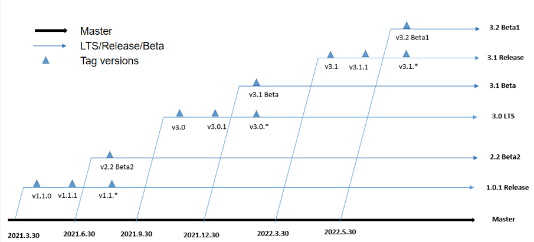

# OpenHarmony Version Definitions

## Branches

To ensure smooth version evolution and continuous stability and reliability of historical versions, the OpenHarmony community periodically pulls branches such as Long Term Support (LTS), Release, and Beta from Master and manages them based on the OpenHarmony lifecycle definition.

### Master

Master is the main branch in the OpenHarmony community, to which code updates of all software packages' Master branches in the community are proactively merged for real-time build.

###  LTS

LTS is a branch pulled from Master in the OpenHarmony community in the third quarter of each year. This branch is compiled, built, and tested in a centralized manner, and finally reviewed and released by the community.

### Release

Release is a branch pulled from Master in the OpenHarmony community in the first quarter of each year. This branch is compiled, built, and tested in a centralized manner, and finally reviewed and released by the community. A Release branch has the same release requirements but a shorter maintenance period when compared with an LTS branch.

### Beta

Beta is a branch pulled from Master in the OpenHarmony community irregularly. This branch has centralized compilation, building, and basic function verification finished, and can be used for development and debugging.

### Tag

A tag version is a stable and reliable version created by applying patches to an LTS or a Release branch, with the purpose of fixing individual bugs, security vulnerabilities, and other necessary adaptation modifications.

## Maintenance Policies

### Lifecycle Policies

OpenHarmony provides lifecycle management services for LTS and Release branches as follows:

#### Release -> Stop proactive maintenance

The Release SIG periodically makes and maintains tag version plans to resolve individual bugs, security vulnerabilities, and other major issues to ensure continuously stable and available branches.

#### Stop proactive maintenance -> Stop maintenance

The Release SIG no longer proactively plans and releases tag versions. It only fixes security vulnerabilities and major defects in corresponding branches.

### LTS and Release Maintenance Policies

For an LTS branch, the OpenHarmony community provides 2-year proactive maintenance and 1.5-year passive maintenance since its release.

For a Release branch, the OpenHarmony community provides 1-year proactive maintenance and 1-year passive maintenance since its release.

### Branch Merge Policies

The Release SIG is responsible for lifecycle management of an LTS or a Release branch. During the maintenance period, the SIG accepts only code updates that resolve security vulnerabilities, ACTS issues, and other major issues. All code updates can be merged into the branch only after the related pull request has been approved by the [owner](https://gitee.com/openharmony/community/blob/master/zh/BRANCHOWNER).

### Maintenance Schedule

The following table lists the maintenance schedule of the LTS and Release branches that have been released in the OpenHarmony community.

| No. | Branch Name       | Branch Type| Release Date | End of Proactive Maintenance| End of Maintenance |
| :--- | ------------- | :------- | :-------- | :----------- | :-------- |
| 1    | 1.0.1-Release | Release  | 2021-03-30| 2022-03-30   | 2023-03-30|
| 2    | 3.0-LTS       | LTS      | 2021-09-30| 2023-09-30   | 2025-03-30|
| 3    | 3.1-Release   | Release  | 2022-03-30| 2023-03-30   | 2024-03-30|

### Version Plan

The OpenHarmony Release SIG periodically releases, updates, and maintains branch version plans. For details, visit [OpenHarmony-SIG-RoadMap](https://gitee.com/openharmony-sig/oh-inner-release-management/blob/master/OpenHarmony-SIG-RoadMap.md).
