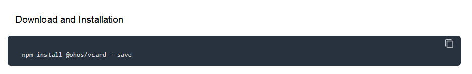
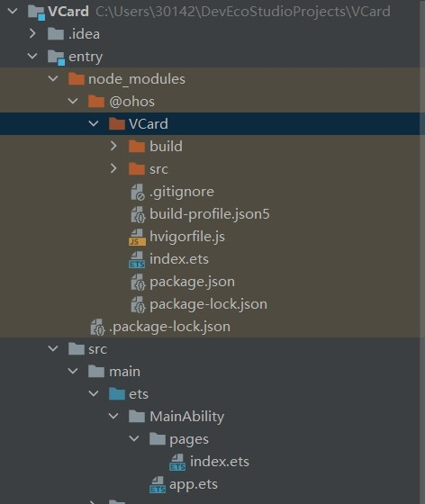

# Using OpenHarmony JS/TS Third-Party Components
## OpenHarmony JS/TS Third-Party Components

OpenHarmony JS/TS third-party components are delivered in the form of OpenHarmony npm packages. Developed based on the traditional npm components, OpenHarmony npm shared packages come with specially designed project structures and configuration files, which allow code of OpenHarmony UI pages and resources to be shared across modules or projects. The OpenHarmony npm package enables multiple modules or projects to share code related to OpenHarmony UI and resources. You can go to the [official npm website](https://docs.npmjs.com/about-npm) to learn about basic functions and mechanisms of npm.

## Searching for OpenHarmony JS/TS Third-Party Components

1. Watch the [OpenHarmony-TPC/tpc_resource](https://gitee.com/openharmony-tpc/tpc_resource) project on the Gitee website. You can find a component based on the directory index.

2. Visit the [OpenHarmony website](https://www.openharmony.cn/mainPlay/tpc) and search for required third-party components by type, category, or keyword.

## Installing and Using OpenHarmony JS/TS Third-Party Components

During application development, you can import JS/TS third-party components in the form of source code or OpenHarmony npm packages. Perform the following steps to import and use an OpenHarmony npm package. For details about how to import and use the source code, see **README.md** of the corresponding third-party components.

1. Configure the OpenHarmony npm environment. For details, see [Installing the OpenHarmony npm Package](https://gitee.com/openharmony-tpc/docs/blob/master/OpenHarmony_npm_usage-en.md).

2. Under **Terminal** project, go to the **entry** directory and run the target component's command to install the component. For details about the command, see "Download and Installation" of the third-party component on the OpenHarmony website.

   The following uses the installation of the [vCard third-party component](https://growing.openharmony.cn/mainPlay/libraryMaps/vcard_595) as an example. Find the installation command in "Download and Installation" and then run the command.

   
   
   

3. A **node_modules** file is automatically generated in the project folder. In this example, the downloaded third-party library is **@ohos\VCard** in the **node_modules** directory.

   

4. The following dependency is automatically added to the **package.json** file:

   ```
   "dependencies": {
     "@ohos/vcard": "^2.0.5"
   }
   ```
   
5. Import the component to the file that wants to use the component.

   

6. Now you can use the APIs.

   
