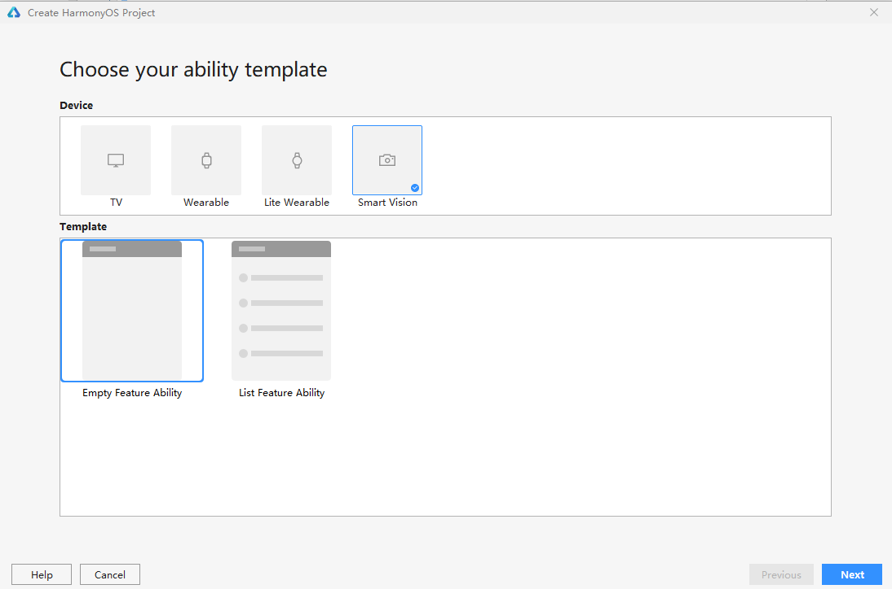

# 开发准备<a name="ZH-CN_TOPIC_0000001055087693"></a>

-   [准备开发环境](#section1912530122716)
-   [创建项目](#section1456035192720)

## 准备开发环境<a name="section1912530122716"></a>

首先需要下载和配置DevEco Studio，具体操作请参考[《DevEco Studio使用指南》](https://developer.harmonyos.com/cn/docs/documentation/doc-guides/software_install-0000001053582415)。

## 创建项目<a name="section1456035192720"></a>

DevEco Studio配置完成后，请根据如下步骤创建项目（暂不支持直接创建“smartVision”类型项目）。

> **说明：** 
>当前的DevEco Studio提供基本的开发功能，至于模拟器界面预览、代码调测将在下个版本提供，敬请期待。

1.  运行DevEco Studio，点击**File \> Project**，选择“Lite Wearable”下的“Empty Feature Ability”模板。

    **图 1**  选择工程模板<a name="fig1111842916140"></a>  
    

2.  创建成功后，修改**entry \> src \> main**目录下的config.json文件。
    1.  将“deviceType”的取值修改为"smartVision"。
    2.  在abilities数组内新增“visible”属性，取值设置为“true”。

        ```
        "deviceConfig": {},
        "module": {
            "deviceType": [
                "smartVision" //将deviceType 改为"smartVision"
            ],
            "distro": {
                "deliveryWithInstall": true,
                "moduleName": "entry",
                "moduleType": "entry"  
             },
             "abilities": [    
                {"name": 
                    "default","icon": 
                    "$media:icon",
                    "label": "airquality",
                    "visible": true, //新增“visible”属性，值为“true”
                    "type": "page"    
                }  
            ],
        ```


