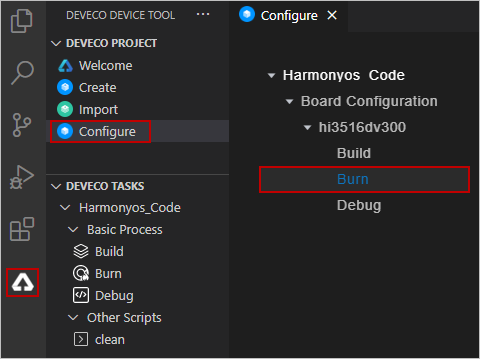
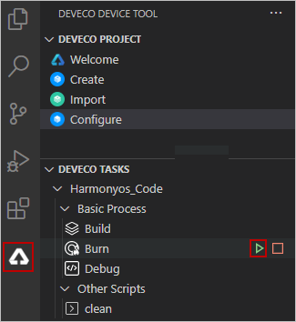

# 开发Hi3516第一个应用程序示例<a name="ZH-CN_TOPIC_0000001052906247"></a>

-   [获取源码](#section215953714245)
-   [修改应用程序](#s8efc1952ebfe4d1ea717182e108c29bb)
-   [编译](#section1077671315253)
-   [烧录](#section08153912587)
-   [镜像运行](#section380511712615)
-   [执行应用程序](#section5276734182615)

本节指导开发者在单板上运行第一个应用程序，其中包括修改应用程序、编译、烧写、运行等步骤，最终输出“Hello OHOS！”。

## 获取源码<a name="section215953714245"></a>

开发者需要在Linux服务器上下载并解压一套源代码，获取Hi3516源码（[下载链接](https://repo.huaweicloud.com/harmonyos/os/1.0/code-1.0.tar.gz)）。更多源码获取方式，请见[源码获取](../get-code/源码获取.md)。

## 修改应用程序<a name="s8efc1952ebfe4d1ea717182e108c29bb"></a>

源码目录applications/sample/camera/app/src内**helloworld.c**代码如下所示，用户可以自定义修改打印内容（例如：修改OHOS为World）。当前应用程序可支持标准C及C++的代码开发。

```
#include <stdio.h>
#include "los_sample.h"

int main(int argc, char **argv)
{
    printf("\n************************************************\n");
    printf("\n\t\tHello OHOS!\n");
    printf("\n************************************************\n\n");

    LOS_Sample(g_num);

    return 0;
}
```

## 编译<a name="section1077671315253"></a>

如果Linux编译环境通过Docker方式安装，具体编译过程请参见[Docker方式获取编译环境](../get-code/获取工具.md)的编译操作。如果Linux编译环境通过软件包方式安装，请进入源码根目录，执行如下命令进行编译：

```
python build.py ipcamera_hi3516dv300 -b debug
```

结果文件生成在out/ipcamera\_hi3516dv300目录下。

## 烧录<a name="section08153912587"></a>

Hi3516开发板的代码烧录支持USB烧录、网口烧录和串口烧录三种方式。此处仅以网口烧录为例进行说明。

1.  请连接好电脑和待烧录开发板，以Hi3516DV300为例，需要同时连接串口、网口和电源，具体可参考[Hi3516开发板介绍](https://device.harmonyos.com/cn/docs/start/introduce/oem_camera_start_3516-0000001052670587)。
2.  <a name="zh-cn_topic_0000001071634529_li142386399535"></a>打开电脑的设备管理器，查看并记录对应的串口号。

    > **说明：** 
    >如果对应的串口异常，请根据[Hi3516/Hi3518系列开发板串口驱动安装](https://device.harmonyos.com/cn/docs/ide/user-guides/hi3516_hi3518-drivers-0000001050743695)安装USB转串口的驱动程序。

    

3.  点击“Configure \> Burn“，进入烧录配置界面，设置ARM系列芯片烧录信息。

    

4.  选择烧录方式（Burning Mode），固定选择“network“。

    

5.  设置网口烧录方式的烧录参数。
    -   设置Port number，请选择[2](#zh-cn_topic_0000001071634529_li142386399535)中查询的串口号。
    -   设置Baud rate和Data bits参数，已根据开发板进行适配，保持默认值即可。
    -   设置网络连接信息：

        -   Host IP address：选择对应本地PC端的IP地址，可通过命令行工具中输入“ipconfig“命令查看。
        -   Remote IP address：设置开发板的IP地址，工具自动设置。
        -   Gateway：对应开发板的网关，工具自动设置。
        -   Subnet mask：子网验码，工具自动设置。
        -   MAC address of board：开发板的物理地址，请使用默认值即可。

        

    -   设置器件类型（Memory Type），包括spi nor、spi nand和emmc，具体设置规则与硬件接收类型相关，请查阅随硬件发货的硬件说明书。例如Hi3516DV300固定设置为emmc。
    -   设置烧录文件信息：请根据如下表格设置烧录文件，网口烧录方式，不支持烧录U-Boot文件。

        <a name="zh-cn_topic_0000001071634529_table833816126143"></a>
        <table><thead align="left"><tr id="zh-cn_topic_0000001071634529_row123381912111410"><th class="cellrowborder" valign="top" width="25%" id="mcps1.1.5.1.1"><p id="zh-cn_topic_0000001071634529_p933816122140"><a name="zh-cn_topic_0000001071634529_p933816122140"></a><a name="zh-cn_topic_0000001071634529_p933816122140"></a>待烧录文件（File Name）</p>
        </th>
        <th class="cellrowborder" valign="top" width="25%" id="mcps1.1.5.1.2"><p id="zh-cn_topic_0000001071634529_p1533819122144"><a name="zh-cn_topic_0000001071634529_p1533819122144"></a><a name="zh-cn_topic_0000001071634529_p1533819122144"></a>开始地址（Start Address）</p>
        </th>
        <th class="cellrowborder" valign="top" width="24.98%" id="mcps1.1.5.1.3"><p id="zh-cn_topic_0000001071634529_p1733831231411"><a name="zh-cn_topic_0000001071634529_p1733831231411"></a><a name="zh-cn_topic_0000001071634529_p1733831231411"></a>Flash地址块大小（File Size）</p>
        </th>
        <th class="cellrowborder" valign="top" width="25.019999999999996%" id="mcps1.1.5.1.4"><p id="zh-cn_topic_0000001071634529_p1433851211145"><a name="zh-cn_topic_0000001071634529_p1433851211145"></a><a name="zh-cn_topic_0000001071634529_p1433851211145"></a>是否烧录（Enable）</p>
        </th>
        </tr>
        </thead>
        <tbody><tr id="zh-cn_topic_0000001071634529_row6339412101413"><td class="cellrowborder" valign="top" width="25%" headers="mcps1.1.5.1.1 "><p id="zh-cn_topic_0000001071634529_p14339131221416"><a name="zh-cn_topic_0000001071634529_p14339131221416"></a><a name="zh-cn_topic_0000001071634529_p14339131221416"></a>OHOS_Image.bin</p>
        </td>
        <td class="cellrowborder" valign="top" width="25%" headers="mcps1.1.5.1.2 "><p id="zh-cn_topic_0000001071634529_p133901211419"><a name="zh-cn_topic_0000001071634529_p133901211419"></a><a name="zh-cn_topic_0000001071634529_p133901211419"></a>1M</p>
        </td>
        <td class="cellrowborder" valign="top" width="24.98%" headers="mcps1.1.5.1.3 "><p id="zh-cn_topic_0000001071634529_p1533951261412"><a name="zh-cn_topic_0000001071634529_p1533951261412"></a><a name="zh-cn_topic_0000001071634529_p1533951261412"></a>9M</p>
        </td>
        <td class="cellrowborder" valign="top" width="25.019999999999996%" headers="mcps1.1.5.1.4 "><p id="zh-cn_topic_0000001071634529_p2574183818223"><a name="zh-cn_topic_0000001071634529_p2574183818223"></a><a name="zh-cn_topic_0000001071634529_p2574183818223"></a>第一次使用开发板烧录时，必须同时烧录；在后续烧录过程中，如果修改了内核和驱动相关内容，才需要烧录。</p>
        </td>
        </tr>
        <tr id="zh-cn_topic_0000001071634529_row533914120143"><td class="cellrowborder" valign="top" width="25%" headers="mcps1.1.5.1.1 "><p id="zh-cn_topic_0000001071634529_p8339112111412"><a name="zh-cn_topic_0000001071634529_p8339112111412"></a><a name="zh-cn_topic_0000001071634529_p8339112111412"></a>rootfs.img</p>
        </td>
        <td class="cellrowborder" valign="top" width="25%" headers="mcps1.1.5.1.2 "><p id="zh-cn_topic_0000001071634529_p733921271410"><a name="zh-cn_topic_0000001071634529_p733921271410"></a><a name="zh-cn_topic_0000001071634529_p733921271410"></a>10M</p>
        </td>
        <td class="cellrowborder" valign="top" width="24.98%" headers="mcps1.1.5.1.3 "><p id="zh-cn_topic_0000001071634529_p13339181214145"><a name="zh-cn_topic_0000001071634529_p13339181214145"></a><a name="zh-cn_topic_0000001071634529_p13339181214145"></a>15M</p>
        </td>
        <td class="cellrowborder" rowspan="2" valign="top" width="25.019999999999996%" headers="mcps1.1.5.1.4 "><p id="zh-cn_topic_0000001071634529_p233901211146"><a name="zh-cn_topic_0000001071634529_p233901211146"></a><a name="zh-cn_topic_0000001071634529_p233901211146"></a>第一次使用开发板烧录时，必须同时烧录；在后续烧录过程中，如果这两个文件未做修改，可以不烧录。建议每次烧录时，都烧录这两个文件。</p>
        </td>
        </tr>
        <tr id="zh-cn_topic_0000001071634529_row1333901281418"><td class="cellrowborder" valign="top" headers="mcps1.1.5.1.1 "><p id="zh-cn_topic_0000001071634529_p53391912131416"><a name="zh-cn_topic_0000001071634529_p53391912131416"></a><a name="zh-cn_topic_0000001071634529_p53391912131416"></a>userfs.img</p>
        </td>
        <td class="cellrowborder" valign="top" headers="mcps1.1.5.1.2 "><p id="zh-cn_topic_0000001071634529_p193391612161414"><a name="zh-cn_topic_0000001071634529_p193391612161414"></a><a name="zh-cn_topic_0000001071634529_p193391612161414"></a>25M</p>
        </td>
        <td class="cellrowborder" valign="top" headers="mcps1.1.5.1.3 "><p id="zh-cn_topic_0000001071634529_p433918121148"><a name="zh-cn_topic_0000001071634529_p433918121148"></a><a name="zh-cn_topic_0000001071634529_p433918121148"></a>50M</p>
        </td>
        </tr>
        </tbody>
        </table>

        


6.  修改了相关配置后，请点击最下方的“Save“进行保存。
7.  在DevEco Device Tool中，点击Burn后的按钮开始烧录。

    

8.  请在15秒内手动重启开发板\(下电再上电\)。
9.  等待烧录完成，当控制台输出如下信息时，表示烧录成功。

    

10. 如果第一次使用开发板，需要使用[串口工具](https://device.harmonyos.com/cn/docs/ide/user-guides/serial_port-0000001057649420)修改U-boot的bootcmd及bootargs内容，具体可参考[Hi3516开发板镜像运行](https://device.harmonyos.com/cn/docs/start/introduce/oem_camera_start_first_example-0000001051610926#ZH-CN_TOPIC_0000001052906247__section380511712615)。

## 镜像运行<a name="section380511712615"></a>

1.  连接串口。

    > **须知：** 
    >若无法连接串口，请参考[常见问题](Hi3516常见问题.md#section14871149155911)进行排查。

    **图 1**  连接串口图<a name="fig056645018495"></a>  
    

    

    1.  单击**Serial port**打开串口。
    2.  输入串口编号\(按照烧录步骤中查询的串口号，此处以com11举例\)，并连续输入回车直到串口显示"hisillicon"。
    3.  单板初次启动或修改启动参数，请进入[步骤2](#l5b42e79a33ea4d35982b78a22913b0b1)，否则进入[步骤3](#ld26f18828aa44c36bfa36be150e60e49)。

2.  <a name="l5b42e79a33ea4d35982b78a22913b0b1"></a>（单板初次启动必选）修改U-boot的bootcmd及bootargs内容：该步骤为固化操作，若不修改参数只需执行一次。每次复位单板均会自动进入系统。

    > **须知：** 
    >U-boot引导程序默认会有2秒的等待时间，用户可使用回车打断等待并显示"hisillicon"，通过**reset**命令可再次启动系统。

    **表 1**  U-boot修改命令

    <a name="table1323441103813"></a>
    <table><thead align="left"><tr id="row1423410183818"><th class="cellrowborder" valign="top" width="50%" id="mcps1.2.3.1.1"><p id="p623461163818"><a name="p623461163818"></a><a name="p623461163818"></a>执行命令</p>
    </th>
    <th class="cellrowborder" valign="top" width="50%" id="mcps1.2.3.1.2"><p id="p42341014388"><a name="p42341014388"></a><a name="p42341014388"></a>命令解释</p>
    </th>
    </tr>
    </thead>
    <tbody><tr id="row1623471113817"><td class="cellrowborder" valign="top" width="50%" headers="mcps1.2.3.1.1 "><p id="p102341719385"><a name="p102341719385"></a><a name="p102341719385"></a>setenv bootcmd "mmc read 0x0 0x80000000 0x800 0x4800; go 0x80000000";</p>
    </td>
    <td class="cellrowborder" valign="top" width="50%" headers="mcps1.2.3.1.2 "><p id="p92347120389"><a name="p92347120389"></a><a name="p92347120389"></a>读取FLASH起始地址为0x800（单位为512B，即1MB），大小为0x4800（单位为512B，即9MB）的内容到0x80000000的内存地址，该大小（9MB）与IDE中所填写OHOS_Image.bin文件大小<strong id="b15685648113111"><a name="b15685648113111"></a><a name="b15685648113111"></a>必须相同</strong>。</p>
    </td>
    </tr>
    <tr id="row12234912381"><td class="cellrowborder" valign="top" width="50%" headers="mcps1.2.3.1.1 "><p id="p172306219392"><a name="p172306219392"></a><a name="p172306219392"></a>setenv bootargs "console=ttyAMA0,115200n8 root=emmc fstype=vfat rootaddr=10M rootsize=15M rw";</p>
    </td>
    <td class="cellrowborder" valign="top" width="50%" headers="mcps1.2.3.1.2 "><p id="p13489329396"><a name="p13489329396"></a><a name="p13489329396"></a>表示设置启动参数，输出模式为串口输出，波特率为115200，数据位8，rootfs挂载于emmc器件，文件系统类型为vfat，</p>
    <p id="p12481832163913"><a name="p12481832163913"></a><a name="p12481832163913"></a>“rootaddr=10M rootsize=15M rw”处对应填入rootfs.img的烧写起始位置与长度，此处与IDE中新增rootfs.img文件时所填大小<strong id="b24816327398"><a name="b24816327398"></a><a name="b24816327398"></a>必须相同</strong>。</p>
    </td>
    </tr>
    <tr id="row18234161153820"><td class="cellrowborder" valign="top" width="50%" headers="mcps1.2.3.1.1 "><p id="p823417118386"><a name="p823417118386"></a><a name="p823417118386"></a>saveenv</p>
    </td>
    <td class="cellrowborder" valign="top" width="50%" headers="mcps1.2.3.1.2 "><p id="p32341616389"><a name="p32341616389"></a><a name="p32341616389"></a>表示保存当前配置。</p>
    </td>
    </tr>
    <tr id="row192345113811"><td class="cellrowborder" valign="top" width="50%" headers="mcps1.2.3.1.1 "><p id="p7235111183819"><a name="p7235111183819"></a><a name="p7235111183819"></a>reset</p>
    </td>
    <td class="cellrowborder" valign="top" width="50%" headers="mcps1.2.3.1.2 "><p id="p123781411114016"><a name="p123781411114016"></a><a name="p123781411114016"></a>表示复位单板。</p>
    </td>
    </tr>
    </tbody>
    </table>

    > **须知：** 
    >**“go 0x80000000”**为可选指令，默认配置已将该指令固化在启动参数中，单板复位后可自动启动。若想切换为手动启动，可在U-boot启动倒数阶段使用"回车"打断自动启动。

3.  <a name="ld26f18828aa44c36bfa36be150e60e49"></a>输入**“reset”**指令并回车，重启单板，启动成功如下图，输入回车串口显示OHOS字样。

    **图 2**  系统启动图<a name="fig10181006376"></a>  
    

    


## 执行应用程序<a name="section5276734182615"></a>

根目录下，在命令行输入指令“**./bin/camera\_app**”执行写入的demo程序，显示成功结果如下图所示。

**图 3**  应用程序启动图<a name="fig36537913815"></a>  


