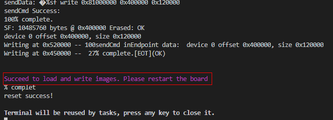

# 开发Hi3518第一个示例程序<a name="ZH-CN_TOPIC_0000001053422339"></a>

-   [获取源码](#section1726092873119)
-   [修改应用程序](#s8efc1952ebfe4d1ea717182e108c29bb)
-   [编译](#section234175193114)
-   [烧录](#section57955241588)
-   [镜像运行](#section62131033183710)
-   [下一步学习](#section9712145420182)

本节指导开发者在单板上运行第一个应用程序，其中包括修改应用程序、编译、烧写、运行等步骤，最终输出“Hello OHOS！”

## 获取源码<a name="section1726092873119"></a>

开发者需要在Linux服务器上下载并解压一套源代码，获取Hi3518源码（[下载链接](https://repo.huaweicloud.com/harmonyos/os/1.0/code-1.0.tar.gz)）。更多源码获取方式，请见[源码获取](../get-code/源码获取.md)。

## 修改应用程序<a name="s8efc1952ebfe4d1ea717182e108c29bb"></a>

源码applications/sample/camera/app/src目录内helloworld.c代码如下所示，用户可以自定义修改打印内容（例如：修改OHOS为World）。当前应用程序可支持ISO C及C++的代码开发。

```
#include <stdio.h>
#include "los_sample.h"

int main(int argc, char **argv)
{
    printf("\n************************************************\n");
    printf("\n\t\tHello OHOS!\n");
    printf("\n************************************************\n\n");

    LOS_Sample(g_num);

    return 0;
}
```

## 编译<a name="section234175193114"></a>

在Linux服务器上，进入源码包根目录，执行如下脚本编译源码包。结果文件生成在out/ipcamera\_hi3518ev300目录下。

```
python build.py ipcamera_hi3518ev300 -b debug
```

## 烧录<a name="section57955241588"></a>

Hi3518开发板的代码烧录仅支持USB烧录方式。

1.  请连接好电脑和待烧录开发板，以Hi3518EV300为例，需要同时连接串口和USB口，具体可参考[Hi3518开发板介绍](https://device.harmonyos.com/cn/docs/start/introduce/oem_camera_start_hi3518-0000001050170473)。
2.  <a name="zh-cn_topic_0000001057313128_li101031912111518"></a>打开电脑的设备管理器，查看并记录对应的串口号。

    > **说明：** 
    >如果对应的串口异常，请根据[Hi3516/Hi3518系列开发板串口驱动安装](https://device.harmonyos.com/cn/docs/ide/user-guides/hi3516_hi3518-drivers-0000001050743695)安装USB转串口的驱动程序。

    

3.  点击“Device Tool \> Configure \> Burn”进入烧录配置界面，设置Hi3518系列开发板烧录信息。

    

4.  选择烧录方式（Burning Mode），固定选择“usbport”。

    

5.  设置USB烧录的烧录参数。
    -   设置Port number，请选择[2](#zh-cn_topic_0000001057313128_li101031912111518)中查询的串口号。
    -   设置Baud Rate和Data Bits参数，已根据开发板进行适配，保持默认值即可。
    -   设置器件类型（Memory Type），Hi3518系列开发板固定设置为spi nor。
    -   设置烧录文件信息：请根据如下表格设置烧录文件。

        <a name="zh-cn_topic_0000001057313128_table17829824143410"></a>
        <table><thead align="left"><tr id="zh-cn_topic_0000001057313128_row1782992414343"><th class="cellrowborder" valign="top" width="25.130000000000003%" id="mcps1.1.5.1.1"><p id="zh-cn_topic_0000001057313128_p198641828133419"><a name="zh-cn_topic_0000001057313128_p198641828133419"></a><a name="zh-cn_topic_0000001057313128_p198641828133419"></a>待烧录文件（File Name）</p>
        </th>
        <th class="cellrowborder" valign="top" width="24.87%" id="mcps1.1.5.1.2"><p id="zh-cn_topic_0000001057313128_p086415289344"><a name="zh-cn_topic_0000001057313128_p086415289344"></a><a name="zh-cn_topic_0000001057313128_p086415289344"></a>开始地址（Start Address）</p>
        </th>
        <th class="cellrowborder" valign="top" width="24.98%" id="mcps1.1.5.1.3"><p id="zh-cn_topic_0000001057313128_p986462863413"><a name="zh-cn_topic_0000001057313128_p986462863413"></a><a name="zh-cn_topic_0000001057313128_p986462863413"></a>Flash地址块大小（File Size）</p>
        </th>
        <th class="cellrowborder" valign="top" width="25.019999999999996%" id="mcps1.1.5.1.4"><p id="zh-cn_topic_0000001057313128_p58291224193410"><a name="zh-cn_topic_0000001057313128_p58291224193410"></a><a name="zh-cn_topic_0000001057313128_p58291224193410"></a>是否烧录（Enable）</p>
        </th>
        </tr>
        </thead>
        <tbody><tr id="zh-cn_topic_0000001057313128_row4829112453415"><td class="cellrowborder" valign="top" width="25.130000000000003%" headers="mcps1.1.5.1.1 "><p id="zh-cn_topic_0000001057313128_p18829162417342"><a name="zh-cn_topic_0000001057313128_p18829162417342"></a><a name="zh-cn_topic_0000001057313128_p18829162417342"></a>u-boot-开发板名称.bin</p>
        </td>
        <td class="cellrowborder" valign="top" width="24.87%" headers="mcps1.1.5.1.2 "><p id="zh-cn_topic_0000001057313128_p38298241348"><a name="zh-cn_topic_0000001057313128_p38298241348"></a><a name="zh-cn_topic_0000001057313128_p38298241348"></a>0</p>
        </td>
        <td class="cellrowborder" valign="top" width="24.98%" headers="mcps1.1.5.1.3 "><p id="zh-cn_topic_0000001057313128_p18295244345"><a name="zh-cn_topic_0000001057313128_p18295244345"></a><a name="zh-cn_topic_0000001057313128_p18295244345"></a>1M</p>
        </td>
        <td class="cellrowborder" valign="top" width="25.019999999999996%" headers="mcps1.1.5.1.4 "><p id="zh-cn_topic_0000001057313128_p1282982415342"><a name="zh-cn_topic_0000001057313128_p1282982415342"></a><a name="zh-cn_topic_0000001057313128_p1282982415342"></a>是</p>
        </td>
        </tr>
        <tr id="zh-cn_topic_0000001057313128_row8829192415342"><td class="cellrowborder" valign="top" width="25.130000000000003%" headers="mcps1.1.5.1.1 "><p id="zh-cn_topic_0000001057313128_p1782912420346"><a name="zh-cn_topic_0000001057313128_p1782912420346"></a><a name="zh-cn_topic_0000001057313128_p1782912420346"></a>OHOS_Image.bin</p>
        </td>
        <td class="cellrowborder" valign="top" width="24.87%" headers="mcps1.1.5.1.2 "><p id="zh-cn_topic_0000001057313128_p1483012483410"><a name="zh-cn_topic_0000001057313128_p1483012483410"></a><a name="zh-cn_topic_0000001057313128_p1483012483410"></a>1M</p>
        </td>
        <td class="cellrowborder" valign="top" width="24.98%" headers="mcps1.1.5.1.3 "><p id="zh-cn_topic_0000001057313128_p1283032433419"><a name="zh-cn_topic_0000001057313128_p1283032433419"></a><a name="zh-cn_topic_0000001057313128_p1283032433419"></a>6M</p>
        </td>
        <td class="cellrowborder" valign="top" width="25.019999999999996%" headers="mcps1.1.5.1.4 "><p id="zh-cn_topic_0000001057313128_p17830524163416"><a name="zh-cn_topic_0000001057313128_p17830524163416"></a><a name="zh-cn_topic_0000001057313128_p17830524163416"></a>第一次使用开发板烧录时，必须同时烧录；在后续烧录过程中，如果修改了内核和驱动相关内容，才需要烧录。</p>
        </td>
        </tr>
        <tr id="zh-cn_topic_0000001057313128_row18830192453415"><td class="cellrowborder" valign="top" width="25.130000000000003%" headers="mcps1.1.5.1.1 "><p id="zh-cn_topic_0000001057313128_p0830162453411"><a name="zh-cn_topic_0000001057313128_p0830162453411"></a><a name="zh-cn_topic_0000001057313128_p0830162453411"></a>rootfs.img</p>
        </td>
        <td class="cellrowborder" valign="top" width="24.87%" headers="mcps1.1.5.1.2 "><p id="zh-cn_topic_0000001057313128_p7830424133418"><a name="zh-cn_topic_0000001057313128_p7830424133418"></a><a name="zh-cn_topic_0000001057313128_p7830424133418"></a>7M</p>
        </td>
        <td class="cellrowborder" valign="top" width="24.98%" headers="mcps1.1.5.1.3 "><p id="zh-cn_topic_0000001057313128_p1583012413417"><a name="zh-cn_topic_0000001057313128_p1583012413417"></a><a name="zh-cn_topic_0000001057313128_p1583012413417"></a>8M</p>
        </td>
        <td class="cellrowborder" rowspan="2" valign="top" width="25.019999999999996%" headers="mcps1.1.5.1.4 "><p id="zh-cn_topic_0000001057313128_p166645916376"><a name="zh-cn_topic_0000001057313128_p166645916376"></a><a name="zh-cn_topic_0000001057313128_p166645916376"></a>第一次使用开发板烧录时，必须同时烧录；在后续烧录过程中，如果这两个文件未做修改，可以不烧录。建议每次烧录时，都烧录这两个文件。</p>
        </td>
        </tr>
        <tr id="zh-cn_topic_0000001057313128_row38301424183414"><td class="cellrowborder" valign="top" headers="mcps1.1.5.1.1 "><p id="zh-cn_topic_0000001057313128_p983032415348"><a name="zh-cn_topic_0000001057313128_p983032415348"></a><a name="zh-cn_topic_0000001057313128_p983032415348"></a>userfs.img</p>
        </td>
        <td class="cellrowborder" valign="top" headers="mcps1.1.5.1.2 "><p id="zh-cn_topic_0000001057313128_p783016244344"><a name="zh-cn_topic_0000001057313128_p783016244344"></a><a name="zh-cn_topic_0000001057313128_p783016244344"></a>15M</p>
        </td>
        <td class="cellrowborder" valign="top" headers="mcps1.1.5.1.3 "><p id="zh-cn_topic_0000001057313128_p2830142412349"><a name="zh-cn_topic_0000001057313128_p2830142412349"></a><a name="zh-cn_topic_0000001057313128_p2830142412349"></a>1M</p>
        </td>
        </tr>
        </tbody>
        </table>

        


6.  修改了相关配置后，请点击最下方的“Save”进行保存。
7.  在DevEco Device Tool中，点击Burn后的按钮开始烧录。

    > **说明：** 
    >如果您是第一次在工作台烧录Hi3516/Hi3518系列开发板，可能烧录失败，提示“not find the Devices”，请根据[Hi3516/Hi3518系列开发板USB驱动安装](https://device.harmonyos.com/cn/docs/ide/user-guides/usb_driver-0000001058690393)进行处理后再重新烧录。

    

8.  请在15秒内手动重启开发板\(下电再上电\)。
9.  等待烧录完成，当控制台输出如下信息时，表示烧录成功。

    

10. 每次烧录U-boot后，需要使用[串口工具](zh-cn_topic_0000001057649420.md)修改U-boot的bootcmd及bootargs内容，具体可参考[Hi3518开发板镜像运行](https://device.harmonyos.com/cn/docs/start/introduce/oem_camera_start_example-0000001051610926#ZH-CN_TOPIC_0000001053422339__section62131033183710)。

## 镜像运行<a name="section62131033183710"></a>

1.  连接串口。

    > **须知：** 
    >若无法连接串口，请参考[常见问题](常见问题-3.md#zh-cn_topic_0000001053466255_section14871149155911)进行排查。

    **图 1**  连接串口图<a name="fig056645018495"></a>  
    

    

    1.  单击**Serial port**打开串口。
    2.  输入串口编号\(按照烧录步骤中查询的串口号，此处以com11举例\)，并连续输入回车直到串口显示"hisillicon"。
    3.  单板初次启动或修改启动参数，请进入[步骤2](#l5b42e79a33ea4d35982b78a22913b0b1)，否则进入[步骤3](#ld26f18828aa44c36bfa36be150e60e49)。

2.  （初次烧写必选）修改U-boot的bootcmd及bootargs内容：该步骤为固化操作，可保存执行结果，但U-boot重新烧入，则需要再次执行下述步骤。

    **表 1**  U-boot修改命令

    <a name="table1336762011222"></a>
    <table><thead align="left"><tr id="row193681920182219"><th class="cellrowborder" valign="top" width="50%" id="mcps1.2.3.1.1"><p id="p3368202016229"><a name="p3368202016229"></a><a name="p3368202016229"></a>执行命令</p>
    </th>
    <th class="cellrowborder" valign="top" width="50%" id="mcps1.2.3.1.2"><p id="p936812052217"><a name="p936812052217"></a><a name="p936812052217"></a>命令解释</p>
    </th>
    </tr>
    </thead>
    <tbody><tr id="row10368142032210"><td class="cellrowborder" valign="top" width="50%" headers="mcps1.2.3.1.1 "><p id="p1636882092214"><a name="p1636882092214"></a><a name="p1636882092214"></a>setenv bootcmd "sf probe 0;sf read 0x40000000 0x100000 0x600000;go 0x40000000";</p>
    </td>
    <td class="cellrowborder" valign="top" width="50%" headers="mcps1.2.3.1.2 "><p id="p17368202082213"><a name="p17368202082213"></a><a name="p17368202082213"></a>设置bootcmd内容，选择FLASH器件0，读取FLASH起始地址为0x100000，大小为0x600000字节的内容到0x40000000的内存地址，此处0x600000为6MB，与IDE中填写OHOS_Image.bin的文件大小<strong id="b1355784283916"><a name="b1355784283916"></a><a name="b1355784283916"></a>必须相同</strong>。</p>
    </td>
    </tr>
    <tr id="row136814209227"><td class="cellrowborder" valign="top" width="50%" headers="mcps1.2.3.1.1 "><p id="p234414019231"><a name="p234414019231"></a><a name="p234414019231"></a>setenv bootargs "console=ttyAMA0,115200n8 root=flash fstype=jffs2 rw rootaddr=7M rootsize=8M";</p>
    </td>
    <td class="cellrowborder" valign="top" width="50%" headers="mcps1.2.3.1.2 "><p id="p10368102010223"><a name="p10368102010223"></a><a name="p10368102010223"></a>表示设置bootargs参数为串口输出，波特率为115200，数据位8，rootfs挂载于FLASH上，文件系统类型为jffs2 rw，以支持可读写JFFS2文件系统。“rootaddr=7M rootsize=8M”处对应填入实际rootfs.img的烧写起始位置与长度，与IDE内所填大小<strong id="b1461083410403"><a name="b1461083410403"></a><a name="b1461083410403"></a>必须相同</strong>。</p>
    </td>
    </tr>
    <tr id="row2368120112219"><td class="cellrowborder" valign="top" width="50%" headers="mcps1.2.3.1.1 "><p id="p20368142072217"><a name="p20368142072217"></a><a name="p20368142072217"></a>saveenv</p>
    </td>
    <td class="cellrowborder" valign="top" width="50%" headers="mcps1.2.3.1.2 "><p id="p19368102020220"><a name="p19368102020220"></a><a name="p19368102020220"></a>表示保存当前配置。</p>
    </td>
    </tr>
    <tr id="row63689205220"><td class="cellrowborder" valign="top" width="50%" headers="mcps1.2.3.1.1 "><p id="p3368162015223"><a name="p3368162015223"></a><a name="p3368162015223"></a>reset</p>
    </td>
    <td class="cellrowborder" valign="top" width="50%" headers="mcps1.2.3.1.2 "><p id="p23681820182217"><a name="p23681820182217"></a><a name="p23681820182217"></a>表示复位单板。</p>
    </td>
    </tr>
    <tr id="row346253519253"><td class="cellrowborder" valign="top" width="50%" headers="mcps1.2.3.1.1 "><p id="p16462113512251"><a name="p16462113512251"></a><a name="p16462113512251"></a>pri</p>
    </td>
    <td class="cellrowborder" valign="top" width="50%" headers="mcps1.2.3.1.2 "><p id="p3462335152514"><a name="p3462335152514"></a><a name="p3462335152514"></a>表示查看显示参数。</p>
    </td>
    </tr>
    </tbody>
    </table>

    > **须知：** 
    >**“go 0x40000000”**为可选指令，默认配置已将该指令固化在启动参数中，单板复位后可自动启动。若想切换为手动启动，可在U-boot启动倒数阶段使用"回车"打断自动启动。

3.  若启动时显示**"hisilicon \#**字样，请输入**“reset”**指令，等待系统自启动进入系统，系统启动后，显示**“OHOS”**字样，输入**”./bin/camera\_app”**并回车，显示成功结果如下图所示。

    **图 2**  启动成功并执行应用程序图<a name="fig11838403383"></a>  
    


## 下一步学习<a name="section9712145420182"></a>

恭喜您，已完成Hi3518的快速上手！建议您下一步进入[无屏摄像头产品开发](../guide/摄像头控制.md)的学习 。

