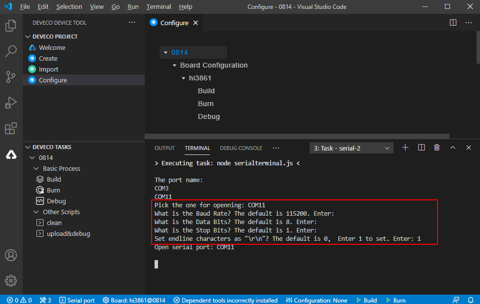

# 开发Hi3861第一个示例程序<a name="ZH-CN_TOPIC_0000001053302600"></a>

-   [源码获取](#section1545225464016)
-   [源码编译](#section1736014117148)
-   [镜像烧录](#section1610612214150)
-   [WLAN模组联网](#section168257461059)

本示例将演示如何通过AT命令完成WLAN模组与网关联网。

## 源码获取<a name="section1545225464016"></a>

开发者需要在Linux服务器上下载并解压一套源代码，获取Hi3861源码（[下载链接](https://repo.huaweicloud.com/harmonyos/os/1.0/code-1.0.tar.gz)）。更多源码获取方式，请见[源码获取](../get-code/源码获取.md)。

## 源码编译<a name="section1736014117148"></a>

本节描述如何在Linux服务器上进行WLAN模组版本的编译。

如果Linux编译环境通过Docker方式安装，具体编译过程请参见[Docker方式获取编译环境](../get-code/获取工具.md)的编译操作。如果Linux编译环境通过软件包方式安装，请参考如下步骤。

1.  打开DevEco Device Tool工具，点击“View \> Terminal”，进入终端界面。

    **图 1**  IDE终端工具打开方法<a name="fig1975813338510"></a>  
    

    

    在终端界面使用ssh命令连接linux服务器，如“ssh  _user_@_ipaddr_”。

    **图 2**  终端界面示意图<a name="fig91165301546"></a>  
    

    

2.  进入代码根路径，并在终端窗口，执行编译脚本命令启动编译“python build.py wifiiot”。

    **图 3**  在终端界面执行编译命令示意图<a name="fig17727115215612"></a>  
    

    

3.  编译结束后，如果出现“BUILD SUCCESS”字样，则证明构建成功，如下图所示。

    **图 4**  编译成功示意图<a name="fig1262101218463"></a>  
    

4.  构建成功后，会在./out/wifiiot/路径中生成以下文件，使用如下命令可以查看，至此编译构建流程结束。

    ```
    ls -l out/wifiiot
    ```

    **图 5**  编译文件存放目录示意图<a name="fig38521346164618"></a>  
    

    


## 镜像烧录<a name="section1610612214150"></a>

Hi3861 WLAN模组的镜像烧录可以通过OpenHarmony IDE工具DevEco完成，工具的基本使用请参考[DevEco Device Tool使用指南](https://device.harmonyos.com/cn/docs/ide/user-guides/service_introduction-0000001050166905)，烧录过程包含如下步骤。

1.  使用USB线连接Windows工作台和WLAN模组。
2.  [下载USB转串口驱动](http://www.wch.cn/downloads/CH341SER_EXE.html)，安装USB转串口驱动。
3.  查询设备管理器上的COM口，如CH340\(COM11\)。该串口集成了烧录、日志打印、AT命令等功能。

    **图 6**  设备管理器的COM口示意图<a name="fig85905394917"></a>  
    

4.  进入IDE烧录配置界面。

    **图 7**  烧录基础配置示意图<a name="fig16939203111472"></a>  
    

    

5.  基础参数配置如下。

    1.  在Baud rate中选择合适的波特率，波特率越高烧写速度越快，此处建议使用默认值921600。
    2.  在Data bit中选择数据位，WLAN模组使用默认值8。
    3.  选择版本包路径“./out/wifiiot/Hi3861\_wifiiot\_app\_allinone.bin”，选择Mode为“Hiburn”。
    4.  点击“Save”保存配置。

    **图 8**  波特率和数据位配置示意图<a name="fig4315145184815"></a>  
    

    **图 9**  烧录包路径示意图<a name="fig105491550185115"></a>  
    

    

6.  在DevEco工具界面中单击“烧录”按钮，然后选择烧录串口“COM11”。

    **图 10**  烧录启动示意图<a name="fig051518341529"></a>  
    

7.  选择串口后，IDE的TERMINAL对话框中出现“Connecting, please reset device...”的字样，模组进入待烧录状态。

    **图 11**  烧录进行中示意图<a name="fig233565715549"></a>  
    

8.  按下模组上的复位按键，开始烧写版本，等待TERMINAL对话框中出现“Execution Successful”字样，即烧录完成。

    **图 12**  烧录完成示意图<a name="fig191921618564"></a>  
    

    


## WLAN模组联网<a name="section168257461059"></a>

完成版本构建及烧录后，下面开始介绍如何在串口终端上执行AT命令，使WLAN模组联网。

1.  保持Windows工作台和WLAN模组的连接状态，在DevEco工具最下方，点击“Serial port”按钮，弹出串口终端的配置界面。

    **图 13**  打开DevEco串口终端示意图<a name="fig12489182991119"></a>  
    

2.  选择串口，并完成参数配置。根据实际情况输入串口号，此处为“COM11”；波特率、数据位、停止位使用默认值；由于AT命令输入需要以“\\r\\n”结尾，否则输入无效，所以结束符处输入“1”。

    **图 14**  串口参数配置示意图<a name="fig192312048131213"></a>  
    

3.  复位WLAN模组，终端界面显示“ready to OS start”，则启动成功。

    **图 15**  WLAN复位成功示意图<a name="fig496084516332"></a>  
    

    

4.  在DevEco的串口终端中，依次执行如下AT命令，启动STA模式，连接指定AP热点，并开启DHCP功能。

    ```
    AT+STARTSTA                             - 启动STA模式
    AT+SCAN                                 - 扫描周边AP
    AT+SCANRESULT                           - 显示扫描结果
    AT+CONN="SSID",,2,"PASSWORD"            - 连接指定AP，其中SSID/PASSWORD为待连接的热点名称和密码
    AT+STASTAT                              - 查看连接结果
    AT+DHCP=wlan0,1                         - 通过DHCP向AP请求wlan0的IP地址
    ```

5.  查看WLAN模组与网关联通是否正常，如下图所示。

    ```
    AT+IFCFG                                - 查看模组接口IP
    AT+PING=X.X.X.X                         - 检查模组与网关的联通性，其中X.X.X.X需替换为实际的网关地址
    ```

    **图 16**  WLAN模组联网成功示意图<a name="fig1166371318339"></a>  
    

    


