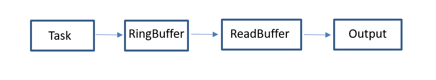

# DFX子系统概述

DFX子系统主要包含DFR（Design for Reliability，可靠性）和DFT（Design for Testability，可测试性）特性，为开发者提供代码维测信息。

由于芯片平台资源有限，且硬件平台多样，因此需要针对不同硬件架构和资源提供组件化且可定制的DFX框架。根据RISC-V、Cortex-M、Cortex-A不同硬件平台，提供两种不同的轻量级DFX框架，以下简称mini、featured框架。

-   mini框架：针对处理架构为Cortex-M或同等处理能力的硬件平台，系统内存一般低于512KB，无文件系统或者仅提供一个可有限使用的轻量级文件系统，遵循CMSIS接口规范。用户Task通过API接口，将日志记录在缓存中，异步调用输出接口打印日志，如下图所示。

**图 1**  mini框架架构  

-   featured框架：处理架构为Cortex-A或同等处理能力的硬件平台，内存资源一般大于512KB，文件系统完善，可存储大量数据，遵循POSIX接口规范。

    **图 2**  featured框架架构  
    

    

    **图解：**用户态Process或内核Task写日志至hilogtask，hilogtask将日志内容存入ringbuffer中，用户态的hilogcat及apphilogcat进程负责日志的串口输出和flash落盘。

    下述主要任务的详细内容：

    1.  hilogtask流水日志的内核任务。
        -   此功能是一个内核的驱动，在系统启动时初始化。
        -   当内核或者用户态模块调用日志接口，将格式化好的日志内容传输给该任务，并将其存储在一个环形缓冲区中 。

    2.  apphilogcat用户态日志存储服务。
        -   用户态进程，负责将内核的Ringbuffer读取出来，存储到日志文件中。

    3.  hilogcat日志查看命令行工具。

        从内核驱动接口读取ringbuffer内容，输出到标准输出，可支持日志过滤。

