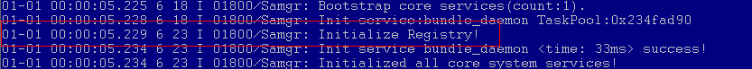

# 使用featured框架开发<a name="ZH-CN_TOPIC_0000001062713987"></a>

-   [接口说明](#section20840587473)
-   [开发步骤](#section32781532131314)
-   [使用featured框架实例](#section1210915266154)

featured框架提供完整的DFX特性，debug版本默认输出到串口及文件，保存路径为“/storage/data/log/“。

## 接口说明<a name="section20840587473"></a>

```
HILOG_DEBUG(type, ...)
HILOG_INFO(type, ...)
HILOG_WARN(type, ...)
HILOG_ERROR(type, ...)
HILOG_FATAL(type, ...)
```

**表 1**  接口参数介绍

<a name="table1872515171474"></a>
<table><thead align="left"><tr id="row772491734711"><th class="cellrowborder" valign="top" width="25.05%" id="mcps1.2.3.1.1"><p id="p1272431714477"><a name="p1272431714477"></a><a name="p1272431714477"></a>参数名字</p>
</th>
<th class="cellrowborder" valign="top" width="74.95%" id="mcps1.2.3.1.2"><p id="p472451724716"><a name="p472451724716"></a><a name="p472451724716"></a>参数含义</p>
</th>
</tr>
</thead>
<tbody><tr id="row15416155714297"><td class="cellrowborder" valign="top" width="25.05%" headers="mcps1.2.3.1.1 "><p id="p041617572292"><a name="p041617572292"></a><a name="p041617572292"></a>type</p>
</td>
<td class="cellrowborder" valign="top" width="74.95%" headers="mcps1.2.3.1.2 "><p id="p74161557172912"><a name="p74161557172912"></a><a name="p74161557172912"></a>兼容mini框架的参数，featured框架忽略传入值。</p>
</td>
</tr>
<tr id="row19724161794719"><td class="cellrowborder" valign="top" width="25.05%" headers="mcps1.2.3.1.1 "><p id="p1072431724710"><a name="p1072431724710"></a><a name="p1072431724710"></a>domainId</p>
</td>
<td class="cellrowborder" valign="top" width="74.95%" headers="mcps1.2.3.1.2 "><p id="p14724181724719"><a name="p14724181724719"></a><a name="p14724181724719"></a>领域标识ID，隐藏参数，需要用户自定义。</p>
</td>
</tr>
<tr id="row5724131714718"><td class="cellrowborder" valign="top" width="25.05%" headers="mcps1.2.3.1.1 "><p id="p2724191724716"><a name="p2724191724716"></a><a name="p2724191724716"></a>tag</p>
</td>
<td class="cellrowborder" valign="top" width="74.95%" headers="mcps1.2.3.1.2 "><p id="p11724917114715"><a name="p11724917114715"></a><a name="p11724917114715"></a>日志tag，隐藏参数，需要用户自定义。</p>
</td>
</tr>
<tr id="row137243177475"><td class="cellrowborder" valign="top" width="25.05%" headers="mcps1.2.3.1.1 "><p id="p1772461754718"><a name="p1772461754718"></a><a name="p1772461754718"></a>fmt</p>
</td>
<td class="cellrowborder" valign="top" width="74.95%" headers="mcps1.2.3.1.2 "><p id="p131236352304"><a name="p131236352304"></a><a name="p131236352304"></a>格式化字符串，</p>
<p id="p2072401710475"><a name="p2072401710475"></a><a name="p2072401710475"></a>支持标识格式化字符串fmt是否是隐私，是{private}时fmt会被认为是隐私，{public}时被认为是公开。</p>
</td>
</tr>
<tr id="row11725161719477"><td class="cellrowborder" valign="top" width="25.05%" headers="mcps1.2.3.1.1 "><p id="p172591734710"><a name="p172591734710"></a><a name="p172591734710"></a>args</p>
</td>
<td class="cellrowborder" valign="top" width="74.95%" headers="mcps1.2.3.1.2 "><p id="p8725617194715"><a name="p8725617194715"></a><a name="p8725617194715"></a>格式化字符串参数。</p>
</td>
</tr>
</tbody>
</table>

接口隐私规则介绍（该功能仅在release版本中有效）：

1.  格式化字符串默认是非隐私

    ```
    HILOG_INFO(0, "Hello World\n"); >> Hello World
    ```

2.  格式化参数默认是隐私

    ```
    HILOG_INFO(0, "Age is %d\n", 10); >> Age is <private>
    ```

3.  %\{private\}标识的参数是隐私

    ```
    HILOG_INFO(0, "Age is %{private}d\n", 10); >> Age is <private>
    ```

4.  %\{public\}标识的参数是非隐私

    ```
    HILOG_INFO(0, "Age is %{public}d\n", 10); >>Age is 10
    ```


## 开发步骤<a name="section32781532131314"></a>

1.  在Build.gn文件中添加动态库依赖。

    ```
    public_deps = [ "//base/hiviewdfx/frameworks/hilog_lite/featured:hilog_shared"]
    ```

2.  增加头文件，定义模块TAG及Domain数值。

    ```
    #include<log.h>
    #undef LOG_TAG
    #undef LOG_DOMAIN
    #define LOG_TAG "MyModule"
    #define LOG_DOMAIN 0xD00000
    ```

3.  添加日志打印代码。

    ```
    HILOG_INFO(0,"Hello World\n"); 
    ```


## 使用featured框架实例<a name="section1210915266154"></a>

以引用samgr\_lite模块使用featured框架作为实例。

1.  源码路径中foundation/distributedschedule/services/samgr\_lite/samgr/source/BUILD.gn中通过依赖语句引用hilog的头文件及依赖库。

    ```
    public_deps = [ "//base/hiviewdfx/frameworks/hilog_lite/featured:hilog_shared" ]
    ```

2.  源码文件中引用头文件并使用HILOG接口。

    参考源码文件distributedschedule/services/samgr\_lite/samgr\_server/source/samgr\_server.c。

    ```
    #include<log.h>
    
    #undef LOG_TAG
    #undef LOG_DOMAIN
    #define LOG_TAG "Samgr"
    #define LOG_DOMAIN 0xD001800
    
    static void InitializeRegistry(void)
    {
        HILOG_INFO(HILOG_MODULE_SAMGR, "Initialize Registry!");
        ...
    }
    ```

    文件内引用头文件<log.h\>或者<hilog/log.h\>，增加模块类别的编号及TAG标识（Samgr）。

3.  InitializeRegistry函数被调用时，打印输出日志内容，内容包括日期，PID（6），taskID（23），级别（I），领域标识ID（01800，取定义值0xD001800的低5位），模块名（Samgr），语句内容（Initialize Registry!）。

    **图 1**  启动阶段打印图示<a name="fig418242621511"></a>  
    


