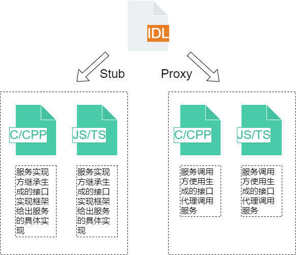
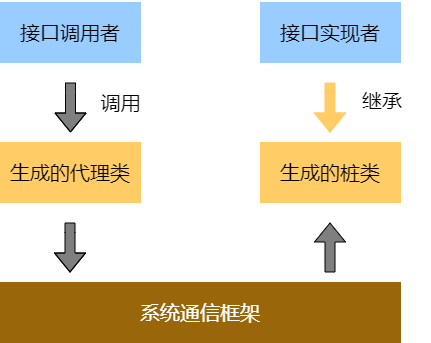
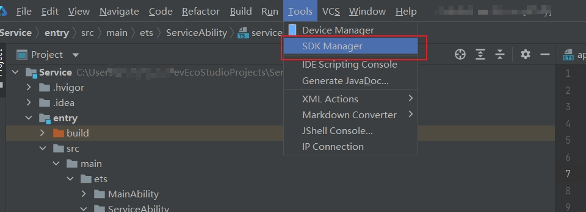
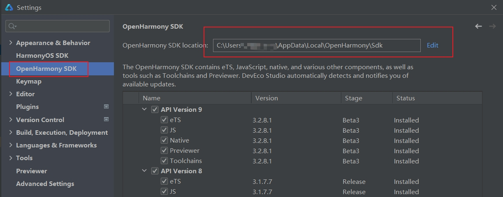

# OpenHarmony IDL工具规格及使用说明书（仅对系统应用开放）

## IDL接口描述语言简介
当客户端和服务器进行IPC通信时，需要定义双方都认可的接口，以保障双方可以成功通信，OpenHarmony IDL（OpenHarmony Interface Definition Language）则是一种定义此类接口的工具。OpenHarmony IDL先把需要传递的对象分解成操作系统能够理解的基本类型，并根据开发者的需要封装跨边界的对象。

  **图1** IDL接口描述



 **OpenHarmony IDL接口描述语言主要用于：** 

- 声明系统服务对外提供的服务接口，根据接口声明在编译时生成跨进程调用（IPC）或跨设备调用（RPC）的代理（Proxy）和桩（Stub）的C/C++代码或JS/TS代码。

- 声明Ability对外提供的服务接口，根据接口声明在编译时生成跨进程调用（IPC）或跨设备调用（RPC）的代理（Proxy）和桩（Stub）的C/C++代码或JS/TS代码。

**图2** IPC/RPC通信模型



 **使用OpenHarmony IDL接口描述语言声明接口具有以下优点：** 

- OpenHarmony IDL中是以接口的形式定义服务，可以专注于定义而隐藏实现细节。

- OpenHarmony IDL中定义的接口可以支持跨进程调用或跨设备调用。根据OpenHarmony IDL中的定义生成的信息或代码可以简化跨进程或跨设备调用接口的实现。

## IDL接口描述语言构成

### 数据类型

#### 基础数据类型
| IDL基本数据类型 | C++基本数据类型 | TS基本数据类型 |
|   --------    |  --------     | --------     |
|void           | void          | void         |
|boolean        | bool          | boolean      |
|byte           | int8_t        | number       |
|short          | int16_t       | number       |
|int            | int32_t       | number       |
|long           | int64_t       | number       |
|float          | float         | number       |
|double         | double        | number       |
|String         | std::string   | string       |

IDL支持的基本数据类型及其映射到C++、TS上的数据类型的对应关系如上表所示。

#### sequenceable数据类型
sequenceable数据类型是指使用“sequenceable”关键字声明的数据，表明该数据类型可以被序列化进行跨进程或跨设备传递。sequenceable在C++与TS中声明方式存在一定差异。

在C++中sequenceable数据类型的声明放在文件的头部，以“sequenceable includedir..namespace.typename”的形式声明。具体而言。声明可以有如下三个形式：

```cpp
sequenceable includedir..namespace.typename
sequenceable includedir...typename
sequenceable namespace.typename
```

其中，includedir表示该数据类型头文件所在目录，includedir中以“.”作为分隔符。namespace表示该数据类型所在命名空间，namespace中同样以“.”作为分隔符。typename表示数据类型，数据类型中不能包含非英文字符类型的其他符号。includedir与namespace之间通过“..”分割，如果类型声明的表达式中不包含“..”,除去最后一个typename之外的字符都会被解析为命名空间。例如：

```cpp
sequenceable a.b..C.D
```

 上述声明在生成的的C++头文件中将被解析为如下代码：

```cpp
#include  “a/b/d.h”
using C::D;
```

TS声明放在文件的头部，以 “sequenceable namespace.typename;”的形式声明。具体而言，声明可以有如下形式（idl为对应namespace，MySequenceable为对应typename）：

```ts
sequenceable idl.MySequenceable
```

其中，namespace是该类型所属的命名空间，typename是类型名。MySequenceable类型表示可以通过Parcel进行跨进程传递。sequenceable数据类型并不在OpenHarmony IDL文件中定义，而是定义在.ts文件中。因此，OpenHarmony IDL工具将根据声明在生成的.ts代码文件中加入如下语句：

```ts
import MySequenceable from "./my_sequenceable"
```

需要注意的是，IDL并不负责该类型的代码实现，仅仅按照指定的形式引入该头文件或import指定模块，并使用该类型，因此开发者需要自行保证引入目录、命名空间及类型的正确性。

#### 接口类型
 接口类型是指OpenHarmony IDL文件中定义的接口。对于当前IDL文件中定义的接口，可以直接使用它作为方法参数类型或返回值类型。而在其它OpenHarmony IDL文件中定义的接口，则需要在文件的头部进行前置声明。 

 C++中声明的形式与sequenceable类型相似，具体而言可以有如下形式： 

```cpp
interface includedir..namespace.typename
```

 TS中声明的形式，具体而言可以有如下形式： 

```ts
interface namespace.interfacename
```

其中，namespace是该接口所属的命名空间，interfacename是接口名。例如：“interface OHOS.IIdlTestObserver;”声明了在其他OpenHarmony IDL文件定义的IIdlTestObserver接口，该接口可以作为当前定义中方法的参数类型或返回值类型使用。OpenHarmony IDL工具将根据该声明在生成的TS代码文件中加入如下语句：

```ts
import IIdlTestObserver from "./i_idl_test_observer"
```

#### 数组类型
数组类型使用“T[]”表示，其中T可以是基本数据类型、sequenceable数据类型、interface类型和数组类型。该类型在C++生成代码中将被生成为std::vector&lt;T&gt;类型。
OpenHarmony IDL数组数据类型与TS数据类型、C++数据类型的对应关系如下表所示：

|OpenHarmony IDL数据类型  | C++数据类型           | TS数据类型     |
|   -------              |  --------            |  --------    |
|T[]                     | std::vector&lt;T&gt; | T[]          |

#### 容器类型
IDL支持两种容器类型，即List和Map。其中List类型容器的用法为List&lt;T&gt;;Map容器的用法为Map<KT,VT>,其中T、KT、VT为基本数据类型、sequenceable类型、interface类型、数组类型或容器类型。

List类型在C++代码中被映射为std::list,Map容器被映射为std::map。

List类型在TS代码中不支持,Map容器被映射为Map。

OpenHarmony IDL容器数据类型与Ts数据类型、C++数据类型的对应关系如下表所示：

|OpenHarmony IDL数据类型  | C++数据类型       | TS数据类型     |
|   --------             |  --------        |  -------     |
|List&lt;T&gt;           | std::list        | 不支持        |
|Map<KT,VT>              | std::map         | Map          |


### IDL文件编写规范
一个idl文件只能定义一个interface类型，且该interface名称必须和文件名相同。idl文件的接口定义使用BNF范式描述，其基本定义的形式如下：

```
[<*interface_attr_declaration*>]interface<*interface_name_with_namespace*>{<*method_declaration*>}
```

其中，<*interface_attr_declaration*>表示接口属性声明。当前仅支持“oneway”属性，表示该接口中的接口都是单向方法，即调用方法后不用等待该方法执行即可返回。这个属性为可选项，如果未声明该属性，则默认为同步调用方法。接口名需要包含完整的接口头文件目录及命名空间，且必须包含方法声明，不允许出现空接口。
接口内的方法声明形式为：

```
[<*method_attr_declaration*>]<*result_type*><*method_declaration*>
```

其中，<*method_attr_declaration*>表示接口属性说明。当前仅支持“oneway”属性，表示该方法为单向方法，即调用方法后不用等待该方法执行即可返回。这个属性为可选项，如果未声明该属性，则默认为同步调用方法。<*result_type*>为返回值类型，<*method_declaration*>是方法名和各个参数声明。
参数声明的形式为：

```
[<*formal_param_attr*>]<*type*><*identifier*>
```

其中<*formal_param_attr*>的值为“in”，“out”，“inout”,分别表示该参数是输入参数，输出参数或输入输出参数。需要注意的是，如果一个方法被声明为oneway，则该方法不允许有输出类型的参数（及输入输出类型）和返回值。

## 开发步骤

### 获取IDL工具
#### 方法一（推荐）：
1. 在linux系统，下载OpenHarmony的两个仓：ability_idl_tool代码仓、third_party_bounds_checking_function代码仓。
2. 进入ability_idl_tool代码仓，在Makefile所在目录执行make命令（**注意修改MakefileLinux中关于bounds_checking_function的相对位置**）。
3. make执行完成后，在当前目录下会生成idl-gen可执行文件，可用于idl文件本地调试。

#### 方法二：
首先，打开DevEco Studio—>Tools—>SDK Manager，查看OpenHarmony SDK的本地安装路径，此处以DevEco Studio 3.0.0.993版本为例，查看方式如下图所示。



进入对应路径后，查看toolchains->3.x.x.x（对应版本号命名文件夹）下是否存在idl工具的可执行文件。

> **注意**：
> 
> 请保证使用最新版的SDK，版本老旧可能导致部分语句报错。

若不存在，可对应版本前往[docs仓版本目录](../../release-notes)下载SDK包，以[3.2Beta3版本](../../release-notes/OpenHarmony-v3.2-beta3.md)为例，可通过镜像站点获取。

关于如何替换DevEco Studio的SDK包具体操作，参考[full-SDK替换指南](../faqs/full-sdk-compile-guide.md)中的替换方法。

得到idl工具的可执行文件后，根据具体场景进行后续开发步骤。

### TS开发步骤

#### 创建.idl文件

 开发者可以使用TS编程语言构建.idl文件。

 例如，此处构建一个名为IIdlTestService.idl的文件，文件内具体内容如下：  

```cpp
  interface OHOS.IIdlTestService {
      int TestIntTransaction([in] int data);
      void TestStringTransaction([in] String data);
      void TestMapTransaction([in] Map<int, int> data);
      int TestArrayTransaction([in] String[] data);
  }
```

在idl的可执行文件所在文件夹下执行命令 `idl -gen-ts -d dir -c dir/IIdlTestService.idl`。

-d后的dir为目标输出目录，以输出文件夹名为IIdlTestServiceTs为例，在idl可执行文件所在目录下执行`idl -gen-ts -d IIdlTestServiceTs -c IIdlTestServiceTs/IIdlTestService.idl`，将会在执行环境的dir目录（即IIdlTestServiceTs目录）中生成接口文件、Stub文件、Proxy文件。

> **注意**：生成的接口类文件名称和.idl文件名称保持一致，否则会生成代码时会出现错误。

以名为`IIdlTestService.idl`的.idl文件、目标输出文件夹为IIdlTestServiceTs为例，其目录结构应类似于:

```
├── IIdlTestServiceTs  # idl代码输出文件夹
│   ├── i_idl_test_service.ts  # 生成文件
│   ├── idl_test_service_proxy.ts  # 生成文件
│   ├── idl_test_service_stub.ts  # 生成文件
│   └── IIdlTestService.idl  # 构造的.idl文件
└── idl.exe  # idl的可执行文件
```

#### 服务端公开接口

OpenHarmony IDL工具生成的Stub类是接口类的抽象实现，并且会声明.idl文件中的所有方法。 

```ts
import {testIntTransactionCallback} from "./i_idl_test_service";
import {testStringTransactionCallback} from "./i_idl_test_service";
import {testMapTransactionCallback} from "./i_idl_test_service";
import {testArrayTransactionCallback} from "./i_idl_test_service";
import IIdlTestService from "./i_idl_test_service";
import rpc from "@ohos.rpc";

export default class IdlTestServiceStub extends rpc.RemoteObject implements IIdlTestService {
    constructor(des: string) {
        super(des);
    }
    
    async onRemoteMessageRequest(code: number, data: rpc.MessageSequence, reply: rpc.MessageSequence,
        option: rpc.MessageOption): Promise<boolean> {
        console.log("onRemoteMessageRequest called, code = " + code);
        if (code == IdlTestServiceStub.COMMAND_TEST_INT_TRANSACTION) {
            let _data = data.readInt();
            this.testIntTransaction(_data, (errCode: number, returnValue: number) => {
                reply.writeInt(errCode);
                if (errCode == 0) {
                    reply.writeInt(returnValue);
                }
            });
            return true;
        } else if (code == IdlTestServiceStub.COMMAND_TEST_STRING_TRANSACTION) {
            let _data = data.readString();
            this.testStringTransaction(_data, (errCode: number) => {
                reply.writeInt(errCode);
            });
            return true;
        } else if (code == IdlTestServiceStub.COMMAND_TEST_MAP_TRANSACTION) {
            let _data: Map<number, number> = new Map();
            let _dataSize = data.readInt();
            for (let i = 0; i < _dataSize; ++i) {
                let key = data.readInt();
                let value = data.readInt();
                _data.set(key, value);
            }
            this.testMapTransaction(_data, (errCode: number) => {
                reply.writeInt(errCode);
            });
            return true;
        } else if (code == IdlTestServiceStub.COMMAND_TEST_ARRAY_TRANSACTION) {
            let _data = data.readStringArray();
            this.testArrayTransaction(_data, (errCode: number, returnValue: number) => {
                reply.writeInt(errCode);
                if (errCode == 0) {
                    reply.writeInt(returnValue);
                }
            });
            return true;
        } else {
            console.log("invalid request code" + code);
        }
        return false;
    }
    
    testIntTransaction(data: number, callback: testIntTransactionCallback): void{}
    testStringTransaction(data: string, callback: testStringTransactionCallback): void{}
    testMapTransaction(data: Map<number, number>, callback: testMapTransactionCallback): void{}
    testArrayTransaction(data: string[], callback: testArrayTransactionCallback): void{}

    static readonly COMMAND_TEST_INT_TRANSACTION = 1;
    static readonly COMMAND_TEST_STRING_TRANSACTION = 2;
    static readonly COMMAND_TEST_MAP_TRANSACTION = 3;
    static readonly COMMAND_TEST_ARRAY_TRANSACTION = 4;
}
```

开发者需要继承.idl文件中定义的接口类并实现其中的方法。在本示例中，我们继承了IdlTestServiceStub接口类并实现了其中的testIntTransaction、testStringTransaction、testMapTransaction和testArrayTransaction方法。具体的示例代码如下：

```ts
import {testIntTransactionCallback} from "./i_idl_test_service"
import {testStringTransactionCallback} from "./i_idl_test_service"
import {testMapTransactionCallback} from "./i_idl_test_service";
import {testArrayTransactionCallback} from "./i_idl_test_service";
import IdlTestServiceStub from "./idl_test_service_stub"


class IdlTestImp extends IdlTestServiceStub {

    testIntTransaction(data: number, callback: testIntTransactionCallback): void
    {
        callback(0, data + 1);
    }
    testStringTransaction(data: string, callback: testStringTransactionCallback): void
    {
        callback(0);
    }
    testMapTransaction(data: Map<number, number>, callback: testMapTransactionCallback): void
    {
        callback(0);
    }
    testArrayTransaction(data: string[], callback: testArrayTransactionCallback): void
    {
        callback(0, 1);
    }
}
```

在服务实现接口后，需要向客户端公开该接口，以便客户端进程绑定。如果开发者的服务要公开该接口，请扩展Ability并实现onConnect()从而返回IRemoteObject，以便客户端能与服务进程交互。服务端向客户端公开IRemoteAbility接口的代码示例如下:

```ts
import Want from '@ohos.app.ability.Want';
import rpc from "@ohos.rpc";

class ServiceAbility {
  onStart() {
    console.info('ServiceAbility onStart');
  }
  onStop() {
    console.info('ServiceAbility onStop');
  }
  onCommand(want: Want, startId: number) {
    console.info('ServiceAbility onCommand');
  }
  onConnect(want: Want) {
    console.info('ServiceAbility onConnect');
    try {
      console.log('ServiceAbility want:' + typeof(want));
      console.log('ServiceAbility want:' + JSON.stringify(want));
      console.log('ServiceAbility want name:' + want.bundleName)
    } catch(err) {
      console.log('ServiceAbility error:' + err)
    }
    console.info('ServiceAbility onConnect end');
    return new IdlTestImp('connect') as rpc.RemoteObject;
  }
  onDisconnect(want: Want) {
    console.info('ServiceAbility onDisconnect');
    console.info('ServiceAbility want:' + JSON.stringify(want));
  }
}

export default new ServiceAbility()
```

#### 客户端调用IPC方法

客户端调用connectServiceExtensionAbility()以连接服务时，客户端的onAbilityConnectDone中的onConnect回调会接收服务的onConnect()方法返回的IRemoteObject实例。由于客户端和服务在不同应用内，所以客户端应用的目录内必须包含.idl文件(SDK工具会自动生成Proxy代理类)的副本。客户端的onAbilityConnectDone中的onConnect回调会接收服务的onConnect()方法返回的IRemoteObject实例，使用IRemoteObject创建IdlTestServiceProxy类的实例对象testProxy，然后调用相关IPC方法。示例代码如下：

```ts
import common from '@ohos.app.ability.common';
import Want from '@ohos.app.ability.Want';
import IdlTestServiceProxy from './idl_test_service_proxy'

function callbackTestIntTransaction(result: number, ret: number): void {
  if (result == 0 && ret == 124) {
    console.log('case 1 success');
  }
}

function callbackTestStringTransaction(result: number): void {
  if (result == 0) {
    console.log('case 2 success');
  }
}

function callbackTestMapTransaction(result: number): void {
  if (result == 0) {
    console.log('case 3 success');
  }
}

function callbackTestArrayTransaction(result: number, ret: number): void {
  if (result == 0 && ret == 124) {
    console.log('case 4 success');
  }
}

let onAbilityConnectDone: common.ConnectOptions = {
  onConnect: (elementName, proxy) => {
    let testProxy: IdlTestServiceProxy = new IdlTestServiceProxy(proxy);
    let testMap: Map<number, number> = new Map();
    testMap.set(1, 1);
    testMap.set(1, 2);
    testProxy.testIntTransaction(123, callbackTestIntTransaction);
    testProxy.testStringTransaction('hello', callbackTestStringTransaction);
    testProxy.testMapTransaction(testMap, callbackTestMapTransaction);
    testProxy.testArrayTransaction(['1','2'], callbackTestMapTransaction);
  },
  onDisconnect: (elementName) => {
    console.log('onDisconnectService onDisconnect');
  },
  onFailed: (code) => {
    console.log('onDisconnectService onFailed');
  }
};

let context: common.UIAbilityContext = this.context;

function connectAbility(): void {
    let want: Want = {
        bundleName: 'com.example.myapplicationidl',
        abilityName: 'com.example.myapplicationidl.ServiceAbility'
    };
    let connectionId = -1;
    connectionId = context.connectServiceExtensionAbility(want, onAbilityConnectDone);
}


```

#### IPC传递sequenceable对象

开发者可以通过 IPC 接口，将某个类从一个进程发送至另一个进程。但是，必须确保 IPC 通道的另一端可使用该类的代码，并且该类必须支持marshalling和unmarshalling方法。系统需要通过marshalling和unmarshalling方法将对象序列化和反序列化成各进程能识别的对象。

 **如需创建支持sequenceable 类型数据，开发者必须执行以下操作：** 

1. 实现marshalling方法，它会获取对象的当前状态并将其序列化后写入Parcel。
2. 实现unmarshalling方法，它会从Parcel中反序列化出对象。

MySequenceable类的代码示例如下：

```ts
import rpc from '@ohos.rpc';
export default class MySequenceable implements rpc.Sequenceable {
    constructor(num: number, str: string) {
        this.num = num;
        this.str = str;
    }
    getNum() : number {
        return this.num;
    }
    getString() : string {
        return this.str;
    }
    marshalling(messageParcel: rpc.MessageParcel) {
        messageParcel.writeInt(this.num);
        messageParcel.writeString(this.str);
        return true;
    }
    unmarshalling(messageParcel: rpc.MessageParcel) {
        this.num = messageParcel.readInt();
        this.str = messageParcel.readString();
        return true;
    }
    private num: number;
    private str: string;
}
```

### C++开发SA步骤（编译期自动生成SA接口模板代码）

#### 创建.idl文件

开发者使用C++编程语言构建.idl文件。

例如，此处构建一个名为IQuickFixManager.idl的文件，文件内具体内容如下：

```
/*
 * Copyright (c) 2023 Huawei Device Co., Ltd.
 * Licensed under the Apache License, Version 2.0 (the "License");
 * you may not use this file except in compliance with the License.
 * You may obtain a copy of the License at
 *
 *     http://www.apache.org/licenses/LICENSE-2.0
 *
 * Unless required by applicable law or agreed to in writing, software
 * distributed under the License is distributed on an "AS IS" BASIS,
 * WITHOUT WARRANTIES OR CONDITIONS OF ANY KIND, either express or implied.
 * See the License for the specific language governing permissions and
 * limitations under the License.
 */

sequenceable QuickFixInfo..OHOS.AAFwk.ApplicationQuickFixInfo;
interface OHOS.AAFwk.IQuickFixManager {
    void ApplyQuickFix([in] String[] quickFixFiles, [in] boolean isDebug);
    void GetApplyedQuickFixInfo([in] String bundleName, [out] ApplicationQuickFixInfo quickFixInfo);
    void RevokeQuickFix([in] String bundleName);
}
```

#### 修改BUILD.gn文件
提供两种配置方法，选择其中一种即可

##### 修改方法一（推荐，支持批量处理idl文件并编译为so）

1. 导入IDL工具模板到当前BUILD.gn文件。

   ```bash
   # 此处不需要修改，直接复制到gn中即可
   import("//foundation/ability/idl_tool/idl_config.gni")
   ```

2. 调用IDL工具生成C++模板文件。

   ```bash
   
   # 使用idl_gen_interface生成模板文件、输入的参数名在deps中会使用
   idl_gen_interface("EEEFFFGGG") {
     # 开发者定义的.idl名，须与gn文件在同一路径下
     sources = [
      "IAxxBxxCxx.idl",
      "IAxxBxxCxx2.idl",
     ]

     # 根据idl文件中对自定义对象的使用，编译为so时需要增加自定义对应使用的cpp的编译，默认为空
     sources_cpp = []

     # 编译so时增加configs配置
     configs = []

     # 编译so时增加public_deps配置
     sequenceable_pub_deps = []

     # 编译so时增加external_deps配置
     sequeceable_ext_deps = []

     # 编译so时增加innerapi_tags
     innerapi_tags = ""

     # 编译so时增加sanitize
     sanitize = ""


     # 开启hitrace，值是hitrace_meter.h文件中定义的uint64_t类型标识,需要填入常量的变量名
     hitrace = "HITRACE_TAG_ABILITY_MANAGER"
     
     # 开启hilog，Domain ID 使用16进制的整数
     log_domainid = "0xD003900"
     # 开启hilog，字符串类型tag名、一般为子系统名称
     log_tag = "QuickFixManagerService"

     # 必填：编译so时增加subsystem_name，与业务保持一致，如quick_fix使用：
     subsystem_name = "ability"
     # 必填：编译so时增加part_name，与业务保持一致，如quick_fix使用：
     part_name = "ability_runtime"
   }
   ```

   配置hilog，参数log_domainid和log_tag必须成对出现，若只写一个会编译错误，quick_fix示例如下：

   ```bash
   idl_gen_interface("quickfix_manager_interface") {
     sources = [
      "IQuickFixManager.idl"
     ]
     hitrace = "HITRACE_TAG_ABILITY_MANAGER"
     log_domainid = "0xD003900"
     log_tag = "QuickFixManagerService"    #只有一个log_tag，编译会错误，同理只有log_domainid，编译也会错误
   }
   ```

3. 在BUILD.gn中添加依赖“EEEFFFGGG”。

   ```bash
   deps = [
      # 使用idl_gen_interface函数参数名，前面加上lib，后面加上_proxy和_stub即为生成的so名称
      ":libEEEFFFGGG_proxy", # 如果需要 proxy 的so，加上这个依赖
      ":libEEEFFFGGG_stub", # 如果需要 stub 的so，加上这个依赖
     ]
   ```

   deps添加的依赖名，必须同idl_gen_interface函数参数名相同，quick_fix示例如下：

   ```bash
   idl_gen_interface("quickfix_manager_interface") {
     sources = [
      "IQuickFixManager.idl"
     ]
     hitrace = "HITRACE_TAG_ABILITY_MANAGER"
     log_domainid = "0xD003900"
     log_tag = "QuickFixManagerService"
   }
   deps = [
    "${ability_runtime_innerkits_path}/app_manager:app_manager",
    ":libquickfix_manager_interface_proxy", # idl_gen_interface函数参数名前面加上lib，后面加上_proxy
    ":libquickfix_manager_interface_stub", # idl_gen_interface函数参数名前面加上lib，后面加上_stub
   ]
   ```

6. 在BUILD.gn中添加模板文件的外部依赖。

   模板文件的外部依赖需要自己添加到external_deps里。
   若之前已存在，不需要重复添加，若重复添加会导致编译错误。

   ```bash
     external_deps = [
     # 模板文件必须的依赖
     "c_utils:utils",
     # hilog输出必须的依赖
     "hilog:libhilog",
     # hitrace输出必须的依赖（如果idl_gen_interface中未配置hitrace，则不需要此依赖）
     "hitrace:hitrace_meter",
     # 模板文件必须的依赖
     "ipc:ipc_core",
   ]
   ```

##### 修改方法二

1. 导入IDL工具模板到当前BUILD.gn文件。

   ```bash
   # 此处不需要修改，直接复制到gn中即可
   import("//foundation/ability/idl_tool/idl_config.gni")
   ```

2. 调用IDL工具生成C++模板文件。

   示例中的axx_bxx_cxx需要替换为生成的stub和proxy的.cpp名。

   ```bash
   idl_interface_sources = [
     # axx_bxx_cxx为需要修改为生成proxy的.cpp名
     "${target_gen_dir}/axx_bxx_cxx_proxy.cpp",                                            
     # axx_bxx_cxx为需要修改为生成stub的.cpp名
     "${target_gen_dir}/axx_bxx_cxx_stub.cpp",
   ]
   
   # 使用idl_gen_interface生成模板文件、需输入参数名后面的deps中会使用
   idl_gen_interface("EEEFFFGGG") {
     # 开发者定义的.idl名，与gn文件在同一路径下
     src_idl = rebase_path("IAxxBxxCxx.idl")
     # proxy和stub模板.cpp文件, 此处不需要修改，直接复制到gn中即可
     dst_file = string_join(",", idl_interface_sources)
     # 开启hitrace，值是hitrace_meter.h文件中定义的uint64_t类型标识,需要填入常量的变量名
     hitrace = "HITRACE_TAG_ABILITY_MANAGER"
     # 开启hilog，Domain ID 使用16进制的整数
     log_domainid = "0xD003900"
     # 开启hilog，字符串类型tag名、一般为子系统名称
     log_tag = "QuickFixManagerService"
   }
   ```

   axx_bxx_cxx_proxy.cpp和axx_bxx_cxx_stub.cpp的命名与.idl文件小写名相同，遇到大写时加"_"。

   ```bash
   # 例：.idl文件为IQuickFixManager.idl
   axx_bxx_cxx_proxy.cpp为：quick_fix_manager_proxy.cpp
   axx_bxx_cxx_stub.cpp为：quick_fix_manager_stub.cpp
   ```

   如果需要生成的模板文件名第一个字母为I时，需要在interface命名时在前面加一个I。

   ```bash
   # 例：生成的模板文件为quick_fix_manager_proxy.cpp时interface的名称应为IQuickFixManager
   # .idl文件中的定义
   interface OHOS.AAFwk.IQuickFixManager {
       void ApplyQuickFix([in] String[] quickFixFiles, [in] boolean isDebug);
       void GetApplyedQuickFixInfo([in] String bundleName, [out] ApplicationQuickFixInfo quickFixInfo);
       void RevokeQuickFix([in] String bundleName);
   }
   ```

   配置hilog，参数log_domainid和log_tag必须成对出现，若只写一个会编译错误。

   ```bash
   idl_gen_interface("quickfix_manager_interface") {
     src_idl = rebase_path("IQuickFixManager.idl")
     dst_file = string_join(",", idl_interface_sources)
     hitrace = "HITRACE_TAG_ABILITY_MANAGER"
     log_domainid = "0xD003900"
     log_tag = "QuickFixManagerService"    #只有一个log_tag，编译会错误，同理只有log_domainid，编译也会错误
   }
   ```

3. 在BUILD.gn中添加模板文件的头文件路径。

   只需将“${target_gen_dir}”名添加到现有include_dirs中即可，其它不需要更改。

   ```bash
   include_dirs = [
     "aaa/bbb/ccc",        # 原有头文件路径
     "${target_gen_dir}",  # 模板头文件路径
   ]
   ```

4. 在BUILD.gn中添加模板文件.cpp文件路径。

   若sources中有axx_bxx_cxx_proxy.cpp和axx_bxx_cxx_stub.cpp需要删除，并加上sources += filter_include(output_values, [ "*.cpp" ])。

   ```bash
   output_values = get_target_outputs(":EEEFFFGGG") # 返回给定目标标签的输出文件列表，替换EEEFFFGGG
   sources = [ "axx_bxx_cxx_proxy.cpp" ]  # 需要删除axx_bxx_cxx_proxy.cpp
   sources += filter_include(output_values, [ "*.cpp" ]) # filter_include选中符合的列表，直接复制即可
   ```

5. 在BUILD.gn中添加依赖“EEEFFFGGG”。

   ```bash
   deps = [
       ":EEEFFFGGG",
     ]
   ```

   deps添加的依赖名，必须同idl_gen_interface函数参数名相同。

   ```bash
   idl_gen_interface("quickfix_manager_interface") {
     src_idl = rebase_path("IQuickFixManager.idl")
     dst_file = string_join(",", idl_interface_sources)
     hitrace = "HITRACE_TAG_ABILITY_MANAGER"
     log_domainid = "0xD003900"
     log_tag = "QuickFixManagerService"
   }
   deps = [
    "${ability_runtime_innerkits_path}/app_manager:app_manager",
    ":quickfix_manager_interface"]    # idl_gen_interface函数参数名相同
   ```

6. 在BUILD.gn中添加模板文件的外部依赖。

   模板文件的外部依赖需要自己添加到external_deps里。

   若之前已存在，不需要重复添加，若重复添加会导致编译错误。

   ```bash
     external_deps = [
     # 模板文件必须的依赖
     "c_utils:utils",
     # hilog输出必须的依赖
     "hilog:libhilog",
     # hitrace输出必须的依赖
     "hitrace:hitrace_meter",
     # 模板文件必须的依赖
     "ipc:ipc_core",
   ]
   ```

#### 实例

**以应用快速修复服务为例：**

1. 创建名为IQuickFixManager.idl文件。

   在创建.idl文件时，interface名称必须和.idl文件名相同，否则会在生成代码时出现错误。

   创建.idl的文件路径与功能代码BUILD.gn的路径相同。

   实例中的位置为：foundation/ability/ability_runtime/interfaces/inner_api/quick_fix/。

   ```bash
   /*
    * Copyright (c) 2023 Huawei Device Co., Ltd.
    * Licensed under the Apache License, Version 2.0 (the "License");
    * you may not use this file except in compliance with the License.
    * You may obtain a copy of the License at
    *
    *     http://www.apache.org/licenses/LICENSE-2.0
    *
    * Unless required by applicable law or agreed to in writing, software
    * distributed under the License is distributed on an "AS IS" BASIS,
    * WITHOUT WARRANTIES OR CONDITIONS OF ANY KIND, either express or implied.
    * See the License for the specific language governing permissions and
    * limitations under the License.
    */
   
   sequenceable QuickFixInfo..OHOS.AAFwk.ApplicationQuickFixInfo;
   interface OHOS.AAFwk.IQuickFixManager {
       void ApplyQuickFix([in] String[] quickFixFiles, [in] boolean isDebug);
       void GetApplyedQuickFixInfo([in] String bundleName, [out] ApplicationQuickFixInfo quickFixInfo);
       void RevokeQuickFix([in] String bundleName);
   }
   ```

   在创建.idl文件时，需要将返回值为int的函数，修改为void。

   ```bash
   # 例 quick_fix_manager_client.h中的函数
       int32_t ApplyQuickFix(const std::vector<std::string> &quickFixFiles);
       int32_t GetApplyedQuickFixInfo(const std::string &bundleName, ApplicationQuickFixInfo &quickFixInfo);
       int32_t RevokeQuickFix(const std::string &bundleName);
   # .idl文件中的定义
   interface OHOS.AAFwk.QuickFixManager {
       void ApplyQuickFix([in] String[] quickFixFiles);
       void GetApplyedQuickFixInfo([in] String bundleName, [out] ApplicationQuickFixInfo quickFixInfo);
       void RevokeQuickFix([in] String bundleName);
   }
   ```

2. 修改BUILD.gn文件。

   ```bash
   # Copyright (c) 2023 Huawei Device Co., Ltd.
   # Licensed under the Apache License, Version 2.0 (the "License");
   # you may not use this file except in compliance with the License.
   # You may obtain a copy of the License at
   #
   #     http://www.apache.org/licenses/LICENSE-2.0
   #
   # Unless required by applicable law or agreed to in writing, software
   # distributed under the License is distributed on an "AS IS" BASIS,
   # WITHOUT WARRANTIES OR CONDITIONS OF ANY KIND, either express or implied.
   # See the License for the specific language governing permissions and
   # limitations under the License.
   
   import("//build/ohos.gni")
   import("//foundation/ability/ability_runtime/ability_runtime.gni")
   import("//foundation/ability/idl_tool/idl_config.gni")
   
   idl_interface_sources = [
     "${target_gen_dir}/quick_fix_manager_proxy.cpp",
     "${target_gen_dir}/quick_fix_manager_stub.cpp",
   ]
   
   idl_gen_interface("quickfix_manager_interface") {
     src_idl = rebase_path("IQuickFixManager.idl")
     dst_file = string_join(",", idl_interface_sources)
     hitrace = "HITRACE_TAG_ABILITY_MANAGER"
     log_domainid = "0xD003900"
     log_tag = "QuickFixManagerService"
   }
   
   config("quickfix_config") {
     visibility = [ ":*" ]
     include_dirs = [
       "include",
       "${target_gen_dir}",
     ]
     cflags = []
     if (target_cpu == "arm") {
       cflags += [ "-DBINDER_IPC_32BIT" ]
     }
   }
   
   ohos_shared_library("quickfix_manager") {
     configs = [ "${ability_runtime_services_path}/common:common_config" ]
     public_configs = [ ":quickfix_config" ]
   
     output_values = get_target_outputs(":quickfix_manager_interface")
     sources = [
       "src/quick_fix_error_utils.cpp",
       "src/quick_fix_info.cpp",
       "src/quick_fix_load_callback.cpp",
       "src/quick_fix_manager_client.cpp",
       "src/quick_fix_utils.cpp",
     ]
     sources += filter_include(output_values, [ "*.cpp" ])
     defines = [ "AMS_LOG_TAG = \"QuickFixService\"" ]
     deps = [
       ":quickfix_manager_interface",
       "${ability_runtime_innerkits_path}/app_manager:app_manager",
     ]
   
     external_deps = [
       "ability_base:want",
       "bundle_framework:appexecfwk_base",
       "bundle_framework:appexecfwk_core",
       "c_utils:utils",
       "hilog:libhilog",
       "hitrace:hitrace_meter",
       "ipc:ipc_single",
       "safwk:system_ability_fwk",
       "samgr:samgr_proxy",
     ]
   
     innerapi_tags = [ "platformsdk" ]
     subsystem_name = "ability"
     part_name = "ability_runtime"
   }
   ```

3. 生成模板文件的路径及目录结构。

   编译以rk3568为例，实例中生成的模板文件路径为：out/rk3568/gen/foundation/ability/ability_runtime/interfaces/inner_api/quick_fix/。

   其中foundation/ability/ability_runtime/interfaces/inner_api/quick_fix/为.idl文件所在的相对路径。

   生成文件目录结构为：

   ```bash
   |-- out/rk3568/gen/foundation/ability/ability_runtime/interfaces/inner_api/quick_fix/
      |-- iquick_fix_manager.h
      |-- quick_fix_manager_stub.h
      |-- quick_fix_manager_stub.cpp
      |-- quick_fix_manager_proxy.h
      |-- quick_fix_manager_proxy.cpp
   ```


## 相关实例

针对IDL的使用，有以下相关实例可供参考：

- [Ability与ServiceExtensionAbility通信（ArkTS）(Full SDK)（API9）](https://gitee.com/openharmony/applications_app_samples/tree/OpenHarmony-5.0.1-Release/code/SystemFeature/IDL/AbilityConnectServiceExtension)