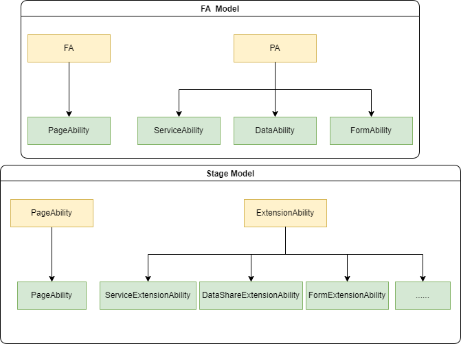
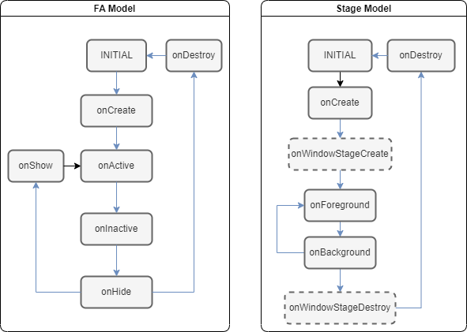

# Ability框架概述

Ability是OpenHarmony系统对应用的基本抽象。

每个Ability是完成独立业务的应用组件，是系统调度应用的最小单元。一个应用可以包含一个或多个Ability。

Ability框架模型具有两种形态：

- 第一种形态称为FA模型。API 8及其更早版本的应用只能使用FA模型。FA模型将Ability分为Page Ability、Service Ability以及Data Ability几种类型。
- 第二种形态称为Stage模型，这是自API 9新增的模型。Stage模型将Ability分为UIAbility和ExtensionAbility两大类，其中ExtensionAbility又被扩展为ServiceExtensionAbility、FormExtensionAbility、DataShareExtensionAbility等一系列ExtensionAbility，以便满足更多的使用场景。

自API 9开始，Stage模型是主推的开发模型。

Stage模型的设计，主要是为了开发者更加方便地开发出分布式环境下的复杂应用。下表给出了两种模型在设计上的差异：

| 对比           | FA模型                                                       | Stage模型                                                |
| -------------- | ------------------------------------------------------------ | -------------------------------------------------------- |
| 应用组件开发方式       | 类Web的开发方式。                     | 面向对象的开发方式。             |
| 引擎实例       | 每个Ability实例独占一个虚拟机实例。               | 多个Ability实例可以共享同一个虚拟机实例。       |
| 进程内对象共享 | 不支持。                                                     | 支持。                                                   |
| 包描述文件     | 使用`config.json`描述HAP和组件信息，组件必须使用固定的文件名。 | 使用`module.json5`描述HAP和组件信息，可以指定入口文件名。 |
| 组件           | 提供PageAbility(页面展示)，ServiceAbility(服务)，DataAbility(数据分享)以及FormAbility(卡片)。 | 提供UIAbility(页面展示)、Extension(基于场景的服务扩展)。   |

除了上述设计上的差异外，对于开发者而言，两种模型的主要区别在于：

* Ability类型存在差异；

  

* Ability生命周期存在差异；

  

两种模型的基本介绍，详见[FA模型综述](fa-brief.md)及[Stage模型综述](stage-brief.md)。

## 相关实例

### FA 模型

- [Page内和Page间导航跳转（ArkTS）（API8）](https://gitee.com/openharmony/codelabs/tree/master/Ability/PageAbility)

### Stage 模型

- [Stage模型介绍（ArkTS）（API9）](https://gitee.com/openharmony/applications_app_samples/tree/master/ability/StageModel)
- [窗口扩展（ArkTS）（API9）](https://gitee.com/openharmony/applications_app_samples/tree/master/ability/WindowExtAbility)
- [系统任务管理（ArkTS）（API9）](https://gitee.com/openharmony/applications_app_samples/tree/master/ability/MissionManager)
- [仿桌面应用（ArkTS）（API9）](https://gitee.com/openharmony/applications_app_samples/tree/master/ability/Launcher)
