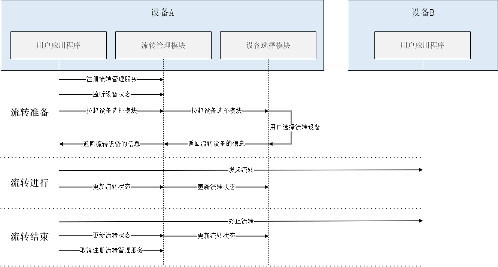

# ContinuationManager开发指导

> 说明：本模块接口用于拉起系统中的设备选择模块，由于该模块功能暂不完备，因此**流转能力整体暂不支持用于应用开发**。

## 场景简介
随着全场景多设备生活方式的不断深入，用户拥有的设备越来越多，每个设备都能在适合的场景下提供良好的体验，但是，每个设备也有使用场景的局限。流转能力致力于打破设备界限，多设备联动，使用户应用程序可分可合、可流转，实现体验升级。

continuationManager作为流转能力的入口，主要用于拉起系统中的设备选择模块供用户选择，待选择设备后，会给用户返回已选择的远端设备信息，用户可以根据远端设备信息发起跨端迁移或多端协同操作。



## 接口说明
| 接口名                                                                                          | 接口描述 |
| ---------------------------------------------------------------------------------------------- | ----------- |
| registerContinuation(callback: AsyncCallback\<number>): void | 注册流转管理服务，并获取对应的注册token，无过滤条件(AsyncCallback)。 |
| registerContinuation(options: ContinuationExtraParams, callback: AsyncCallback\<number>): void | 注册流转管理服务，并获取对应的注册token(AsyncCallback)。 |
| registerContinuation(options?: ContinuationExtraParams): Promise\<number> | 连接流转管理服务，并获取对应的注册token(Promise)。 |
| on(type: "deviceSelected", token: number, callback: Callback\<Array\<ContinuationResult>>): void | 监听设备连接状态(Callback)。 |
| on(type: "deviceUnselected", token: number, callback: Callback\<Array\<ContinuationResult>>): void | 监听设备断开状态(Callback)。 |
| off(type: "deviceSelected", token: number): void | 取消监听设备连接状态。 |
| off(type: "deviceUnselected", token: number): void | 取消监听设备断开状态。 |
| startContinuationDeviceManager(token: number, callback: AsyncCallback\<void>): void | 拉起设备选择模块，可显示组网内可选择设备列表信息，无过滤条件(AsyncCallback)。 |
| startContinuationDeviceManager(token: number, options: ContinuationExtraParams, callback: AsyncCallback\<void>): void | 拉起设备选择模块，可显示组网内可选择设备列表信息(AsyncCallback)。 |
| startContinuationDeviceManager(token: number, options?: ContinuationExtraParams): Promise\<void> | 拉起设备选择模块，可显示组网内可选择设备列表信息(Promise)。 |
| updateContinuationState(token: number, deviceId: string, status: DeviceConnectState, callback: AsyncCallback\<void>): void | 通知设备选择模块，更新当前的流转状态(AsyncCallback)。 |
| updateContinuationState(token: number, deviceId: string, status: DeviceConnectState): Promise\<void> | 通知设备选择模块，更新当前的流转状态(Promise)。 |
| unregisterContinuation(token: number, callback: AsyncCallback\<void>): void | 取消注册流转管理服务，传入注册时获取的token进行取消注册(AsyncCallback)。 |
| unregisterContinuation(token: number): Promise\<void> | 取消注册流转管理服务，传入注册时获取的token进行取消注册(Promise)。 |

## 开发步骤
1. 导入continuationManager模块。

    ```ts
    import continuationManager from '@ohos.continuation.continuationManager';
    ```

2. 申请分布式权限 DISTRIBUTED_DATASYNC。

    权限申请在FA平台和Stage平台有区别，FA平台需要在`config.json`里面进行配置请求权限，示例代码如下：

    ```json
    {
        "module": {
            "reqPermissions": [
                {
                    "name": "ohos.permission.DISTRIBUTED_DATASYNC"
                }
            ]
        }
    }
    ```

    这个权限还需要在应用首次启动的时候弹窗获取用户授权，可以通过如下代码实现：

    ```ts
    import abilityAccessCtrl from "@ohos.abilityAccessCtrl";
    import bundle from '@ohos.bundle';
    import featureAbility from '@ohos.ability.featureAbility';

    async function requestPermission() {
        let permissions: Array<string> = [
            "ohos.permission.DISTRIBUTED_DATASYNC"
        ];
        let needGrantPermission: boolean = false;
        let atManager: abilityAccessCtrl.AtManager = abilityAccessCtrl.createAtManager();
        let applicationInfo = await bundle.getApplicationInfo('ohos.samples.etsDemo', 0, 100);
        for (let i = 0; i < permissions.length; i++) {
            let result = await atManager.verifyAccessToken(applicationInfo.accessTokenId, permissions[i]);
            //判断是否未申请该权限
            if (result == abilityAccessCtrl.GrantStatus.PERMISSION_GRANTED) {
                needGrantPermission = true;
                break;
            }
        }
        // 如果未申请该权限，则需要调用requestPermissionsFromUser接口申请权限
        if (needGrantPermission) {
            await featureAbility.getContext().requestPermissionsFromUser(permissions, 1);
        } else {
            console.info('app permission already granted');
        }
    }
    ```

    Stage平台需要在`module.json5`里面进行配置请求权限，示例代码如下：

    ```json
    {
        "module": {
            "requestPermissions": [
                {
                    "name": "ohos.permission.DISTRIBUTED_DATASYNC"
                }
            ]
        }
    }
    ```

    ```ts
    import abilityAccessCtrl from "@ohos.abilityAccessCtrl";
    import bundle from '@ohos.bundle';

    async function requestPermission() {
        let permissions: Array<string> = [
            "ohos.permission.DISTRIBUTED_DATASYNC"
        ];
        let needGrantPermission: boolean = false;
        let atManger: abilityAccessCtrl.AtManager = abilityAccessCtrl.createAtManager();
        let applicationInfo = await bundle.getApplicationInfo('ohos.samples.continuationmanager', 0, 100);
        for (const permission of permissions) {
            try {
                let grantStatus = await atManger.verifyAccessToken(applicationInfo.accessTokenId, permission);
                //判断是否未申请该权限
                if (grantStatus === abilityAccessCtrl.GrantStatus.PERMISSION_DENIED) {
                    needGrantPermission = true;
                    break;
                }
            } catch (err) {
                console.error('app permission query grant status error' + JSON.stringify(err));
                needGrantPermission = true;
                break;
            }
        }
        // 如果未申请该权限，则需要调用requestPermissionsFromUser接口申请权限
        if (needGrantPermission) {
            try {
                // globalThis.context即Ability.context,需提前在MainAbility.ts文件中赋值
                await globalThis.context.requestPermissionsFromUser(permissions);
            } catch (err) {
                console.error('app permission request permissions error' + JSON.stringify(err));
            }
        } else {
            console.info('app permission already granted');
        }
    }
    ```

3. 注册流转管理服务，获取对应的注册token。

    注册流转管理服务的代码示例如下：

    ```ts
    let token: number = -1; // 用于保存注册成功并返回的token，后续使用其完成监听设备连接/断开状态、拉起设备选择模块以及更新流转状态的动作
    try {
        continuationManager.registerContinuation().then((data) => {
            console.info('registerContinuation finished, ' + JSON.stringify(data));
            token = data; // 获取到对应的注册token，并赋值给token变量
        }).catch((err) => {
            console.error('registerContinuation failed, cause: ' + JSON.stringify(err));
        });
    } catch (err) {
        console.error('registerContinuation failed, cause: ' + JSON.stringify(err));
    }
    ```

4. 监听设备状态。

    监听设备连接状态的代码示例如下：

    ```ts
    let remoteDeviceId: string = ""; // 用于保存用户选择的远端设备信息，后续使用其完成跨端迁移或多端协同操作

    try {
        // 参数token为注册token
        continuationManager.on("deviceSelected", token, (continuationResults) => {
            console.info('registerDeviceSelectedCallback len: ' + continuationResults.length);
            if (continuationResults.length <= 0) {
                console.info('no selected device');
                return;
            }
            remoteDeviceId = continuationResults[0].id; // 将选择的第一个远端设备deviceId赋值给remoteDeviceId变量

            // 将remoteDeviceId参数传给want
            let want = {
                deviceId: remoteDeviceId,
                bundleName: 'ohos.samples.continuationmanager',
                abilityName: 'MainAbility'
            };
            globalThis.abilityContext.startAbility(want).then((data) => {
                console.info('StartRemoteAbility finished, ' + JSON.stringify(data));
            }).catch((err) => {
                console.error('StartRemoteAbility failed, cause: ' + JSON.stringify(err));
            });
        });
    } catch (err) {
        console.error('on failed, cause: ' + JSON.stringify(err));
    }
    ```

    上述多端协同操作为Stage平台的跨设备拉起，FA平台详情见[PageAbility开发指导](fa-pageability.md)。

    同时用户还可通知设备选择模块，更新当前的流转状态，代码示例如下：

    ```ts
    // 设置设备流转状态
    let deviceConnectStatus: continuationManager.DeviceConnectState = continuationManager.DeviceConnectState.CONNECTED;

    // 参数token为注册token，参数remoteDeviceId为获取到的remoteDeviceId
    try {
        continuationManager.updateContinuationState(token, remoteDeviceId, deviceConnectStatus).then((data) => {
            console.info('updateContinuationState finished, ' + JSON.stringify(data));
        }).catch((err) => {
            console.error('updateContinuationState failed, cause: ' + JSON.stringify(err));
        });
    } catch (err) {
        console.error('updateContinuationState failed, cause: ' + JSON.stringify(err));
    }
    ```

    监听设备断开状态，方便用户终止跨端迁移或多端协同操作，代码示例如下：

    ```ts
    try {
        // 参数token为注册token
        continuationManager.on("deviceUnselected", token, (continuationResults) => {
            console.info('onDeviceUnselected len: ' + continuationResults.length);
            if (continuationResults.length <= 0) {
                console.info('no unselected device');
                return;
            }

            // 更新设备流转状态
            let unselectedDeviceId: string = continuationResults[0].id; // 将取消选择的第一个远端设备deviceId赋值给unselectedDeviceId变量
            let deviceConnectStatus: continuationManager.DeviceConnectState = continuationManager.DeviceConnectState.DISCONNECTING; // 设备断开状态

            // 参数token为注册token，参数unselectedDeviceId为获取到的unselectedDeviceId
            continuationManager.updateContinuationState(token, unselectedDeviceId, deviceConnectStatus).then((data) => {
                console.info('updateContinuationState finished, ' + JSON.stringify(data));
            }).catch((err) => {
                console.error('updateContinuationState failed, cause: ' + JSON.stringify(err));
            });
        });
    } catch (err) {
        console.error('updateContinuationState failed, cause: ' + JSON.stringify(err));
    }
    ```

5. 拉起设备选择模块，可显示组网内可选择设备列表信息，供用户选择。

    拉起设备选择模块的代码示例如下：

    ```ts
    // 过滤参数
    let continuationExtraParams = {
        deviceType: ["00E"], // 设备类型
        continuationMode: continuationManager.ContinuationMode.COLLABORATION_SINGLE // 设备选择模块单选模式
    };

    try {
        // 参数token为注册token
        continuationManager.startContinuationDeviceManager(token, continuationExtraParams).then((data) => {
            console.info('startContinuationDeviceManager finished, ' + JSON.stringify(data));
        }).catch((err) => {
            console.error('startContinuationDeviceManager failed, cause: ' + JSON.stringify(err));
        });
    } catch (err) {
        console.error('startContinuationDeviceManager failed, cause: ' + JSON.stringify(err));
    }
    ```

6. 当用户不打算再进行跨端迁移或多端协同操作时，可以传入注册时获取的token进行取消注册。

    取消注册流转管理服务的代码示例如下：

    ```ts
    try {
        // 参数token为注册token
        continuationManager.unregisterContinuation(token).then((data) => {
            console.info('unregisterContinuation finished, ' + JSON.stringify(data));
        }).catch((err) => {
            console.error('unregisterContinuation failed, cause: ' + JSON.stringify(err));
        });
    } catch (err) {
        console.error('unregisterContinuation failed, cause: ' + JSON.stringify(err));
    }
    ```