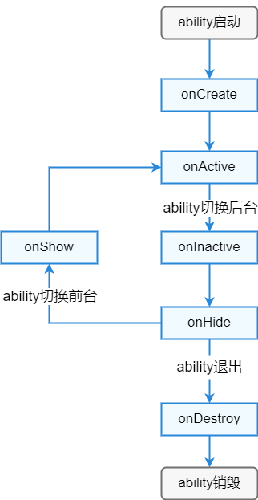
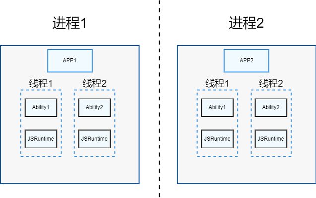

# FA模型综述

## 整体架构

OpenHarmony应用的开发，是以Ability为入口展开的。

对于Ability的开发，通常是以生命周期的回调处理为中心。

Ability框架在API 8及更早版本仅支持FA模型。FA模型中Ability分为PageAbility、ServiceAbility、DataAbility、FormAbility几种类型。其中：
- PageAbility使用ArkUI实现用户界面，是用户可见并可以交互的Ability实例。
- ServiceAbility也是Ability一种，但是没有用户界面。它提供了其他Ability调用的自定义服务，ServiceAbility在后台运行。
- DataAbility也是没有界面的Ability，提供其他Ability进行数据的增删查服务，它同样在后台运行。
- FormAbility是实现卡片的Ability，卡片是OpenHarmomny系统上的一种界面展示形式。

> 注：自API 9开始，Stage模型是主推的开发模型。

## 生命周期

在所有Ability中，PageAbility因为具有界面，也是应用的交互入口，因此其生命周期更加复杂。
**PageAbility生命周期回调如下图所示：**

其他类型Ability的生命周期可参考PageAbility生命周期去除前后台切换以及`onShow`及`onHide`的部分来理解。
开发者可以在 `app.js/app.ets` 中重写生命周期函数，在对应的生命周期回调内处理应用的相应逻辑。

目前`app.js`仅支持`onCreate`和`onDestroy`回调，但`app.ets`支持全量生命周期回调。

## 进程线程模型

每个应用运行在不同的进程中，在FA模型中，每个Ability运行在独立的虚拟机中。

应用进程在Ability启动时创建，此时会为Ability创建相应的线程。当一个应用有多个Ability时，每一个Ability在独立线程中运行。在FA模型中，每个Ability绑定一个独立的虚拟机实例，因此Ability之间是隔离的。

## 应用包结构

FA模型的应用包的工程目录结构，请参考[OpenHarmony工程介绍](https://developer.harmonyos.com/cn/docs/documentation/doc-guides/ohos-project-overview-0000001218440650#section4154183910141)。

对FA模型的应用包结构的配置说明，请参考[应用包结构说明（FA模型）](../quick-start/application-configuration-file-overview-fa.md)。

## 相关实例

针对FA模型下的Ability开发，有以下相关实例可供参考：

- [`FaModel`：FA模型（ArkTS）（API9）](https://gitee.com/openharmony/applications_app_samples/tree/master/ability/FaModel)
- [`DistributedCalc`：分布式计算器（JS）（API8）（Full SDK）](https://gitee.com/openharmony/applications_app_samples/tree/master/common/DistributeCalc)
- [`DistributedCalc`：分布式计算器（ArkTS）（API8）（Full SDK）](https://gitee.com/openharmony/applications_app_samples/tree/master/Preset/DistributeCalc)
- [`DistributeGraffiti`：分布式涂鸦（ArkTS）（API8）（Full SDK）](https://gitee.com/openharmony/applications_app_samples/tree/master/ability/DistributedGraffiti)
- [分布式调度启动远程FA（JS）（API8）](https://gitee.com/openharmony/codelabs/tree/master/Distributed/RemoteStartFA)
- [分布式新闻客户端（JS）（API8）](https://gitee.com/openharmony/codelabs/tree/master/Distributed/NewsDemo)
- [分布式手写板（ArkTS）（API8）](https://gitee.com/openharmony/codelabs/tree/master/Distributed/DistributeDatabaseDrawEts)
- [分布式鉴权（JS）（API8）](https://gitee.com/openharmony/codelabs/tree/master/Distributed/GameAuthOpenH)
- [分布式游戏手柄（ArkTS）（API8）](https://gitee.com/openharmony/codelabs/tree/master/Distributed/HandleGameApplication)
- [分布式邮件（ArkTS）（API8）](https://gitee.com/openharmony/codelabs/tree/master/Distributed/OHMailETS)
- [分布式亲子早教系统（ArkTS）（API8）](https://gitee.com/openharmony/codelabs/tree/master/Distributed/OpenHarmonyPictureGame)
- [分布式遥控器（ArkTS）（API8）](https://gitee.com/openharmony/codelabs/tree/master/Distributed/RemoteControllerETS)