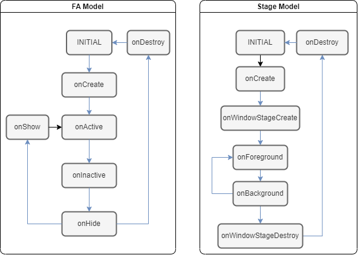

# Ability框架概述

Ability是应用所具备能力的抽象，也是应用程序的重要组成部分。Ability是系统调度应用的最小单元，是能够完成一个独立功能的组件。一个应用可以包含一个或多个Ability。

Ability框架模型具有两种形态：

- 第一种形态为FA模型。API 8及其更早版本的应用程序只能使用FA模型进行开发。FA模型将Ability分为FA（Feature Ability）和PA（Particle Ability）两种类型，其中FA支持Page Ability，PA支持Service Ability、Data Ability、以及FormAbility。
- 第二种形态为Stage模型。从API 9开始，Ability框架引入了Stage模型作为第二种应用框架形态，Stage模型将Ability分为PageAbility和ExtensionAbility两大类，其中ExtensionAbility又被扩展为ServiceExtensionAbility、FormExtensionAbility、DataShareExtensionAbility等一系列ExtensionAbility，以便满足更多的使用场景。

Stage模型的设计，主要是为了开发者更加方便地开发出分布式环境下的复杂应用。下表给出了两种模型在设计上的差异：

| 对比           | FA模型                                                       | Stage模型                                                |
| -------------- | ------------------------------------------------------------ | -------------------------------------------------------- |
| 开发方式       | 提供类Web的API，UI开发与Stage模型一致。                     | 提供面向对象的开发方式，UI开发与FA模型一致。             |
| 引擎实例       | 每个进程内的每个Ability实例独享一个JS VM引擎实例。               | 每个进程内的多个Ability实例共享一个JS VM引擎实例。       |
| 进程内对象共享 | 不支持。                                                     | 支持。                                                   |
| 包描述文件     | 使用config.json描述HAP包和组件信息，组件必须使用固定的文件名。 | 使用module.json5描述HAP包和组件信息，可以指定入口文件名。 |
| 组件           | 提供PageAbility(页面展示)，ServiceAbility(服务)，DataAbility(数据分享)以及FormAbility(卡片)。 | 提供Ability(页面展示)、Extension(基于场景的服务扩展)。   |

除了上述设计上的差异外，对于开发者而言，两种模型的主要区别在于：

* Ability类型存在差异；

  

* Ability生命周期存在差异；

  

两种模型的基本介绍，详见[FA模型综述](fa-brief.md)及[Stage模型综述](stage-brief.md)。

## 相关实例
针对Ability开发，有以下相关实例可供参考：

- [Page内和Page间导航跳转（ArkTS）（API8）](https://gitee.com/openharmony/codelabs/tree/master/Ability/PageAbility)