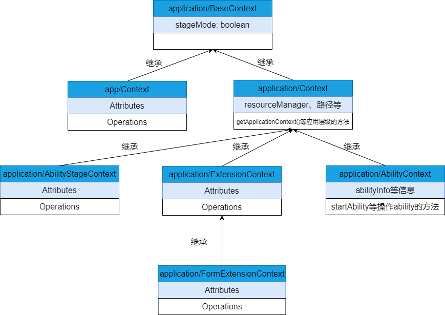

# 应用上下文Context使用指导

## Context概述

​        Context是应用中对象的上下文，提供获取应用程序环境信息的能力。

​        OpenHarmony的应用框架分为FA模型和Stage两种模型。对应存在两套Context机制适配两种应用框架模型，其中application/BaseContext属于通用的Context基类，里面包含一个属性stageMode，用来区分开发模型是FA还是Stage。

- FA模型  
  只有app/Context中的方法属于FA模型对应的Context。该模式下，应用级别的Context和Ability级别的Context都是该类型的实例，如果在应用级别的Context里面调用了Ability级别的方法，会产生错误。所以开发者需要注意Context实例所代表的实际含义。

- Stage模型  
  除了app/Context之外的Context都属于Stage模型，分别有application/Context、application/ApplicationContext、application/AbilityStageContext、application/ExtensionContext、application/AbilityContext、application/FormExtensionContext等Context。这些Context的介绍及使用方式将会在[Stage模型的Context详细介绍](#stage模型的context详细介绍)中进行说明。



## FA模型的Context详细介绍

​        只有app/Context中的方法属于FA模型对应的Context。

​        FA模型只有一个Context定义。Context中所有的功能都是通过方法来提供的，它提供了一些featureAbility中不存在的方法，相当于featureAbility的一个扩展和补全。

**d.ts声明**

​        https://gitee.com/openharmony/interface_sdk-js/blob/master/api/app/context.d.ts

**示例**

```javascript
import featureAbility from '@ohos.ability.featureAbility'
export default {
  onCreate() {
    // 获取context并调用相关方法
    let context = featureAbility.getContext();
    context.getBundleName((data, bundleName)=>{
      console.info("ability bundleName:" + bundleName)
    });
    console.info('Application onCreate')
  },
  onDestroy() {
    console.info('Application onDestroy')
  },
}
```

### FA模型Context常用方法介绍
方法：
```javascript
setDisplayOrientation(orientation: bundle.DisplayOrientation, callback: AsyncCallback<void>): void
setDisplayOrientation(orientation: bundle.DisplayOrientation): Promise<void>;
```
简介：设置当前ability的显示方向。

示例：
```javascript
import featureAbility from '@ohos.ability.featureAbility'
import bundle from '@ohos.bundle';

export default {
  onCreate() {
    // 获取context并调用相关方法
    let context = featureAbility.getContext();
    context.setDisplayOrientation(bundle.DisplayOrientation.LANDSCAPE).then(() => {
        console.log("Set display orientation.")
    })
    console.info('Application onCreate')
  },
  onDestroy() {
    console.info('Application onDestroy')
  },
}
```

## Stage模型的Context详细介绍

​        Stage模型有如下几类Context：

### application/Context

​        application/Context是基类Context。里面提供了应用的一些基础信息：resourceManager、applicationInfo、cacheDir、area等，还有应用的一些基本方法：createModuleContext等。

**d.ts声明**

​        https://gitee.com/openharmony/interface_sdk-js/blob/master/api/application/Context.d.ts

### application/ApplicationContext

​         application/ApplicationContext是应用级别的Context。和基类Context相比，应用级别的Context中提供了监听进程内组件的生命周期的能力，包括registerAbilityLifecycleCallback和unregisterAbilityLifecycleCallback两种方法。

**获取方法**

​        在Ability中通过context.getApplicationContext()方法获取。

**示例**

```javascript
import AbilityStage from "@ohos.application.AbilityStage";

var lifecycleid;

export default class MyAbilityStage extends AbilityStage {
    onCreate() {
        console.log("MyAbilityStage onCreate")
        let AbilityLifecycleCallback  =  {
            onAbilityCreate(ability){
                console.log("AbilityLifecycleCallback onAbilityCreate ability:" + JSON.stringify(ability));        
            },
            onWindowStageCreate(ability, windowStage){
                console.log("AbilityLifecycleCallback onWindowStageCreate ability:" + JSON.stringify(ability)); 
                console.log("AbilityLifecycleCallback onWindowStageCreate windowStage:" + JSON.stringify(windowStage));           
            },
            onWindowStageActive(ability, windowStage){
                console.log("AbilityLifecycleCallback onWindowStageActive ability:" + JSON.stringify(ability)); 
                console.log("AbilityLifecycleCallback onWindowStageActive windowStage:" + JSON.stringify(windowStage));           
            },
            onWindowStageInactive(ability, windowStage){
                console.log("AbilityLifecycleCallback onWindowStageInactive ability:" + JSON.stringify(ability));
                console.log("AbilityLifecycleCallback onWindowStageInactive windowStage:" + JSON.stringify(windowStage));  
            },
            onWindowStageDestroy(ability, windowStage){
                console.log("AbilityLifecycleCallback onWindowStageDestroy ability:" + JSON.stringify(ability));
                console.log("AbilityLifecycleCallback onWindowStageDestroy windowStage:" + JSON.stringify(windowStage));  
            },
            onAbilityDestroy(ability){
                console.log("AbilityLifecycleCallback onAbilityDestroy ability:" + JSON.stringify(ability));             
            },
            onAbilityForeground(ability){
                console.log("AbilityLifecycleCallback onAbilityForeground ability:" + JSON.stringify(ability));             
            },
            onAbilityBackground(ability){
                console.log("AbilityLifecycleCallback onAbilityBackground ability:" + JSON.stringify(ability));              
            },
            onAbilityContinue(ability){
                console.log("AbilityLifecycleCallback onAbilityContinue ability:" + JSON.stringify(ability));
            }
        }
        // 1.通过context属性获取applicationContext
        let applicationContext = this.context.getApplicationContext();
        // 2.通过applicationContext注册监听应用内生命周期
        lifecycleid = applicationContext.registerAbilityLifecycleCallback(AbilityLifecycleCallback);
        console.log("registerAbilityLifecycleCallback number: " + JSON.stringify(lifecycleid));       
    }
    onDestroy() {
        let applicationContext = this.context.getApplicationContext();
        applicationContext.unregisterAbilityLifecycleCallback(lifecycleid, (error, data) => {
        console.log("unregisterAbilityLifecycleCallback success, err: " + JSON.stringify(error));
        });
    }
}
```

**d.ts声明**

​        https://gitee.com/openharmony/interface_sdk-js/blob/master/api/application/ApplicationContext.d.ts

### application/AbilityStageContext

​        application/AbilityStageContext是Hap包级别的Context。和基类Context相比，Hap包级别的Context中多了HapModuleInfo和Configuration两个信息。

**获取方法**

​        可以直接在AbilityStage中通过context属性获取。

**示例**

```javascript
export default class MyAbilityStage extends AbilityStage {
  onCreate() {
    // 属性context就是AbilityStageContext类型的
    console.log('HapModuleInfo is ' + this.context.currentHapModuleInfo);
  }
}
```

**d.ts声明**

​        https://gitee.com/openharmony/interface_sdk-js/blob/master/api/application/AbilityStageContext.d.ts

### application/AbilityContext

​        Stage模型下，每个Ability中都包含了一个Context属性。

​        Ability功能主要是处理生命周期，其余操作Ability的方法(如startAbility、connectAbility等)都是在AbilityContext中实现的。

**获取方法**

​        在Ability中通过context属性获取。

**示例**

```javascript
import Ability from '@ohos.application.Ability'

export default class MainAbility extends Ability {
    onCreate(want, launchParam) {
        console.log("[Demo] MainAbility onCreate")
        globalThis.abilityWant = want;
    }

    onDestroy() {
        console.log("[Demo] MainAbility onDestroy")
    }

    onWindowStageCreate(windowStage) {
        // Main window is created, set main page for this ability
        console.log("[Demo] MainAbility onWindowStageCreate")

        // 在这里获取AbilityContext，打印ability的信息
        let context = this.context;
        console.log("[Demo] MainAbility bundleName " + context.abilityInfo.bundleName)

        windowStage.loadContent("pages/index", (err, data) => {
            if (err.code) {
                console.error('Failed to load the content. Cause:' + JSON.stringify(err));
                return;
            }
            console.info('Succeeded in loading the content. Data: ' + JSON.stringify(data))
        });
    }

    onWindowStageDestroy() {
        // Main window is destroyed, release UI related resources
        console.log("[Demo] MainAbility onWindowStageDestroy")
    }

    onForeground() {
        // Ability has brought to foreground
        console.log("[Demo] MainAbility onForeground")
    }

    onBackground() {
        // Ability has back to background
        console.log("[Demo] MainAbility onBackground")
    }
};
```

### application/FormExtensionContext

卡片业务相关，点下面链接了解。

​        [FormExtensionContext](../reference/apis/js-apis-formextensioncontext.md)

### 在ArkTS页面中访问Context

Stage模型下，在Ability的`onWindowStageCreate`生命周期中，可以通过WindowStage的`SetUIContent`方法加载一个ArkTS页面。在一些场景中，需要在页面内获取Context调用相关API。

**获取方法**

在ArkTS页面中通过以下全局方法获取当前页面关联的Context。

| 接口名                                   | 描述                           |
| :------------------------------------ | :--------------------------- |
| getContext(component: Object): Object | 获取页面中component所关联的Context对象。 |

**示例**

```ts
// MainAbility.ts
import Ability from '@ohos.application.Ability'

export default class MainAbility extends Ability {
    onCreate(want, launchParam) {
        console.log("[Demo] MainAbility onCreate")
    }

    onDestroy() {
        console.log("[Demo] MainAbility onDestroy")
    }

    onWindowStageCreate(windowStage) {
        // 加载index页面，并传入当前Context
        windowStage.setUIContent(this.context, "pages/index", null)
    }

    onWindowStageDestroy() {}

    onForeground() {}

    onBackground() {}
};
```

```ts
// pages/index.ets
import context from '@ohos.application.context'

type Context = context.Context

@Entry
@Component
struct Index {
    build() {
        Row() {
            Column() {
                Text('GetContext')
                    .fontSize(50)
                    .fontWeight(FontWeight.Bold)
                    .onClick(() => {
                        // 获取当前component关联的Context
                        var context : Context = getContext(this) as Context
                        console.info("CacheDir:" + context.cacheDir)
                    })
            }
            .width('100%')
        }
        .height('100%')
    }
}
```

## 常见错误使用方式

**错误1：Stage模型通过globalThis去获取Context**

**原因**

​        应用框架在API9上推出了新的应用模型（Stage模型）。在老的模型（FA模型）下，每个Ability实例有一个js虚拟机实例，所以可以从js引擎的global对象上，获取到一个全局的Ability实例，但是在新的模型（Stage模型）下，整个应用进程共用一个js虚拟机实例，其中可以运行多个Ability实例，这样就不存在一个全局的Ability实例。如果开发者在新的模型（Stage模型）下，调用的API实现仍然走到了获取全局Ability实例的方法，就可能会发生错误或者崩溃。