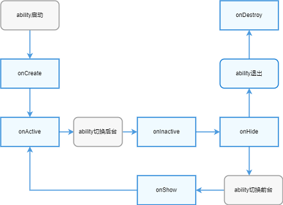

# PageAbility开发指导

## 概述

### 功能简介

PageAbility是具备ArkUI实现的Ability，是开发者具体可见并可以与之交互的Ability实例。开发者通过DevEco Studio创建Ability时，DevEco Studio会自动创建相关模板代码。

PageAbility相关能力通过单独的featureAbility实现，生命周期相关回调则通过`app.js/app.ets`中各个回调函数实现。

### PageAbility的生命周期

**PageAbility生命周期介绍**（Ability Lifecycle）：

PageAbility生命周期是PageAbility被调度到INACTIVE、ACTIVE、BACKGROUND等各个状态的统称。

PageAbility生命周期流转如下图所示：


**Ability生命周期状态说明：**

  - **UNINITIALIZED**：未初始状态，为临时状态，PageAbility被创建后会由UNINITIALIZED状态进入INITIAL状态。

  - **INITIAL**：初始化状态，也表示停止状态，表示当前PageAbility未运行，PageAbility被启动后由INITIAL态进入INACTIVE状态。

  - **INACTIVE**：失去焦点状态，表示当前窗口已显示但是无焦点状态。

  - **ACTIVE**：前台激活状态，表示当前窗口已显示，并获取焦点。

  - **BACKGROUND**：后台状态，表示当前PageAbility退到后台，PageAbility在被销毁后由BACKGROUND状态进入INITIAL状态，或者重新被激活后由BACKGROUND状态进入ACTIVE状态。

**PageAbility生命周期回调与生命周期状态的关系如下图所示：**



PageAbility提供生命周期回调，开发者可以在`app.js/app.ets`中重写生命周期相关回调函数 。目前`app.js`环境中仅支持onCreate和onDestroy回调，`app.ets`环境支持全量生命周期回调。

### 启动模式

ability支持单实例和多实例两种启动模式。

在`config.json`中通过launchType配置项，可以配置具体的启动模式，其中：

**表1** 启动模式介绍

| 启动模式     | 描述     |说明             |
| ----------- | -------  |---------------- |
| standard    | 多实例   | 每次startAbility都会启动一个新的实例。 |
| singleton   | 单实例   | 系统中只存在唯一一个实例，startAbility时，如果已存在，则复用系统中的唯一一个实例。 |

缺省情况下是singleton模式。


## 开发指导

### featureAbility接口说明

**表2** featureAbility接口介绍

| 接口名                                              | 描述            |
| --------------------------------------------------- | --------------- |
| void startAbility(parameter: StartAbilityParameter) | 启动Ability。    |
| Context getContext():                               | 获取应用Context。 |
| void terminateSelf()                                | 结束Ability。     |
| bool hasWindowFocus()                               | 是否获取焦点。    |


### 启动本地PageAbility

**导入模块**

```js
  import featureAbility from '@ohos.ability.featureAbility'
```

**示例**

```javascript
  import featureAbility from '@ohos.ability.featureAbility'
  featureAbility.startAbility({
      want: {
          action: "",
          entities: [""],
          type: "",
          deviceId: "",
          bundleName: "com.example.myapplication",
          /* FA模型中abilityName由package + Ability name组成 */
          abilityName: "com.example.entry.secondAbility",
          uri: ""
      }
  });
```

### 启动远程PageAbility（当前仅对系统应用开放）

>说明：由于DeviceManager的getTrustedDeviceListSync接口仅对系统应用开放，当前启动远程PageAbility仅支持系统应用。

**导入模块**

```
  import featureAbility from '@ohos.ability.featureAbility'
  import deviceManager from '@ohos.distributedHardware.deviceManager';
```

**示例**
```ts
  function onStartRemoteAbility() {
  console.info('onStartRemoteAbility begin');
  let params;
  let wantValue = {
      bundleName: 'ohos.samples.etsDemo',
      abilityName: 'ohos.samples.etsDemo.RemoteAbility',
      deviceId: getRemoteDeviceId(),
      parameters: params
  };
  console.info('onStartRemoteAbility want=' + JSON.stringify(wantValue));
  featureAbility.startAbility({
      want: wantValue
  }).then((data) => {
      console.info('onStartRemoteAbility finished, ' + JSON.stringify(data));
  });
  console.info('onStartRemoteAbility end');
  }
```

从DeviceManager获取`deviceId`，具体示例代码如下：

```ts
  import deviceManager from '@ohos.distributedHardware.deviceManager';
  let dmClass;
  function getRemoteDeviceId() {
      if (typeof dmClass === 'object' && dmClass != null) {
          let list = dmClass.getTrustedDeviceListSync();
          if (typeof (list) == 'undefined' || typeof (list.length) == 'undefined') {
            console.log("MainAbility onButtonClick getRemoteDeviceId err: list is null");
            return;
          }
          console.log("MainAbility onButtonClick getRemoteDeviceId success:" + list[0].deviceId);
          return list[0].deviceId;
      } else {
          console.log("MainAbility onButtonClick getRemoteDeviceId err: dmClass is null");
      }
  }
```

在跨设备场景下，需要向用户申请数据同步的权限。具体示例代码如下：

```ts
  import abilityAccessCtrl from "@ohos.abilityAccessCtrl";
  import bundle from '@ohos.bundle';
  async function RequestPermission() {
      console.info('RequestPermission begin');
      let array: Array<string> = ["ohos.permission.DISTRIBUTED_DATASYNC"];
      let bundleFlag = 0;
      let tokenID = undefined;
      let userID = 100;
      let  appInfo = await bundle.getApplicationInfo('ohos.samples.etsDemo', bundleFlag, userID);
      tokenID = appInfo.accessTokenId;
      let atManager = abilityAccessCtrl.createAtManager();
      let requestPermissions: Array<string> = [];
      for (let i = 0;i < array.length; i++) {
          let result = await atManager.verifyAccessToken(tokenID, array[i]);
          console.info("verifyAccessToken result:" + JSON.stringify(result));
          if (result != abilityAccessCtrl.GrantStatus.PERMISSION_GRANTED) {
              requestPermissions.push(array[i]);
          }
      }
      console.info("requestPermissions:" + JSON.stringify(requestPermissions));
      if (requestPermissions.length == 0 || requestPermissions == []) {
          return;
      }
      let context = featureAbility.getContext();
      context.requestPermissionsFromUser(requestPermissions, 1, (data)=>{
          console.info("data:" + JSON.stringify(data));
          console.info("data requestCode:" + data.requestCode);
          console.info("data permissions:" + data.permissions);
          console.info("data authResults:" + data.authResults);
      });
      console.info('RequestPermission end');
  }
```

### 生命周期接口说明

**表3** 生命周期回调函数介绍

| 接口名       | 描述                                                         |
| ------------ | ------------------------------------------------------------ |
| onShow()     | Ability由后台不可见状态切换到前台可见状态调用onShow方法，此时用户在屏幕可以看到该Ability。 |
| onHide()     | Ability由前台切换到后台不可见状态时调用onHide方法，此时用户在屏幕看不到该Ability。 |
| onDestroy()  | 应用退出，销毁Ability对象前调用onDestroy方法，开发者可以在该方法里做一些回收资源、清空缓存等应用退出前的准备工作。 |
| onCreate()   | Ability第一次启动创建Ability时调用onCreate方法，开发者可以在该方法里做一些应用初始化工作。 |
| onInactive() | Ability失去焦点时调用onInactive方法，Ability在进入后台状态时会先失去焦点，再进入后台。 |
| onActive()   | Ability切换到前台，并且已经获取焦点时调用onActive方法。      |

**示例**

开发者需要重写`app.js/app.ets`中相关生命周期回调函数，DevEco Studio模板默认生成`onCreate()`和`onDestroy()`方法，其他方法需要开发者自行实现。

```javascript
export default {
  onCreate() {
    console.info('Application onCreate')
  },
  onDestroy() {
    console.info('Application onDestroy')
  },
  onShow(){
    console.info('Application onShow')
  },
  onHide(){
    console.info('Application onHide')
  },
  onInactive(){
    console.info('Application onInactive')
  },
  onActive(){
    console.info('Application onActive')
  },
}
```
## 相关实例

针对PageAbility开发，有以下相关实例可供参考：

- [`DMS`：分布式Demo（ArkTS）（API8）（Full SDK）](https://gitee.com/openharmony/applications_app_samples/tree/master/ability/DMS)