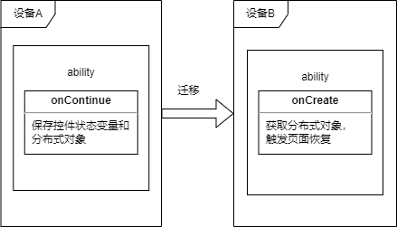

# 跨端迁移开发指导

## 场景介绍

迁移的主要工作是实现将应用当前任务，包括页面控件状态变量、分布式对象等，迁移到远端设备。页面控件状态变量用于同步页面UI数据，分布式对象用于同步内存中的数据。

## 接口说明

迁移提供的能力如下，具体的API详见[接口文档](../reference/apis/js-apis-application-ability.md)。

**表1** 应用迁移API接口功能介绍

|接口名 | 描述|
|:------ | :------|
| onContinue(wantParam : {[key: string]: any}): OnContinueResult | 迁移**发起端**在该回调中保存迁移所需要的数据，同时返回是否同意迁移：AGREE表示同意，REJECT表示拒绝；MISMATCH表示版本不匹配。 |
| onCreate(want: Want, param: AbilityConstant.LaunchParam): void; | 多实例应用迁移**目标端**在该回调中完成数据恢复，并触发页面恢复。 |
| onNewWant(want: Want, launchParams: AbilityConstant.LaunchParam): void; | 单实例应用迁移**目标端**在该回调中完成数据恢复，并触发页面恢复。 |


**图1** 迁移开发示意图



迁移实际上是Ability携带数据的跨端启动。触发迁移动作时，会在A设备上通过系统回调应用的onContinue()方法，开发者需要在此方法中实现当前数据的保存。然后系统发起在B设备上的跨端启动，并将数据一同传输到B设备。B设备系统回调onCreate()/onNewWant()方法，开发者需要在此方法中实现传输过来的数据的恢复。 

## 开发步骤

下文代码片段来自参考[示例](https://gitee.com/openharmony/ability_dmsfwk/tree/master/services/dtbschedmgr/test/samples/continuationManualTestSuite)。

### 迁移应用

1. 配置

   - 配置应用支持迁移

     在module.json5中配置continuable字段：true表示支持迁移，false表示不支持，默认为false。配置为false的应用将被系统识别为无法迁移。
   
     ```javascript
     {
       "module": {
         "abilities": [
           {
             "continuable": true
           }
         ]
       }
     }
     ```
     


   - 配置应用启动类型

     多实例应用在module.json5中将launchType字段配置为standard，目标端将会拉起一个新的应用，并恢复页面；单实例将该字段配置为singleton，如果目标端应用已经打开，迁移将会将已有页面栈清空，并根据迁移数据恢复页面。关于单实例与多实例的更多信息详见[ability开发指导](./stage-ability.md)启动模式。
     
     多实例：
     
     ```javascript
     {
       "module": {
         "abilities": [
           {
             "launchType": "standard"
           }
         ]
       }
     }
     ```
     
     缺省或如下配置为单实例：
     
     ```javascript
     {
       "module": {
         "abilities": [
           {
             "launchType": "singleton"
           }
         ]
       }
     }
     ```
     
     
     
   - 申请分布式权限

     支持跨端迁移的应用需要在module.json5申请分布式权限 DISTRIBUTED_DATASYNC。

     ```javascript
     "requestPermissions": [
            {
                "name": "ohos.permission.DISTRIBUTED_DATASYNC"
            },
     ```

     

     这个权限需要在应用首次启动的时候弹窗让用户授予，可以通过在ability的onWindowStageCreate中添加如下代码实现：

     ```javascript
        requestPermissions = async () => {
            let permissions: Array<string> = [
                "ohos.permission.DISTRIBUTED_DATASYNC"
            ];
            let needGrantPermission = false
            let accessManger = accessControl.createAtManager()
            Logger.info("app permission get bundle info")
            let bundleInfo = await bundle.getApplicationInfo(BUNDLE_NAME, 0, 100)
            Logger.info(`app permission query permission ${bundleInfo.accessTokenId.toString()}`)
            for (const permission of permissions) {
                Logger.info(`app permission query grant status ${permission}`)
                try {
                    let grantStatus = await accessManger.verifyAccessToken(bundleInfo.accessTokenId, permission)
                    if (grantStatus === PERMISSION_REJECT) {
                        needGrantPermission = true
                        break;
                    }
                } catch (err) {
                    Logger.error(`app permission query grant status error ${permission} ${JSON.stringify(err)}`)
                    needGrantPermission = true
                    break;
                }
            }
            if (needGrantPermission) {
                Logger.info("app permission needGrantPermission")
                try {
                    await this.context.requestPermissionsFromUser(permissions)
                } catch (err) {
                    Logger.error(`app permission ${JSON.stringify(err)}`)
                }
            } else {
                Logger.info("app permission already granted")
            }
        }
     ```


2. 实现onContinue接口

   onContinue()接口在发起端被调用，主要用于在迁移发起时，通知开发者保存控件状态变量和内存中数据，准备迁移。当应用准备完成后，需要返回OnContinueResult.AGREE(0)表示同意迁移，否则返回相应的错误码拒绝迁移。如果不实现该接口，系统将默认为拒绝迁移。

   导入模块

   ```javascript
   import Ability from '@ohos.application.Ability';
   import AbilityConstant from '@ohos.application.AbilityConstant';
   ```

   要实现迁移，此接口必须实现并返回AGREE，否则默认为拒绝迁移。

   另外，在该接口的入参wantParam中可以获取目标设备的deviceId（key为“targetDevice”），以及目标设备上所安装的应用的版本号（key为“version”）。版本号可用来与本应用版本进行对比，做兼容性判断，如果判定本应用版本与远端不兼容，可以返回OnContinueResult.MISMATCH拒绝迁移。

   示例

   ```javascript
        onContinue(wantParam : {[key: string]: any}) {
            Logger.info(`onContinue version = ${wantParam.version}, targetDevice: ${wantParam.targetDevice}`)
            let workInput = AppStorage.Get<string>('ContinueWork');
            // set user input data into want params
            wantParam["work"] = workInput // set user input data into want params
            Logger.info(`onContinue input = ${wantParam["input"]}`);
            return AbilityConstant.OnContinueResult.AGREE
        }
   ```

   

3. 在onCreate/onNewWant接口中实现迁移逻辑

   onCreate()接口在迁移目标端被调用，在目标端ability被拉起时，通知开发者同步已保存的内存数据和控件状态，完成后触发页面的恢复。如果不实现该接口中迁移相关逻辑，ability将会作为普通的启动方式拉起，无法恢复页面。

   远端设备上，在onCreate()中根据launchReason判断该次启动是否为迁移LaunchReason.CONTINUATION
   
   完成数据恢复后，开发者需要调用restoreWindowStage来触发页面恢复。
   
   

   在入参want中也可以通过want.parameters.version来获取发起端的应用版本号。
   
   示例
   
   ```javascript
    import Ability from '@ohos.application.Ability';
    import distributedObject from '@ohos.data.distributedDataObject';
    
    export default class MainAbility extends Ability {
        storage : LocalStorag;

        onCreate(want, launchParam) {
            Logger.info(`MainAbility onCreate ${AbilityConstant.LaunchReason.CONTINUATION}`)
            if (launchParam.launchReason == AbilityConstant.LaunchReason.CONTINUATION) {
                // get user data from want params
                let workInput = want.parameters.work
                Logger.info(`work input ${workInput}`)
                AppStorage.SetOrCreate<string>('ContinueWork', workInput)
   
                this.storage = new LocalStorage();
                this.context.restoreWindowStage(this.storage);
            }
        }
    }
   ```
如果是单实例应用，则同样的代码实现onNewWant接口即可。


### 迁移数据

使用分布式对象

分布式数据对象提供了与本地变量类似的操作，实现两个设备的数据同步，当设备1的应用A的分布式数据对象增、删、改数据后，设备2的应用A也可以获取到对应的数据变化，同时还能监听数据变更以及对端数据对象的上下线。用法详见[分布式对象指导文档](../database/database-distributedobject-guidelines.md)。

迁移场景中，分布式对象（distributedDataObject）主要用于将本机内存数据同步到目标设备。

- 发起端在onContinue()中，将待迁移的数据存入分布式对象中，并调用save接口将数据保存并同步到远端，然后设置好session id，并通过wantParam将session id传到远端设备。

  ```javascript
     import Ability from '@ohos.application.Ability';
     import distributedObject from '@ohos.data.distributedDataObject';
  
     var g_object = distributedObject.createDistributedObject({data:undefined});
  
     export default class MainAbility extends Ability {
         sessionId : string;
  
      onContinue(wantParam : {[key: string]: any}) {
        Logger.info(`onContinue version = ${wantParam.version}, targetDevice: ${wantParam.targetDevice}`)

        if (g_object.__sessionId === undefined) {
            this.sessionId = distributedObject.genSessionId()
            Logger.info(`onContinue generate new sessionId`)
        }
        else {
            this.sessionId = g_object.__sessionId;
        }

        wantParam["session"] = this.sessionId
        g_object.data = AppStorage.Get<string>('ContinueStudy');
        Logger.info(`onContinue sessionId = ${this.sessionId}, name = ${g_object.data}`)
        g_object.setSessionId(this.sessionId);
        g_object.save(wantParam.targetDevice, (result, data)=>{
            Logger.info("save callback");
            Logger.info("save sessionId " + data.sessionId);
            Logger.info("save version " + data.version);
            Logger.info("save deviceId " + data.deviceId);
        });
  ```

  

- 目标设备在onCreate()中，取出发起端传过来的session id，建立分布式对象并关联该session id，这样就能实现分布式对象的同步。需要注意的是，在调用restoreWindowStage之前，迁移需要的分布式对象必须全部关联完，保证能够获取到正确的数据。

  ```javascript
     import Ability from '@ohos.application.Ability';
     import distributedObject from '@ohos.data.distributedDataObject';
  
     var g_object = distributedObject.createDistributedObject({data:undefined});
  
     export default class MainAbility extends Ability {
         storage : LocalStorag;
  
  
         onCreate(want, launchParam) {
             Logger.info(`MainAbility onCreate ${AbilityConstant.LaunchReason.CONTINUATION}`)
             if (launchParam.launchReason == AbilityConstant.LaunchReason.CONTINUATION) {
                 // get distributed data object session id from want params
                 this.sessionId = want.parameters.session
                 Logger.info(`onCreate for continuation sessionId:  ${this.sessionId}`)
  
                // in order to fetch from remote, reset g_object.data to undefined first
                g_object.data = undefined;
                // set session id, so it will fetch data from remote
                g_object.setSessionId(this.sessionId);
  
                AppStorage.SetOrCreate<string>('ContinueStudy', g_object.data)
                this.storage = new LocalStorage();
                this.context.restoreWindowStage(this.storage);
             }
             
         }
     }
  ```
  
   
  
### 其他说明

1. 超时机制：

   - 如果目标端迁移应用未安装，系统会去查询在目标端设备上能否安装，这段最大时间为4s，超出此时间，调用者会收到超时错误码，视为不可在目标端安装。若可安装，则系统会提示用户在目标端安装，安装完成后可再次尝试发起迁移。
   -  如果目标端迁移应用已安装 ，那么发起迁移后超时时间为20s，若超过此时间，调用者会收到超时错误码，视为此次迁移失败。

2. 当前系统默认支持页面栈信息的迁移，即发起端页面栈会被自动迁移到目标端，无需开发者适配。


### 约束

1.   迁移要求在同ability之间进行，也就是需要相同的bundleName、moduleName和abilityName，具体含义[应用包配置文件说明](../quick-start/stage-structure.md)。
2.    当前应用只能实现迁移能力，但迁移的动作只能由系统发起。


### 最佳实践

   为了获得最佳体验，建议100kb以下的数据直接使用wantParam传输，大于100kb的数据采用分布式对象传输。