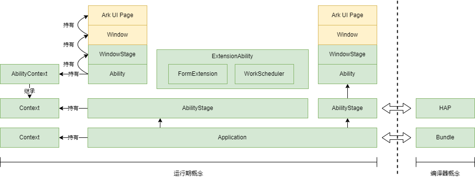
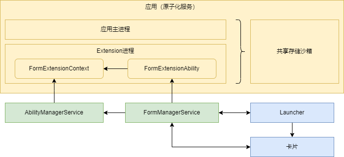

# Stage模型综述

## 设计思想

​Stage模型的设计，是为了提供给开发者一个更好的开发方式，更好的适用于多设备、分布式场景。

​Stage模型的设计思想如下图所示。

​Stage模型的设计基于如下三个出发点：

- **应用进程的有序管理**

随着设备的内存越来越大，系统中同时运行的进程数量也越来越多。当数百个进程同时运行时，如果没有有效的管理措施，则系统整体的功耗和性能将无法得到保证。Stage模型中，通过短时任务、长时任务、托管任务和延迟任务四种方法对后台进程做了有序约束。这样做使得前台进程的资源得以保障，最终能获得更好的用户体验。

- **原生支持跨端迁移和多端协同**

OpenHarmony是原生分布式的操作系统，应用框架需要从架构设计上使得组件更易于实现跨端迁移和多端协同。Stage模型通过Ability与UI分离及UI展示与服务能力合一等模型特性，实现这一设计目标。

- **支持多种设备的不同窗口形态**

Stage模型重新定义了Ability的生命周期。系统在架构上，将应用组件管理服务和窗口管理服务进行了彼此解耦，这样做可以方便的针对特定设备进行适配，以实现出不同的窗口形态。

## 基本概念

下图展示了Stage模型中的基本概念。

-  **HAP**：OpenHarmony应用编译、分发、加载的基本单位。与开发态的module一一对应。在应用内，moduleName是其唯一标识；
-  **Bundle**：通过appid标识的OpenHarmony应用，Bundle可以包含多个HAP，每个应用都有一个bundleName，但是bundleName并不能唯一标识一个应用，appid中包含bundleName以及其他的更多信息，能够唯一标识一个应用；
-  **AbilityStage**：对应HAP的运行期对象，在HAP首次加载到进程中时创建，运行期开发者可见；
-  **Application**：对应Bundle的运行期对象，运行期开发者不可见；
-  **Context**：提供运行期开发者可以调用的各种能力，Ability组件和各种ExtensionAbility都有各自不同的Context类，他们都继承自基类Context，基类提供包名、moduleName、路径等信息；
-  **Ability**：提供生命周期回调，持有AbilityContext，支持组件的跨端迁移和多端协同;
-  **ExtensionAbility**：基于场景的扩展能力统称，系统定义了多种场景的ExtensionAbility类，它们持有各自的ExtensionContext;
-  **WindowStage**：本地窗口管理器；
-  **Window**：应用窗口，持有一个ArkUI引擎实例；
-  **ArkUI Page**：基于ArkUI开发的用户界面。

## 生命周期

AbilityStage及Ability是关于应用生命周期的关键对象。

在[Ability框架概述](ability-brief.md)中，给出了FA模型与Stage模型的生命周期对比，因此这里仅对Ability生命周期切换以及和AbilityStage、WindowStage之间的调度关系进行介绍。

为了实现多设备形态上的适配和多窗口的扩展，OpenHarmony对组件管理和窗口管理进行了解耦。

Stage模型定义Ability组件的生命周期，只包含创建、销毁、前后台等状态，而将与界面强相关的获焦、失焦状态都放在WindowStage之中，从而实现Ability与窗口之间的弱耦合；在服务侧，窗口管理服务依赖于组件管理服务，前者通知后者前后台变化，这样组件管理服务仅感知前后台变化，不感知焦点变化。

需要注意的是，在Ability中存在两个与WindowStage相关的生命周期状态onWindowStageCreate和onWindowStageDestroy，这两个生命周期状态的变化仅存在于具有显示能力的设备中。前者表示WindowStage已经创建完成，开发者可以通过执行loadContent的操作设置Ability需要加载的页面；后者在WindowStage销毁后调用，以便开发者对资源进行释放。

## Ability组件实例与任务

Ability组件有三种启动类型：

* **Singleton**：应用进程中只存在一个该类型的Ability实例，如下图Ability1；
* **Standard**：每次startAbility调用，都会在应用进程中创建一个该类型的实例，如下图Ability2的两个实例；
* **Specified**：允许开发者在系统创建Ability实例之前，为该实例创建一个key，后续每次创建该类型的Ability实例都会询问应用使用哪个key对应的Ability实例，来响应startAbility请求，如下图Ability3。

每个Ability实例都对应了一个近期任务中的Mission(任务)。

每个Ability实例对应的Mission都留有该Ability实例的快照，Ability实例销毁后，Mission中会继续保留Ability的类的信息和快照，直到用户删除，或者超过存储上限。

 

## ExtensionAbility机制

不同于页面展示的Ability，ExtensionAbility提供的是一种受限的运行环境。

ExtensionAbility组件具有如下特点：

- 运行在独立于主进程的单独进程中，与主进程无IPC，但共享一个存储沙箱；

- 独立的Context提供基于相应业务场景的API能力；

- 由系统触发创建，应用不能直接创建；

- ExtensionAbility和进程的生命周期受系统管理。

下图以卡片使用场景为例进行展示。系统提供了FormExtensionAbility基类，开发者通过派生提供卡片的具体信息。FormExtensionAbility实例及其所在的ExtensionAbility进程的整个生命周期，都是由系统服务FormManagerService进行管理。

## 进程模型

OpenHarmony系统对于应用进程是有强管控策略的。对于开发者来说，没有自行配置多进程的能力。应用的所有进程都是由系统创建和管理的。

每个应用的进程可以分为三类：

- 主进程：运行UIAbility组件、页面和业务逻辑；

- Extension进程：运行应用中的ExtensionAbility派生类，该进程由系统中的特定场景的服务管理其生命周期；

- Render进程：专门为webview创建的进程，用于加载webview的渲染库。

  下图展示了应用的进程模型。

  

## 应用包结构

Stage模型的应用包的工程目录结构，请参考[OpenHarmony工程介绍](https://developer.harmonyos.com/cn/docs/documentation/doc-guides/ohos-project-overview-0000001218440650#section56487581904)。

对Stage模型的应用包结构的配置说明，请参考[应用包结构说明（Stage模型）](../quick-start/stage-structure.md)。

## 相关实例

针对Stage模型下的Ability开发，有以下相关实例可供参考：

- [`StageModel`：Stage模型（ArkTS）（API9）（Full SDK）](https://gitee.com/openharmony/applications_app_samples/tree/master/ability/StageModel)
- [`WindowExtAbility`：窗口扩展（ArkTS）（API9）（Full SDK）](https://gitee.com/openharmony/applications_app_samples/tree/master/ability/WindowExtAbility)
- [`MissionManager`：系统任务管理（ArkTS）（API9）（Full SDK）](https://gitee.com/openharmony/applications_app_samples/tree/master/ability/MissionManager)
- [`Launcher`：仿桌面应用（ArkTS）（API9）（Full SDK）](https://gitee.com/openharmony/applications_app_samples/tree/master/ability/Launcher)
