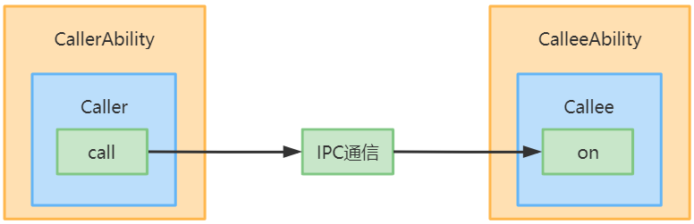

# Call调用开发指导
## 场景介绍
Ability Call调用是Ability能力的扩展，它为Ability提供一种能够被外部调用的能力，使Ability既能被拉起到前台展示UI，也支持Ability在后台被创建并运行。应用开发者可通过Call调用，使用IPC通信实现不同Ability之间的数据共享。Call调用的场景主要包括：
- 创建Callee被调用端。
- 访问Callee被调用端。

本文中的Caller和Callee分别表示调用者和被调用者，IPC表示进程间通信，Call调用流程示意图如下。



>  **说明：**
> Callee被调用端所在的Ability，启动模式需要为单实例。
> 当前仅支持系统应用及ServiceExtensionAbility使用Call访问Callee。

## 接口说明
Caller及Callee功能如下：具体的API详见[接口文档](../reference/apis/js-apis-application-ability.md#caller)。

**表1** Call API接口功能介绍
|接口名|描述|
|:------|:------|
|startAbilityByCall(want: Want): Promise<Caller>|获取指定通用组件的Caller通信接口，拉起指定通用组件并将其切换到后台。|
|on(method: string, callback: CaleeCallBack): void|通用组件Callee注册method对应的callback方法。|
|off(method: string): void|通用组件Callee去注册method的callback方法。|
|call(method: string, data: rpc.Sequenceable): Promise<void>|向通用组件Callee发送约定序列化数据。|
|callWithResult(method: string, data: rpc.Sequenceable): Promise<rpc.MessageParcel>|向通用组件Callee发送约定序列化数据, 并将返回的约定序列化数据带回。|
|release(): void|释放通用组件的Caller通信接口。|
|onRelease(callback: OnReleaseCallBack): void|注册通用组件通信断开监听通知。|

## 开发步骤
>  **说明：**
> 开发步骤章节中的示例代码片段是开发过程的步骤化展示，部分代码可能无法单独运行，完整工程代码请参考[相关实例](##相关实例)。
### 创建Callee被调用端
Callee被调用端，需要实现指定方法的数据接收回调函数、数据的序列化及反序列化方法。在需要接收数据期间，通过on接口注册监听，无需接收数据时通过off接口解除监听。
1. 配置Ability的启动模式

  配置module.json5，将Callee被调用端所在的Ability配置为单实例"singleton"。

|Json字段|字段说明|
|:------|:------|
|"launchType"|Ability的启动模式，设置为"singleton"类型。 |

Ability配置标签示例如下：
```json
"abilities":[{
    "name": ".CalleeAbility",
    "srcEntrance": "./ets/CalleeAbility/CalleeAbility.ts",
    "launchType": "singleton",
    "description": "$string:CalleeAbility_desc",
    "icon": "$media:icon",
    "label": "$string:CalleeAbility_label",
    "visible": true
}]
```
2. 导入Ability模块。
```
import Ability from '@ohos.application.Ability'
```
3. 定义约定的序列化数据。

  调用端及被调用端发送接收的数据格式需协商一致，如下示例约定数据由number和string组成。具体示例代码如下：
```ts
export default class MySequenceable {
    num: number = 0
    str: String = ""

    constructor(num, string) {
        this.num = num
        this.str = string
    }

    marshalling(messageParcel) {
        messageParcel.writeInt(this.num)
        messageParcel.writeString(this.str)
        return true
    }

    unmarshalling(messageParcel) {
        this.num = messageParcel.readInt()
        this.str = messageParcel.readString()
        return true
    }
}
```
4. 实现Callee.on监听及Callee.off解除监听。

  被调用端Callee的监听函数注册时机, 取决于应用开发者。注册监听之前的数据不会被处理，取消监听之后的数据不会被处理。如下示例在Ability的onCreate注册'CalleeSortMethod'监听，在onDestroy取消监听，收到序列化数据后作相应处理并返回，应用开发者根据实际需要做相应处理。具体示例代码如下：
```ts
const TAG: string = '[CalleeAbility]'
const MSG_SEND_METHOD: string = 'CallSendMsg'

function sendMsgCallback(data) {
    Logger.log(TAG, 'CalleeSortFunc called')

    // 获取Caller发送的序列化数据
    let receivedData = new MySequenceable(0, '')
    data.readSequenceable(receivedData)
    Logger.log(TAG, `receiveData[${receivedData.num}, ${receivedData.str}]`)

    // 作相应处理
    // 返回序列化数据result给Caller
    return new MySequenceable(receivedData.num + 1, `send ${receivedData.str} succeed`)
}

export default class CalleeAbility extends Ability {
    onCreate(want, launchParam) {
        try {
            this.callee.on(MSG_SEND_METHOD, sendMsgCallback)
        } catch (error) {
            Logger.error(TAG, `${MSG_SEND_METHOD} register failed with error ${JSON.stringify(error)}`)
        }
    }

    onDestroy() {
        try {
            this.callee.off(MSG_SEND_METHOD)
        } catch (error) {
            console.error(TAG, `${MSG_SEND_METHOD} unregister failed with error ${JSON.stringify(error)}`)
        }
    }
}
```

### 访问Callee被调用端
1. 导入Ability模块。
```
import Ability from '@ohos.application.Ability'
```
2. 获取Caller通信接口。

  Ability的context属性实现了startAbilityByCall方法，用于获取指定通用组件的Caller通信接口。如下示例通过`this.context`获取Ability实例的context属性，使用startAbilityByCall拉起Callee被调用端并获取Caller通信接口，注册Caller的onRelease监听。应用开发者根据实际需要做相应处理。具体示例代码如下：
```ts
async onButtonGetCaller() {
    try {
        this.caller = await context.startAbilityByCall({
            bundleName: 'com.samples.CallApplication',
            abilityName: 'CalleeAbility'
        })
        if (this.caller === undefined) {
            Logger.error(TAG, 'get caller failed')
            return
        }
        Logger.log(TAG, 'get caller success')
        this.regOnRelease(this.caller)
    } catch (error) {
        Logger.error(TAG, `get caller failed with ${error}`)
    }
}.catch((error) => {
    console.error(TAG + 'get caller failed with ' + error)
})
```
  在跨设备场景下，需指定对端设备deviceId。具体示例代码如下：
```ts
let TAG = '[MainAbility] '
var caller = undefined
let context = this.context

context.startAbilityByCall({
    deviceId: getRemoteDeviceId(),
    bundleName: 'com.samples.CallApplication',
    abilityName: 'CalleeAbility'
}).then((data) => {
    if (data != null) {
        caller = data
        console.log(TAG + 'get remote caller success')
        // 注册caller的release监听
        caller.onRelease((msg) => {
            console.log(TAG + 'remote caller onRelease is called ' + msg)
        })
        console.log(TAG + 'remote caller register OnRelease succeed')
    }
}).catch((error) => {
    console.error(TAG + 'get remote caller failed with ' + error)
})
```
  从DeviceManager获取指定设备的deviceId，getTrustedDeviceListSync接口仅对系统应用开放。具体示例代码如下：
```ts
import deviceManager from '@ohos.distributedHardware.deviceManager';
var dmClass;
function getRemoteDeviceId() {
    if (typeof dmClass === 'object' && dmClass != null) {
        var list = dmClass.getTrustedDeviceListSync();
        if (typeof (list) == 'undefined' || typeof (list.length) == 'undefined') {
            console.log("MainAbility onButtonClick getRemoteDeviceId err: list is null");
            return;
        }
        console.log("MainAbility onButtonClick getRemoteDeviceId success:" + list[0].deviceId);
        return list[0].deviceId;
    } else {
        console.log("MainAbility onButtonClick getRemoteDeviceId err: dmClass is null");
    }
}
```
  在跨设备场景下，需要向用户申请数据同步的权限。具体示例代码如下：
```ts
let context = this.context
let permissions: Array<string> = ['ohos.permission.DISTRIBUTED_DATASYNC']
context.requestPermissionsFromUser(permissions).then((data) => {
    console.log("Succeed to request permission from user with data: "+ JSON.stringify(data))
}).catch((error) => {
    console.log("Failed to request permission from user with error: "+ JSON.stringify(error))
})
```
3. 发送约定序列化数据

  向被调用端发送Sequenceable数据有两种方式，一种是不带返回值，一种是获取被调用端返回的数据，method以及序列化数据需要与被调用端协商一致。如下示例调用Call接口，向Callee被调用端发送数据。具体示例代码如下：
```ts
const MSG_SEND_METHOD: string = 'CallSendMsg'
async onButtonCall() {
    try {
        let msg = new MySequenceable(1, 'origin_Msg')
        await this.caller.call(MSG_SEND_METHOD, msg)
    } catch (error) {
        Logger.error(TAG, `caller call failed with ${error}`)
    }
}
```

  如下示例调用CallWithResult接口，向Callee被调用端发送待处理的数据`originMsg`，并将'CallSendMsg'方法处理完毕的数据赋值给`backMsg`。具体示例代码如下：
```ts
const MSG_SEND_METHOD: string = 'CallSendMsg'
originMsg: string = ''
backMsg: string = ''
async onButtonCallWithResult(originMsg, backMsg) {
    try {
        let msg = new MySequenceable(1, originMsg)
        const data = await this.caller.callWithResult(MSG_SEND_METHOD, msg)
        Logger.log(TAG, 'caller callWithResult succeed')

        let result = new MySequenceable(0, '')
        data.readSequenceable(result)
        backMsg(result.str)
        Logger.log(TAG, `caller result is [${result.num}, ${result.str}]`)
    } catch (error) {
        Logger.error(TAG, `caller callWithResult failed with ${error}`)
    }
}
```
4. 释放Caller通信接口

  Caller不再使用后，应用开发者可以通过release接口释放Caller。具体示例代码如下：
```ts
try {
    this.caller.release()
    this.caller = undefined
    Logger.log(TAG, 'caller release succeed')
} catch (error) {
    Logger.error(TAG, `caller release failed with ${error}`)
}
```

## 相关实例
针对Stage模型本地Call功能开发，有以下相关实例可供参考：
- [`StageCallAbility`：StageCallAbility的创建与使用（eTS）（API9）](https://gitee.com/openharmony/app_samples/tree/master/ability/StageCallAbility)
