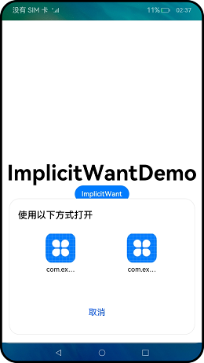

# 使用隐式Want打开网址


## 前提条件

设备上安装了一个或多个浏览器。

浏览器应用中通过module.json5配置如下：

```json
"skills": [
  {
    "entities": [
      "entity.system.browsable"
      // ...
    ],
    "actions": [
        "ohos.want.action.viewData"
        // ...
    ],
    "uris": [
      {
        "scheme": "https",
        "host": "www.test.com",
        "port": "8080",
        // prefix matching
        "pathStartWith": "query",
        "type": "text/*"
      },
      {
        "scheme": "http",
        // ...
      }
      // ...
    ]
  },
]
```


## 开发步骤

1. 在自定义函数implicitStartAbility内使用**隐式Want**启动Ability。
   
   ```ts
       async implicitStartAbility() {
           try {
               let want = {
                   // uncomment line below if wish to implicitly query only in the specific bundle.
                   // bundleName: "com.example.myapplication",
                   "action": "ohos.want.action.viewData",
                   // entities can be omitted.
                   "entities": [ "entity.system.browsable" ],
                   "uri": "https://www.test.com:8080/query/student",
                   "type": "text/plain"
               }
               let context = getContext(this) as common.UIAbilityContext;
               await context.startAbility(want)
               console.info(`explicit start ability succeed`)
           } catch (error) {
               console.info(`explicit start ability failed with ${error.code}`)
           }
           let context = getContext(this) as common.UIAbilityContext;
           await context.startAbility(want)
           console.info(`explicit start ability succeed`)
       } catch (error) {
           console.info(`explicit start ability failed with ${error.code}`)
       }
   }
   ```

     匹配过程如下：
   1. want内action不为空，且被skills内action包括，匹配成功。
   
   2. want内entities不为空，且被skills内entities包括，匹配成功。
   
   3. skills内uris拼接为https://www.test.com:8080/query\* (\*为通配符)包含want内uri，匹配成功。
   
   4. want内type不为空，且被skills内type包含，匹配成功。

2. 当有多个匹配应用时，会被应用选择器展示给用户进行选择。
